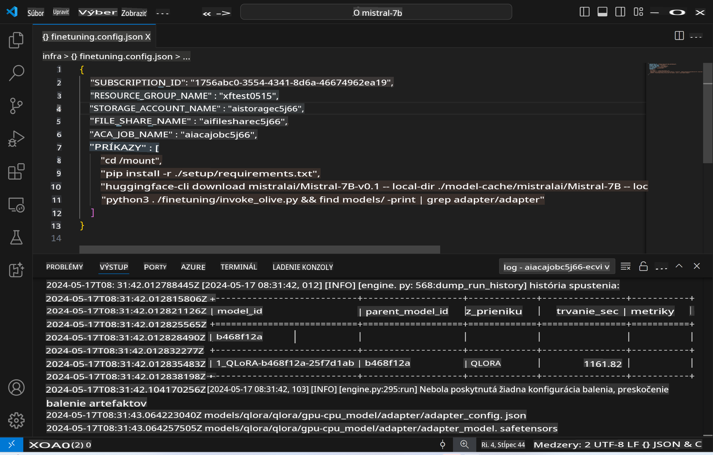
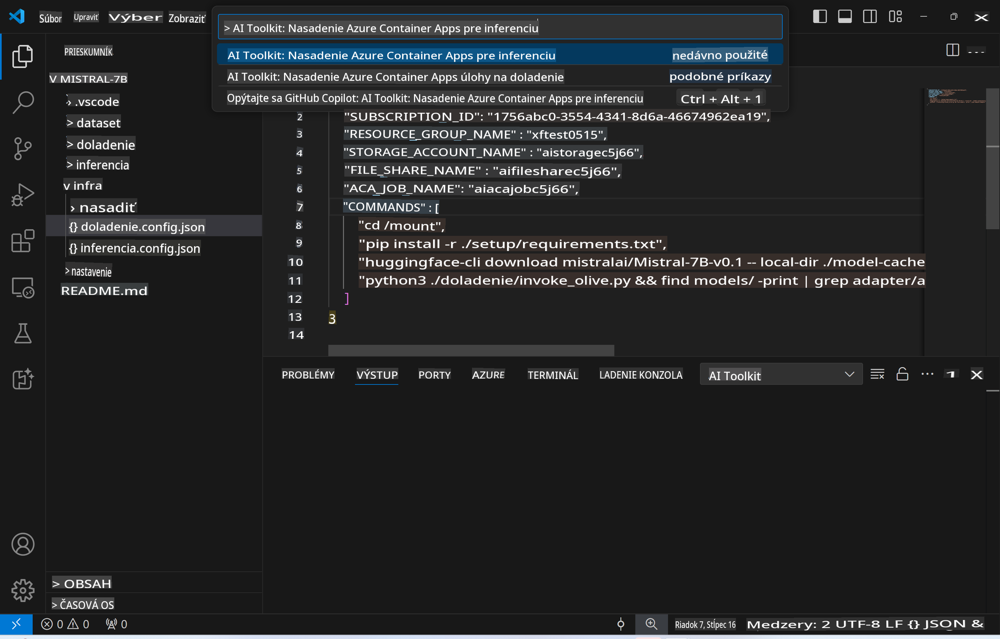
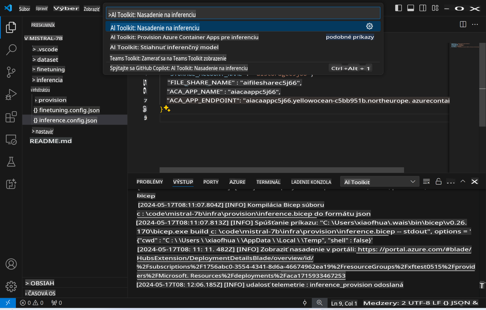
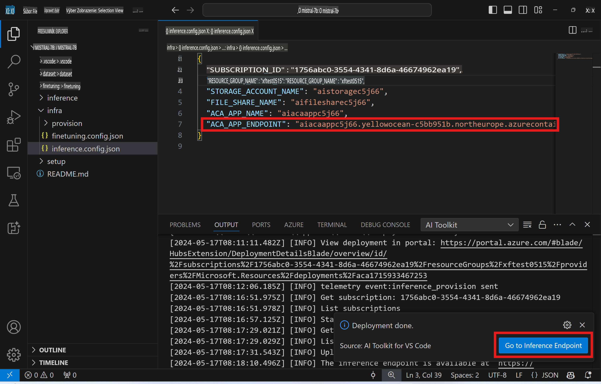

# Vzdialené inferencovanie s jemne doladeným modelom

Po natrénovaní adaptérov v vzdialenom prostredí môžete použiť jednoduchú aplikáciu Gradio na interakciu s modelom.



### Zriadenie Azure zdrojov
Na nastavenie Azure zdrojov pre vzdialené inferencovanie spustite `AI Toolkit: Provision Azure Container Apps for inference` z príkazovej palety. Počas tohto procesu budete vyzvaní vybrať si svoju Azure predplatnú službu a skupinu zdrojov.  


Predvolene by predplatná služba a skupina zdrojov pre inferencovanie mali zodpovedať tým, ktoré boli použité pri jemnom doladení. Inferencovanie bude používať rovnaké prostredie Azure Container App a pristupovať k modelu a adaptéru modelu uloženým v Azure Files, ktoré boli vytvorené počas kroku jemného doladenia.

## Použitie AI Toolkit

### Nasadenie pre inferencovanie
Ak chcete upraviť kód pre inferencovanie alebo znovu načítať inferenčný model, spustite príkaz `AI Toolkit: Deploy for inference`. Týmto sa synchronizuje váš najnovší kód s ACA a reštartuje sa replika.



Po úspešnom dokončení nasadenia je model pripravený na vyhodnotenie pomocou tohto endpointu.

### Prístup k API pre inferencovanie

K API pre inferencovanie môžete pristupovať kliknutím na tlačidlo "*Go to Inference Endpoint*" zobrazené v oznámení VSCode. Alternatívne, webový API endpoint nájdete pod `ACA_APP_ENDPOINT` v `./infra/inference.config.json` a v paneli výstupu.



> **Poznámka:** Endpoint pre inferencovanie môže potrebovať niekoľko minút, aby bol plne funkčný.

## Komponenty pre inferencovanie zahrnuté v šablóne

| Priečinok | Obsah |
| --------- |-------|
| `infra` | Obsahuje všetky potrebné konfigurácie pre vzdialené operácie. |
| `infra/provision/inference.parameters.json` | Obsahuje parametre pre bicep šablóny, ktoré sa používajú na zriadenie Azure zdrojov pre inferencovanie. |
| `infra/provision/inference.bicep` | Obsahuje šablóny pre zriadenie Azure zdrojov pre inferencovanie. |
| `infra/inference.config.json` | Konfiguračný súbor, ktorý generuje príkaz `AI Toolkit: Provision Azure Container Apps for inference`. Používa sa ako vstup pre ďalšie príkazové palety vzdialených operácií. |

### Použitie AI Toolkit na konfiguráciu zriadenia Azure zdrojov
Konfigurujte [AI Toolkit](https://marketplace.visualstudio.com/items?itemName=ms-windows-ai-studio.windows-ai-studio)

Zriadenie Azure Container Apps pre inferencovanie` command.

You can find configuration parameters in `./infra/provision/inference.parameters.json` file. Here are the details:
| Parameter | Description |
| --------- |------------ |
| `defaultCommands` | This is the commands to initiate a web API. |
| `maximumInstanceCount` | This parameter sets the maximum capacity of GPU instances. |
| `location` | This is the location where Azure resources are provisioned. The default value is the same as the chosen resource group's location. |
| `storageAccountName`, `fileShareName` `acaEnvironmentName`, `acaEnvironmentStorageName`, `acaAppName`,  `acaLogAnalyticsName` | These parameters are used to name the Azure resources for provision. By default, they will be same to the fine-tuning resource name. You can input a new, unused resource name to create your own custom-named resources, or you can input the name of an already existing Azure resource if you'd prefer to use that. For details, refer to the section [Using existing Azure Resources](../../../../../md/01.Introduction/03). |

### Using Existing Azure Resources

By default, the inference provision use the same Azure Container App Environment, Storage Account, Azure File Share, and Azure Log Analytics that were used for fine-tuning. A separate Azure Container App is created solely for the inference API. 

If you have customized the Azure resources during the fine-tuning step or want to use your own existing Azure resources for inference, specify their names in the `./infra/inference.parameters.json` súbor. Potom spustite príkaz `AI Toolkit: Provision Azure Container Apps for inference` z príkazovej palety. Týmto sa aktualizujú všetky špecifikované zdroje a vytvoria sa chýbajúce.

Napríklad, ak už máte existujúce prostredie Azure Container, váš súbor `./infra/finetuning.parameters.json` by mal vyzerať takto:

```json
{
    "$schema": "https://schema.management.azure.com/schemas/2019-04-01/deploymentParameters.json#",
    "contentVersion": "1.0.0.0",
    "parameters": {
      ...
      "acaEnvironmentName": {
        "value": "<your-aca-env-name>"
      },
      "acaEnvironmentStorageName": {
        "value": null
      },
      ...
    }
  }
```

### Manuálne zriadenie
Ak uprednostňujete manuálnu konfiguráciu Azure zdrojov, môžete použiť poskytnuté bicep súbory v priečinku `./infra/provision` folders. If you have already set up and configured all the Azure resources without using the AI Toolkit command palette, you can simply enter the resource names in the `inference.config.json`.

Napríklad:

```json
{
  "SUBSCRIPTION_ID": "<your-subscription-id>",
  "RESOURCE_GROUP_NAME": "<your-resource-group-name>",
  "STORAGE_ACCOUNT_NAME": "<your-storage-account-name>",
  "FILE_SHARE_NAME": "<your-file-share-name>",
  "ACA_APP_NAME": "<your-aca-name>",
  "ACA_APP_ENDPOINT": "<your-aca-endpoint>"
}
```

**Upozornenie**:  
Tento dokument bol preložený pomocou strojových prekladových služieb AI. Hoci sa snažíme o presnosť, prosím, vezmite na vedomie, že automatizované preklady môžu obsahovať chyby alebo nepresnosti. Pôvodný dokument v jeho rodnom jazyku by mal byť považovaný za záväzný zdroj. Pre kritické informácie sa odporúča profesionálny ľudský preklad. Nenesieme zodpovednosť za akékoľvek nedorozumenia alebo nesprávne interpretácie vyplývajúce z použitia tohto prekladu.