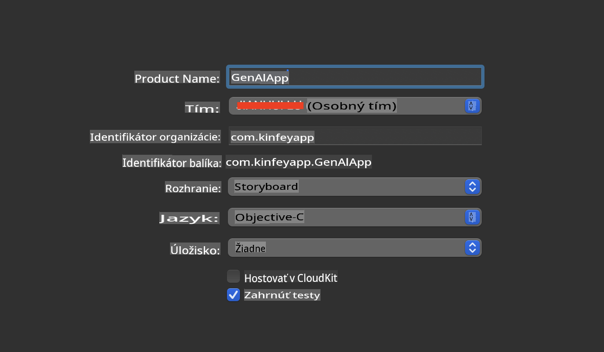
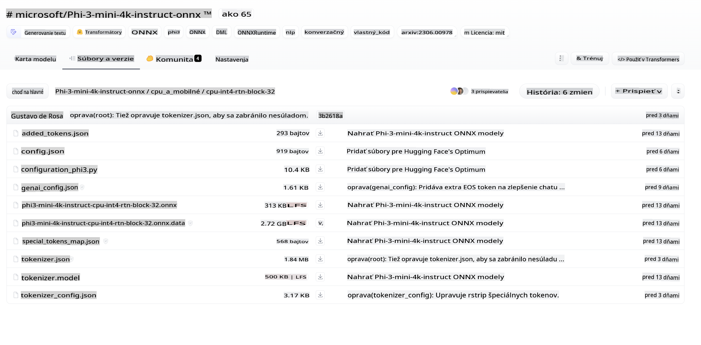
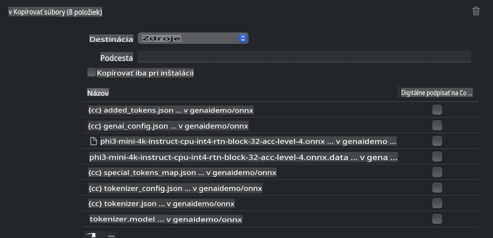
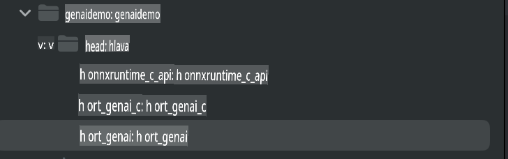
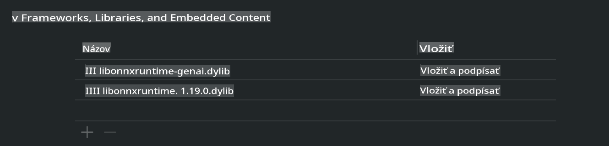
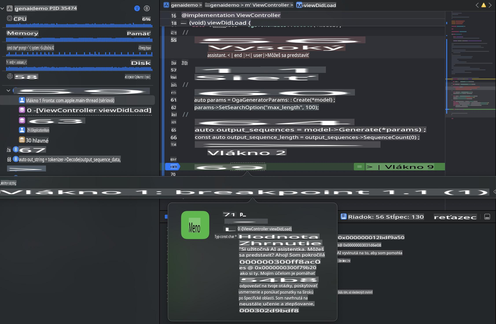

# **Inference Phi-3 v iOS**

Phi-3-mini je nová séria modelov od Microsoftu, ktorá umožňuje nasadenie veľkých jazykových modelov (LLMs) na edge zariadeniach a IoT zariadeniach. Phi-3-mini je dostupný pre nasadenie na iOS, Android a edge zariadeniach, čo umožňuje nasadenie generatívnej AI v prostrediach BYOD. Nasledujúci príklad demonštruje, ako nasadiť Phi-3-mini na iOS.

## **1. Príprava**

- **a.** macOS 14+
- **b.** Xcode 15+
- **c.** iOS SDK 17.x (iPhone 14 A16 alebo novší)
- **d.** Nainštalujte Python 3.10+ (odporúča sa Conda)
- **e.** Nainštalujte Python knižnicu: `python-flatbuffers`
- **f.** Nainštalujte CMake

### Semantic Kernel a inferencia

Semantic Kernel je aplikačný rámec, ktorý vám umožňuje vytvárať aplikácie kompatibilné s Azure OpenAI Service, OpenAI modelmi a dokonca aj lokálnymi modelmi. Prístup k lokálnym službám prostredníctvom Semantic Kernel umožňuje jednoduchú integráciu s vaším lokálne hostovaným Phi-3-mini modelovým serverom.

### Volanie kvantizovaných modelov pomocou Ollama alebo LlamaEdge

Mnoho používateľov uprednostňuje používanie kvantizovaných modelov na lokálne spúšťanie. [Ollama](https://ollama.com) a [LlamaEdge](https://llamaedge.com) umožňujú používateľom volať rôzne kvantizované modely:

#### **Ollama**

Môžete spustiť `ollama run phi3` priamo alebo ho nakonfigurovať offline. Vytvorte Modelfile s cestou k vášmu `gguf` súboru. Ukážkový kód na spustenie kvantizovaného modelu Phi-3-mini:

```gguf
FROM {Add your gguf file path}
TEMPLATE \"\"\"<|user|> .Prompt<|end|> <|assistant|>\"\"\"
PARAMETER stop <|end|>
PARAMETER num_ctx 4096
```

#### **LlamaEdge**

Ak chcete používať `gguf` súčasne v cloude aj na edge zariadeniach, LlamaEdge je skvelá voľba.

## **2. Kompilácia ONNX Runtime pre iOS**

```bash

git clone https://github.com/microsoft/onnxruntime.git

cd onnxruntime

./build.sh --build_shared_lib --ios --skip_tests --parallel --build_dir ./build_ios --ios --apple_sysroot iphoneos --osx_arch arm64 --apple_deploy_target 17.5 --cmake_generator Xcode --config Release

cd ../

```

### **Upozornenie**

- **a.** Pred kompiláciou sa uistite, že Xcode je správne nakonfigurovaný a nastavte ho ako aktívny vývojársky adresár v termináli:

    ```bash
    sudo xcode-select -switch /Applications/Xcode.app/Contents/Developer
    ```

- **b.** ONNX Runtime je potrebné skompilovať pre rôzne platformy. Pre iOS môžete kompilovať pre `arm64` or `x86_64`.

- **c.** Odporúča sa použiť najnovšiu iOS SDK pre kompiláciu. Ak však potrebujete kompatibilitu so staršími SDK, môžete použiť aj staršiu verziu.

## **3. Kompilácia generatívnej AI s ONNX Runtime pre iOS**

> **Poznámka:** Keďže generatívna AI s ONNX Runtime je v náhľade, berte do úvahy možné zmeny.

```bash

git clone https://github.com/microsoft/onnxruntime-genai
 
cd onnxruntime-genai
 
mkdir ort
 
cd ort
 
mkdir include
 
mkdir lib
 
cd ../
 
cp ../onnxruntime/include/onnxruntime/core/session/onnxruntime_c_api.h ort/include
 
cp ../onnxruntime/build_ios/Release/Release-iphoneos/libonnxruntime*.dylib* ort/lib
 
export OPENCV_SKIP_XCODEBUILD_FORCE_TRYCOMPILE_DEBUG=1
 
python3 build.py --parallel --build_dir ./build_ios --ios --ios_sysroot iphoneos --ios_arch arm64 --ios_deployment_target 17.5 --cmake_generator Xcode --cmake_extra_defines CMAKE_XCODE_ATTRIBUTE_CODE_SIGNING_ALLOWED=NO

```

## **4. Vytvorenie App aplikácie v Xcode**

Ako metódu vývoja aplikácie som zvolil Objective-C, pretože pri používaní generatívnej AI s ONNX Runtime C++ API je Objective-C lepšie kompatibilný. Samozrejme, môžete vykonať súvisiace volania aj prostredníctvom Swift bridging.



## **5. Kopírovanie ONNX kvantizovaného INT4 modelu do projektu aplikácie**

Je potrebné importovať model s kvantizáciou INT4 vo formáte ONNX, ktorý je potrebné najprv stiahnuť.



Po stiahnutí ho musíte pridať do adresára Resources projektu v Xcode.



## **6. Pridanie C++ API vo ViewControllers**

> **Upozornenie:**

- **a.** Pridajte príslušné C++ hlavičkové súbory do projektu.

  

- **b.** Zahrňte `onnxruntime-genai` dynamic library in Xcode.

  

- **c.** Use the C Samples code for testing. You can also add additional features like ChatUI for more functionality.

- **d.** Since you need to use C++ in your project, rename `ViewController.m` to `ViewController.mm`, aby ste povolili podporu Objective-C++.

```objc

    NSString *llmPath = [[NSBundle mainBundle] resourcePath];
    char const *modelPath = llmPath.cString;

    auto model =  OgaModel::Create(modelPath);

    auto tokenizer = OgaTokenizer::Create(*model);

    const char* prompt = "<|system|>You are a helpful AI assistant.<|end|><|user|>Can you introduce yourself?<|end|><|assistant|>";

    auto sequences = OgaSequences::Create();
    tokenizer->Encode(prompt, *sequences);

    auto params = OgaGeneratorParams::Create(*model);
    params->SetSearchOption("max_length", 100);
    params->SetInputSequences(*sequences);

    auto output_sequences = model->Generate(*params);
    const auto output_sequence_length = output_sequences->SequenceCount(0);
    const auto* output_sequence_data = output_sequences->SequenceData(0);
    auto out_string = tokenizer->Decode(output_sequence_data, output_sequence_length);
    
    auto tmp = out_string;

```

## **7. Spustenie aplikácie**

Po dokončení nastavenia môžete spustiť aplikáciu a zobraziť výsledky inferencie modelu Phi-3-mini.



Pre viac ukážkového kódu a podrobné pokyny navštívte [Phi-3 Mini Samples repository](https://github.com/Azure-Samples/Phi-3MiniSamples/tree/main/ios).

**Upozornenie**:  
Tento dokument bol preložený pomocou strojových AI prekladateľských služieb. Aj keď sa snažíme o presnosť, prosím, vezmite na vedomie, že automatizované preklady môžu obsahovať chyby alebo nepresnosti. Pôvodný dokument v jeho pôvodnom jazyku by mal byť považovaný za záväzný zdroj. Pre kritické informácie sa odporúča profesionálny ľudský preklad. Nezodpovedáme za žiadne nedorozumenia alebo nesprávne interpretácie vyplývajúce z použitia tohto prekladu.