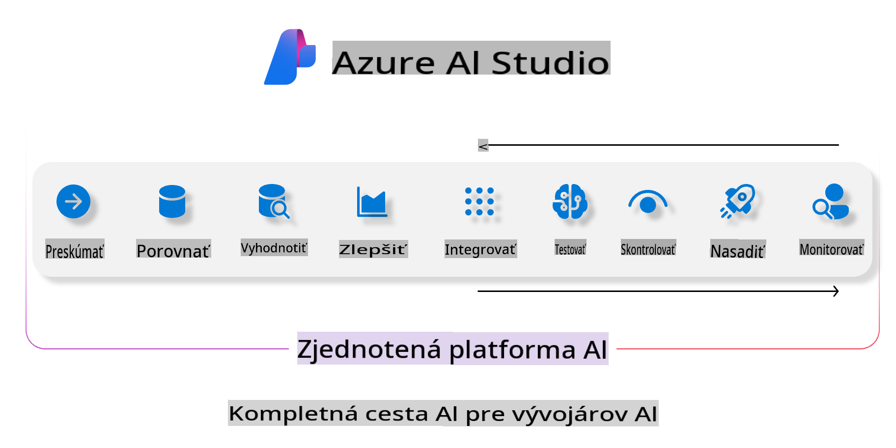
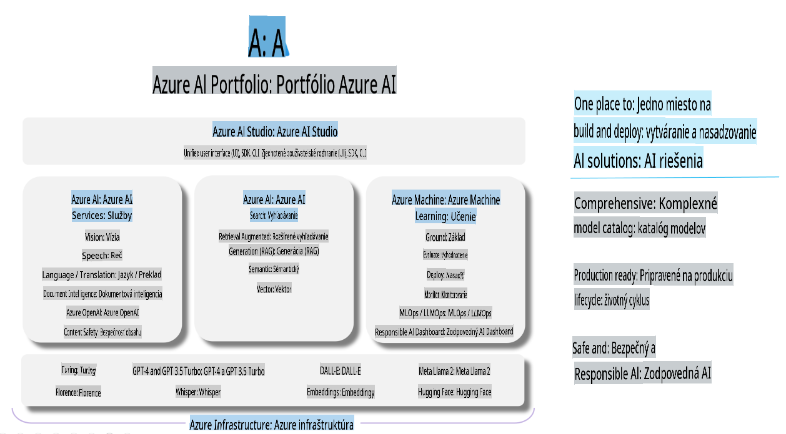

# **Používanie Azure AI Foundry na hodnotenie**

Ako hodnotiť vašu generatívnu AI aplikáciu pomocou [Azure AI Foundry](https://ai.azure.com?WT.mc_id=aiml-138114-kinfeylo). Či už posudzujete jednootáčkové alebo viacotáčkové konverzácie, Azure AI Foundry poskytuje nástroje na hodnotenie výkonu a bezpečnosti modelu.

## Ako hodnotiť generatívne AI aplikácie s Azure AI Foundry
Podrobnejšie pokyny nájdete v [dokumentácii Azure AI Foundry](https://learn.microsoft.com/azure/ai-studio/how-to/evaluate-generative-ai-app?WT.mc_id=aiml-138114-kinfeylo).

Tu sú kroky, ako začať:

## Hodnotenie generatívnych AI modelov v Azure AI Foundry

**Predpoklady**

- Testovacia dátová sada vo formáte CSV alebo JSON.
- Nasadený generatívny AI model (napríklad Phi-3, GPT 3.5, GPT 4 alebo modely Davinci).
- Runtime s výpočtovým prostredím na spustenie hodnotenia.

## Zabudované metriky hodnotenia

Azure AI Foundry vám umožňuje hodnotiť jednootáčkové aj zložité viacotáčkové konverzácie.  
Pre scenáre Retrieval Augmented Generation (RAG), kde je model založený na konkrétnych dátach, môžete hodnotiť výkon pomocou zabudovaných metrík hodnotenia.  
Okrem toho môžete hodnotiť aj všeobecné jednootáčkové scenáre otázok a odpovedí (non-RAG).

## Vytvorenie hodnotiaceho procesu

V rozhraní Azure AI Foundry prejdite na stránku Evaluate alebo Prompt Flow.  
Nasledujte sprievodcu na vytvorenie hodnotiaceho procesu. Poskytnite voliteľný názov pre vaše hodnotenie.  
Vyberte scenár, ktorý zodpovedá cieľom vašej aplikácie.  
Zvoľte jednu alebo viac metrík hodnotenia na posúdenie výstupu modelu.

## Vlastný hodnotiaci proces (voliteľné)

Pre väčšiu flexibilitu môžete vytvoriť vlastný hodnotiaci proces. Prispôsobte proces hodnotenia podľa vašich konkrétnych požiadaviek.

## Zobrazenie výsledkov

Po spustení hodnotenia si môžete zaznamenať, zobraziť a analyzovať podrobné metriky hodnotenia v Azure AI Foundry. Získajte prehľad o schopnostiach a obmedzeniach vašej aplikácie.

**Poznámka** Azure AI Foundry je momentálne vo verejnej ukážke, preto ho používajte na experimentovanie a vývojové účely. Pre produkčné pracovné záťaže zvážte iné možnosti. Preskúmajte oficiálnu [dokumentáciu AI Foundry](https://learn.microsoft.com/azure/ai-studio/?WT.mc_id=aiml-138114-kinfeylo) pre viac podrobností a krok za krokom inštrukcie.

**Upozornenie**:  
Tento dokument bol preložený pomocou strojových AI prekladových služieb. Hoci sa snažíme o presnosť, upozorňujeme, že automatizované preklady môžu obsahovať chyby alebo nepresnosti. Pôvodný dokument v jeho rodnom jazyku by mal byť považovaný za záväzný zdroj. Pre kritické informácie sa odporúča profesionálny ľudský preklad. Nenesieme zodpovednosť za akékoľvek nedorozumenia alebo nesprávne interpretácie vyplývajúce z použitia tohto prekladu.