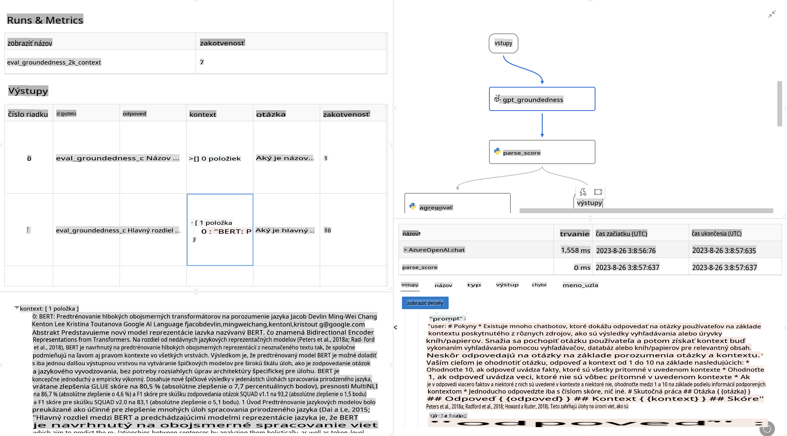

# **Predstavujeme Promptflow**

[Microsoft Prompt Flow](https://microsoft.github.io/promptflow/index.html?WT.mc_id=aiml-138114-kinfeylo) je vizuálny nástroj na automatizáciu pracovných postupov, ktorý umožňuje používateľom vytvárať automatizované procesy pomocou predpripravených šablón a vlastných konektorov. Je navrhnutý tak, aby vývojári a obchodní analytici mohli rýchlo vytvárať automatizované procesy pre úlohy, ako sú správa dát, spolupráca a optimalizácia procesov. S Prompt Flow môžu používatelia jednoducho prepojiť rôzne služby, aplikácie a systémy a automatizovať zložité obchodné procesy.

Microsoft Prompt Flow je navrhnutý na zjednodušenie celého vývojového cyklu AI aplikácií poháňaných veľkými jazykovými modelmi (LLMs). Či už ide o návrh, prototypovanie, testovanie, hodnotenie alebo nasadenie aplikácií založených na LLM, Prompt Flow zjednodušuje proces a umožňuje vám vytvárať aplikácie LLM v produkčnej kvalite.

## Kľúčové vlastnosti a výhody používania Microsoft Prompt Flow:

**Interaktívny zážitok z tvorby**

Prompt Flow poskytuje vizuálne zobrazenie štruktúry vášho pracovného postupu, čo uľahčuje pochopenie a navigáciu v projektoch.  
Ponúka prostredie podobné zápisníku na efektívny vývoj a ladenie pracovných postupov.

**Varianty promptov a ich ladenie**

Vytvárajte a porovnávajte viaceré varianty promptov na podporu iteratívneho procesu zdokonaľovania.  
Vyhodnocujte výkon rôznych promptov a vyberte tie najefektívnejšie.

**Zabudované hodnotiace postupy**  
Posudzujte kvalitu a účinnosť svojich promptov a pracovných postupov pomocou zabudovaných nástrojov na hodnotenie.  
Získajte prehľad o výkone vašich aplikácií založených na LLM.

**Komplexné zdroje**

Prompt Flow obsahuje knižnicu zabudovaných nástrojov, ukážok a šablón.  
Tieto zdroje slúžia ako východiskový bod pre vývoj, inšpirujú kreativitu a urýchľujú proces.

**Spolupráca a pripravenosť pre podniky**

Podporujte tímovú spoluprácu umožnením viacerým používateľom pracovať na projektoch prompt engineeringu.  
Udržujte kontrolu verzií a efektívne zdieľajte znalosti.  
Zjednodušte celý proces prompt engineeringu od vývoja a hodnotenia až po nasadenie a monitorovanie.

## Hodnotenie v Prompt Flow 

V Microsoft Prompt Flow zohráva hodnotenie kľúčovú úlohu pri posudzovaní výkonu vašich AI modelov. Pozrime sa, ako si môžete prispôsobiť hodnotiace postupy a metriky v rámci Prompt Flow:

**Pochopenie hodnotenia v Prompt Flow**

V Prompt Flow predstavuje pracovný postup sekvenciu uzlov, ktoré spracovávajú vstupy a generujú výstupy. Hodnotiace postupy sú špeciálne typy pracovných postupov navrhnuté na posúdenie výkonu behu na základe konkrétnych kritérií a cieľov.

**Kľúčové vlastnosti hodnotiacich postupov**

Zvyčajne sa vykonávajú po testovanom pracovnom postupe, pričom používajú jeho výstupy.  
Počítajú skóre alebo metriky na meranie výkonu testovaného pracovného postupu.  
Metriky môžu zahŕňať presnosť, skóre relevantnosti alebo akékoľvek iné relevantné ukazovatele.

### Prispôsobenie hodnotiacich postupov

**Definovanie vstupov**

Hodnotiace postupy musia prijímať výstupy z testovaného behu. Definujte vstupy podobne ako pri štandardných pracovných postupoch.  
Napríklad, ak hodnotíte pracovný postup QnA, pomenujte vstup ako "odpoveď." Ak hodnotíte klasifikačný pracovný postup, pomenujte vstup ako "kategória." Môžu byť potrebné aj vstupy s reálnymi údajmi (napr. skutočné štítky).

**Výstupy a metriky**

Hodnotiace postupy generujú výsledky, ktoré merajú výkon testovaného pracovného postupu.  
Metriky môžu byť počítané pomocou Pythonu alebo LLM (veľkých jazykových modelov).  
Použite funkciu log_metric() na zaznamenanie relevantných metrík.

**Používanie prispôsobených hodnotiacich postupov**

Vytvorte vlastný hodnotiaci postup prispôsobený vašim konkrétnym úlohám a cieľom.  
Prispôsobte metriky na základe svojich hodnotiacich cieľov.  
Použite tento prispôsobený hodnotiaci postup na dávkové behy pre rozsiahle testovanie.

## Zabudované metódy hodnotenia

Prompt Flow poskytuje aj zabudované metódy hodnotenia.  
Môžete odosielať dávkové behy a používať tieto metódy na hodnotenie výkonu pracovného postupu pri veľkých datasetoch.  
Prezrite si výsledky hodnotenia, porovnajte metriky a iterujte podľa potreby.  
Pamätajte, že hodnotenie je nevyhnutné na zabezpečenie toho, aby vaše AI modely splnili požadované kritériá a ciele. Preskúmajte oficiálnu dokumentáciu pre podrobné pokyny na vývoj a používanie hodnotiacich postupov v Microsoft Prompt Flow.

Na záver, Microsoft Prompt Flow umožňuje vývojárom vytvárať vysoko kvalitné aplikácie LLM zjednodušením prompt engineeringu a poskytovaním robustného vývojového prostredia. Ak pracujete s LLM, Prompt Flow je cenný nástroj na preskúmanie. Preskúmajte [dokumentáciu k hodnoteniu Prompt Flow](https://learn.microsoft.com/azure/machine-learning/prompt-flow/how-to-develop-an-evaluation-flow?view=azureml-api-2?WT.mc_id=aiml-138114-kinfeylo) pre podrobné pokyny na vývoj a používanie hodnotiacich postupov v Microsoft Prompt Flow.

**Upozornenie**:  
Tento dokument bol preložený pomocou strojových AI prekladateľských služieb. Hoci sa snažíme o presnosť, berte na vedomie, že automatické preklady môžu obsahovať chyby alebo nepresnosti. Pôvodný dokument v jeho rodnom jazyku by mal byť považovaný za autoritatívny zdroj. Pre dôležité informácie sa odporúča profesionálny ľudský preklad. Nenesieme zodpovednosť za akékoľvek nedorozumenia alebo nesprávne interpretácie vyplývajúce z použitia tohto prekladu.