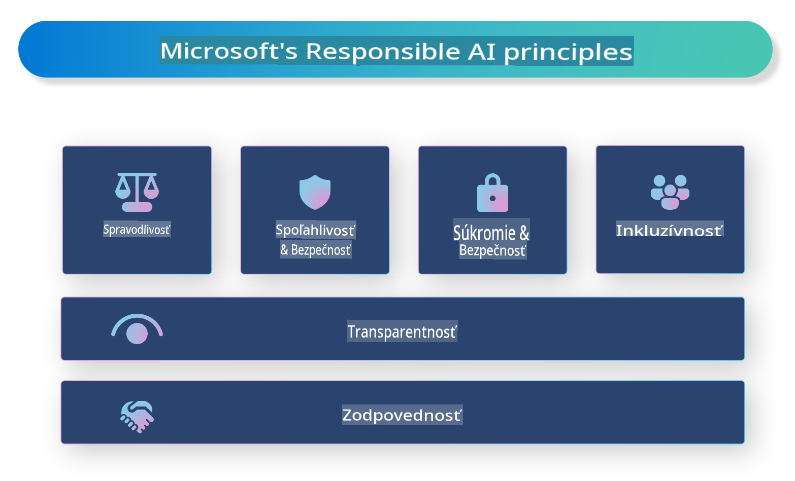

# **Predstavujeme zodpovednú AI**

[Microsoft Responsible AI](https://www.microsoft.com/ai/responsible-ai?WT.mc_id=aiml-138114-kinfeylo) je iniciatíva, ktorá má za cieľ pomôcť vývojárom a organizáciám vytvárať AI systémy, ktoré sú transparentné, dôveryhodné a zodpovedné. Táto iniciatíva poskytuje usmernenia a zdroje na vývoj zodpovedných AI riešení, ktoré sú v súlade s etickými princípmi, ako sú ochrana súkromia, spravodlivosť a transparentnosť. Preskúmame tiež niektoré výzvy a osvedčené postupy spojené s budovaním zodpovedných AI systémov.

## Prehľad Microsoft Responsible AI

**Etické princípy** 

Microsoft Responsible AI sa riadi súborom etických princípov, ako sú ochrana súkromia, spravodlivosť, transparentnosť, zodpovednosť a bezpečnosť. Tieto princípy sú navrhnuté tak, aby zabezpečili vývoj AI systémov v súlade s etikou a zodpovednosťou.

**Transparentná AI**

Microsoft Responsible AI zdôrazňuje dôležitosť transparentnosti v AI systémoch. To zahŕňa poskytovanie jasných vysvetlení, ako AI modely fungujú, a zabezpečenie verejnej dostupnosti zdrojov dát a algoritmov.

**Zodpovedná AI** 

[Microsoft Responsible AI](https://www.microsoft.com/ai/responsible-ai?WT.mc_id=aiml-138114-kinfeylo) podporuje vývoj zodpovedných AI systémov, ktoré dokážu poskytnúť náhľad do spôsobu, akým modely AI robia rozhodnutia. To môže pomôcť používateľom pochopiť a dôverovať výstupom AI systémov.

**Inkluzívnosť** 

AI systémy by mali byť navrhnuté tak, aby prospievali všetkým. Microsoft sa snaží vytvárať inkluzívnu AI, ktorá zohľadňuje rôzne perspektívy a vyhýba sa zaujatosti alebo diskriminácii.

**Spoľahlivosť a bezpečnosť**

Zabezpečenie spoľahlivosti a bezpečnosti AI systémov je kľúčové. Microsoft sa zameriava na budovanie robustných modelov, ktoré fungujú konzistentne a predchádzajú škodlivým výsledkom.

**Spravodlivosť v AI** 

Microsoft Responsible AI uznáva, že AI systémy môžu prehlbovať zaujatosti, ak sú trénované na zaujatých dátach alebo algoritmoch. Iniciatíva poskytuje usmernenia na vývoj spravodlivých AI systémov, ktoré nediskriminujú na základe faktorov, ako sú rasa, pohlavie alebo vek.

**Ochrana súkromia a bezpečnosť** 

Microsoft Responsible AI zdôrazňuje dôležitosť ochrany súkromia používateľov a bezpečnosti dát v AI systémoch. To zahŕňa implementáciu silného šifrovania dát a kontrol prístupu, ako aj pravidelné audity AI systémov na identifikáciu zraniteľností.

**Zodpovednosť a zodpovedné správanie** 

Microsoft Responsible AI podporuje zodpovednosť a zodpovedné správanie pri vývoji a nasadzovaní AI. To zahŕňa zabezpečenie, že vývojári a organizácie si uvedomujú potenciálne riziká spojené s AI systémami a podnikajú kroky na ich zmiernenie.

## Osvedčené postupy pri budovaní zodpovedných AI systémov

**Vyvíjajte AI modely s použitím rôznorodých dátových súborov** 

Aby sa predišlo zaujatosti v AI systémoch, je dôležité používať rôznorodé dátové súbory, ktoré reprezentujú širokú škálu perspektív a skúseností.

**Používajte techniky vysvetliteľnej AI** 

Techniky vysvetliteľnej AI môžu pomôcť používateľom pochopiť, ako AI modely robia rozhodnutia, čo môže zvýšiť dôveru v systém.

**Pravidelne vykonávajte audity AI systémov na zraniteľnosti** 

Pravidelné audity AI systémov môžu pomôcť identifikovať potenciálne riziká a zraniteľnosti, ktoré je potrebné riešiť.

**Implementujte silné šifrovanie dát a kontroly prístupu** 

Šifrovanie dát a kontroly prístupu môžu pomôcť chrániť súkromie a bezpečnosť používateľov v AI systémoch.

**Dodržiavajte etické princípy pri vývoji AI** 

Dodržiavanie etických princípov, ako sú spravodlivosť, transparentnosť a zodpovednosť, môže pomôcť vybudovať dôveru v AI systémy a zabezpečiť ich zodpovedný vývoj.

## Používanie AI Foundry pre zodpovednú AI 

[Azure AI Foundry](https://ai.azure.com?WT.mc_id=aiml-138114-kinfeylo) je výkonná platforma, ktorá umožňuje vývojárom a organizáciám rýchlo vytvárať inteligentné, inovatívne, trhovo pripravené a zodpovedné aplikácie. Tu sú niektoré kľúčové funkcie a schopnosti Azure AI Foundry:

**Predpripravené API a modely** 

Azure AI Foundry poskytuje predpripravené a prispôsobiteľné API a modely. Tieto pokrývajú široké spektrum AI úloh, vrátane generatívnej AI, spracovania prirodzeného jazyka pre konverzácie, vyhľadávania, monitorovania, prekladu, reči, videnia a rozhodovania.

**Prompt Flow** 

Prompt Flow v Azure AI Foundry umožňuje vytvárať zážitky konverzačnej AI. Umožňuje navrhovať a spravovať konverzačné toky, čo uľahčuje vývoj chatbotov, virtuálnych asistentov a ďalších interaktívnych aplikácií.

**Retrieval Augmented Generation (RAG)** 

RAG je technika, ktorá kombinuje prístupy založené na vyhľadávaní a generovaní. Zvyšuje kvalitu generovaných odpovedí tým, že využíva existujúce znalosti (vyhľadávanie) a kreatívne generovanie (generovanie).

**Hodnotiace a monitorovacie metriky pre generatívnu AI** 

Azure AI Foundry poskytuje nástroje na hodnotenie a monitorovanie generatívnych AI modelov. Môžete hodnotiť ich výkonnosť, spravodlivosť a ďalšie dôležité metriky, aby ste zabezpečili zodpovedné nasadenie. Navyše, ak ste vytvorili dashboard, môžete použiť no-code UI v Azure Machine Learning Studio na prispôsobenie a generovanie Responsible AI Dashboard a pridruženého skóre na základe [Responsible AI Toolbox](https://responsibleaitoolbox.ai/?WT.mc_id=aiml-138114-kinfeylo) Python knižníc. Tento skórecard pomáha zdieľať kľúčové poznatky týkajúce sa spravodlivosti, dôležitosti funkcií a ďalších zodpovedných aspektov nasadenia s technickými aj netechnickými účastníkmi.

Ak chcete použiť AI Foundry so zodpovednou AI, môžete postupovať podľa týchto osvedčených postupov:

**Definujte problém a ciele vášho AI systému**

Pred začatím vývojového procesu je dôležité jasne definovať problém alebo cieľ, ktorý váš AI systém má vyriešiť. To vám pomôže identifikovať dáta, algoritmy a zdroje potrebné na vytvorenie efektívneho modelu.

**Zhromaždite a predspracujte relevantné dáta** 

Kvalita a množstvo dát použitých na trénovanie AI systému môžu mať významný dopad na jeho výkon. Preto je dôležité zhromaždiť relevantné dáta, vyčistiť ich, predspracovať a zabezpečiť, že sú reprezentatívne pre populáciu alebo problém, ktorý sa snažíte vyriešiť.

**Vyberte vhodné hodnotenie** 

Existuje mnoho hodnotiacich algoritmov. Je dôležité vybrať najvhodnejší algoritmus na základe vašich dát a problému.

**Vyhodnoťte a interpretujte model** 

Keď už máte vytvorený AI model, je dôležité vyhodnotiť jeho výkon pomocou vhodných metrík a interpretovať výsledky transparentným spôsobom. To vám pomôže identifikovať akékoľvek zaujatosti alebo obmedzenia modelu a zlepšiť ho tam, kde je to potrebné.

**Zabezpečte transparentnosť a vysvetliteľnosť** 

AI systémy by mali byť transparentné a vysvetliteľné, aby používatelia mohli pochopiť, ako fungujú a ako sa prijímajú rozhodnutia. To je obzvlášť dôležité pre aplikácie, ktoré majú významný dopad na ľudské životy, ako sú zdravotníctvo, financie a právne systémy.

**Monitorujte a aktualizujte model** 

AI systémy by mali byť neustále monitorované a aktualizované, aby sa zabezpečilo, že zostanú presné a efektívne v priebehu času. To si vyžaduje priebežnú údržbu, testovanie a opätovné trénovanie modelu.

Na záver, Microsoft Responsible AI je iniciatíva, ktorá má za cieľ pomôcť vývojárom a organizáciám vytvárať AI systémy, ktoré sú transparentné, dôveryhodné a zodpovedné. Pamätajte, že implementácia zodpovednej AI je kľúčová, a Azure AI Foundry sa snaží sprístupniť ju pre organizácie. Dodržiavaním etických princípov a osvedčených postupov môžeme zabezpečiť, že AI systémy budú vyvíjané a nasadzované zodpovedným spôsobom, ktorý prospieva celej spoločnosti.

**Upozornenie**:  
Tento dokument bol preložený pomocou strojových prekladových služieb založených na umelej inteligencii. Hoci sa snažíme o presnosť, berte prosím na vedomie, že automatické preklady môžu obsahovať chyby alebo nepresnosti. Pôvodný dokument v jeho pôvodnom jazyku by mal byť považovaný za záväzný zdroj. Pre kritické informácie sa odporúča profesionálny ľudský preklad. Nenesieme zodpovednosť za akékoľvek nedorozumenia alebo nesprávne výklady vyplývajúce z použitia tohto prekladu.