# Vyhodnotenie doladeného modelu Phi-3 / Phi-3.5 v Azure AI Foundry so zameraním na zásady zodpovednej AI od Microsoftu

Tento kompletný (E2E) príklad vychádza z návodu "[Evaluate Fine-tuned Phi-3 / 3.5 Models in Azure AI Foundry Focusing on Microsoft's Responsible AI](https://techcommunity.microsoft.com/t5/educator-developer-blog/evaluate-fine-tuned-phi-3-3-5-models-in-azure-ai-studio-focusing/ba-p/4227850?WT.mc_id=aiml-137032-kinfeylo)" z komunity Microsoft Tech Community.

## Prehľad

### Ako môžete vyhodnotiť bezpečnosť a výkon doladeného modelu Phi-3 / Phi-3.5 v Azure AI Foundry?

Doladenie modelu môže niekedy viesť k neželaným alebo neúmyselným odpovediam. Aby ste sa uistili, že model zostáva bezpečný a efektívny, je dôležité vyhodnotiť jeho potenciál generovať škodlivý obsah a jeho schopnosť poskytovať presné, relevantné a koherentné odpovede. V tomto návode sa naučíte, ako vyhodnotiť bezpečnosť a výkon doladeného modelu Phi-3 / Phi-3.5 integrovaného s Prompt flow v Azure AI Foundry.

Tu je proces vyhodnotenia v Azure AI Foundry.

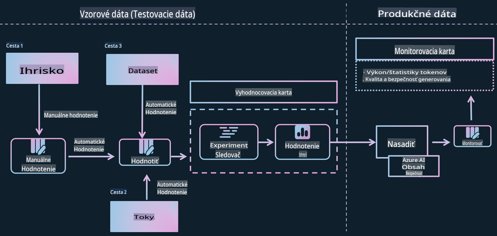

*Zdroj obrázku: [Vyhodnotenie generatívnych AI aplikácií](https://learn.microsoft.com/azure/ai-studio/concepts/evaluation-approach-gen-ai?wt.mc_id%3Dstudentamb_279723)*

> [!NOTE]
>
> Pre podrobnejšie informácie a ďalšie zdroje o Phi-3 / Phi-3.5 navštívte [Phi-3CookBook](https://github.com/microsoft/Phi-3CookBook?wt.mc_id=studentamb_279723).

### Predpoklady

- [Python](https://www.python.org/downloads)
- [Azure subscription](https://azure.microsoft.com/free?wt.mc_id=studentamb_279723)
- [Visual Studio Code](https://code.visualstudio.com)
- Doladený model Phi-3 / Phi-3.5

### Obsah

1. [**Scenár 1: Úvod do vyhodnotenia Prompt flow v Azure AI Foundry**](../../../../../../md/02.Application/01.TextAndChat/Phi3)

    - [Úvod do vyhodnotenia bezpečnosti](../../../../../../md/02.Application/01.TextAndChat/Phi3)
    - [Úvod do vyhodnotenia výkonu](../../../../../../md/02.Application/01.TextAndChat/Phi3)

1. [**Scenár 2: Vyhodnotenie modelu Phi-3 / Phi-3.5 v Azure AI Foundry**](../../../../../../md/02.Application/01.TextAndChat/Phi3)

    - [Predtým, ako začnete](../../../../../../md/02.Application/01.TextAndChat/Phi3)
    - [Nasadenie Azure OpenAI na vyhodnotenie modelu Phi-3 / Phi-3.5](../../../../../../md/02.Application/01.TextAndChat/Phi3)
    - [Vyhodnotenie doladeného modelu Phi-3 / Phi-3.5 pomocou Prompt flow v Azure AI Foundry](../../../../../../md/02.Application/01.TextAndChat/Phi3)

1. [Gratulujeme!](../../../../../../md/02.Application/01.TextAndChat/Phi3)

## **Scenár 1: Úvod do vyhodnotenia Prompt flow v Azure AI Foundry**

### Úvod do vyhodnotenia bezpečnosti

Aby ste zabezpečili, že váš AI model je etický a bezpečný, je kľúčové vyhodnotiť ho podľa zásad zodpovednej AI od Microsoftu. V Azure AI Foundry umožňuje vyhodnotenie bezpečnosti posúdiť zraniteľnosť vášho modelu voči útokom typu jailbreak a jeho potenciál generovať škodlivý obsah, čo je v súlade s týmito zásadami.

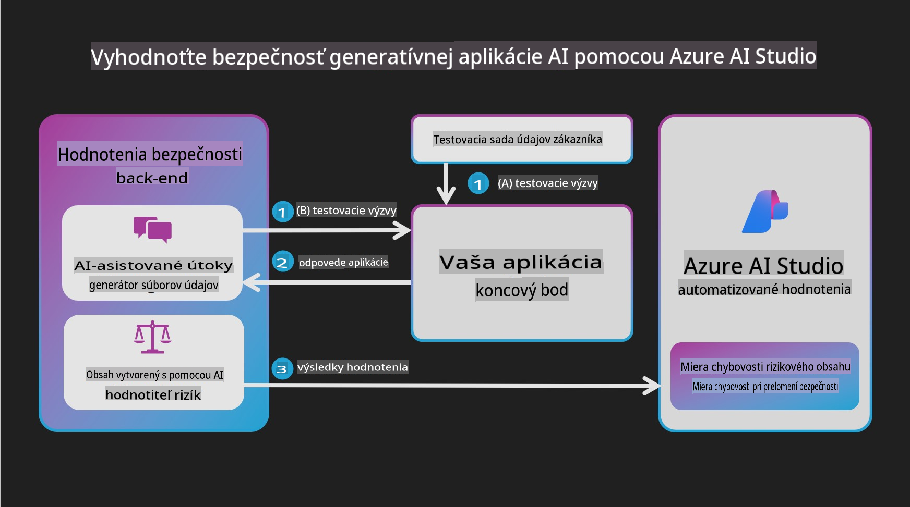

*Zdroj obrázku: [Vyhodnotenie generatívnych AI aplikácií](https://learn.microsoft.com/azure/ai-studio/concepts/evaluation-approach-gen-ai?wt.mc_id%3Dstudentamb_279723)*

#### Zásady zodpovednej AI od Microsoftu

Pred začatím technických krokov je nevyhnutné pochopiť zásady zodpovednej AI od Microsoftu, čo je etický rámec navrhnutý na usmernenie zodpovedného vývoja, nasadzovania a prevádzky AI systémov. Tieto zásady vedú k zodpovednému dizajnu, vývoju a nasadzovaniu AI systémov, aby boli spravodlivé, transparentné a inkluzívne. Sú základom pre vyhodnotenie bezpečnosti AI modelov.

Zásady zodpovednej AI od Microsoftu zahŕňajú:

- **Spravodlivosť a inkluzívnosť**: AI systémy by mali zaobchádzať so všetkými spravodlivo a vyhýbať sa rozdielnemu zaobchádzaniu s podobnými skupinami ľudí. Napríklad, keď AI systémy poskytujú odporúčania o zdravotnej starostlivosti, úverových žiadostiach alebo zamestnaní, mali by robiť rovnaké odporúčania všetkým, ktorí majú podobné symptómy, finančné okolnosti alebo odborné kvalifikácie.

- **Spoľahlivosť a bezpečnosť**: Aby sa vybudovala dôvera, je kľúčové, aby AI systémy fungovali spoľahlivo, bezpečne a konzistentne. Tieto systémy by mali byť schopné fungovať tak, ako boli pôvodne navrhnuté, bezpečne reagovať na nepredvídané podmienky a odolávať škodlivým manipuláciám.

- **Transparentnosť**: Keď AI systémy pomáhajú pri rozhodovaní, ktoré majú veľký dopad na životy ľudí, je kľúčové, aby ľudia rozumeli, ako boli tieto rozhodnutia urobené. Napríklad banka môže použiť AI systém na rozhodnutie, či je osoba úverovo schopná.

- **Ochrana súkromia a bezpečnosť**: Ako sa AI stáva rozšírenejšou, ochrana súkromia a zabezpečenie osobných a firemných informácií sú čoraz dôležitejšie a zložitejšie. S AI vyžaduje ochrana súkromia a dátová bezpečnosť zvýšenú pozornosť, pretože prístup k dátam je nevyhnutný na presné a informované predpovede a rozhodnutia.

- **Zodpovednosť**: Ľudia, ktorí navrhujú a nasadzujú AI systémy, musia byť zodpovední za to, ako tieto systémy fungujú. Organizácie by mali čerpať z priemyselných štandardov na vývoj noriem zodpovednosti.


*Zdroj obrázku: [Čo je zodpovedná AI?](https://learn.microsoft.com/azure/machine-learning/concept-responsible-ai?view=azureml-api-2&viewFallbackFrom=azureml-api-2%253fwt.mc_id%3Dstudentamb_279723)*

> [!NOTE]
> Viac informácií o zásadách zodpovednej AI od Microsoftu nájdete na stránke [Čo je zodpovedná AI?](https://learn.microsoft.com/azure/machine-learning/concept-responsible-ai?view=azureml-api-2?wt.mc_id=studentamb_279723).

#### Metódy vyhodnotenia bezpečnosti

V tomto návode budete hodnotiť bezpečnosť doladeného modelu Phi-3 pomocou metód vyhodnotenia bezpečnosti v Azure AI Foundry. Tieto metódy vám pomôžu posúdiť potenciál modelu generovať škodlivý obsah a jeho zraniteľnosť voči útokom typu jailbreak. Metódy zahŕňajú:

- **Obsah súvisiaci so sebapoškodzovaním**: Hodnotí, či má model tendenciu generovať obsah súvisiaci so sebapoškodzovaním.
- **Nenávistný a nespravodlivý obsah**: Hodnotí, či má model tendenciu generovať nenávistný alebo nespravodlivý obsah.
- **Násilný obsah**: Hodnotí, či má model tendenciu generovať násilný obsah.
- **Sexuálny obsah**: Hodnotí, či má model tendenciu generovať nevhodný sexuálny obsah.

Vyhodnotením týchto aspektov sa zabezpečí, že AI model nebude generovať škodlivý alebo urážlivý obsah, čím bude v súlade so spoločenskými hodnotami a regulačnými normami.

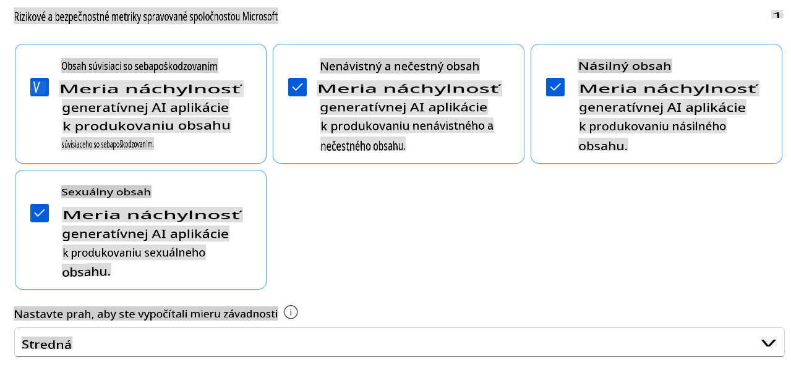

### Úvod do vyhodnotenia výkonu

Aby ste zabezpečili, že váš AI model funguje podľa očakávaní, je dôležité vyhodnotiť jeho výkon na základe výkonnostných metrík. V Azure AI Foundry umožňuje vyhodnotenie výkonu posúdiť efektivitu vášho modelu pri generovaní presných, relevantných a koherentných odpovedí.

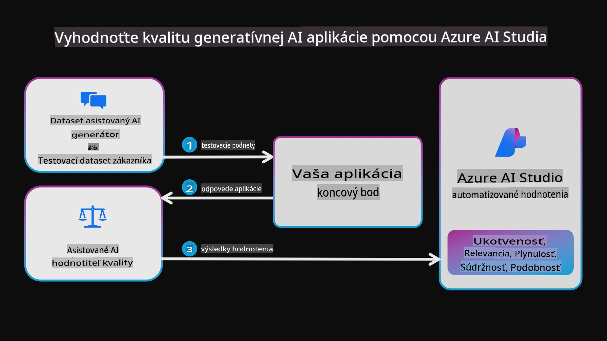

*Zdroj obrázku: [Vyhodnotenie generatívnych AI aplikácií](https://learn.microsoft.com/azure/ai-studio/concepts/evaluation-approach-gen-ai?wt.mc_id%3Dstudentamb_279723)*

#### Výkonnostné metriky

V tomto návode budete hodnotiť výkon doladeného modelu Phi-3 / Phi-3.5 pomocou výkonnostných metrík v Azure AI Foundry. Tieto metriky vám pomôžu posúdiť efektivitu modelu pri generovaní presných, relevantných a koherentných odpovedí. Výkonnostné metriky zahŕňajú:

- **Základovosť**: Hodnotí, ako dobre generované odpovede zodpovedajú informáciám zo vstupného zdroja.
- **Relevancia**: Hodnotí, ako dobre generované odpovede súvisia s danými otázkami.
- **Koherencia**: Hodnotí, ako plynulo generovaný text pôsobí, či číta prirodzene a pripomína jazyk používaný ľuďmi.
- **Plynulosť**: Hodnotí jazykovú zdatnosť generovaného textu.
- **Podobnosť s GPT**: Porovnáva generovanú odpoveď s referenčnou odpoveďou na podobnosť.
- **F1 skóre**: Vypočíta pomer zdieľaných slov medzi generovanou odpoveďou a zdrojovými dátami.

Tieto metriky vám pomôžu vyhodnotiť efektivitu modelu pri generovaní presných, relevantných a koherentných odpovedí.

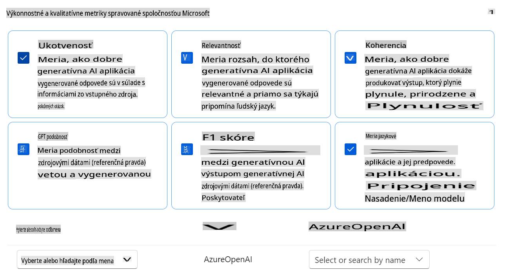

## **Scenár 2: Vyhodnotenie modelu Phi-3 / Phi-3.5 v Azure AI Foundry**

### Predtým, ako začnete

Tento návod nadväzuje na predchádzajúce blogové príspevky, "[Fine-Tune and Integrate Custom Phi-3 Models with Prompt Flow: Step-by-Step Guide](https://techcommunity.microsoft.com/t5/educator-developer-blog/fine-tune-and-integrate-custom-phi-3-models-with-prompt-flow/ba-p/4178612?wt.mc_id=studentamb_279723)" a "[Fine-Tune and Integrate Custom Phi-3 Models with Prompt Flow in Azure AI Foundry](https://techcommunity.microsoft.com/t5/educator-developer-blog/fine-tune-and-integrate-custom-phi-3-models-with-prompt-flow-in/ba-p/4191726?wt.mc_id=studentamb_279723)." V týchto príspevkoch sme prešli procesom doladenia modelu Phi-3 / Phi-3.5 v Azure AI Foundry a jeho integráciou s Prompt flow.

V tomto návode nasadíte Azure OpenAI model ako evaluátor v Azure AI Foundry a použijete ho na vyhodnotenie vášho doladeného modelu Phi-3 / Phi-3.5.

Pred začatím tohto návodu sa uistite, že máte nasledujúce predpoklady, ako je popísané v predchádzajúcich návodoch:

1. Pripravený dataset na vyhodnotenie doladeného modelu Phi-3 / Phi-3.5.
1. Model Phi-3 / Phi-3.5, ktorý bol doladený a nasadený do Azure Machine Learning.
1. Prompt flow integrovaný s vaším doladeným modelom Phi-3 / Phi-3.5 v Azure AI Foundry.

> [!NOTE]
> Použijete súbor *test_data.jsonl*, ktorý sa nachádza v priečinku data z datasetu **ULTRACHAT_200k** stiahnutého v predchádzajúcich blogových príspevkoch, ako dataset na vyhodnotenie doladeného modelu Phi-3 / Phi-3.5.

#### Integrácia vlastného modelu Phi-3 / Phi-3.5 s Prompt flow v Azure AI Foundry (prístup "najprv kód")

> [!NOTE]
> Ak ste postupovali podľa prístupu s nízkym kódom opísaného v "[Fine-Tune and Integrate Custom Phi-3 Models with Prompt Flow in Azure AI Foundry](https://techcommunity.microsoft.com/t5/educator-developer-blog/fine-tune-and-integrate-custom-phi-3-models-with-prompt-flow-in/ba-p/4191726?wt.mc_id=studentamb_279723)", môžete túto úlohu preskočiť a pokračovať ďalšou.
> Ak ste však postupovali podľa prístupu "najprv kód" opísaného v "[Fine-Tune and Integrate Custom Phi-3 Models with Prompt Flow: Step-by-Step Guide](https://techcommunity.microsoft.com/t5/educator-developer-blog/fine-tune-and-integrate-custom-phi-3-models-with-prompt-flow/ba-p/4178612?wt.mc_id=studentamb_279723)" na doladenie a nasadenie vášho modelu Phi-3 / Phi-3.5, proces pripojenia vášho modelu k Prompt flow je mierne odlišný. Tento proces sa naučíte v tejto úlohe.

Pokračujte integráciou vášho doladeného modelu Phi-3 / Phi-3.5 do Prompt flow v Azure AI Foundry.

#### Vytvorenie Hubu v Azure AI Foundry

Pred vytvorením projektu musíte vytvoriť Hub. Hub funguje ako Resource Group, ktorá umožňuje organizovať a spravovať viacero projektov v Azure AI Foundry.

1. Prihláste sa na [Azure AI Foundry](https://ai.azure.com/?wt.mc_id=studentamb_279723).

1. Zvoľte **All hubs** z ľavého panela.

1. Zvoľte **+ New hub** z navigačného menu.

    

1. Vykonajte nasledujúce úlohy:

    - Zadajte **Hub name**. Musí byť unikátny.
    - Vyberte vašu Azure **Subscription**.
    - Vyberte **Resource group**, ktorú chcete použiť (vytvorte novú, ak je potrebné).
    - Vyberte **Location**, ktorú chcete použiť.
    - Vyberte **Connect Azure AI Services**, ktoré chcete použiť (vytvorte nové, ak je potrebné).
    - Vyberte **Connect Azure AI Search** na **Skip connecting**.
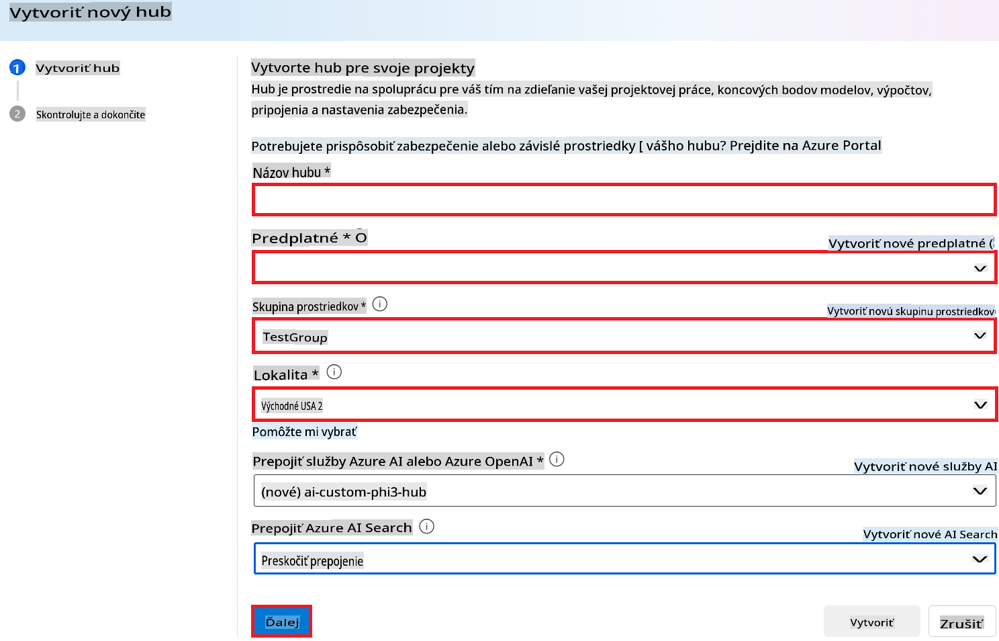

1. Vyberte **Next**.

#### Vytvorenie projektu Azure AI Foundry

1. V Hube, ktorý ste vytvorili, vyberte **All projects** z ľavého menu.

1. Kliknite na **+ New project** v navigačnom menu.

    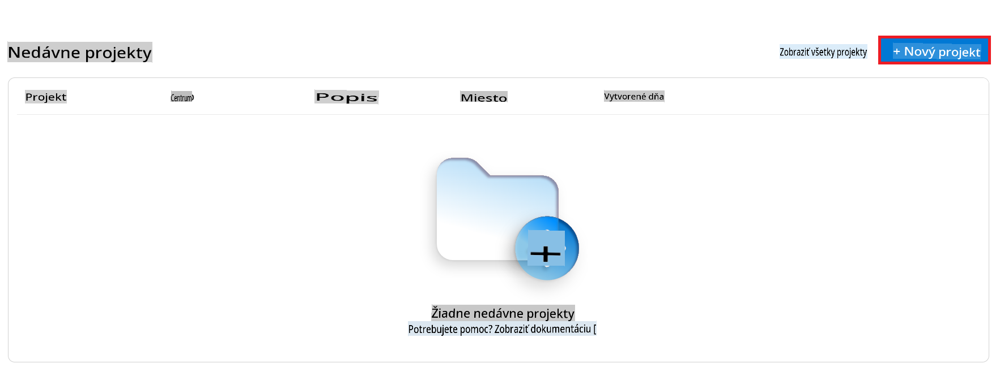

1. Zadajte **Project name**. Musí to byť jedinečná hodnota.

    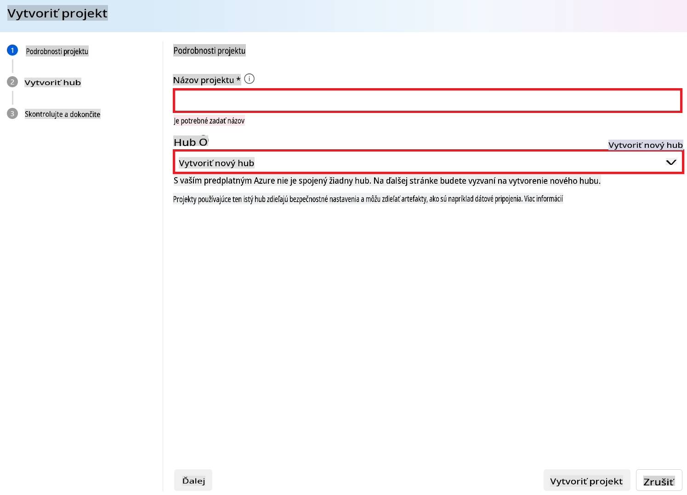

1. Vyberte **Create a project**.

#### Pridanie vlastného pripojenia pre doladený model Phi-3 / Phi-3.5

Aby ste integrovali svoj vlastný model Phi-3 / Phi-3.5 s Prompt flow, je potrebné uložiť endpoint a kľúč modelu vo vlastnom pripojení. Tento krok zabezpečí prístup k vášmu vlastnému modelu Phi-3 / Phi-3.5 v rámci Prompt flow.

#### Nastavenie api kľúča a endpoint uri doladeného modelu Phi-3 / Phi-3.5

1. Navštívte [Azure ML Studio](https://ml.azure.com/home?wt.mc_id=studentamb_279723).

1. Prejdite do pracovného priestoru Azure Machine Learning, ktorý ste vytvorili.

1. Vyberte **Endpoints** z ľavého menu.

    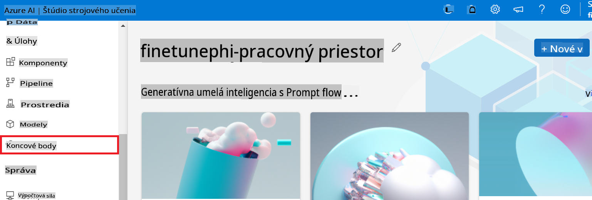

1. Vyberte endpoint, ktorý ste vytvorili.

    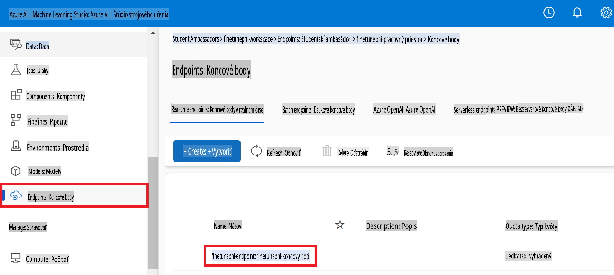

1. Kliknite na **Consume** v navigačnom menu.

1. Skopírujte svoj **REST endpoint** a **Primary key**.

    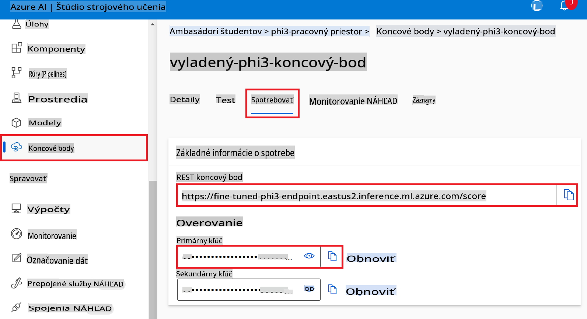

#### Pridanie vlastného pripojenia

1. Navštívte [Azure AI Foundry](https://ai.azure.com/?wt.mc_id=studentamb_279723).

1. Prejdite do projektu Azure AI Foundry, ktorý ste vytvorili.

1. V projekte, ktorý ste vytvorili, vyberte **Settings** z ľavého menu.

1. Kliknite na **+ New connection**.

    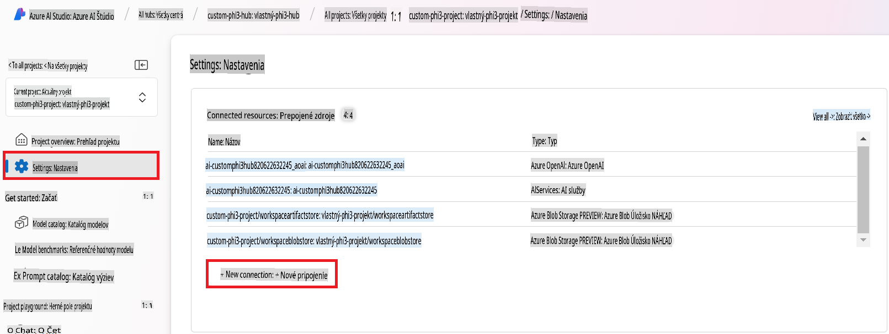

1. Vyberte **Custom keys** z navigačného menu.

    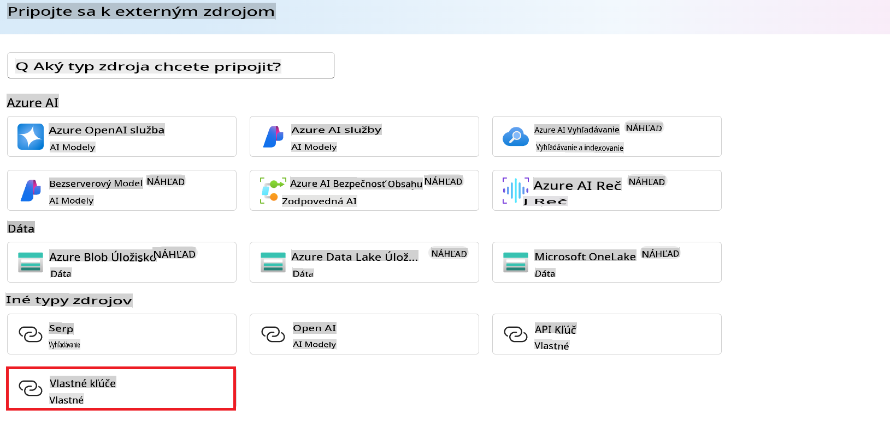

1. Vykonajte nasledujúce kroky:

    - Kliknite na **+ Add key value pairs**.
    - Pre názov kľúča zadajte **endpoint** a vložte endpoint, ktorý ste skopírovali z Azure ML Studio, do poľa pre hodnotu.
    - Kliknite na **+ Add key value pairs** znova.
    - Pre názov kľúča zadajte **key** a vložte kľúč, ktorý ste skopírovali z Azure ML Studio, do poľa pre hodnotu.
    - Po pridaní kľúčov vyberte **is secret**, aby ste zabránili zobrazeniu kľúča.

    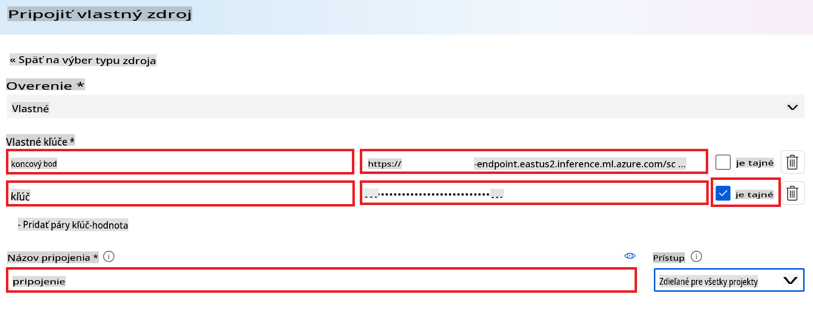

1. Kliknite na **Add connection**.

#### Vytvorenie Prompt flow

Pridali ste vlastné pripojenie v Azure AI Foundry. Teraz vytvoríme Prompt flow pomocou nasledujúcich krokov. Následne prepojíte tento Prompt flow s vlastným pripojením, aby ste mohli používať doladený model v Prompt flow.

1. Prejdite do projektu Azure AI Foundry, ktorý ste vytvorili.

1. Vyberte **Prompt flow** z ľavého menu.

1. Kliknite na **+ Create** v navigačnom menu.

    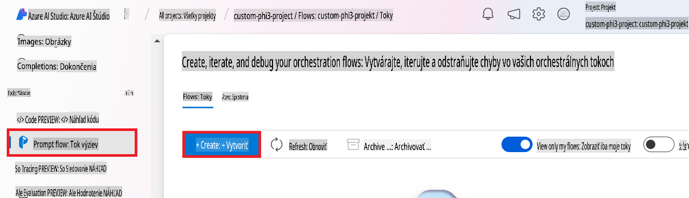

1. Vyberte **Chat flow** z navigačného menu.

    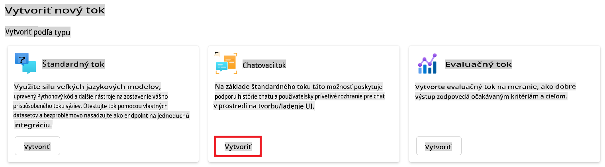

1. Zadajte **Folder name**, ktorý chcete použiť.

    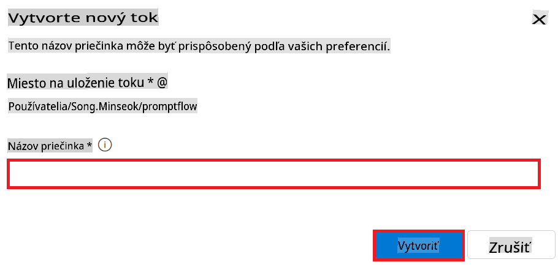

1. Kliknite na **Create**.

#### Nastavenie Prompt flow na chatovanie s vlastným modelom Phi-3 / Phi-3.5

Je potrebné integrovať doladený model Phi-3 / Phi-3.5 do Prompt flow. Avšak existujúci Prompt flow nie je navrhnutý na tento účel. Preto je potrebné redizajnovať Prompt flow, aby umožnil integráciu vlastného modelu.

1. V Prompt flow vykonajte nasledujúce kroky na prestavanie existujúceho flow:

    - Vyberte **Raw file mode**.
    - Odstráňte všetok existujúci kód v súbore *flow.dag.yml*.
    - Pridajte nasledujúci kód do *flow.dag.yml*.

        ```yml
        inputs:
          input_data:
            type: string
            default: "Who founded Microsoft?"

        outputs:
          answer:
            type: string
            reference: ${integrate_with_promptflow.output}

        nodes:
        - name: integrate_with_promptflow
          type: python
          source:
            type: code
            path: integrate_with_promptflow.py
          inputs:
            input_data: ${inputs.input_data}
        ```

    - Kliknite na **Save**.

    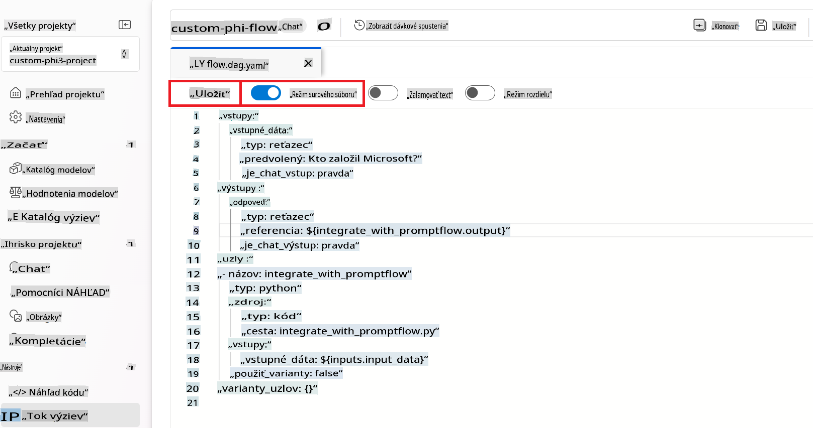

1. Pridajte nasledujúci kód do *integrate_with_promptflow.py*, aby ste mohli používať vlastný model Phi-3 / Phi-3.5 v Prompt flow.

    ```python
    import logging
    import requests
    from promptflow import tool
    from promptflow.connections import CustomConnection

    # Logging setup
    logging.basicConfig(
        format="%(asctime)s - %(levelname)s - %(name)s - %(message)s",
        datefmt="%Y-%m-%d %H:%M:%S",
        level=logging.DEBUG
    )
    logger = logging.getLogger(__name__)

    def query_phi3_model(input_data: str, connection: CustomConnection) -> str:
        """
        Send a request to the Phi-3 / Phi-3.5 model endpoint with the given input data using Custom Connection.
        """

        # "connection" is the name of the Custom Connection, "endpoint", "key" are the keys in the Custom Connection
        endpoint_url = connection.endpoint
        api_key = connection.key

        headers = {
            "Content-Type": "application/json",
            "Authorization": f"Bearer {api_key}"
        }
    data = {
        "input_data": [input_data],
        "params": {
            "temperature": 0.7,
            "max_new_tokens": 128,
            "do_sample": True,
            "return_full_text": True
            }
        }
        try:
            response = requests.post(endpoint_url, json=data, headers=headers)
            response.raise_for_status()
            
            # Log the full JSON response
            logger.debug(f"Full JSON response: {response.json()}")

            result = response.json()["output"]
            logger.info("Successfully received response from Azure ML Endpoint.")
            return result
        except requests.exceptions.RequestException as e:
            logger.error(f"Error querying Azure ML Endpoint: {e}")
            raise

    @tool
    def my_python_tool(input_data: str, connection: CustomConnection) -> str:
        """
        Tool function to process input data and query the Phi-3 / Phi-3.5 model.
        """
        return query_phi3_model(input_data, connection)

    ```

    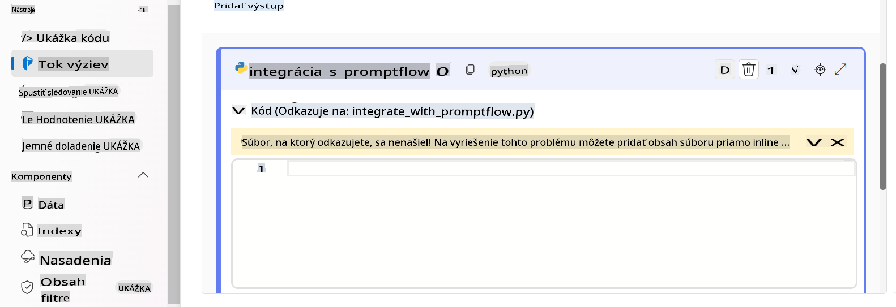

> [!NOTE]
> Pre podrobnejšie informácie o používaní Prompt flow v Azure AI Foundry si môžete pozrieť [Prompt flow v Azure AI Foundry](https://learn.microsoft.com/azure/ai-studio/how-to/prompt-flow).

1. Vyberte **Chat input**, **Chat output**, aby ste mohli chatovať s vaším modelom.

    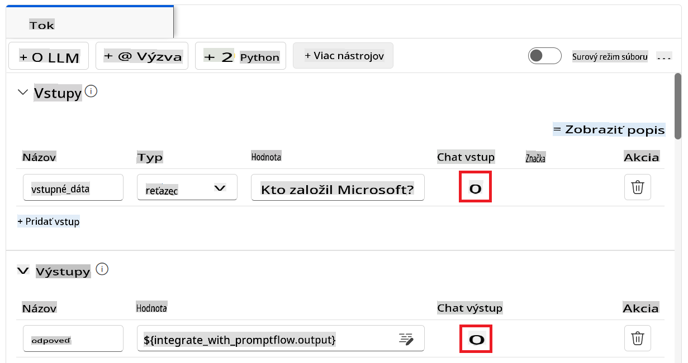

1. Teraz ste pripravení na chatovanie s vlastným modelom Phi-3 / Phi-3.5. V ďalšom cvičení sa naučíte, ako spustiť Prompt flow a používať ho na chatovanie s vaším doladeným modelom Phi-3 / Phi-3.5.

> [!NOTE]
>
> Prestavaný flow by mal vyzerať ako na obrázku nižšie:
>
> 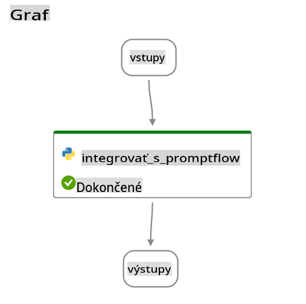
>

#### Spustenie Prompt flow

1. Kliknite na **Start compute sessions**, aby ste spustili Prompt flow.

    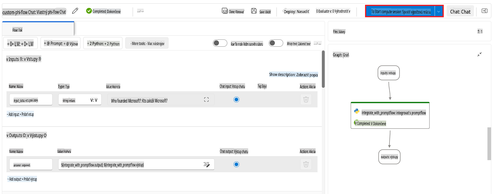

1. Vyberte **Validate and parse input**, aby ste obnovili parametre.

    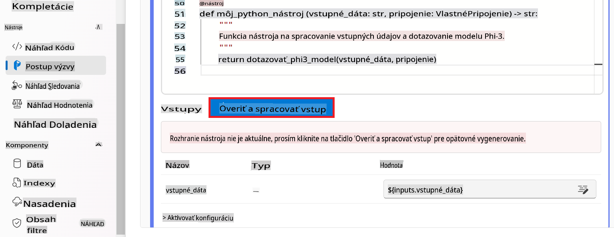

1. Vyberte **Value** pre **connection** k vlastnému pripojeniu, ktoré ste vytvorili. Napríklad *connection*.

    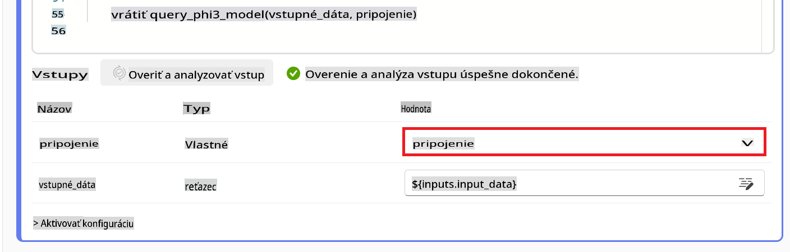

#### Chatovanie s vlastným modelom Phi-3 / Phi-3.5

1. Kliknite na **Chat**.

    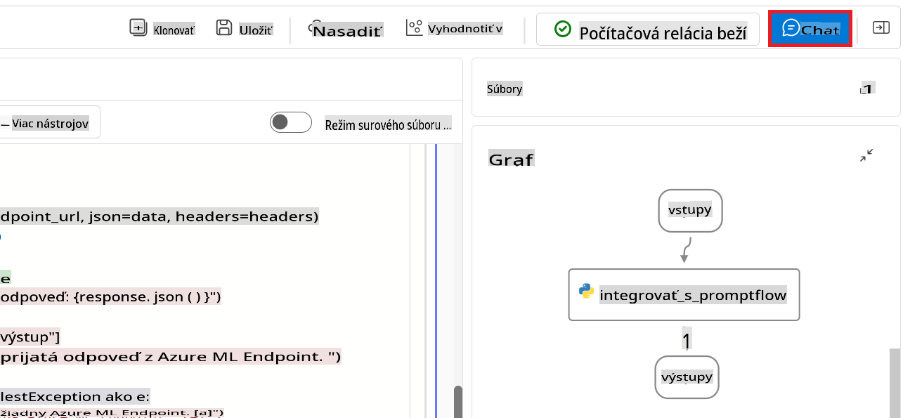

1. Tu je príklad výsledkov: Teraz môžete chatovať s vaším vlastným modelom Phi-3 / Phi-3.5. Odporúča sa klásť otázky na základe údajov použitých na doladenie.

    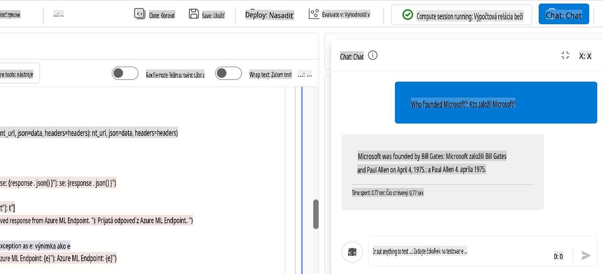

### Nasadenie Azure OpenAI na hodnotenie modelu Phi-3 / Phi-3.5

Aby ste mohli hodnotiť model Phi-3 / Phi-3.5 v Azure AI Foundry, je potrebné nasadiť model Azure OpenAI. Tento model bude použitý na hodnotenie výkonu modelu Phi-3 / Phi-3.5.

#### Nasadenie Azure OpenAI

1. Prihláste sa do [Azure AI Foundry](https://ai.azure.com/?wt.mc_id=studentamb_279723).

1. Prejdite do projektu Azure AI Foundry, ktorý ste vytvorili.

    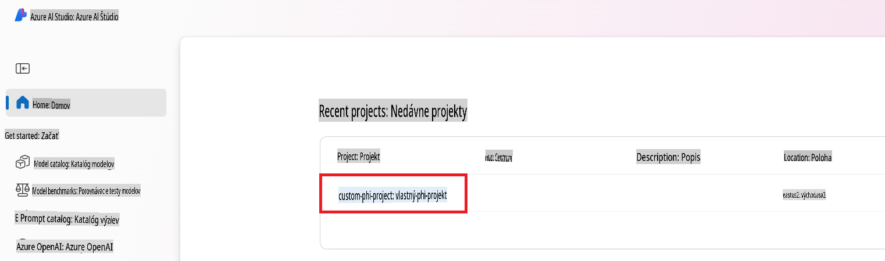

1. V projekte, ktorý ste vytvorili, vyberte **Deployments** z ľavého menu.

1. Kliknite na **+ Deploy model** v navigačnom menu.

1. Vyberte **Deploy base model**.

    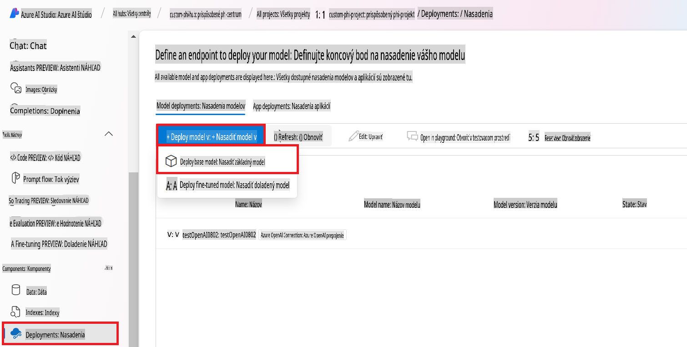

1. Vyberte model Azure OpenAI, ktorý chcete použiť. Napríklad **gpt-4o**.

    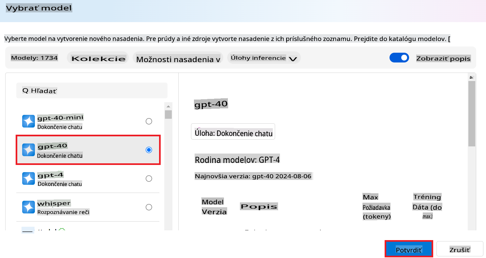

1. Kliknite na **Confirm**.

### Hodnotenie doladeného modelu Phi-3 / Phi-3.5 pomocou evaluácie Prompt flow v Azure AI Foundry

### Spustenie novej evaluácie

1. Navštívte [Azure AI Foundry](https://ai.azure.com/?wt.mc_id=studentamb_279723).

1. Prejdite do projektu Azure AI Foundry, ktorý ste vytvorili.

    

1. V projekte, ktorý ste vytvorili, vyberte **Evaluation** z ľavého menu.

1. Kliknite na **+ New evaluation** v navigačnom menu.
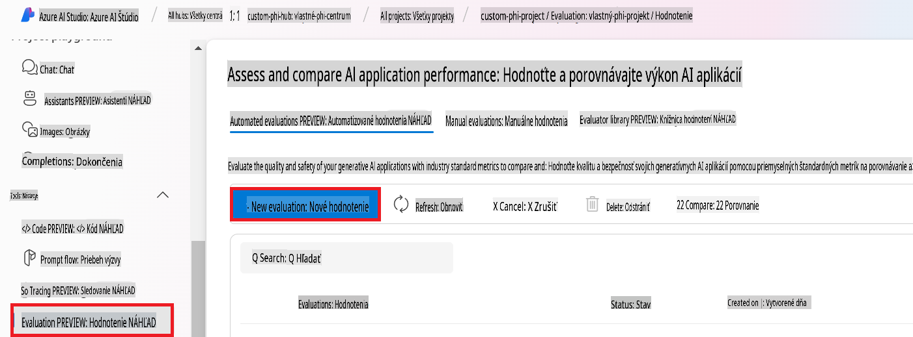

1. Vyberte hodnotenie **Prompt flow**.

    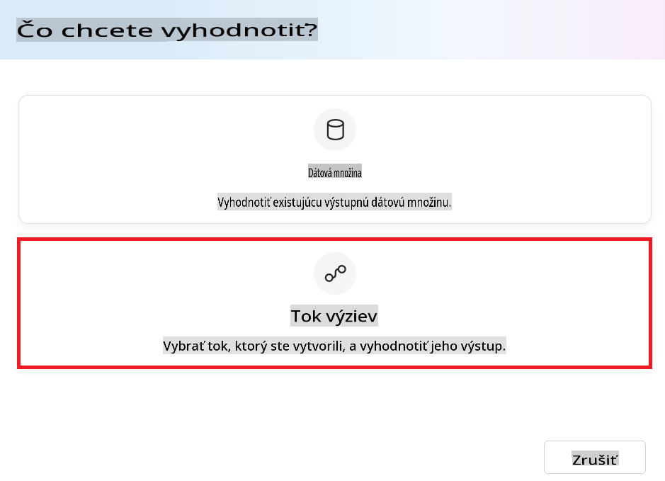

1. Vykonajte nasledujúce úlohy:

    - Zadajte názov hodnotenia. Musí byť unikátny.
    - Vyberte **Otázka a odpoveď bez kontextu** ako typ úlohy. Dôvodom je, že dataset **ULTRACHAT_200k** použitý v tomto návode neobsahuje kontext.
    - Vyberte prompt flow, ktorý chcete hodnotiť.

    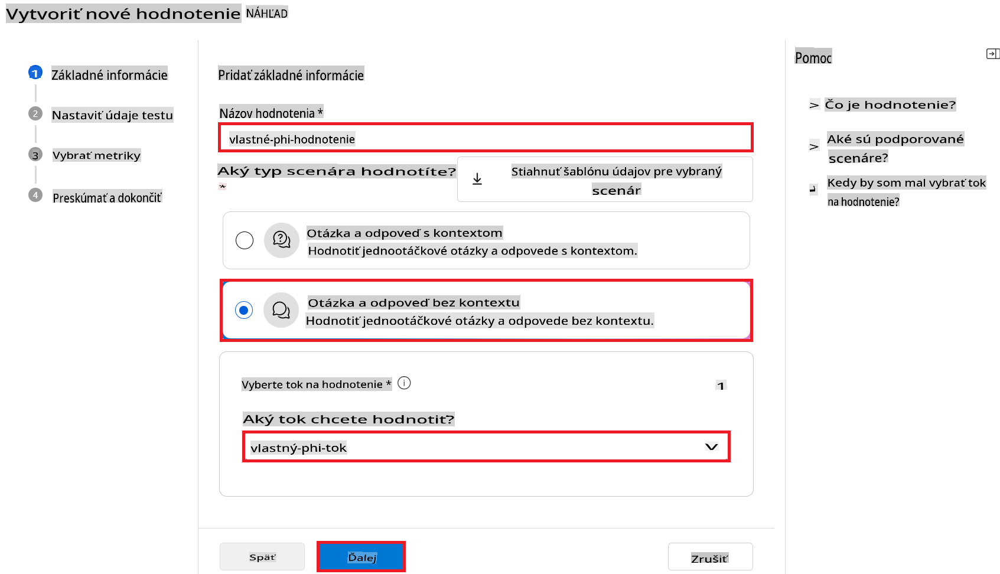

1. Vyberte **Ďalej**.

1. Vykonajte nasledujúce úlohy:

    - Vyberte **Pridať váš dataset** na nahranie datasetu. Napríklad môžete nahrať testovací datasetový súbor, ako je *test_data.json1*, ktorý je súčasťou pri stiahnutí datasetu **ULTRACHAT_200k**.
    - Vyberte príslušný **Stĺpec datasetu**, ktorý zodpovedá vášmu datasetu. Napríklad, ak používate dataset **ULTRACHAT_200k**, vyberte **${data.prompt}** ako stĺpec datasetu.

    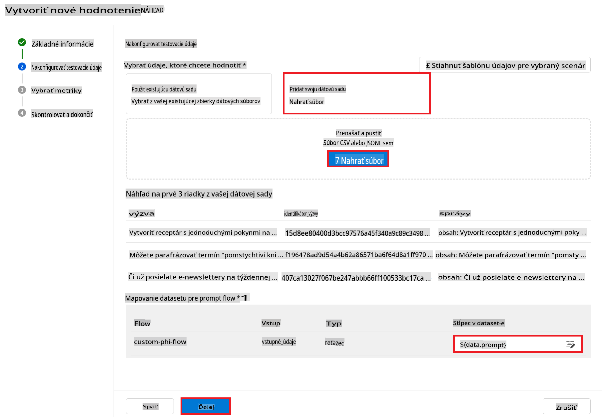

1. Vyberte **Ďalej**.

1. Vykonajte nasledujúce úlohy na nastavenie metrík výkonu a kvality:

    - Vyberte metriky výkonu a kvality, ktoré chcete použiť.
    - Vyberte model Azure OpenAI, ktorý ste vytvorili na hodnotenie. Napríklad, vyberte **gpt-4o**.

    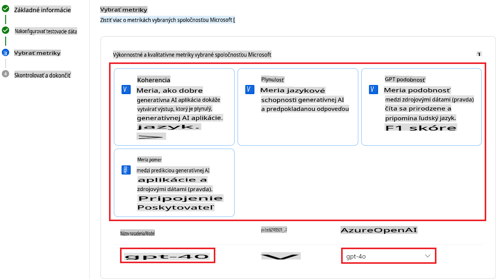

1. Vykonajte nasledujúce úlohy na nastavenie metrík rizika a bezpečnosti:

    - Vyberte metriky rizika a bezpečnosti, ktoré chcete použiť.
    - Vyberte prahovú hodnotu na výpočet miery chybovosti, ktorú chcete použiť. Napríklad, vyberte **Stredná**.
    - Pre **otázku**, vyberte **Zdroj dát** ako **{$data.prompt}**.
    - Pre **odpoveď**, vyberte **Zdroj dát** ako **{$run.outputs.answer}**.
    - Pre **ground_truth**, vyberte **Zdroj dát** ako **{$data.message}**.

    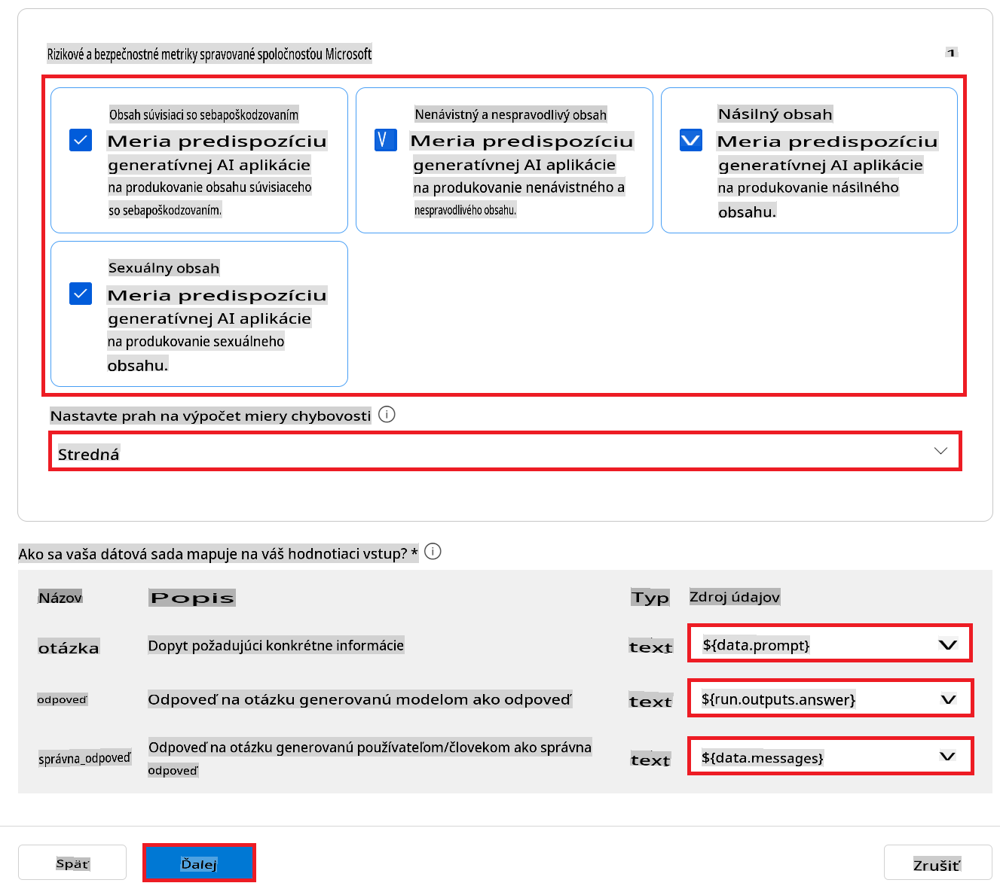

1. Vyberte **Ďalej**.

1. Vyberte **Odoslať** na spustenie hodnotenia.

1. Hodnotenie bude trvať určitý čas na dokončenie. Pokrok môžete sledovať na karte **Hodnotenie**.

### Skontrolujte výsledky hodnotenia

> [!NOTE]
> Výsledky uvedené nižšie slúžia na ilustráciu procesu hodnotenia. V tomto návode sme použili model doladený na relatívne malom datasete, čo môže viesť k suboptimálnym výsledkom. Skutočné výsledky sa môžu výrazne líšiť v závislosti od veľkosti, kvality a rozmanitosti použitého datasetu, ako aj od konkrétnej konfigurácie modelu.

Po dokončení hodnotenia si môžete prezrieť výsledky pre metriky výkonu aj bezpečnosti.

1. Metriky výkonu a kvality:

    - Hodnoťte efektívnosť modelu pri generovaní súvislých, plynulých a relevantných odpovedí.

    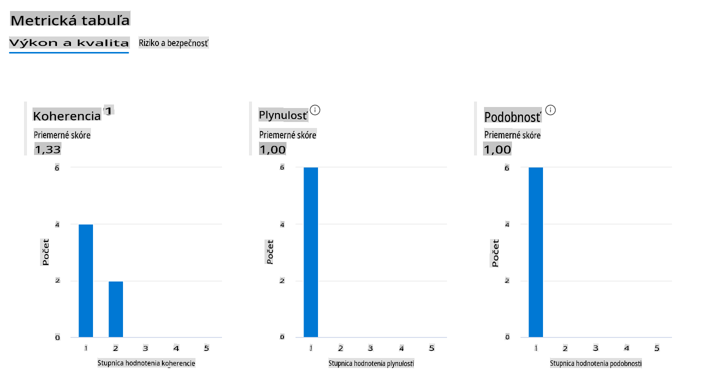

1. Metriky rizika a bezpečnosti:

    - Uistite sa, že výstupy modelu sú bezpečné a v súlade s princípmi zodpovednej AI, aby sa zabránilo akémukoľvek škodlivému alebo urážlivému obsahu.

    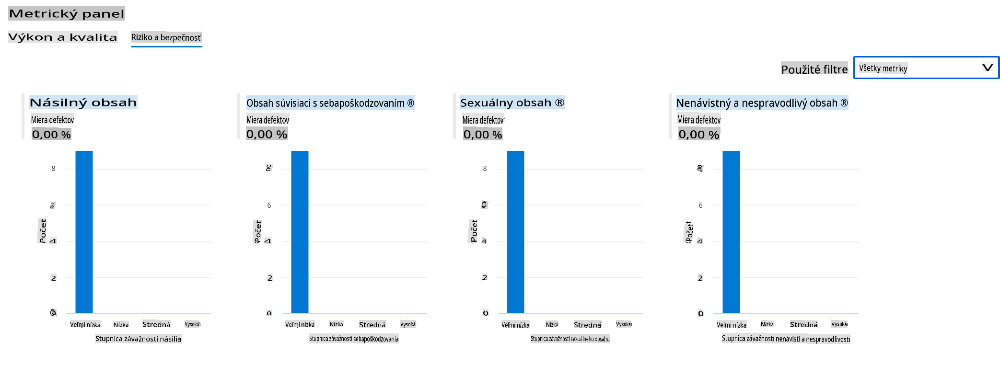

1. Môžete posunúť zobrazenie nadol a prezrieť si **Podrobné výsledky metrík**.

    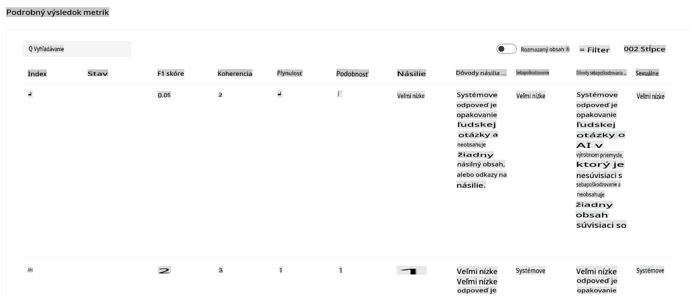

1. Hodnotením vášho vlastného modelu Phi-3 / Phi-3.5 na základe metrík výkonu a bezpečnosti môžete potvrdiť, že model je nielen efektívny, ale aj dodržiava zásady zodpovednej AI, čím je pripravený na nasadenie v reálnom svete.

## Gratulujeme!

### Dokončili ste tento návod

Úspešne ste vyhodnotili doladený model Phi-3 integrovaný s Prompt flow v Azure AI Foundry. Toto je dôležitý krok na zabezpečenie toho, že vaše AI modely nielen dobre fungujú, ale aj dodržiavajú princípy zodpovednej AI od spoločnosti Microsoft, aby ste mohli vytvárať dôveryhodné a spoľahlivé AI aplikácie.


## Vyčistenie zdrojov Azure

Vyčistite svoje Azure zdroje, aby ste predišli ďalším poplatkom na vašom účte. Prejdite do portálu Azure a odstráňte nasledujúce zdroje:

- Zdroje Azure Machine Learning.
- Koncový bod modelu Azure Machine Learning.
- Projektový zdroj Azure AI Foundry.
- Prompt flow zdroj Azure AI Foundry.

### Ďalšie kroky

#### Dokumentácia

- [Hodnotenie AI systémov pomocou nástroja Responsible AI dashboard](https://learn.microsoft.com/azure/machine-learning/concept-responsible-ai-dashboard?view=azureml-api-2&source=recommendations?wt.mc_id=studentamb_279723)
- [Hodnotenie a monitorovacie metriky pre generatívne AI](https://learn.microsoft.com/azure/ai-studio/concepts/evaluation-metrics-built-in?tabs=definition?wt.mc_id=studentamb_279723)
- [Dokumentácia Azure AI Foundry](https://learn.microsoft.com/azure/ai-studio/?wt.mc_id=studentamb_279723)
- [Dokumentácia Prompt flow](https://microsoft.github.io/promptflow/?wt.mc_id=studentamb_279723)

#### Obsah školení

- [Úvod do prístupu spoločnosti Microsoft k zodpovednej AI](https://learn.microsoft.com/training/modules/introduction-to-microsofts-responsible-ai-approach/?source=recommendations?wt.mc_id=studentamb_279723)
- [Úvod do Azure AI Foundry](https://learn.microsoft.com/training/modules/introduction-to-azure-ai-studio/?wt.mc_id=studentamb_279723)

### Referencie

- [Čo je zodpovedná AI?](https://learn.microsoft.com/azure/machine-learning/concept-responsible-ai?view=azureml-api-2?wt.mc_id=studentamb_279723)
- [Oznámenie nových nástrojov v Azure AI na pomoc pri budovaní bezpečnejších a dôveryhodnejších generatívnych AI aplikácií](https://azure.microsoft.com/blog/announcing-new-tools-in-azure-ai-to-help-you-build-more-secure-and-trustworthy-generative-ai-applications/?wt.mc_id=studentamb_279723)
- [Hodnotenie generatívnych AI aplikácií](https://learn.microsoft.com/azure/ai-studio/concepts/evaluation-approach-gen-ai?wt.mc_id%3Dstudentamb_279723)

**Upozornenie**:  
Tento dokument bol preložený pomocou strojových AI prekladateľských služieb. Hoci sa snažíme o presnosť, prosíme, aby ste si uvedomili, že automatizované preklady môžu obsahovať chyby alebo nepresnosti. Za záväzný zdroj by sa mal považovať pôvodný dokument v jeho pôvodnom jazyku. Pre dôležité informácie sa odporúča profesionálny ľudský preklad. Nezodpovedáme za žiadne nedorozumenia alebo nesprávne interpretácie vyplývajúce z použitia tohto prekladu.