# Vyladenie a integrácia vlastných modelov Phi-3 s Prompt Flow v Azure AI Foundry

Tento kompletný (E2E) príklad je založený na návode "[Fine-Tune and Integrate Custom Phi-3 Models with Prompt Flow in Azure AI Foundry](https://techcommunity.microsoft.com/t5/educator-developer-blog/fine-tune-and-integrate-custom-phi-3-models-with-prompt-flow-in/ba-p/4191726?WT.mc_id=aiml-137032-kinfeylo)" z Microsoft Tech Community. Predstavuje procesy vyladenia, nasadenia a integrácie vlastných modelov Phi-3 s Prompt Flow v Azure AI Foundry.  
Na rozdiel od príkladu "[Fine-Tune and Integrate Custom Phi-3 Models with Prompt Flow](./E2E_Phi-3-FineTuning_PromptFlow_Integration.md)", ktorý zahŕňal spúšťanie kódu lokálne, sa tento návod sústreďuje výlučne na vyladenie a integráciu vášho modelu v Azure AI / ML Studio.

## Prehľad

V tomto E2E príklade sa naučíte, ako vyladiť model Phi-3 a integrovať ho s Prompt Flow v Azure AI Foundry. Využitím Azure AI / ML Studio vytvoríte pracovný postup pre nasadenie a používanie vlastných AI modelov. Tento E2E príklad je rozdelený do troch scenárov:

**Scenár 1: Nastavenie Azure zdrojov a príprava na vyladenie**

**Scenár 2: Vyladenie modelu Phi-3 a nasadenie v Azure Machine Learning Studio**

**Scenár 3: Integrácia s Prompt Flow a rozhovor s vaším vlastným modelom v Azure AI Foundry**

Nižšie je prehľad tohto E2E príkladu.

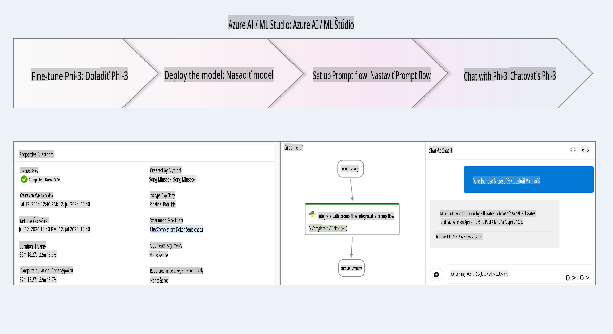

### Obsah

1. **[Scenár 1: Nastavenie Azure zdrojov a príprava na vyladenie](../../../../../../md/02.Application/01.TextAndChat/Phi3)**
    - [Vytvorenie Azure Machine Learning Workspace](../../../../../../md/02.Application/01.TextAndChat/Phi3)
    - [Požiadanie o GPU kvóty v Azure Subscription](../../../../../../md/02.Application/01.TextAndChat/Phi3)
    - [Pridanie priradenia rolí](../../../../../../md/02.Application/01.TextAndChat/Phi3)
    - [Nastavenie projektu](../../../../../../md/02.Application/01.TextAndChat/Phi3)
    - [Príprava datasetu na vyladenie](../../../../../../md/02.Application/01.TextAndChat/Phi3)

1. **[Scenár 2: Vyladenie modelu Phi-3 a nasadenie v Azure Machine Learning Studio](../../../../../../md/02.Application/01.TextAndChat/Phi3)**
    - [Vyladenie modelu Phi-3](../../../../../../md/02.Application/01.TextAndChat/Phi3)
    - [Nasadenie vyladeného modelu Phi-3](../../../../../../md/02.Application/01.TextAndChat/Phi3)

1. **[Scenár 3: Integrácia s Prompt Flow a rozhovor s vaším vlastným modelom v Azure AI Foundry](../../../../../../md/02.Application/01.TextAndChat/Phi3)**
    - [Integrácia vlastného modelu Phi-3 s Prompt Flow](../../../../../../md/02.Application/01.TextAndChat/Phi3)
    - [Rozhovor s vaším vlastným modelom Phi-3](../../../../../../md/02.Application/01.TextAndChat/Phi3)

## Scenár 1: Nastavenie Azure zdrojov a príprava na vyladenie

### Vytvorenie Azure Machine Learning Workspace

1. Napíšte *azure machine learning* do **vyhľadávacieho panela** v hornej časti portálu a vyberte **Azure Machine Learning** z ponúkaných možností.

    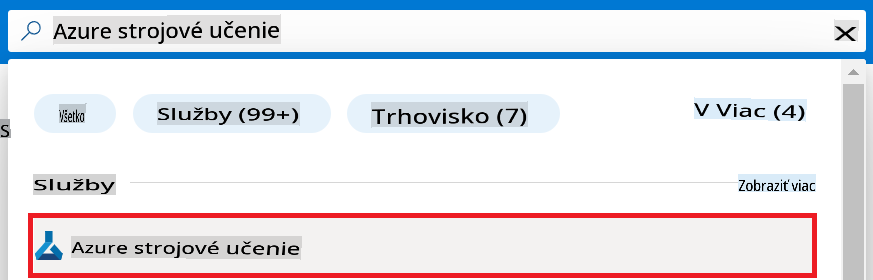

2. Vyberte **+ Create** z navigačného menu.

3. Vyberte **New workspace** z navigačného menu.

    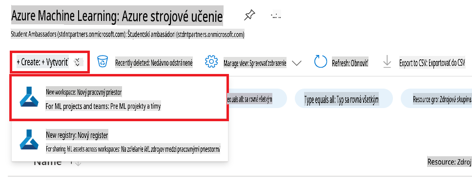

4. Vykonajte nasledujúce úlohy:

    - Vyberte vašu Azure **Subscription**.
    - Vyberte **Resource group**, ktorú chcete použiť (v prípade potreby vytvorte novú).
    - Zadajte **Workspace Name**. Musí byť unikátne.
    - Vyberte **Region**, ktorú chcete použiť.
    - Vyberte **Storage account**, ktorý chcete použiť (v prípade potreby vytvorte nový).
    - Vyberte **Key vault**, ktorý chcete použiť (v prípade potreby vytvorte nový).
    - Vyberte **Application insights**, ktoré chcete použiť (v prípade potreby vytvorte nové).
    - Vyberte **Container registry**, ktorý chcete použiť (v prípade potreby vytvorte nový).

    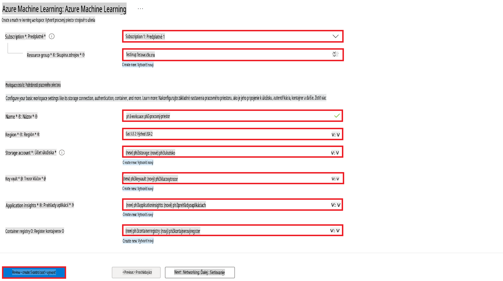

5. Vyberte **Review + Create**.

6. Vyberte **Create**.

### Požiadanie o GPU kvóty v Azure Subscription

V tomto návode sa naučíte, ako vyladiť a nasadiť model Phi-3 pomocou GPU. Na vyladenie použijete GPU *Standard_NC24ads_A100_v4*, ktoré vyžaduje žiadosť o kvótu. Na nasadenie použijete GPU *Standard_NC6s_v3*, ktoré tiež vyžaduje žiadosť o kvótu.

> [!NOTE]
>
> Iba predplatné typu Pay-As-You-Go (štandardný typ predplatného) sú oprávnené na pridelenie GPU; predplatné s výhodami momentálne nie sú podporované.
>

1. Navštívte [Azure ML Studio](https://ml.azure.com/home?wt.mc_id=studentamb_279723).

1. Vykonajte nasledujúce kroky na požiadanie o kvótu *Standard NCADSA100v4 Family*:

    - Vyberte **Quota** z ľavého navigačného panela.
    - Vyberte **Virtual machine family**, ktorú chcete použiť. Napríklad vyberte **Standard NCADSA100v4 Family Cluster Dedicated vCPUs**, ktorý zahŕňa GPU *Standard_NC24ads_A100_v4*.
    - Vyberte **Request quota** z navigačného menu.

        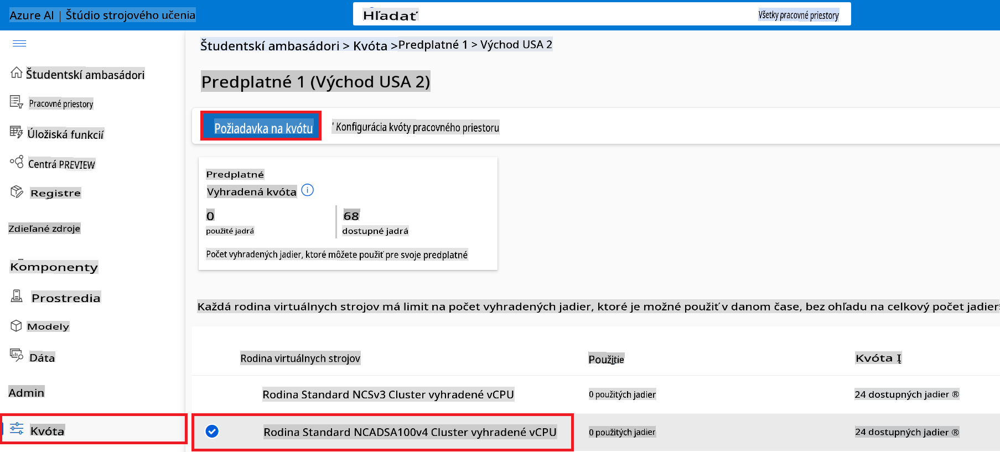

    - Na stránke Request quota zadajte **New cores limit**, ktorý chcete použiť. Napríklad 24.
    - Na stránke Request quota vyberte **Submit** na odoslanie žiadosti o GPU kvótu.

1. Vykonajte nasledujúce kroky na požiadanie o kvótu *Standard NCSv3 Family*:

    - Vyberte **Quota** z ľavého navigačného panela.
    - Vyberte **Virtual machine family**, ktorú chcete použiť. Napríklad vyberte **Standard NCSv3 Family Cluster Dedicated vCPUs**, ktorý zahŕňa GPU *Standard_NC6s_v3*.
    - Vyberte **Request quota** z navigačného menu.
    - Na stránke Request quota zadajte **New cores limit**, ktorý chcete použiť. Napríklad 24.
    - Na stránke Request quota vyberte **Submit** na odoslanie žiadosti o GPU kvótu.

### Pridanie priradenia rolí

Na vyladenie a nasadenie modelov musíte najskôr vytvoriť User Assigned Managed Identity (UAI) a priradiť mu potrebné povolenia. Tento UAI bude použitý na autentifikáciu počas nasadenia.

#### Vytvorenie User Assigned Managed Identity (UAI)

1. Napíšte *managed identities* do **vyhľadávacieho panela** v hornej časti portálu a vyberte **Managed Identities** z ponúkaných možností.

    

1. Vyberte **+ Create**.

    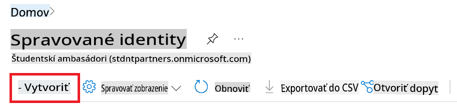

1. Vykonajte nasledujúce úlohy:

    - Vyberte vašu Azure **Subscription**.
    - Vyberte **Resource group**, ktorú chcete použiť (v prípade potreby vytvorte novú).
    - Vyberte **Region**, ktorú chcete použiť.
    - Zadajte **Name**. Musí byť unikátne.

    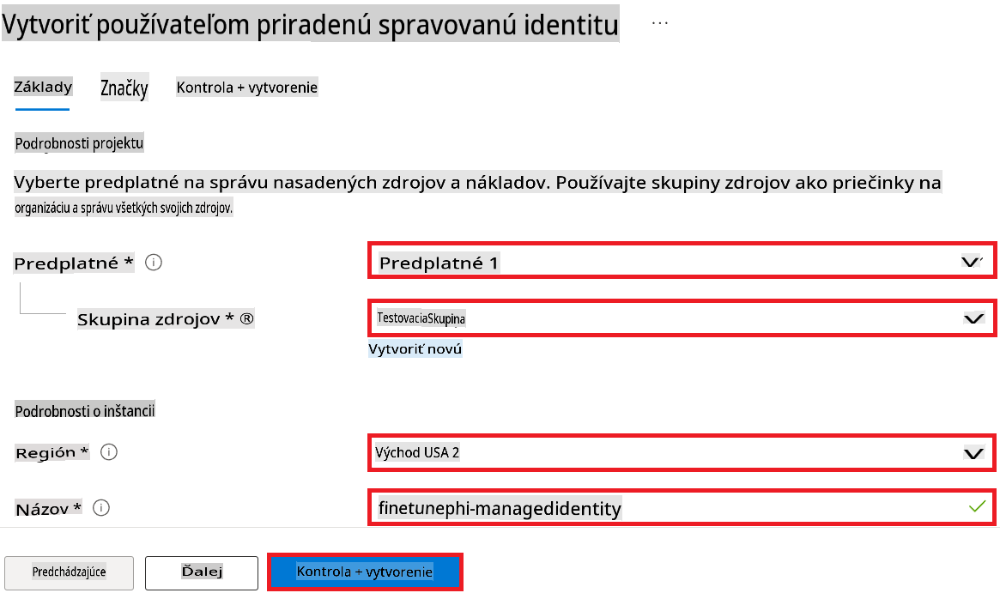

1. Vyberte **Review + create**.

1. Vyberte **+ Create**.

#### Pridanie role Contributor k Managed Identity

1. Prejdite na Managed Identity zdroj, ktorý ste vytvorili.

1. Vyberte **Azure role assignments** z ľavého navigačného panela.

1. Vyberte **+Add role assignment** z navigačného menu.

1. Na stránke Add role assignment vykonajte nasledujúce úlohy:
    - Vyberte **Scope** na **Resource group**.
    - Vyberte vašu Azure **Subscription**.
    - Vyberte **Resource group**, ktorú chcete použiť.
    - Vyberte **Role** na **Contributor**.

    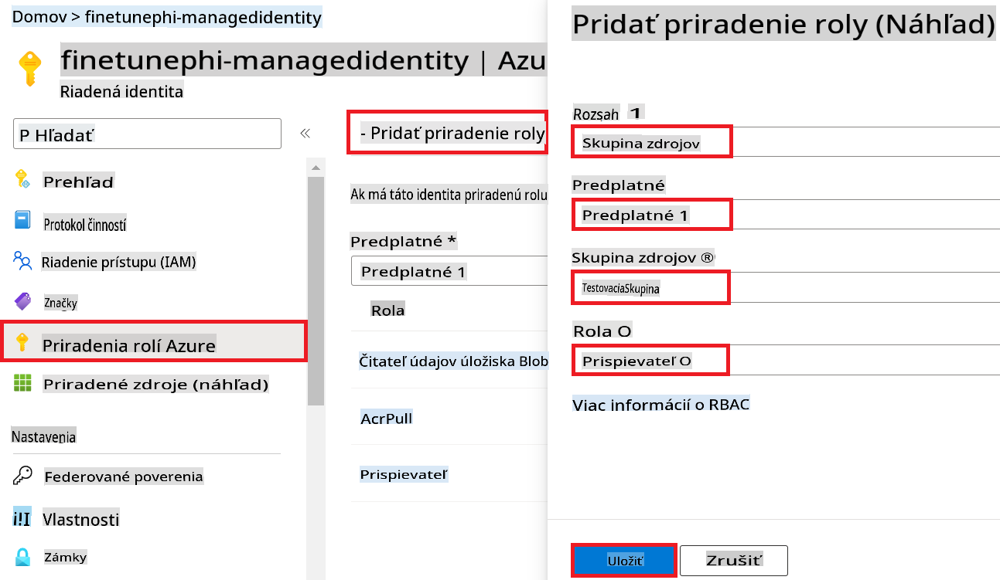

2. Vyberte **Save**.

#### Pridanie role Storage Blob Data Reader k Managed Identity

1. Napíšte *storage accounts* do **vyhľadávacieho panela** v hornej časti portálu a vyberte **Storage accounts** z ponúkaných možností.

    

1. Vyberte storage account priradený k Azure Machine Learning workspace, ktorý ste vytvorili. Napríklad *finetunephistorage*.

1. Vykonajte nasledujúce kroky na navigáciu na stránku Add role assignment:

    - Prejdite na Azure Storage account, ktorý ste vytvorili.
    - Vyberte **Access Control (IAM)** z ľavého navigačného panela.
    - Vyberte **+ Add** z navigačného menu.
    - Vyberte **Add role assignment** z navigačného menu.

    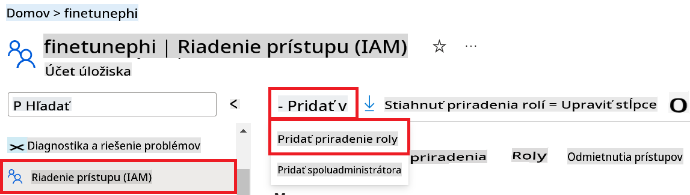

1. Na stránke Add role assignment vykonajte nasledujúce úlohy:

    - Na stránke Role napíšte *Storage Blob Data Reader* do **vyhľadávacieho panela** a vyberte **Storage Blob Data Reader** z ponúkaných možností.
    - Na stránke Role vyberte **Next**.
    - Na stránke Members vyberte **Assign access to** **Managed identity**.
    - Na stránke Members vyberte **+ Select members**.
    - Na stránke Select managed identities vyberte vašu Azure **Subscription**.
    - Na stránke Select managed identities vyberte **Managed identity** na **Manage Identity**.
    - Na stránke Select managed identities vyberte Managed Identity, ktorý ste vytvorili. Napríklad *finetunephi-managedidentity*.
    - Na stránke Select managed identities vyberte **Select**.

    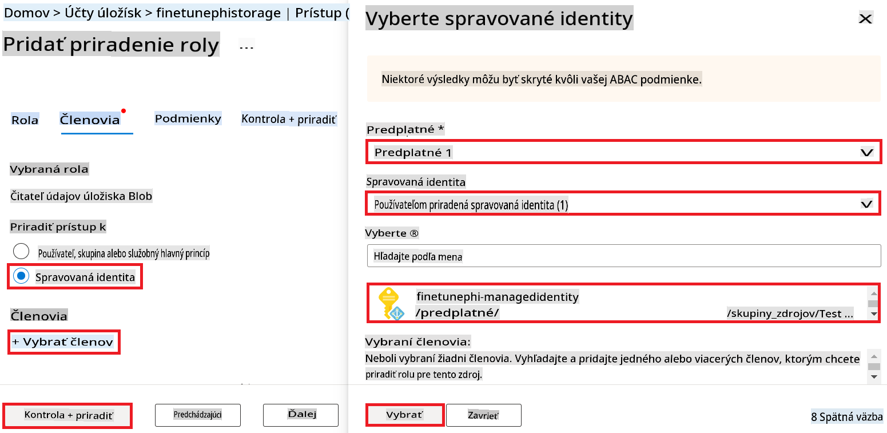

1. Vyberte **Review + assign**.

#### Pridanie role AcrPull k Managed Identity

1. Napíšte *container registries* do **vyhľadávacieho panela** v hornej časti portálu a vyberte **Container registries** z ponúkaných možností.

    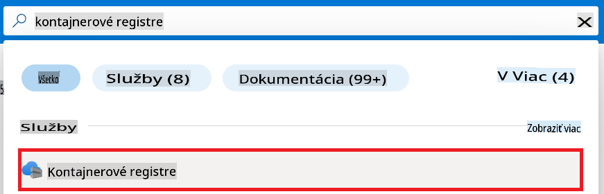

1. Vyberte container registry priradený k Azure Machine Learning workspace. Napríklad *finetunephicontainerregistry*.

1. Vykonajte nasledujúce kroky na navigáciu na stránku Add role assignment:

    - Vyberte **Access Control (IAM)** z ľavého navigačného panela.
    - Vyberte **+ Add** z navigačného menu.
    - Vyberte **Add role assignment** z navigačného menu.

1. Na stránke Add role assignment vykonajte nasledujúce úlohy:

    - Na stránke Role napíšte *AcrPull* do **vyhľadávacieho panela** a vyberte **AcrPull** z ponúkaných možností.
    - Na stránke Role vyberte **Next**.
    - Na stránke Members vyberte **Assign access to** **Managed identity**.
    - Na stránke Members vyberte **+ Select members**.
    - Na stránke Select managed identities vyberte vašu Azure **Subscription**.
    - Na stránke Select managed identities vyberte **Managed identity** na **Manage Identity**.
    - Na stránke Select managed identities vyberte Managed Identity, ktorý ste vytvorili. Napríklad *finetunephi-managedidentity*.
    - Na stránke Select managed identities vyberte **Select**.
    - Vyberte **Review + assign**.

### Nastavenie projektu

Na stiahnutie datasetov potrebných na vyladenie nastavíte lokálne prostredie.

V tomto cvičení:

- Vytvoríte priečinok na prácu.
- Vytvoríte virtuálne prostredie.
- Nainštalujete potrebné balíčky.
- Vytvoríte súbor *download_dataset.py* na stiahnutie datasetu.

#### Vytvorenie priečinka na prácu

1. Otvorte terminál a napíšte nasledujúci príkaz na vytvorenie priečinka s názvom *finetune-phi* v predvolenej ceste.

    ```console
    mkdir finetune-phi
    ```

2. Napíšte nasledujúci príkaz v termináli na navigáciu do vytvoreného priečinka *finetune-phi*.

    ```console
    cd finetune-phi
    ```

#### Vytvorenie virtuálneho prostredia

1. Napíšte nasledujúci príkaz v termináli na vytvorenie virtuálneho prostredia s názvom *.venv*.

    ```console
    python -m venv .venv
    ```

2. Napíšte nasledujúci príkaz v termináli na aktiváciu virtuálneho prostredia.

    ```console
    .venv\Scripts\activate.bat
    ```

> [!NOTE]
> Ak sa to podarilo, pred výzvou príkazového riadku by ste mali vidieť *(.venv)*.

#### Inštalácia potrebných balíčkov

1. Napíšte nasledujúce príkazy v termináli na inštaláciu potrebných balíčkov.

    ```console
    pip install datasets==2.19.1
    ```

#### Vytvorenie `download_dataset.py`

> [!NOTE]
> Kompletná štruktúra priečinkov:
>
> ```text
> └── YourUserName
> .    └── finetune-phi
> .        └── download_dataset.py
> ```

1. Otvorte **Visual Studio Code**.

1. Vyberte **File** z menu.

1. Vyberte **Open Folder**.

1. Vyberte priečinok *finetune-phi*, ktorý ste vytvorili, nachádzajúci sa na *C:\Users\yourUserName\finetune-phi*.

    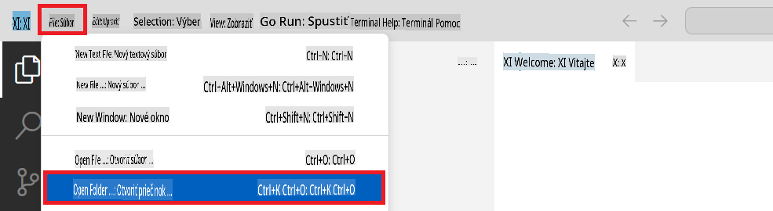

1. V ľavom paneli Visual Studio Code kliknite pravým tlačidlom a vyberte **New File** na vytvorenie nového súboru s názvom *download_dataset.py*.

    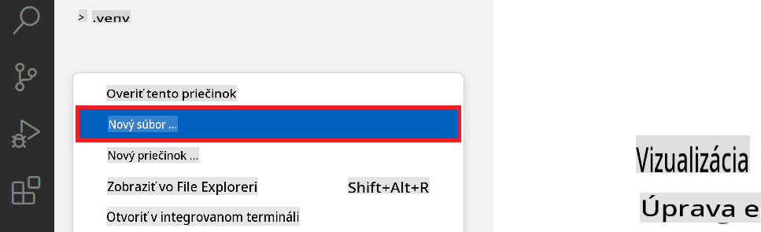

### Príprava datasetu na vyladenie

V tomto cvičení spustíte súbor *download_dataset.py* na stiahnutie datasetu *ultrachat_200k* do vášho lokálneho prostredia. Tento dataset následne použijete na vyladenie modelu Phi-3 v Azure Machine Learning.

V tomto cvičení:

- Pridáte kód do súboru *download_dataset.py* na stiahnutie datasetov.
- Spustíte súbor *download_dataset.py* na stiahnutie datasetov do vášho lokálneho prostredia.

#### Stiahnutie datasetu pomocou *download_dataset.py*

1. Otvorte súbor *download_dataset.py* vo Visual Studio Code.

1. Pridajte nasledujúci kód do súboru *download_dataset.py*.

    ```python
    import json
    import os
    from datasets import load_dataset

    def load_and_split_dataset(dataset_name, config_name, split_ratio):
        """
        Load and split a dataset.
        """
        # Load the dataset with the specified name, configuration, and split ratio
        dataset = load_dataset(dataset_name, config_name, split=split_ratio)
        print(f"Original dataset size: {len(dataset)}")
        
        # Split the dataset into train and test sets (80% train, 20% test)
        split_dataset = dataset.train_test_split(test_size=0.2)
        print(f"Train dataset size: {len(split_dataset['train'])}")
        print(f"Test dataset size: {len(split_dataset['test'])}")
        
        return split_dataset

    def save_dataset_to_jsonl(dataset, filepath):
        """
        Save a dataset to a JSONL file.
        """
        # Create the directory if it does not exist
        os.makedirs(os.path.dirname(filepath), exist_ok=True)
        
        # Open the file in write mode
        with open(filepath, 'w', encoding='utf-8') as f:
            # Iterate over each record in the dataset
            for record in dataset:
                # Dump the record as a JSON object and write it to the file
                json.dump(record, f)
                # Write a newline character to separate records
                f.write('\n')
        
        print(f"Dataset saved to {filepath}")

    def main():
        """
        Main function to load, split, and save the dataset.
        """
        # Load and split the ULTRACHAT_200k dataset with a specific configuration and split ratio
        dataset = load_and_split_dataset("HuggingFaceH4/ultrachat_200k", 'default', 'train_sft[:1%]')
        
        # Extract the train and test datasets from the split
        train_dataset = dataset['train']
        test_dataset = dataset['test']

        # Save the train dataset to a JSONL file
        save_dataset_to_jsonl(train_dataset, "data/train_data.jsonl")
        
        # Save the test dataset to a separate JSONL file
        save_dataset_to_jsonl(test_dataset, "data/test_data.jsonl")

    if __name__ == "__main__":
        main()

    ```

1. Napíšte nasledujúci príkaz v termináli na spustenie skriptu a stiahnutie datasetu do vášho lokálneho prostredia.

    ```console
    python download_dataset.py
    ```

1.
1. Navštívte [Azure ML Studio](https://ml.azure.com/home?wt.mc_id=studentamb_279723).

1. Vyberte **Compute** z ľavého panela.

1. Vyberte **Compute clusters** z navigačného menu.

1. Kliknite na **+ New**.

    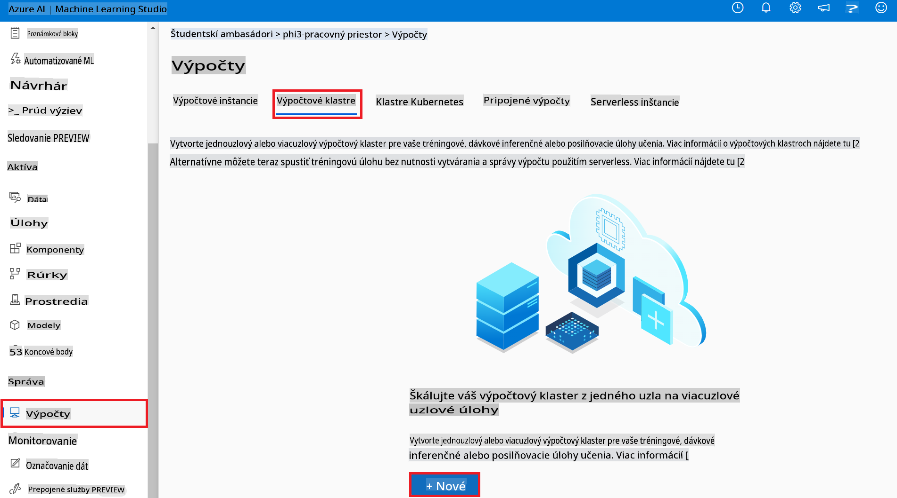

1. Vykonajte nasledujúce kroky:

    - Vyberte **Region**, ktorý chcete použiť.
    - Nastavte **Virtual machine tier** na **Dedicated**.
    - Nastavte **Virtual machine type** na **GPU**.
    - Nastavte filter **Virtual machine size** na **Select from all options**.
    - Vyberte **Virtual machine size** na **Standard_NC24ads_A100_v4**.

    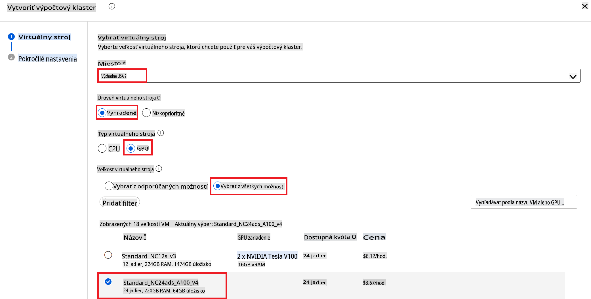

1. Kliknite na **Next**.

1. Vykonajte nasledujúce kroky:

    - Zadajte **Compute name**. Musí byť jedinečné.
    - Nastavte **Minimum number of nodes** na **0**.
    - Nastavte **Maximum number of nodes** na **1**.
    - Nastavte **Idle seconds before scale down** na **120**.

    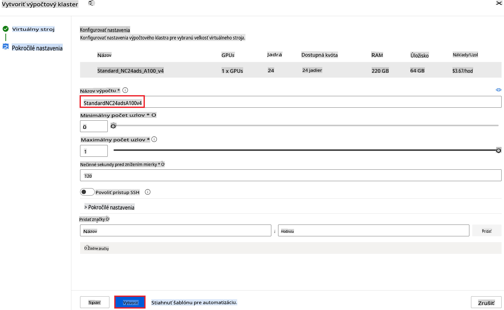

1. Kliknite na **Create**.

#### Jemné doladenie modelu Phi-3

1. Navštívte [Azure ML Studio](https://ml.azure.com/home?wt.mc_id=studentamb_279723).

1. Vyberte pracovný priestor Azure Machine Learning, ktorý ste vytvorili.

    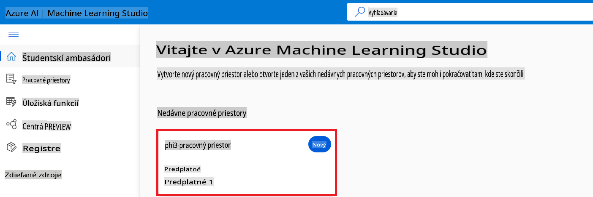

1. Vykonajte nasledujúce kroky:

    - Vyberte **Model catalog** z ľavého panela.
    - Do **search bar** zadajte *phi-3-mini-4k* a z dostupných možností vyberte **Phi-3-mini-4k-instruct**.

    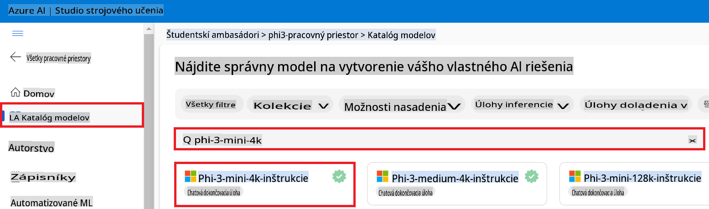

1. Vyberte **Fine-tune** z navigačného menu.

    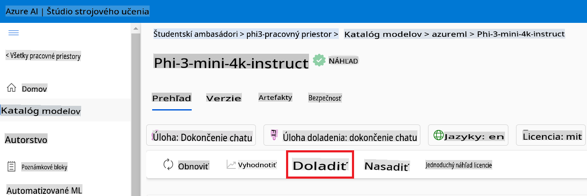

1. Vykonajte nasledujúce kroky:

    - Nastavte **Select task type** na **Chat completion**.
    - Kliknite na **+ Select data** na nahratie **Traning data**.
    - Nastavte typ nahrávania validačných dát na **Provide different validation data**.
    - Kliknite na **+ Select data** na nahratie **Validation data**.

    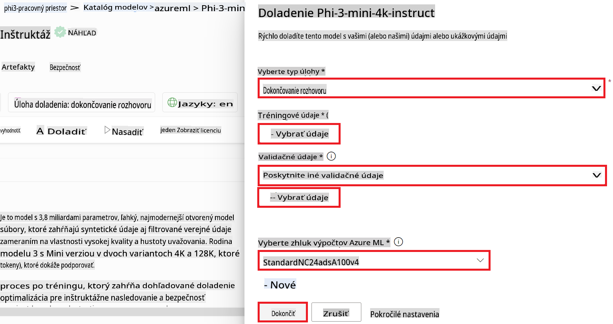

    > [!TIP]
    >
    > Môžete vybrať **Advanced settings** na prispôsobenie konfigurácií, ako sú **learning_rate** a **lr_scheduler_type**, aby ste optimalizovali proces jemného doladenia podľa vašich špecifických potrieb.

1. Kliknite na **Finish**.

1. V tomto cvičení ste úspešne jemne doladili model Phi-3 pomocou Azure Machine Learning. Upozorňujeme, že proces jemného doladenia môže trvať dlhší čas. Po spustení jemného doladenia musíte počkať na jeho dokončenie. Stav jemného doladenia môžete sledovať v karte Jobs na ľavej strane vášho pracovného priestoru Azure Machine Learning. V ďalšej sérii nasadíte jemne doladený model a integrujete ho s Prompt flow.

    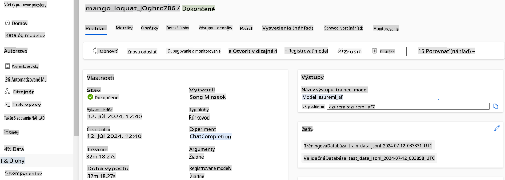

### Nasadenie jemne doladeného modelu Phi-3

Na integráciu jemne doladeného modelu Phi-3 s Prompt flow musíte model nasadiť, aby bol dostupný na inferenciu v reálnom čase. Tento proces zahŕňa registráciu modelu, vytvorenie online koncového bodu a nasadenie modelu.

V tomto cvičení:

- Zaregistrujete jemne doladený model v pracovnom priestore Azure Machine Learning.
- Vytvoríte online koncový bod.
- Nasadíte zaregistrovaný jemne doladený model Phi-3.

#### Registrácia jemne doladeného modelu

1. Navštívte [Azure ML Studio](https://ml.azure.com/home?wt.mc_id=studentamb_279723).

1. Vyberte pracovný priestor Azure Machine Learning, ktorý ste vytvorili.

    

1. Vyberte **Models** z ľavého panela.
1. Kliknite na **+ Register**.
1. Vyberte **From a job output**.

    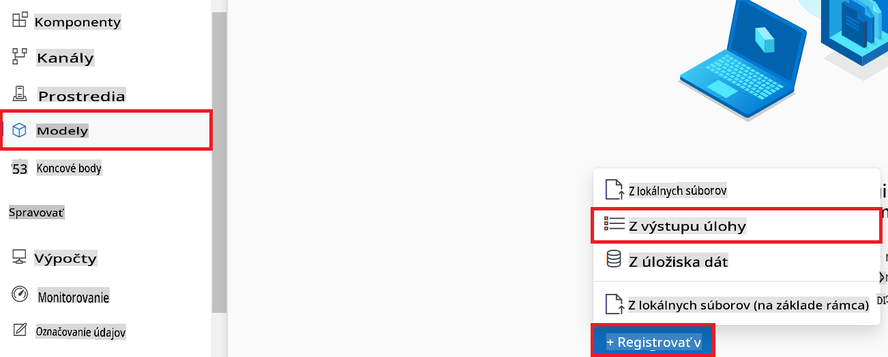

1. Vyberte úlohu, ktorú ste vytvorili.

    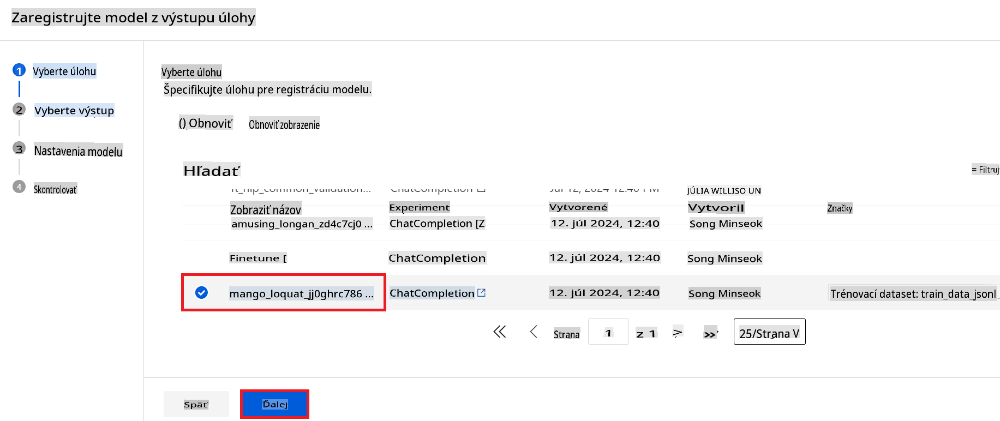

1. Kliknite na **Next**.

1. Nastavte **Model type** na **MLflow**.

1. Uistite sa, že **Job output** je vybrané; malo by byť automaticky vybrané.

    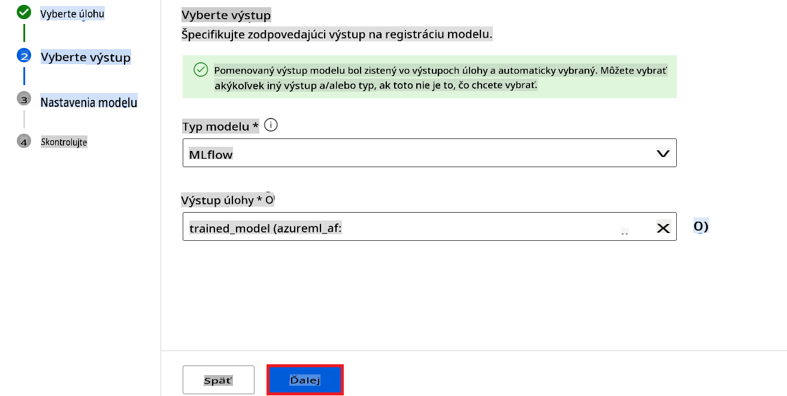

2. Kliknite na **Next**.

3. Kliknite na **Register**.

    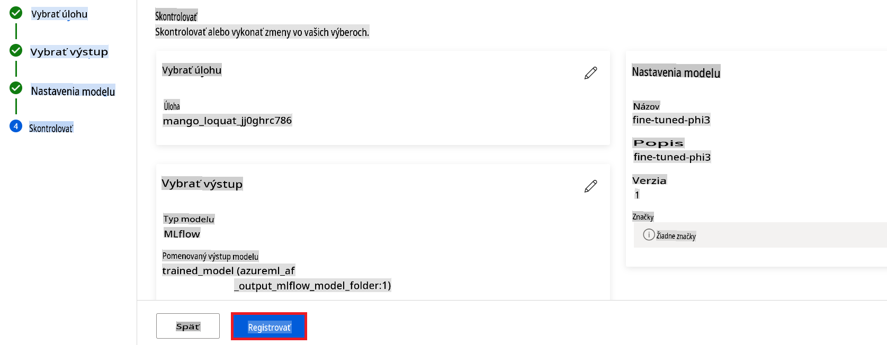

4. Svoj zaregistrovaný model môžete zobraziť tak, že prejdete do menu **Models** z ľavého panela.

    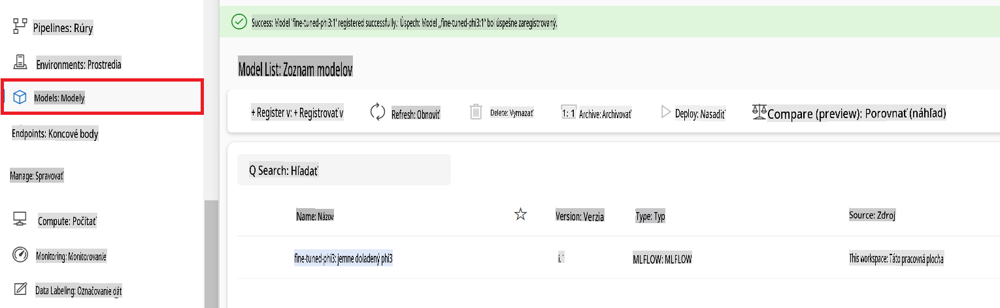

#### Nasadenie jemne doladeného modelu

1. Prejdite do pracovného priestoru Azure Machine Learning, ktorý ste vytvorili.

1. Vyberte **Endpoints** z ľavého panela.

1. Vyberte **Real-time endpoints** z navigačného menu.

    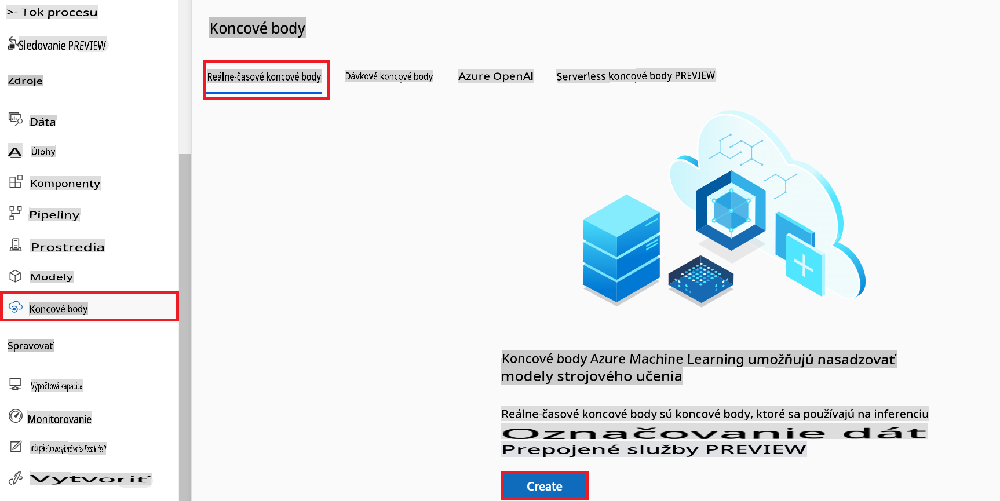

1. Kliknite na **Create**.

1. Vyberte zaregistrovaný model, ktorý ste vytvorili.

    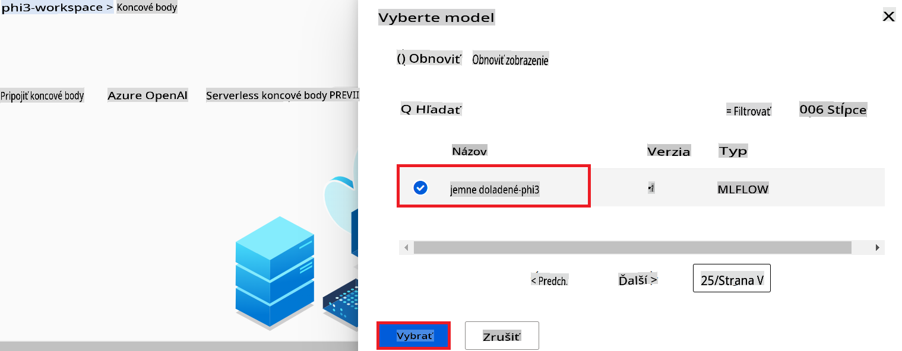

1. Kliknite na **Select**.

1. Vykonajte nasledujúce kroky:

    - Nastavte **Virtual machine** na *Standard_NC6s_v3*.
    - Nastavte **Instance count**, napríklad na *1*.
    - Nastavte **Endpoint** na **New**, aby ste vytvorili endpoint.
    - Zadajte **Endpoint name**. Musí byť jedinečné.
    - Zadajte **Deployment name**. Musí byť jedinečné.

    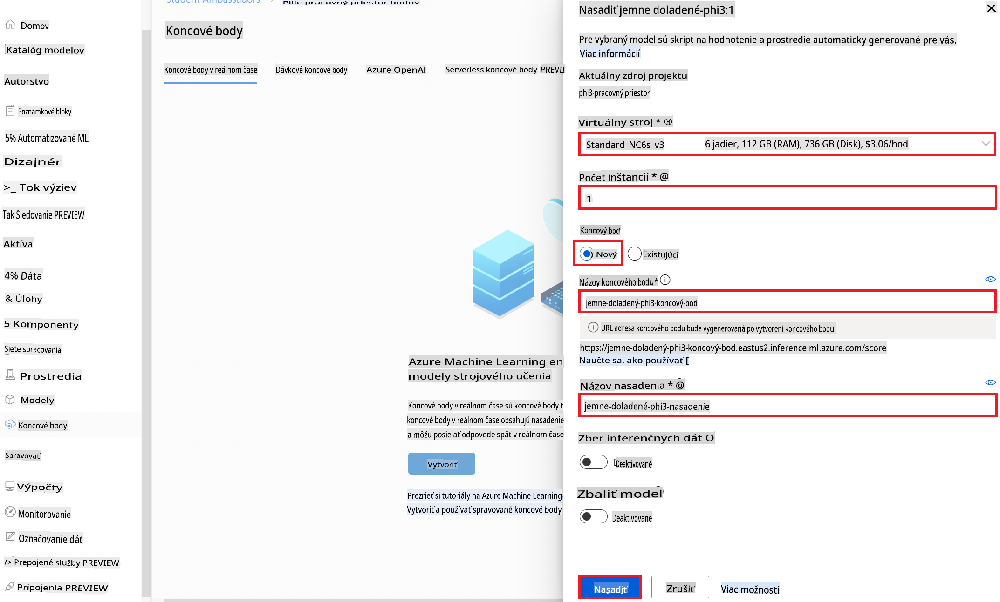

1. Kliknite na **Deploy**.

> [!WARNING]
> Aby ste sa vyhli dodatočným poplatkom na vašom účte, nezabudnite vymazať vytvorený endpoint v pracovnom priestore Azure Machine Learning.
>

#### Skontrolujte stav nasadenia v pracovnom priestore Azure Machine Learning

1. Prejdite do pracovného priestoru Azure Machine Learning, ktorý ste vytvorili.

1. Vyberte **Endpoints** z ľavého panela.

1. Vyberte endpoint, ktorý ste vytvorili.

    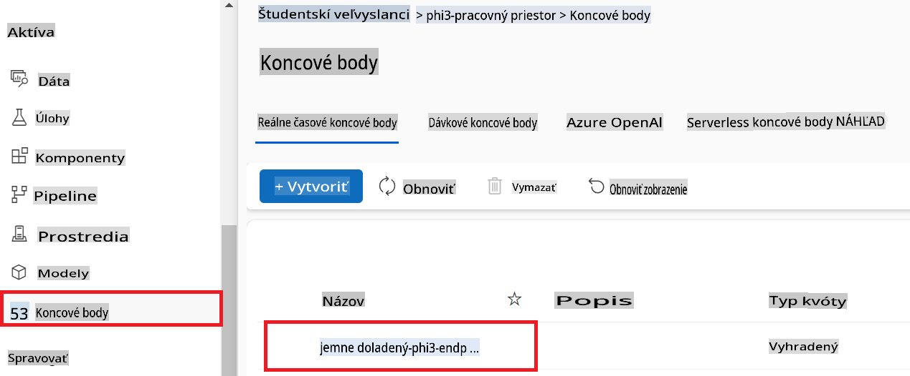

1. Na tejto stránke môžete spravovať endpoints počas procesu nasadenia.

> [!NOTE]
> Po dokončení nasadenia sa uistite, že **Live traffic** je nastavený na **100%**. Ak nie je, vyberte **Update traffic**, aby ste upravili nastavenia prenosu. Upozorňujeme, že model nemôžete testovať, ak je prenos nastavený na 0%.
>
> 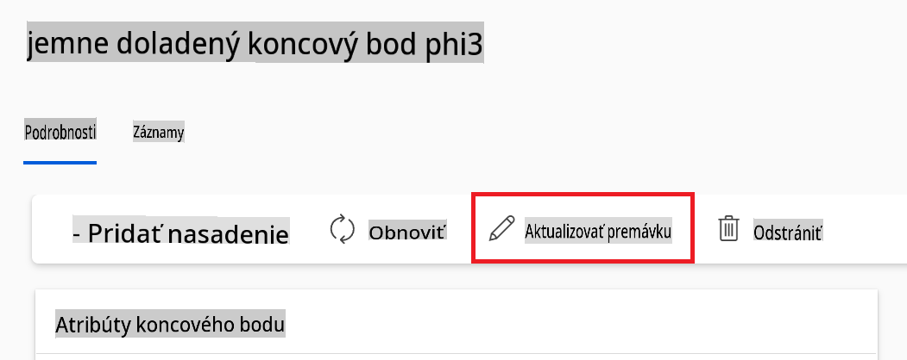
>

## Scenár 3: Integrácia s Prompt flow a komunikácia s vaším vlastným modelom v Azure AI Foundry

### Integrácia vlastného modelu Phi-3 s Prompt flow

Po úspešnom nasadení vášho jemne doladeného modelu ho môžete integrovať s Prompt Flow, aby ste mohli svoj model používať v reálnych aplikáciách a umožniť rôzne interaktívne úlohy s vaším vlastným modelom Phi-3.

V tomto cvičení:

- Vytvoríte Azure AI Foundry Hub.
- Vytvoríte Azure AI Foundry Project.
- Vytvoríte Prompt flow.
- Pridáte vlastné pripojenie pre jemne doladený model Phi-3.
- Nastavíte Prompt flow na komunikáciu s vaším vlastným modelom Phi-3.

> [!NOTE]
> Integrácia s Promptflow je možná aj pomocou Azure ML Studio. Rovnaký proces integrácie sa dá aplikovať aj v Azure ML Studio.

#### Vytvorenie Azure AI Foundry Hub

Pred vytvorením projektu musíte vytvoriť Hub. Hub funguje ako Resource Group, ktorá vám umožňuje organizovať a spravovať viacero projektov v Azure AI Foundry.

1. Navštívte [Azure AI Foundry](https://ai.azure.com/?WT.mc_id=aiml-137032-kinfeylo).

1. Vyberte **All hubs** z ľavého panela.

1. Kliknite na **+ New hub** z navigačného menu.

    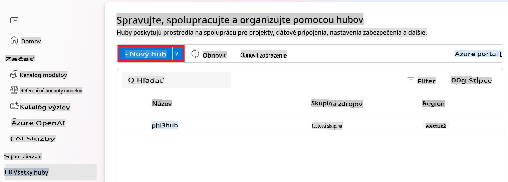

1. Vykonajte nasledujúce kroky:

    - Zadajte **Hub name**. Musí byť jedinečné.
    - Vyberte vašu Azure **Subscription**.
    - Vyberte **Resource group**, ktorú chcete použiť (v prípade potreby vytvorte novú).
    - Vyberte **Location**, ktorú chcete použiť.
    - Vyberte **Connect Azure AI Services**, ktoré chcete použiť (v prípade potreby vytvorte nové).
    - Nastavte **Connect Azure AI Search** na **Skip connecting**.

    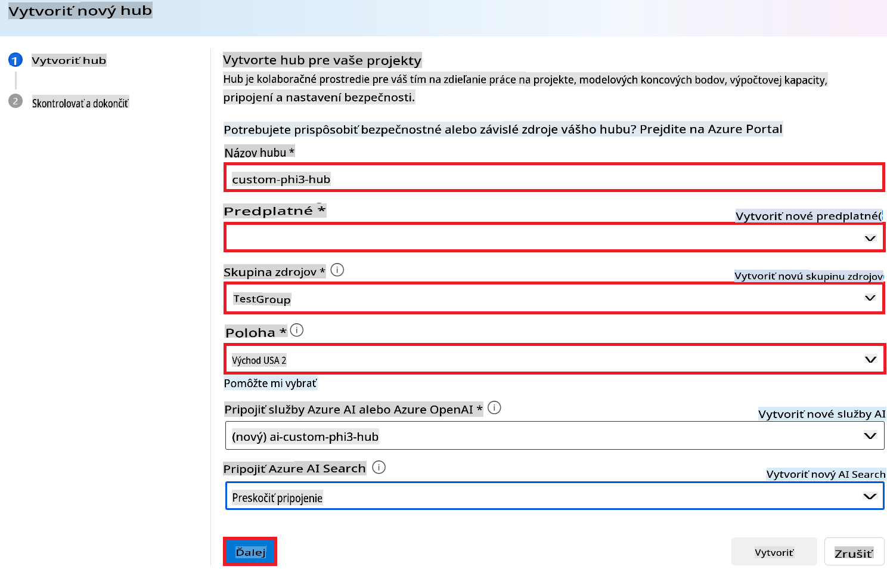

1. Kliknite na **Next**.

#### Vytvorenie Azure AI Foundry Project

1. V Hube, ktorý ste vytvorili, vyberte **All projects** z ľavého panela.

1. Kliknite na **+ New project** z navigačného menu.

    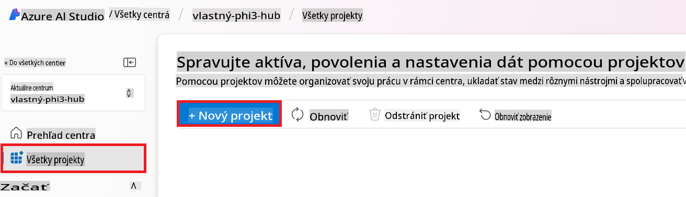

1. Zadajte **Project name**. Musí byť jedinečné.

    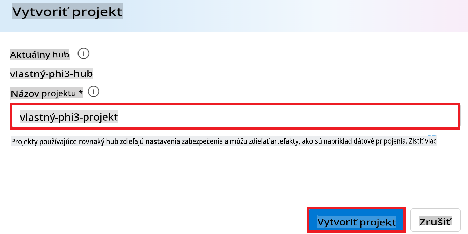

1. Kliknite na **Create a project**.

#### Pridanie vlastného pripojenia pre jemne doladený model Phi-3

Aby ste integrovali váš vlastný model Phi-3 s Prompt flow, musíte uložiť endpoint a kľúč modelu v rámci vlastného pripojenia. Toto nastavenie zabezpečí prístup k vášmu vlastnému modelu Phi-3 v Prompt flow.

#### Nastavenie api kľúča a endpoint uri jemne doladeného modelu Phi-3

1. Navštívte [Azure ML Studio](https://ml.azure.com/home?WT.mc_id=aiml-137032-kinfeylo).

1. Prejdite do pracovného priestoru Azure Machine Learning, ktorý ste vytvorili.

1. Vyberte **Endpoints** z ľavého panela.

    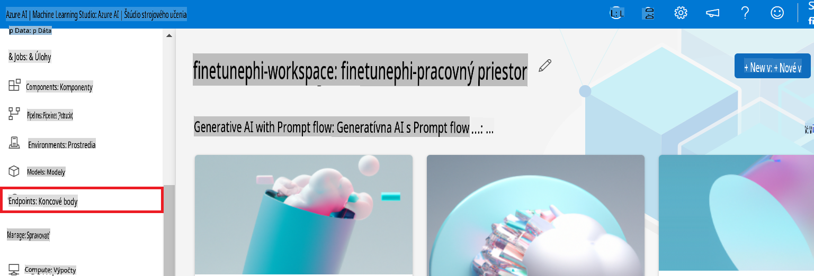

1. Vyberte endpoint, ktorý ste vytvorili.

    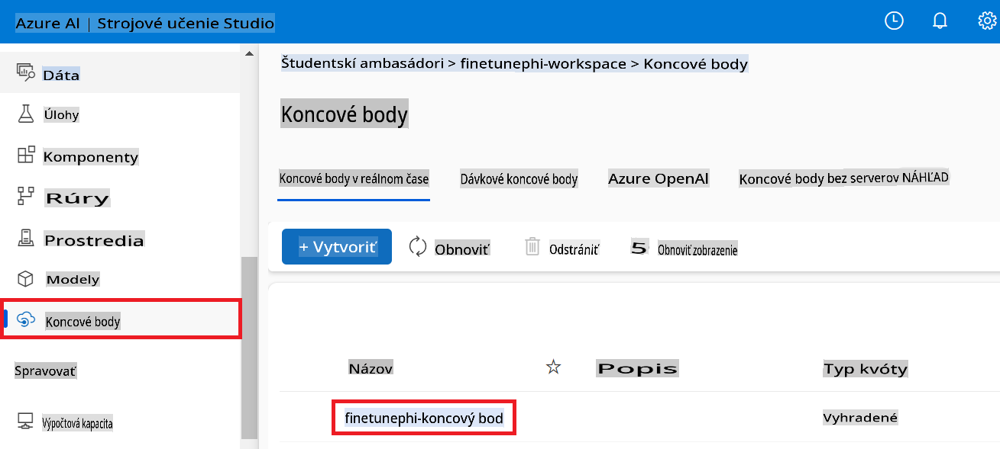

1. Kliknite na **Consume** z navigačného menu.

1. Skopírujte svoj **REST endpoint** a **Primary key**.
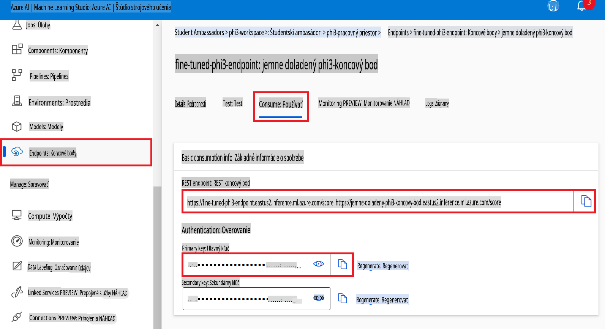

#### Pridanie vlastného pripojenia

1. Navštívte [Azure AI Foundry](https://ai.azure.com/?WT.mc_id=aiml-137032-kinfeylo).

1. Prejdite na projekt Azure AI Foundry, ktorý ste vytvorili.

1. V projekte, ktorý ste vytvorili, vyberte **Settings** z ľavého panelu.

1. Zvoľte **+ New connection**.

    

1. Zvoľte **Custom keys** z navigačného menu.

    

1. Vykonajte nasledujúce kroky:

    - Vyberte **+ Add key value pairs**.
    - Pre názov kľúča zadajte **endpoint** a vložte URI koncového bodu, ktorý ste skopírovali z Azure ML Studio, do poľa hodnoty.
    - Opäť vyberte **+ Add key value pairs**.
    - Pre názov kľúča zadajte **key** a vložte kľúč, ktorý ste skopírovali z Azure ML Studio, do poľa hodnoty.
    - Po pridaní kľúčov vyberte **is secret**, aby ste zabránili zobrazeniu kľúča.

    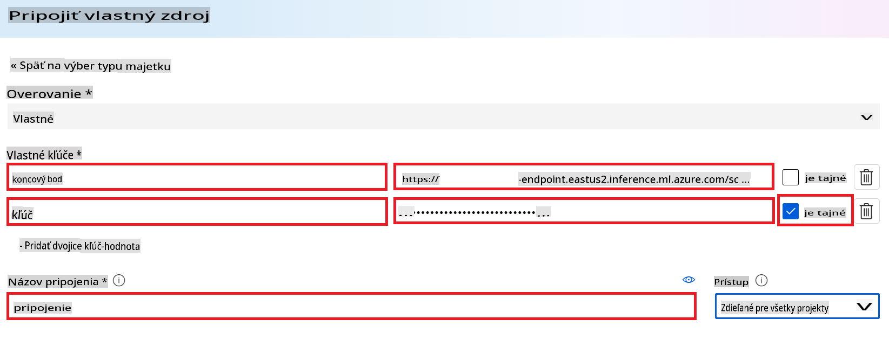

1. Vyberte **Add connection**.

#### Vytvorenie Prompt flow

Pridali ste vlastné pripojenie v Azure AI Foundry. Teraz vytvorme Prompt flow pomocou nasledujúcich krokov. Potom prepojíte tento Prompt flow s vlastným pripojením, aby ste mohli používať jemne doladený model v rámci Prompt flow.

1. Prejdite na projekt Azure AI Foundry, ktorý ste vytvorili.

1. Zvoľte **Prompt flow** z ľavého panelu.

1. Zvoľte **+ Create** z navigačného menu.

    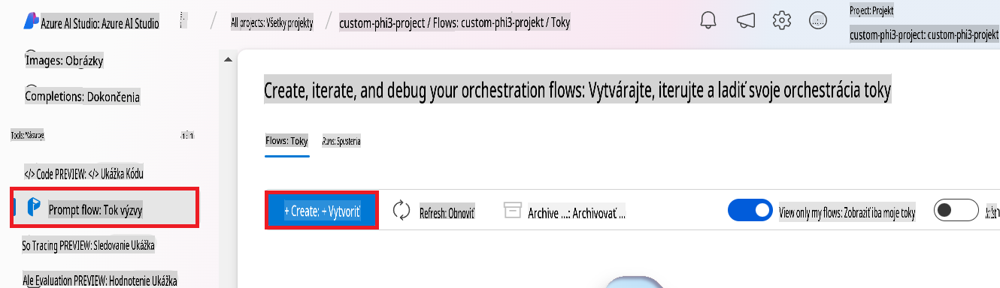

1. Zvoľte **Chat flow** z navigačného menu.

    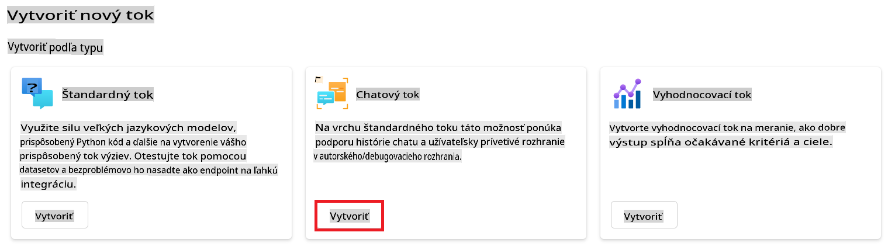

1. Zadajte **Folder name**, ktorý chcete použiť.

    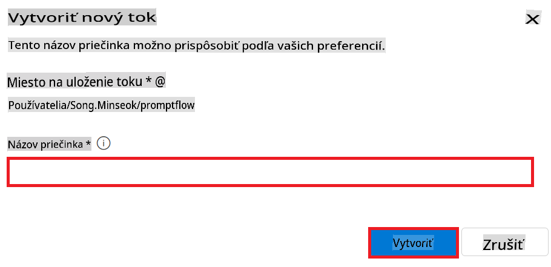

2. Vyberte **Create**.

#### Nastavenie Prompt flow na chatovanie s vaším vlastným modelom Phi-3

Je potrebné integrovať jemne doladený model Phi-3 do Prompt flow. Existujúci Prompt flow však nie je navrhnutý na tento účel. Preto musíte Prompt flow upraviť, aby ste umožnili integráciu vlastného modelu.

1. V Prompt flow vykonajte nasledujúce kroky na prestavbu existujúceho flow:

    - Vyberte **Raw file mode**.
    - Odstráňte všetok existujúci kód v súbore *flow.dag.yml*.
    - Pridajte nasledujúci kód do súboru *flow.dag.yml*.

        ```yml
        inputs:
          input_data:
            type: string
            default: "Who founded Microsoft?"

        outputs:
          answer:
            type: string
            reference: ${integrate_with_promptflow.output}

        nodes:
        - name: integrate_with_promptflow
          type: python
          source:
            type: code
            path: integrate_with_promptflow.py
          inputs:
            input_data: ${inputs.input_data}
        ```

    - Vyberte **Save**.

    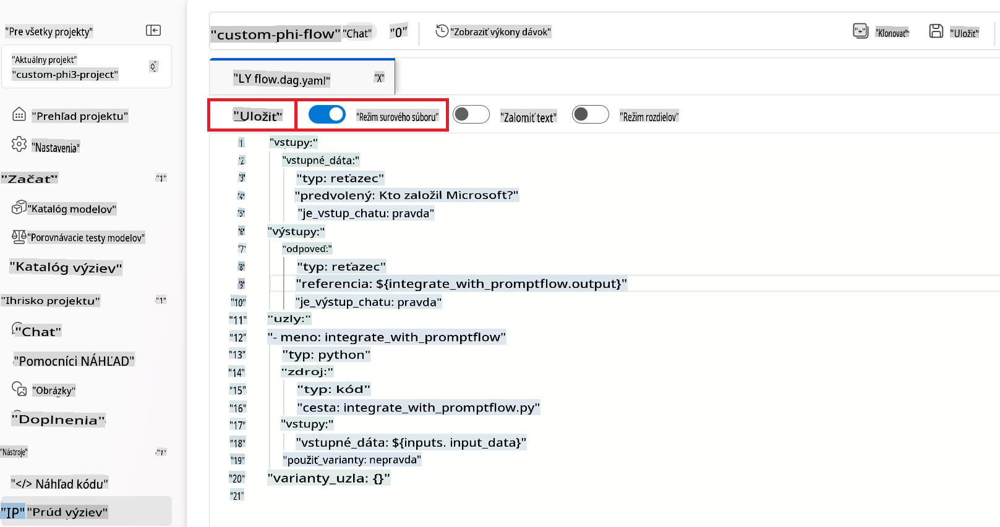

1. Pridajte nasledujúci kód do súboru *integrate_with_promptflow.py* na použitie vlastného modelu Phi-3 v Prompt flow.

    ```python
    import logging
    import requests
    from promptflow import tool
    from promptflow.connections import CustomConnection

    # Logging setup
    logging.basicConfig(
        format="%(asctime)s - %(levelname)s - %(name)s - %(message)s",
        datefmt="%Y-%m-%d %H:%M:%S",
        level=logging.DEBUG
    )
    logger = logging.getLogger(__name__)

    def query_phi3_model(input_data: str, connection: CustomConnection) -> str:
        """
        Send a request to the Phi-3 model endpoint with the given input data using Custom Connection.
        """

        # "connection" is the name of the Custom Connection, "endpoint", "key" are the keys in the Custom Connection
        endpoint_url = connection.endpoint
        api_key = connection.key

        headers = {
            "Content-Type": "application/json",
            "Authorization": f"Bearer {api_key}"
        }
        data = {
            "input_data": {
                "input_string": [
                    {"role": "user", "content": input_data}
                ],
                "parameters": {
                    "temperature": 0.7,
                    "max_new_tokens": 128
                }
            }
        }
        try:
            response = requests.post(endpoint_url, json=data, headers=headers)
            response.raise_for_status()
            
            # Log the full JSON response
            logger.debug(f"Full JSON response: {response.json()}")

            result = response.json()["output"]
            logger.info("Successfully received response from Azure ML Endpoint.")
            return result
        except requests.exceptions.RequestException as e:
            logger.error(f"Error querying Azure ML Endpoint: {e}")
            raise

    @tool
    def my_python_tool(input_data: str, connection: CustomConnection) -> str:
        """
        Tool function to process input data and query the Phi-3 model.
        """
        return query_phi3_model(input_data, connection)

    ```

    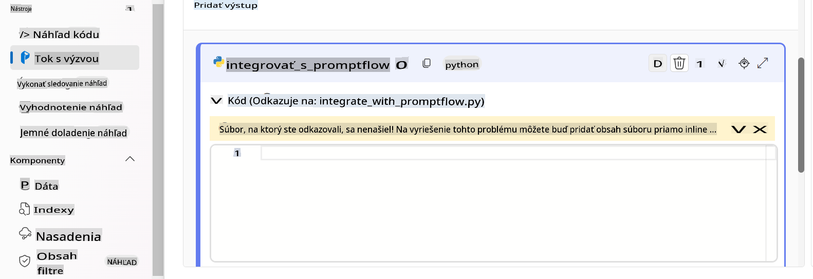

> [!NOTE]
> Pre podrobnejšie informácie o používaní Prompt flow v Azure AI Foundry si môžete pozrieť [Prompt flow v Azure AI Foundry](https://learn.microsoft.com/azure/ai-studio/how-to/prompt-flow).

1. Vyberte **Chat input**, **Chat output**, aby ste umožnili chatovanie s vaším modelom.

    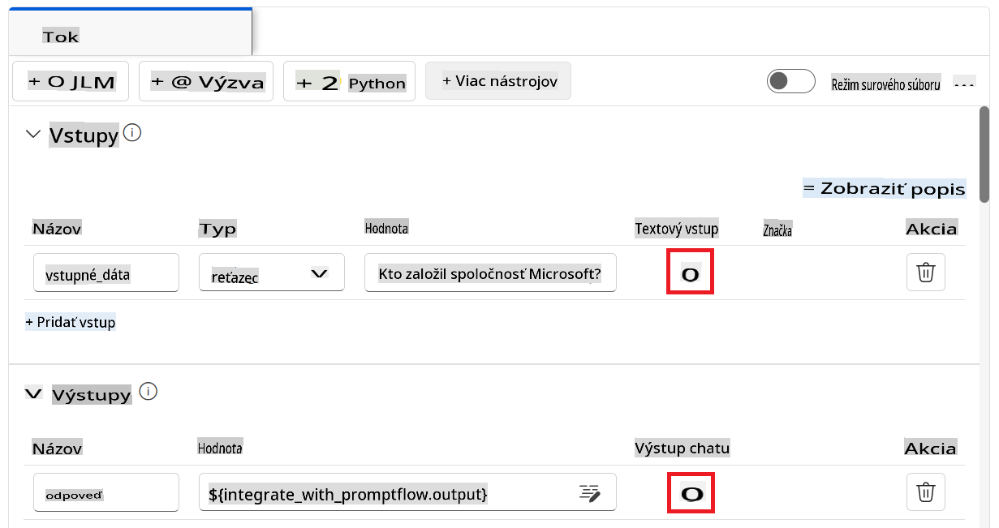

1. Teraz ste pripravení chatovať s vaším vlastným modelom Phi-3. V ďalšom cvičení sa naučíte, ako spustiť Prompt flow a použiť ho na chatovanie s vaším jemne doladeným modelom Phi-3.

> [!NOTE]
>
> Upravený flow by mal vyzerať ako na obrázku nižšie:
>
> 
>

### Chatovanie s vaším vlastným modelom Phi-3

Teraz, keď ste jemne doladili a integrovali váš vlastný model Phi-3 s Prompt flow, ste pripravení začať s ním komunikovať. Toto cvičenie vás prevedie procesom nastavenia a spustenia chatu s vaším modelom pomocou Prompt flow. Postupovaním podľa týchto krokov budete môcť plne využiť schopnosti vášho jemne doladeného modelu Phi-3 pre rôzne úlohy a rozhovory.

- Chatovanie s vaším vlastným modelom Phi-3 pomocou Prompt flow.

#### Spustenie Prompt flow

1. Vyberte **Start compute sessions**, aby ste spustili Prompt flow.

    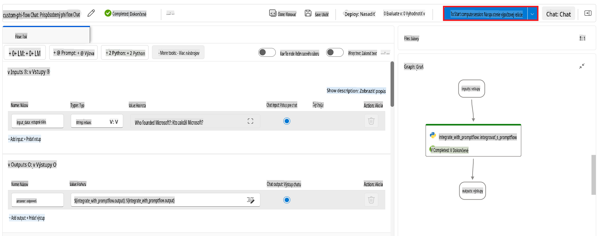

1. Vyberte **Validate and parse input**, aby ste obnovili parametre.

    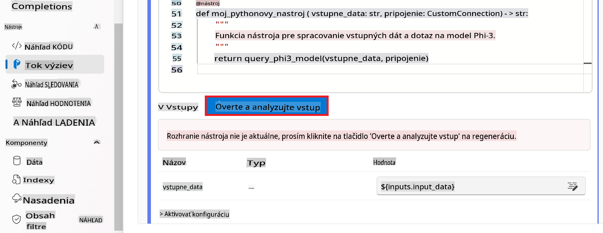

1. Vyberte **Value** pre **connection** k vlastnému pripojeniu, ktoré ste vytvorili. Napríklad *connection*.

    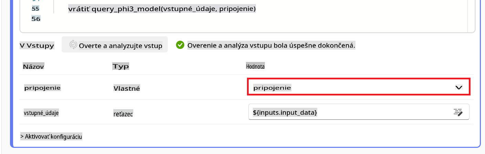

#### Chatovanie s vaším vlastným modelom

1. Vyberte **Chat**.

    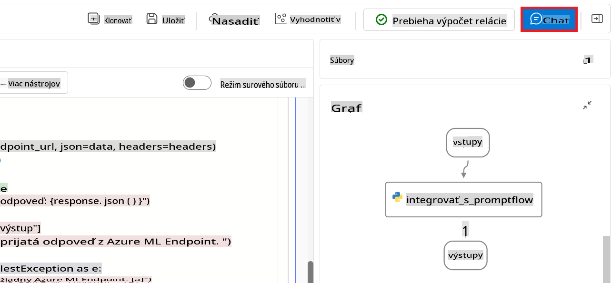

1. Tu je príklad výsledkov: Teraz môžete chatovať s vaším vlastným modelom Phi-3. Odporúča sa klásť otázky na základe údajov použitých pri jemnom doladení.

    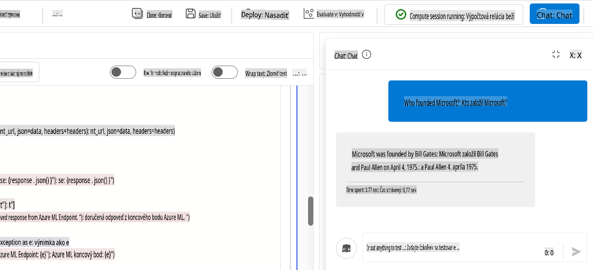

**Upozornenie**:  
Tento dokument bol preložený pomocou služieb strojového prekladu AI. Aj keď sa snažíme o presnosť, uvedomte si, že automatizované preklady môžu obsahovať chyby alebo nepresnosti. Pôvodný dokument v jeho pôvodnom jazyku by mal byť považovaný za záväzný zdroj. Pre kritické informácie sa odporúča profesionálny ľudský preklad. Nenesieme zodpovednosť za akékoľvek nedorozumenia alebo nesprávne interpretácie vyplývajúce z použitia tohto prekladu.