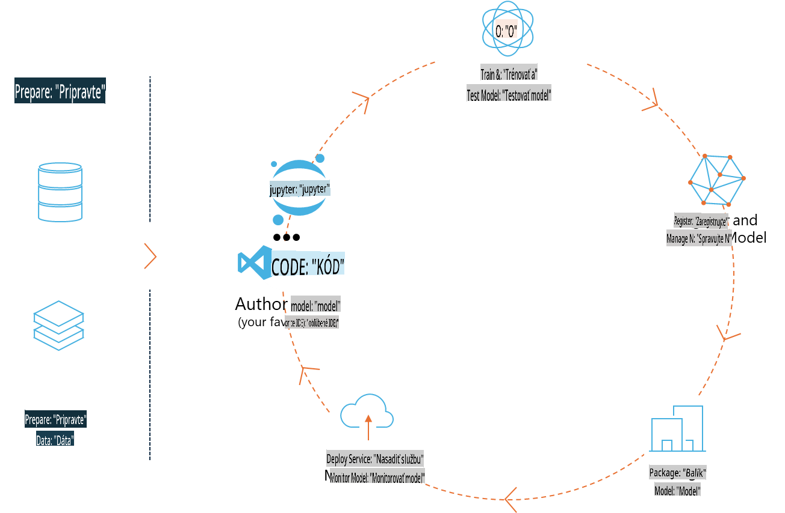
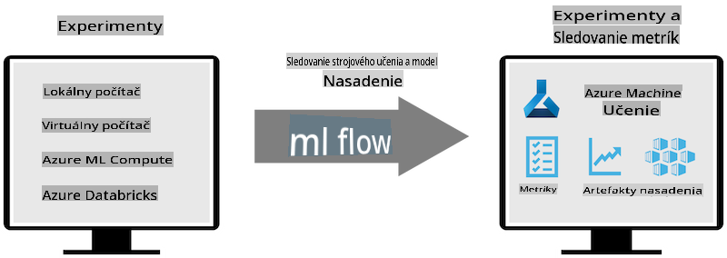
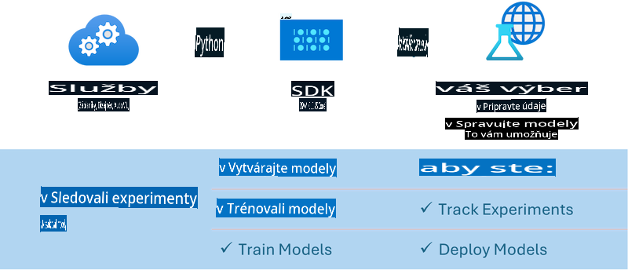

# MLflow

[MLflow](https://mlflow.org/) je open-source platforma navrhnutá na správu životného cyklu strojového učenia od začiatku až do konca.



MLFlow sa používa na správu životného cyklu ML, vrátane experimentovania, reprodukovateľnosti, nasadzovania a centrálneho registra modelov. Aktuálne MLFlow ponúka štyri komponenty:

- **MLflow Tracking:** Zaznamenávanie a vyhľadávanie experimentov, kódu, konfigurácií dát a výsledkov.
- **MLflow Projects:** Balenie kódu dátovej vedy do formátu, ktorý umožňuje reprodukciu na akejkoľvek platforme.
- **Mlflow Models:** Nasadzovanie modelov strojového učenia v rôznych prostrediach.
- **Model Registry:** Ukladanie, anotovanie a správa modelov v centrálnom úložisku.

Zahŕňa funkcie na sledovanie experimentov, balenie kódu do reprodukovateľných spustení a zdieľanie a nasadzovanie modelov. MLFlow je integrovaný do Databricks a podporuje rôzne ML knižnice, čo ho robí nezávislým od konkrétnej knižnice. Dá sa použiť s akoukoľvek knižnicou strojového učenia a v akomkoľvek programovacom jazyku, keďže poskytuje REST API a CLI pre pohodlie.



Kľúčové funkcie MLFlow zahŕňajú:

- **Sledovanie experimentov:** Zaznamenávanie a porovnávanie parametrov a výsledkov.
- **Správa modelov:** Nasadzovanie modelov na rôzne platformy pre servovanie a inferenciu.
- **Model Registry:** Spoločná správa životného cyklu MLFlow modelov, vrátane verzovania a anotácií.
- **Projekty:** Balenie ML kódu na zdieľanie alebo produkčné použitie.

MLFlow tiež podporuje MLOps cyklus, ktorý zahŕňa prípravu dát, registráciu a správu modelov, balenie modelov na spustenie, nasadzovanie služieb a monitorovanie modelov. Cieľom je zjednodušiť proces prechodu od prototypu k produkčnému workflowu, najmä v cloudových a edge prostrediach.

## E2E Scenár - Vytvorenie wrappera a použitie Phi-3 ako MLFlow modelu

V tomto E2E príklade ukážeme dva rôzne prístupy na vytvorenie wrappera okolo Phi-3 malého jazykového modelu (SLM) a jeho následné spustenie ako MLFlow modelu buď lokálne, alebo v cloude, napríklad v Azure Machine Learning workspace.



| Projekt | Popis | Umiestnenie |
| ------------ | ----------- | -------- |
| Transformer Pipeline | Transformer Pipeline je najjednoduchšou možnosťou na vytvorenie wrappera, ak chcete použiť HuggingFace model s experimentálnou transformers flavour od MLFlow. | [**TransformerPipeline.ipynb**](../../../../../../code/06.E2E/E2E_Phi-3-MLflow_TransformerPipeline.ipynb) |
| Vlastný Python Wrapper | V čase písania transformer pipeline nepodporoval generovanie MLFlow wrappera pre HuggingFace modely vo formáte ONNX, dokonca ani s experimentálnym balíkom optimum pre Python. V takýchto prípadoch si môžete vytvoriť vlastný Python wrapper pre MLFlow mód. | [**CustomPythonWrapper.ipynb**](../../../../../../code/06.E2E/E2E_Phi-3-MLflow_CustomPythonWrapper.ipynb) |

## Projekt: Transformer Pipeline

1. Budete potrebovať relevantné Python balíčky z MLFlow a HuggingFace:

    ``` Python
    import mlflow
    import transformers
    ```

2. Ďalej by ste mali inicializovať transformer pipeline odkazom na cieľový Phi-3 model v registri HuggingFace. Ako je vidieť z modelovej karty _Phi-3-mini-4k-instruct_, jeho úloha je typu „Text Generation“:

    ``` Python
    pipeline = transformers.pipeline(
        task = "text-generation",
        model = "microsoft/Phi-3-mini-4k-instruct"
    )
    ```

3. Teraz môžete uložiť transformer pipeline pre Phi-3 model vo formáte MLFlow a poskytnúť ďalšie detaily, ako sú cieľová cesta pre artefakty, špecifické nastavenia konfigurácie modelu a typ inferenčného API:

    ``` Python
    model_info = mlflow.transformers.log_model(
        transformers_model = pipeline,
        artifact_path = "phi3-mlflow-model",
        model_config = model_config,
        task = "llm/v1/chat"
    )
    ```

## Projekt: Vlastný Python Wrapper

1. Môžeme tu využiť [ONNX Runtime generate() API](https://github.com/microsoft/onnxruntime-genai) od Microsoftu pre inferenciu ONNX modelu a kódovanie/dekódovanie tokenov. Musíte si zvoliť balík _onnxruntime_genai_ pre váš cieľový výpočtový prostriedok, v nižšie uvedenom príklade pre CPU:

    ``` Python
    import mlflow
    from mlflow.models import infer_signature
    import onnxruntime_genai as og
    ```

1. Naša vlastná trieda implementuje dve metódy: _load_context()_ na inicializáciu **ONNX modelu** Phi-3 Mini 4K Instruct, **parametrov generátora** a **tokenizéra**; a _predict()_ na generovanie výstupných tokenov pre zadaný prompt:

    ``` Python
    class Phi3Model(mlflow.pyfunc.PythonModel):
        def load_context(self, context):
            # Retrieving model from the artifacts
            model_path = context.artifacts["phi3-mini-onnx"]
            model_options = {
                 "max_length": 300,
                 "temperature": 0.2,         
            }
        
            # Defining the model
            self.phi3_model = og.Model(model_path)
            self.params = og.GeneratorParams(self.phi3_model)
            self.params.set_search_options(**model_options)
            
            # Defining the tokenizer
            self.tokenizer = og.Tokenizer(self.phi3_model)
    
        def predict(self, context, model_input):
            # Retrieving prompt from the input
            prompt = model_input["prompt"][0]
            self.params.input_ids = self.tokenizer.encode(prompt)
    
            # Generating the model's response
            response = self.phi3_model.generate(self.params)
    
            return self.tokenizer.decode(response[0][len(self.params.input_ids):])
    ```

1. Teraz môžete použiť funkciu _mlflow.pyfunc.log_model()_ na generovanie vlastného Python wrappera (vo formáte pickle) pre model Phi-3 spolu s pôvodným ONNX modelom a požadovanými závislosťami:

    ``` Python
    model_info = mlflow.pyfunc.log_model(
        artifact_path = artifact_path,
        python_model = Phi3Model(),
        artifacts = {
            "phi3-mini-onnx": "cpu_and_mobile/cpu-int4-rtn-block-32-acc-level-4",
        },
        input_example = input_example,
        signature = infer_signature(input_example, ["Run"]),
        extra_pip_requirements = ["torch", "onnxruntime_genai", "numpy"],
    )
    ```

## Podpisy generovaných MLFlow modelov

1. V kroku 3 projektu Transformer Pipeline vyššie sme nastavili úlohu MLFlow modelu na „_llm/v1/chat_“. Takáto inštrukcia generuje API wrapper modelu, ktorý je kompatibilný s OpenAI’s Chat API, ako je uvedené nižšie:

    ``` Python
    {inputs: 
      ['messages': Array({content: string (required), name: string (optional), role: string (required)}) (required), 'temperature': double (optional), 'max_tokens': long (optional), 'stop': Array(string) (optional), 'n': long (optional), 'stream': boolean (optional)],
    outputs: 
      ['id': string (required), 'object': string (required), 'created': long (required), 'model': string (required), 'choices': Array({finish_reason: string (required), index: long (required), message: {content: string (required), name: string (optional), role: string (required)} (required)}) (required), 'usage': {completion_tokens: long (required), prompt_tokens: long (required), total_tokens: long (required)} (required)],
    params: 
      None}
    ```

1. Výsledkom je, že môžete odoslať váš prompt v nasledujúcom formáte:

    ``` Python
    messages = [{"role": "user", "content": "What is the capital of Spain?"}]
    ```

1. Potom použite OpenAI API-kompatibilné post-processing, napríklad _response[0][‘choices’][0][‘message’][‘content’]_, na úpravu vášho výstupu do niečoho ako toto:

    ``` JSON
    Question: What is the capital of Spain?
    
    Answer: The capital of Spain is Madrid. It is the largest city in Spain and serves as the political, economic, and cultural center of the country. Madrid is located in the center of the Iberian Peninsula and is known for its rich history, art, and architecture, including the Royal Palace, the Prado Museum, and the Plaza Mayor.
    
    Usage: {'prompt_tokens': 11, 'completion_tokens': 73, 'total_tokens': 84}
    ```

1. V kroku 3 projektu Vlastný Python Wrapper vyššie sme umožnili balíku MLFlow generovať podpis modelu na základe zadaného vstupného príkladu. Podpis nášho MLFlow wrappera bude vyzerať takto:

    ``` Python
    {inputs: 
      ['prompt': string (required)],
    outputs: 
      [string (required)],
    params: 
      None}
    ```

1. Takže náš prompt by mal obsahovať kľúč "prompt" vo formáte slovníka, podobne ako toto:

    ``` Python
    {"prompt": "<|system|>You are a stand-up comedian.<|end|><|user|>Tell me a joke about atom<|end|><|assistant|>",}
    ```

1. Výstup modelu bude potom poskytnutý vo formáte reťazca:

    ``` JSON
    Alright, here's a little atom-related joke for you!
    
    Why don't electrons ever play hide and seek with protons?
    
    Because good luck finding them when they're always "sharing" their electrons!
    
    Remember, this is all in good fun, and we're just having a little atomic-level humor!
    ```

**Upozornenie**:  
Tento dokument bol preložený pomocou strojových AI prekladateľských služieb. Hoci sa snažíme o presnosť, prosím, uvedomte si, že automatizované preklady môžu obsahovať chyby alebo nepresnosti. Pôvodný dokument v jeho pôvodnom jazyku by mal byť považovaný za autoritatívny zdroj. Pre kritické informácie sa odporúča profesionálny ľudský preklad. Nezodpovedáme za akékoľvek nedorozumenia alebo nesprávne interpretácie vyplývajúce z použitia tohto prekladu.