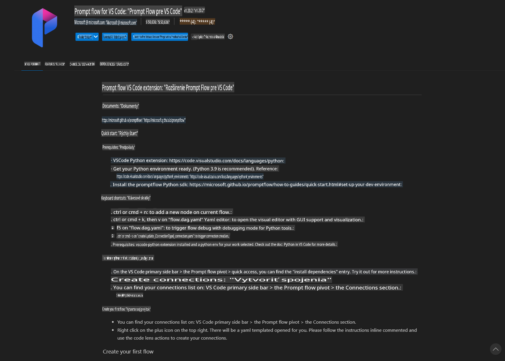
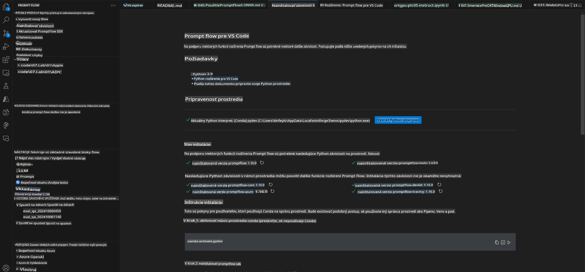
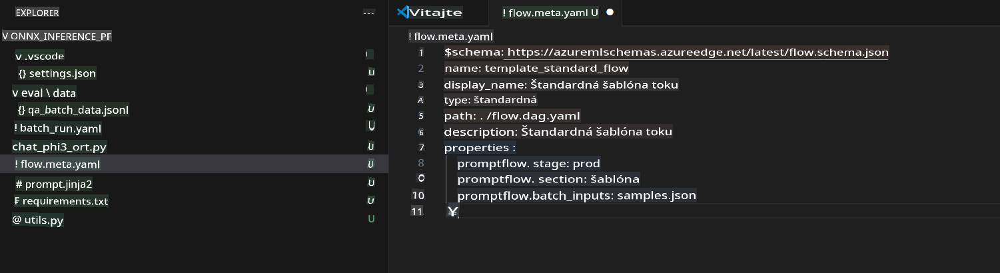
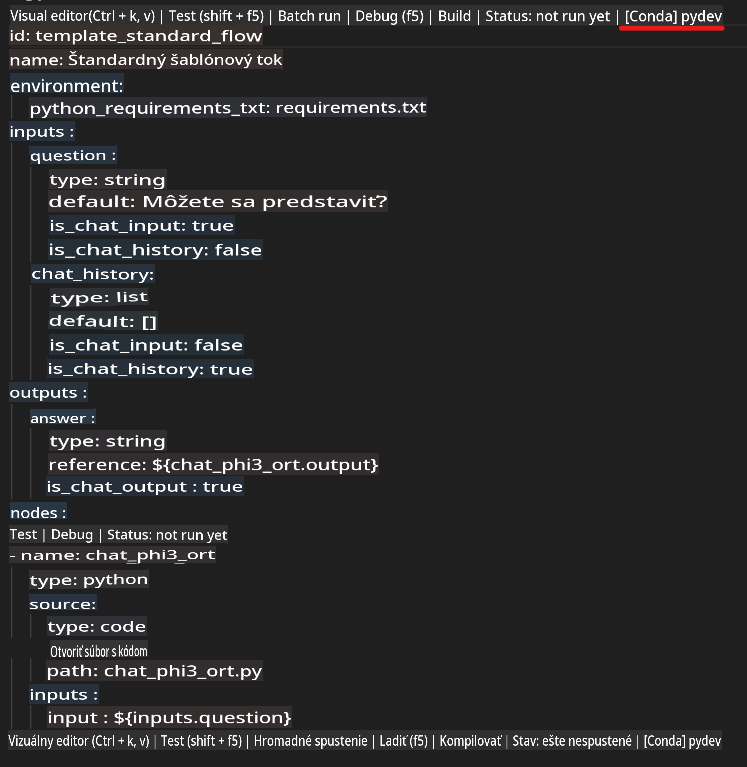
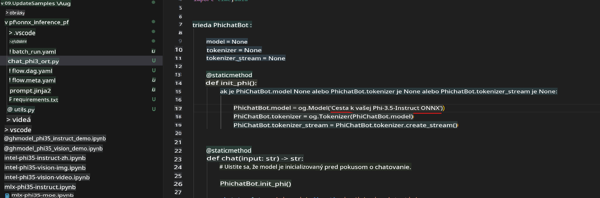
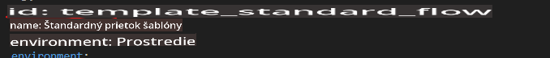
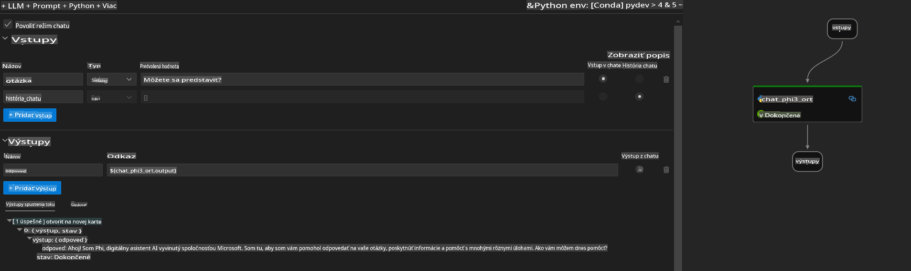
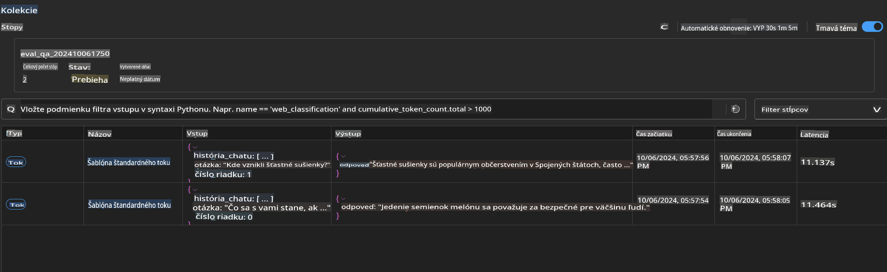

# Použitie Windows GPU na vytvorenie Prompt flow riešenia s Phi-3.5-Instruct ONNX

Nasledujúci dokument je príkladom, ako používať PromptFlow s ONNX (Open Neural Network Exchange) na vývoj AI aplikácií založených na modeloch Phi-3.

PromptFlow je súbor vývojárskych nástrojov navrhnutých na zjednodušenie celého vývojového cyklu AI aplikácií založených na veľkých jazykových modeloch (LLM), od nápadu a prototypovania až po testovanie a vyhodnocovanie.

Integráciou PromptFlow s ONNX môžu vývojári:

- **Optimalizovať výkon modelu:** Využiť ONNX na efektívne inferencie a nasadenie modelov.
- **Zjednodušiť vývoj:** Používať PromptFlow na správu pracovného toku a automatizáciu opakujúcich sa úloh.
- **Zlepšiť spoluprácu:** Uľahčiť spoluprácu medzi členmi tímu poskytnutím jednotného vývojového prostredia.

**Prompt flow** je súbor vývojárskych nástrojov navrhnutých na zjednodušenie celého vývojového cyklu AI aplikácií založených na LLM, od nápadu, prototypovania, testovania, vyhodnocovania až po nasadenie do produkcie a monitorovanie. Uľahčuje prácu s návrhom promptov a umožňuje vytvárať LLM aplikácie v produkčnej kvalite.

Prompt flow dokáže pracovať s OpenAI, Azure OpenAI Service a prispôsobiteľnými modelmi (Huggingface, lokálne LLM/SLM). Naším cieľom je nasadiť kvantizovaný ONNX model Phi-3.5 do lokálnych aplikácií. Prompt flow nám môže pomôcť lepšie plánovať naše podnikanie a vytvárať lokálne riešenia založené na Phi-3.5. V tomto príklade spojíme ONNX Runtime GenAI Library na vytvorenie Prompt flow riešenia na Windows GPU.

## **Inštalácia**

### **ONNX Runtime GenAI pre Windows GPU**

Prečítajte si tento návod na nastavenie ONNX Runtime GenAI pre Windows GPU [kliknite sem](./ORTWindowGPUGuideline.md)

### **Nastavenie Prompt flow vo VSCode**

1. Nainštalujte rozšírenie Prompt flow pre VS Code



2. Po inštalácii rozšírenia Prompt flow kliknite na rozšírenie a vyberte **Installation dependencies**. Postupujte podľa tohto návodu na inštaláciu Prompt flow SDK vo vašom prostredí.



3. Stiahnite si [Ukážkový kód](../../../../../../code/09.UpdateSamples/Aug/pf/onnx_inference_pf) a otvorte ho vo VS Code.



4. Otvorte **flow.dag.yaml** a vyberte svoje Python prostredie.



   Otvorte **chat_phi3_ort.py** a zmeňte umiestnenie vášho Phi-3.5-instruct ONNX modelu.



5. Spustite váš prompt flow na testovanie.

Otvorte **flow.dag.yaml** a kliknite na vizuálny editor.



Po kliknutí naň ho spustite na testovanie.



1. Môžete spustiť dávku v termináli na kontrolu ďalších výsledkov.

```bash

pf run create --file batch_run.yaml --stream --name 'Your eval qa name'    

```

Výsledky si môžete pozrieť vo vašom predvolenom prehliadači.



**Upozornenie**:  
Tento dokument bol preložený pomocou strojových AI prekladateľských služieb. Hoci sa snažíme o presnosť, prosím, berte na vedomie, že automatizované preklady môžu obsahovať chyby alebo nepresnosti. Pôvodný dokument v jeho pôvodnom jazyku by mal byť považovaný za autoritatívny zdroj. Pre kritické informácie sa odporúča profesionálny ľudský preklad. Nenesieme zodpovednosť za akékoľvek nedorozumenia alebo nesprávne interpretácie vyplývajúce z použitia tohto prekladu.