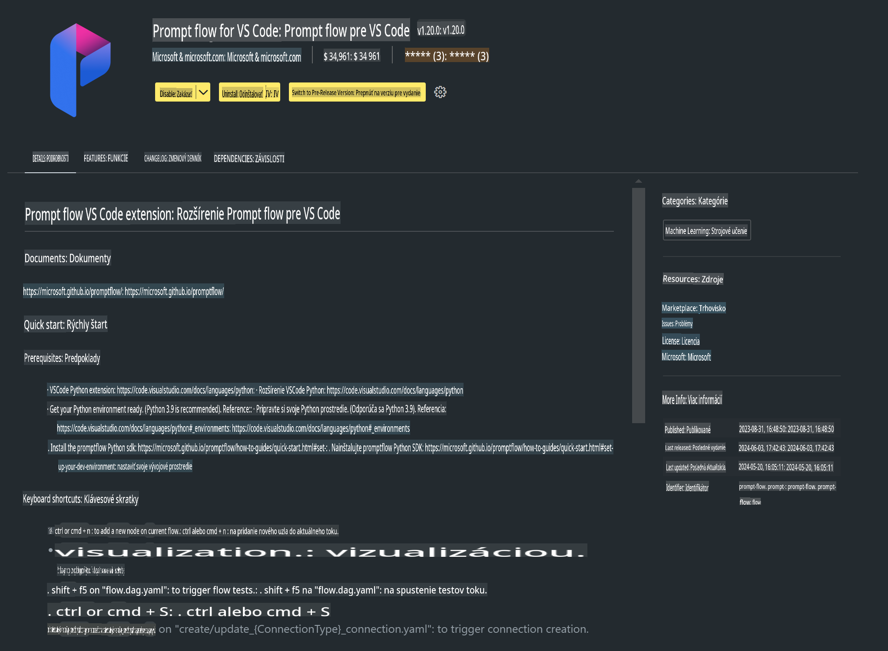

# **Lab 0 - Inštalácia**

Keď vstúpime do laboratória, musíme nakonfigurovať príslušné prostredie:

### **1. Python 3.11+**

Odporúča sa použiť miniforge na konfiguráciu vášho Python prostredia.

Na konfiguráciu miniforge, prosím, pozrite si [https://github.com/conda-forge/miniforge](https://github.com/conda-forge/miniforge).

Po nakonfigurovaní miniforge spustite nasledujúci príkaz v Power Shell:

```bash

conda create -n pyenv python==3.11.8 -y

conda activate pyenv

```

### **2. Inštalácia Prompt flow SDK**

V Lab 1 budeme používať Prompt flow, preto je potrebné nakonfigurovať Prompt flow SDK.

```bash

pip install promptflow --upgrade

```

Prompt flow SDK môžete overiť týmto príkazom:

```bash

pf --version

```

### **3. Inštalácia rozšírenia Prompt flow pre Visual Studio Code**



### **4. Intel NPU Akceleračná knižnica**

Nová generácia procesorov od Intelu podporuje NPU. Ak chcete lokálne spúšťať LLM/SLM pomocou NPU, môžete použiť ***Intel NPU Akceleračnú knižnicu***. Ak sa chcete dozvedieť viac, prečítajte si [https://github.com/microsoft/PhiCookBook/blob/main/md/01.Introduction/03/AIPC_Inference.md](https://github.com/microsoft/PhiCookBook/blob/main/md/01.Introduction/03/AIPC_Inference.md).

Nainštalujte Intel NPU Akceleračnú knižnicu v bash:

```bash

pip install intel-npu-acceleration-library

```

***Poznámka***: Upozorňujeme, že táto knižnica podporuje transformers ***4.40.2***, prosím, overte si verziu.

### **5. Ostatné Python knižnice**

Vytvorte súbor requirements.txt a pridajte tento obsah:

```txt

notebook
numpy 
scipy 
scikit-learn 
matplotlib 
pandas 
pillow 
graphviz

```

### **6. Inštalácia NVM**

Nainštalujte nvm v PowerShell:

```bash

winget install -e --id CoreyButler.NVMforWindows

```

Nainštalujte nodejs 18.20:

```bash

nvm install 18.20.0

nvm use 18.20.0

```

### **7. Inštalácia podpory vývoja vo Visual Studio Code**

```bash

npm install --global yo generator-code

```

Gratulujeme! Úspešne ste nakonfigurovali SDK. Teraz pokračujte k praktickým krokom.

**Upozornenie**:  
Tento dokument bol preložený pomocou strojových AI prekladových služieb. Hoci sa snažíme o presnosť, prosím, majte na pamäti, že automatizované preklady môžu obsahovať chyby alebo nepresnosti. Pôvodný dokument v jeho pôvodnom jazyku by mal byť považovaný za záväzný zdroj. Pre kritické informácie sa odporúča profesionálny ľudský preklad. Nenesieme zodpovednosť za akékoľvek nedorozumenia alebo nesprávne interpretácie vyplývajúce z použitia tohto prekladu.