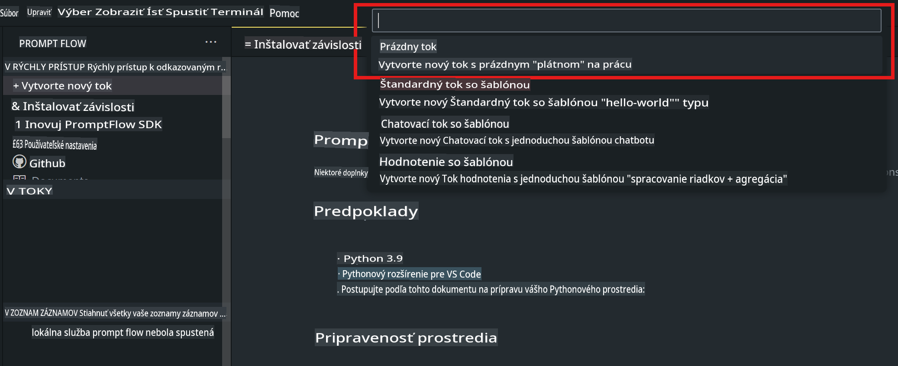
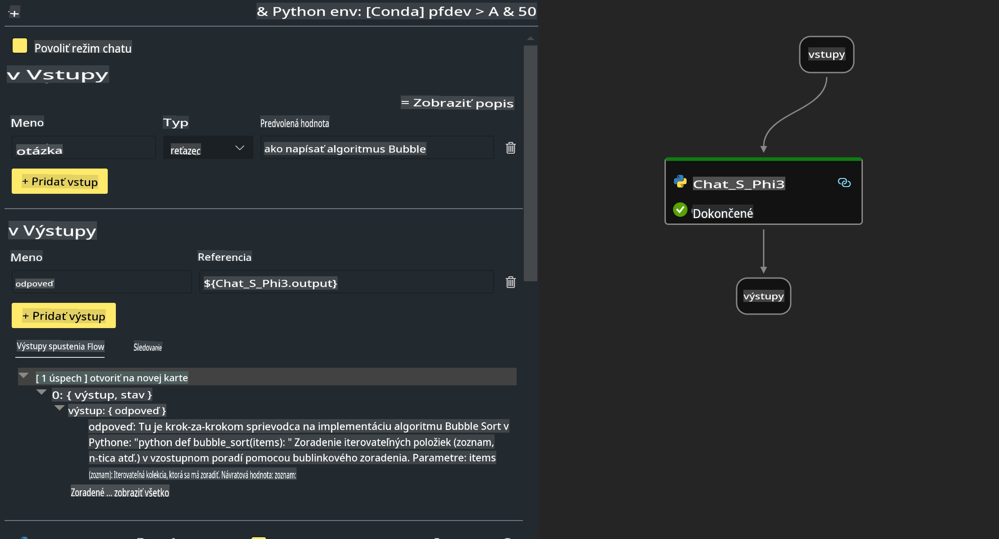

# **Lab 2 - Spustenie Prompt flow s Phi-3-mini v AIPC**

## **Čo je Prompt flow**

Prompt flow je sada vývojárskych nástrojov navrhnutých na zjednodušenie celého vývojového cyklu AI aplikácií založených na LLM, od nápadu, prototypovania, testovania, hodnotenia až po nasadenie do produkcie a monitorovanie. Uľahčuje prácu s promptami a umožňuje vám vytvárať LLM aplikácie s produkčnou kvalitou.

S Prompt flow môžete:

- Vytvárať toky, ktoré prepájajú LLM, prompty, Python kód a ďalšie nástroje do vykonateľného workflowu.

- Jednoducho ladiť a iterovať svoje toky, najmä interakcie s LLM.

- Hodnotiť svoje toky, počítať kvalitatívne a výkonnostné metriky na väčších datasetoch.

- Integrovať testovanie a hodnotenie do vášho CI/CD systému na zabezpečenie kvality vášho toku.

- Nasadzovať svoje toky na platformu podľa vášho výberu alebo ich jednoducho integrovať do kódu vašej aplikácie.

- (Voliteľné, ale veľmi odporúčané) Spolupracovať so svojím tímom využitím cloudovej verzie Prompt flow v Azure AI.


## **Vytváranie generovacích tokov na Apple Silicon**

***Poznámka***: Ak ste ešte neukončili inštaláciu prostredia, navštívte [Lab 0 - Inštalácie](./01.Installations.md)

1. Otvorte rozšírenie Prompt flow vo Visual Studio Code a vytvorte prázdny projekt toku.



2. Pridajte vstupné a výstupné parametre a pridajte Python kód ako nový tok.




Môžete sa odvolať na túto štruktúru (flow.dag.yaml) na vytvorenie svojho toku:

```yaml

inputs:
  prompt:
    type: string
    default: Write python code for Fibonacci serie. Please use markdown as output
outputs:
  result:
    type: string
    reference: ${gen_code_by_phi3.output}
nodes:
- name: gen_code_by_phi3
  type: python
  source:
    type: code
    path: gen_code_by_phi3.py
  inputs:
    prompt: ${inputs.prompt}


```

3. Kvantifikujte phi-3-mini

Chceme, aby SLM lepšie fungoval na lokálnych zariadeniach. Zvyčajne model kvantifikujeme (INT4, FP16, FP32).


```bash

python -m mlx_lm.convert --hf-path microsoft/Phi-3-mini-4k-instruct

```

**Poznámka:** predvolený priečinok je mlx_model 

4. Pridajte kód do súboru ***Chat_With_Phi3.py***


```python


from promptflow import tool

from mlx_lm import load, generate


# The inputs section will change based on the arguments of the tool function, after you save the code
# Adding type to arguments and return value will help the system show the types properly
# Please update the function name/signature per need
@tool
def my_python_tool(prompt: str) -> str:

    model_id = './mlx_model_phi3_mini'

    model, tokenizer = load(model_id)

    # <|user|>\nWrite python code for Fibonacci serie. Please use markdown as output<|end|>\n<|assistant|>

    response = generate(model, tokenizer, prompt="<|user|>\n" + prompt  + "<|end|>\n<|assistant|>", max_tokens=2048, verbose=True)

    return response


```

4. Tok môžete otestovať cez Debug alebo Run, aby ste overili, či generovanie kódu funguje správne.


5. Spustite tok ako vývojárske API v termináli.

```

pf flow serve --source ./ --port 8080 --host localhost   

```

Môžete ho otestovať v Postman / Thunder Client.


### **Poznámky**

1. Prvé spustenie trvá dlhší čas. Odporúčame stiahnuť model phi-3 z Hugging Face CLI.

2. Vzhľadom na obmedzený výpočtový výkon Intel NPU odporúčame používať Phi-3-mini-4k-instruct.

3. Používame Intel NPU akceleráciu na kvantizáciu INT4 konverzie, ale ak spustíte službu znova, musíte odstrániť cache a priečinky nc_workshop.


## **Zdroje**

1. Naučte sa Promptflow [https://microsoft.github.io/promptflow/](https://microsoft.github.io/promptflow/)

2. Naučte sa Intel NPU Acceleration [https://github.com/intel/intel-npu-acceleration-library](https://github.com/intel/intel-npu-acceleration-library)

3. Ukážkový kód, stiahnite si [Local NPU Agent Sample Code](../../../../../../../../../code/07.Lab/01/AIPC/local-npu-agent)

**Upozornenie**:  
Tento dokument bol preložený pomocou strojových AI prekladateľských služieb. Aj keď sa snažíme o presnosť, prosím, berte na vedomie, že automatizované preklady môžu obsahovať chyby alebo nepresnosti. Originálny dokument v jeho pôvodnom jazyku by mal byť považovaný za záväzný zdroj. Pre kritické informácie sa odporúča profesionálny ľudský preklad. Nenesieme zodpovednosť za akékoľvek nedorozumenia alebo nesprávne interpretácie vyplývajúce z použitia tohto prekladu.