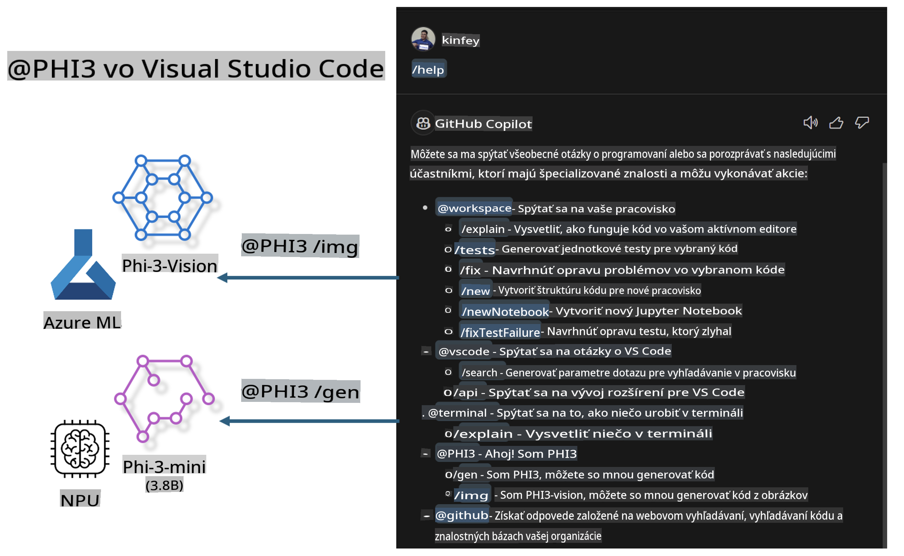

# **Vytvorte si vlastný Visual Studio Code GitHub Copilot Chat s Microsoft Phi-3 Family**

Použili ste už agenta pracovného priestoru v GitHub Copilot Chat? Chcete si vytvoriť vlastného tímového kódového agenta? Tento praktický workshop má za cieľ skombinovať open-source model na vytvorenie podnikovej úrovne kódového agenta.

## **Základy**

### **Prečo si vybrať Microsoft Phi-3**

Phi-3 je séria modelov, ktorá zahŕňa phi-3-mini, phi-3-small a phi-3-medium, pričom každý z nich má rôzne tréningové parametre pre generovanie textu, dokončovanie dialógov a generovanie kódu. Existuje aj phi-3-vision založený na Vision. Je vhodný pre podniky alebo rôzne tímy na vytváranie offline generatívnych AI riešení.

Odporúčame prečítať si tento odkaz [https://github.com/microsoft/PhiCookBook/blob/main/md/01.Introduction/01/01.PhiFamily.md](https://github.com/microsoft/PhiCookBook/blob/main/md/01.Introduction/01/01.PhiFamily.md)

### **Microsoft GitHub Copilot Chat**

Rozšírenie GitHub Copilot Chat vám poskytuje rozhranie chatu, ktoré umožňuje interakciu s GitHub Copilot a získavanie odpovedí na otázky súvisiace s kódovaním priamo vo VS Code, bez potreby prechádzať dokumentáciu alebo hľadať na online fórach.

Copilot Chat môže používať zvýraznenie syntaxe, odsadenie a ďalšie formátovacie funkcie na pridanie prehľadnosti k vygenerovanej odpovedi. V závislosti od typu otázky od používateľa môže výsledok obsahovať odkazy na kontext, ktorý Copilot použil na generovanie odpovede, ako sú zdrojové súbory alebo dokumentácia, alebo tlačidlá na prístup k funkciám VS Code.

- Copilot Chat sa integruje do vášho vývojárskeho toku a poskytuje vám pomoc tam, kde ju potrebujete:

- Spustite inline chatovú konverzáciu priamo z editora alebo terminálu, keď potrebujete pomoc pri kódovaní.

- Použite Chat zobrazenie na to, aby ste mali AI asistenta vždy po ruke.

- Spustite Rýchly chat na položenie rýchlej otázky a pokračujte v práci.

GitHub Copilot Chat môžete využiť v rôznych scenároch, ako napríklad:

- Odpovedanie na otázky ohľadom najlepšieho riešenia problému

- Vysvetlenie kódu od niekoho iného a návrhy na jeho zlepšenie

- Návrh opráv kódu

- Generovanie testovacích prípadov

- Generovanie dokumentácie ku kódu

Odporúčame prečítať si tento odkaz [https://code.visualstudio.com/docs/copilot/copilot-chat](https://code.visualstudio.com/docs/copilot/copilot-chat?WT.mc_id=aiml-137032-kinfeylo)

###  **Microsoft GitHub Copilot Chat @workspace**

Použitie **@workspace** v Copilot Chat vám umožňuje klásť otázky o celej vašej kódovej základni. Na základe otázky Copilot inteligentne vyhľadáva relevantné súbory a symboly, ktoré potom zahrnie do svojej odpovede ako odkazy a príklady kódu.

Na zodpovedanie vašej otázky **@workspace** prehľadáva tie isté zdroje, ktoré by vývojár použil pri navigácii v kódovej základni vo VS Code:

- Všetky súbory v pracovnom priestore, okrem súborov ignorovaných súborom .gitignore

- Štruktúru adresárov s vnorenými priečinkami a názvami súborov

- Index vyhľadávania kódu na GitHube, ak je pracovný priestor GitHub repozitár a indexovaný vyhľadávaním kódu

- Symboly a definície v pracovnom priestore

- Aktuálne vybraný text alebo viditeľný text v aktívnom editore

Poznámka: .gitignore sa obchádza, ak máte otvorený súbor alebo máte vybraný text v ignorovanom súbore.

Odporúčame prečítať si tento odkaz [[https://code.visualstudio.com/docs/copilot/copilot-chat](https://code.visualstudio.com/docs/copilot/workspace-context?WT.mc_id=aiml-137032-kinfeylo)]

## **Viac o tomto workshope**

GitHub Copilot výrazne zlepšil efektivitu programovania v podnikoch a každá spoločnosť si želá prispôsobiť súvisiace funkcie GitHub Copilot. Mnohé podniky si prispôsobili rozšírenia podobné GitHub Copilot na základe svojich vlastných obchodných scenárov a open-source modelov. Pre podniky sú prispôsobené rozšírenia ľahšie kontrolovateľné, no to tiež ovplyvňuje používateľskú skúsenosť. Koniec koncov, GitHub Copilot má silnejšie funkcie pri riešení všeobecných scenárov a odbornosti. Ak by sa dala zachovať konzistentná skúsenosť, bolo by lepšie prispôsobiť si vlastné rozšírenie. GitHub Copilot Chat poskytuje relevantné API pre podniky na rozšírenie chatovej skúsenosti. Zachovanie konzistentnej skúsenosti a prispôsobenie funkcií poskytuje lepšiu používateľskú skúsenosť.

Tento workshop využíva model Phi-3 kombinovaný s lokálnym NPU a hybridným riešením Azure na vytvorenie vlastného Agenta v GitHub Copilot Chat ***@PHI3***, ktorý pomáha vývojárom podnikov pri generovaní kódu ***(@PHI3 /gen)*** a generovaní kódu na základe obrázkov ***(@PHI3 /img)***.

### ***Poznámka:*** 

Tento workshop je momentálne implementovaný na AIPC procesoroch Intel CPU a Apple Silicon. Budeme naďalej aktualizovať verziu Qualcomm NPU.

## **Workshop**

| Názov | Popis | AIPC | Apple |
| ------------ | ----------- | -------- |-------- |
| Lab0 - Inštalácie(✅) | Konfigurácia a inštalácia súvisiacich prostredí a nástrojov | [Go](./HOL/AIPC/01.Installations.md) |[Go](./HOL/Apple/01.Installations.md) |
| Lab1 - Spustenie Prompt flow s Phi-3-mini (✅) | V kombinácii s AIPC / Apple Silicon, použitie lokálneho NPU na vytvorenie generovania kódu cez Phi-3-mini | [Go](./HOL/AIPC/02.PromptflowWithNPU.md) |  [Go](./HOL/Apple/02.PromptflowWithMLX.md) |
| Lab2 - Nasadenie Phi-3-vision na Azure Machine Learning Service(✅) | Generovanie kódu nasadením Model Catalog - Phi-3-vision obrázka na Azure Machine Learning Service | [Go](./HOL/AIPC/03.DeployPhi3VisionOnAzure.md) |[Go](./HOL/Apple/03.DeployPhi3VisionOnAzure.md) |
| Lab3 - Vytvorenie agenta @phi-3 v GitHub Copilot Chat(✅)  | Vytvorenie vlastného agenta Phi-3 v GitHub Copilot Chat na dokončovanie generovania kódu, generovanie grafov, RAG, atď. | [Go](./HOL/AIPC/04.CreatePhi3AgentInVSCode.md) | [Go](./HOL/Apple/04.CreatePhi3AgentInVSCode.md) |
| Ukážkový kód (✅)  | Stiahnutie ukážkového kódu | [Go](../../../../../../../code/07.Lab/01/AIPC) | [Go](../../../../../../../code/07.Lab/01/Apple) |

## **Zdroje**

1. Phi-3 Cookbook [https://github.com/microsoft/Phi-3CookBook](https://github.com/microsoft/Phi-3CookBook)

2. Viac o GitHub Copilot [https://learn.microsoft.com/training/paths/copilot/](https://learn.microsoft.com/training/paths/copilot/?WT.mc_id=aiml-137032-kinfeylo)

3. Viac o GitHub Copilot Chat [https://learn.microsoft.com/training/paths/accelerate-app-development-using-github-copilot/](https://learn.microsoft.com/training/paths/accelerate-app-development-using-github-copilot/?WT.mc_id=aiml-137032-kinfeylo)

4. Viac o GitHub Copilot Chat API [https://code.visualstudio.com/api/extension-guides/chat](https://code.visualstudio.com/api/extension-guides/chat?WT.mc_id=aiml-137032-kinfeylo)

5. Viac o Azure AI Foundry [https://learn.microsoft.com/training/paths/create-custom-copilots-ai-studio/](https://learn.microsoft.com/training/paths/create-custom-copilots-ai-studio/?WT.mc_id=aiml-137032-kinfeylo)

6. Viac o Azure AI Foundry's Model Catalog [https://learn.microsoft.com/azure/ai-studio/how-to/model-catalog-overview](https://learn.microsoft.com/azure/ai-studio/how-to/model-catalog-overview)

**Upozornenie**:  
Tento dokument bol preložený pomocou strojových AI prekladateľských služieb. Hoci sa snažíme o presnosť, uvedomte si, že automatizované preklady môžu obsahovať chyby alebo nepresnosti. Pôvodný dokument v jeho pôvodnom jazyku by mal byť považovaný za záväzný zdroj. Pre kritické informácie sa odporúča profesionálny ľudský preklad. Nenesieme zodpovednosť za akékoľvek nedorozumenia alebo nesprávne interpretácie vyplývajúce z použitia tohto prekladu.