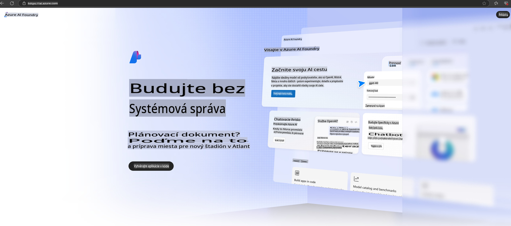

# **Používanie Phi-3 v Azure AI Foundry**

S rozvojom generatívnej AI chceme využiť jednotnú platformu na správu rôznych LLM a SLM, integráciu podnikových dát, operácie jemného doladenia/RAG a hodnotenie rôznych podnikových scenárov po integrácii LLM a SLM, aby boli generatívne AI aplikácie implementované efektívnejšie. [Azure AI Foundry](https://ai.azure.com) je podniková platforma pre generatívne AI aplikácie.

S Azure AI Foundry môžete hodnotiť odpovede veľkých jazykových modelov (LLM) a organizovať komponenty aplikácie s prompt flow pre lepší výkon. Platforma umožňuje škálovateľnosť, vďaka ktorej sa koncepty dokážu jednoducho transformovať na plnohodnotnú produkciu. Neustále monitorovanie a zdokonaľovanie podporujú dlhodobý úspech.

Model Phi-3 môžeme rýchlo nasadiť na Azure AI Foundry prostredníctvom jednoduchých krokov a následne využiť Azure AI Foundry na prácu súvisiacu s Phi-3, ako je Playground/Chat, jemné doladenie, hodnotenie a ďalšie.

## **1. Príprava**

Ak už máte na svojom zariadení nainštalovaný [Azure Developer CLI](https://learn.microsoft.com/azure/developer/azure-developer-cli/overview?WT.mc_id=aiml-138114-kinfeylo), použitie tejto šablóny je také jednoduché, ako spustiť tento príkaz v novom adresári.

## Manuálne vytvorenie

Vytvorenie projektu a hubu v Microsoft Azure AI Foundry je skvelý spôsob, ako organizovať a spravovať svoju AI prácu. Tu je krok-za-krokom návod, ako začať:

### Vytvorenie projektu v Azure AI Foundry

1. **Prejdite na Azure AI Foundry**: Prihláste sa do portálu Azure AI Foundry.
2. **Vytvorte projekt**:
   - Ak sa nachádzate v projekte, vyberte "Azure AI Foundry" v ľavom hornom rohu stránky, aby ste prešli na domovskú stránku.
   - Vyberte "+ Vytvoriť projekt".
   - Zadajte názov projektu.
   - Ak máte hub, bude predvolene vybraný. Ak máte prístup k viacerým hubom, môžete vybrať iný z rozbaľovacieho zoznamu. Ak chcete vytvoriť nový hub, vyberte "Vytvoriť nový hub" a zadajte názov.
   - Kliknite na "Vytvoriť".

### Vytvorenie hubu v Azure AI Foundry

1. **Prejdite na Azure AI Foundry**: Prihláste sa pomocou svojho Azure účtu.
2. **Vytvorte hub**:
   - Vyberte Centrum správy z ľavého menu.
   - Kliknite na "Všetky zdroje", potom na šípku vedľa "+ Nový projekt" a vyberte "+ Nový hub".
   - V dialógu "Vytvoriť nový hub" zadajte názov pre váš hub (napr. contoso-hub) a upravte ostatné polia podľa potreby.
   - Kliknite na "Ďalej", skontrolujte informácie a potom vyberte "Vytvoriť".

Podrobnejšie inštrukcie nájdete v oficiálnej [dokumentácii Microsoft](https://learn.microsoft.com/azure/ai-studio/how-to/create-projects).

Po úspešnom vytvorení môžete pristupovať k štúdiu, ktoré ste vytvorili, prostredníctvom [ai.azure.com](https://ai.azure.com/)

Na jednom AI Foundry môže byť viacero projektov. Vytvorte projekt v AI Foundry na prípravu.

Vytvorte Azure AI Foundry [QuickStarts](https://learn.microsoft.com/azure/ai-studio/quickstarts/get-started-code)

## **2. Nasadenie modelu Phi v Azure AI Foundry**

Kliknite na možnosť Preskúmať projektu, vstúpte do Katalógu modelov a vyberte Phi-3.

Vyberte Phi-3-mini-4k-instruct.

Kliknite na 'Nasadiť' pre nasadenie modelu Phi-3-mini-4k-instruct.

> [!NOTE]
>
> Pri nasadzovaní môžete vybrať výpočtový výkon.

## **3. Playground Chat Phi v Azure AI Foundry**

Prejdite na stránku nasadenia, vyberte Playground a chatujte s Phi-3 v Azure AI Foundry.

## **4. Nasadenie modelu z Azure AI Foundry**

Ak chcete nasadiť model z katalógu modelov Azure, postupujte podľa týchto krokov:

- Prihláste sa do Azure AI Foundry.
- Vyberte model, ktorý chcete nasadiť, z katalógu modelov Azure AI Foundry.
- Na stránke Podrobnosti modelu vyberte Nasadiť a potom vyberte Serverless API s Azure AI Content Safety.
- Vyberte projekt, do ktorého chcete nasadiť svoje modely. Ak chcete použiť ponuku Serverless API, váš workspace musí patriť do regiónu East US 2 alebo Sweden Central. Môžete si prispôsobiť názov nasadenia.
- V sprievodcovi nasadením vyberte Ceny a podmienky, aby ste sa oboznámili s cenami a podmienkami používania.
- Kliknite na Nasadiť. Počkajte, kým sa nasadenie dokončí a budete presmerovaní na stránku Nasadenia.
- Vyberte Otvoriť v playgrounde a začnite interagovať s modelom.
- Môžete sa vrátiť na stránku Nasadenia, vybrať nasadenie a poznamenať si Cieľovú URL a Tajný kľúč, ktoré môžete použiť na volanie nasadenia a generovanie odpovedí.
- Podrobnosti o URL a prístupových kľúčoch vždy nájdete v záložke Build, kde v sekcii Komponenty vyberiete Nasadenia.

> [!NOTE]
> Upozorňujeme, že váš účet musí mať oprávnenia roly Azure AI Developer na Resource Group, aby ste mohli vykonať tieto kroky.

## **5. Používanie Phi API v Azure AI Foundry**

Môžete pristupovať na https://{Názov vášho projektu}.region.inference.ml.azure.com/swagger.json cez Postman GET a v kombinácii s kľúčom si pozrieť dostupné rozhrania.

Parametre požiadavky a odpovede môžete získať veľmi jednoducho.

**Upozornenie**:  
Tento dokument bol preložený pomocou strojových AI prekladateľských služieb. Aj keď sa snažíme o presnosť, upozorňujeme, že automatizované preklady môžu obsahovať chyby alebo nepresnosti. Za autoritatívny zdroj by sa mal považovať pôvodný dokument v jeho pôvodnom jazyku. Pre dôležité informácie sa odporúča profesionálny ľudský preklad. Nezodpovedáme za žiadne nedorozumenia alebo nesprávne interpretácie vyplývajúce z použitia tohto prekladu.