# Vylepšovanie Phi-3 s Azure AI Foundry

Pozrime sa, ako prispôsobiť jazykový model Phi-3 Mini od Microsoftu pomocou Azure AI Foundry. Vylepšovanie umožňuje prispôsobiť Phi-3 Mini špecifickým úlohám, čím sa stáva ešte výkonnejším a kontextovo citlivejším.

## Úvahy

- **Schopnosti:** Ktoré modely je možné prispôsobiť? Čo dokáže základný model po prispôsobení?
- **Náklady:** Aký je cenový model pre prispôsobenie?
- **Prispôsobiteľnosť:** Do akej miery môžem upraviť základný model – a akým spôsobom?
- **Pohodlie:** Ako prebieha samotné prispôsobenie – musím písať vlastný kód? Potrebujem vlastný výpočtový výkon?
- **Bezpečnosť:** Prispôsobené modely môžu predstavovať bezpečnostné riziká – existujú nejaké opatrenia na ochranu pred nežiaducimi dôsledkami?

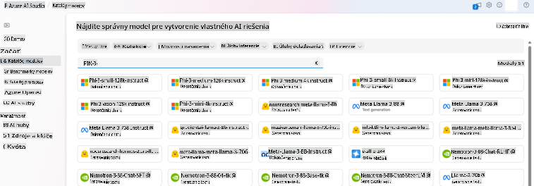

## Príprava na vylepšovanie

### Predpoklady

> [!NOTE]
> Pre modely rodiny Phi-3 je ponuka prispôsobenia na základe platby za použitie dostupná iba v huboch vytvorených v regiónoch **East US 2**.

- Predplatné Azure. Ak ešte nemáte predplatné Azure, vytvorte si [platený účet Azure](https://azure.microsoft.com/pricing/purchase-options/pay-as-you-go) na začiatok.

- [AI Foundry projekt](https://ai.azure.com?WT.mc_id=aiml-138114-kinfeylo).
- Na udeľovanie prístupu k operáciám v Azure AI Foundry sa používajú kontroly prístupu založené na roliach v Azure (Azure RBAC). Na vykonanie krokov v tomto článku musí byť váš používateľský účet priradený k roli __Azure AI Developer__ v skupine zdrojov.

### Registrácia poskytovateľa predplatného

Overte, či je predplatné registrované pre `Microsoft.Network` poskytovateľa zdrojov.

1. Prihláste sa do [portálu Azure](https://portal.azure.com).
1. Z ľavého menu vyberte **Predplatné**.
1. Vyberte predplatné, ktoré chcete použiť.
1. Z ľavého menu vyberte **Nastavenia AI projektu** > **Poskytovatelia zdrojov**.
1. Overte, či je **Microsoft.Network** uvedený v zozname poskytovateľov zdrojov. Ak nie, pridajte ho.

### Príprava dát

Pripravte svoje tréningové a validačné dáta na prispôsobenie modelu. Vaše tréningové a validačné dátové sady by mali obsahovať vstupné a výstupné príklady toho, ako by mal model fungovať.

Uistite sa, že všetky tréningové príklady dodržiavajú očakávaný formát pre inferenciu. Na efektívne prispôsobenie modelov zabezpečte vyvážený a rozmanitý dataset.

To zahŕňa udržiavanie rovnováhy dát, zahrnutie rôznych scenárov a pravidelné dolaďovanie tréningových dát, aby zodpovedali očakávaniam reálneho sveta, čo nakoniec vedie k presnejším a vyváženejším odpovediam modelu.

Rôzne typy modelov vyžadujú rôzny formát tréningových dát.

### Chat Completion

Tréningové a validačné dáta, ktoré používate, **musia** byť vo formáte JSON Lines (JSONL). Pre `Phi-3-mini-128k-instruct` musí byť dataset na prispôsobenie vo formáte konverzácie, ktorý používa API pre dokončenie chatu.

### Príklad formátu súboru

```json
    {"messages": [{"role": "system", "content": "You are an Xbox customer support agent whose primary goal is to help users with issues they are experiencing with their Xbox devices. You are friendly and concise. You only provide factual answers to queries, and do not provide answers that are not related to Xbox."}, {"role": "user", "content": "Is Xbox better than PlayStation?"}, {"role": "assistant", "content": "I apologize, but I cannot provide personal opinions. My primary job is to assist you with any issues related to your Xbox device. Do you have any Xbox-related issues that need addressing?"}]}
    {"messages": [{"role": "system", "content": "You are an Xbox customer support agent whose primary goal is to help users with issues they are experiencing with their Xbox devices. You are friendly and concise. You only provide factual answers to queries, and do not provide answers that are not related to Xbox."}, {"role": "user", "content": "Can I play PC games on my Xbox?"}, {"role": "assistant", "content": "While Xbox consoles don't natively support PC games, they can play an array of Xbox games, many of which are also available on PC. Can I assist you with finding games compatible with your Xbox device?"}]}
    {"messages": [{"role": "system", "content": "You are an Xbox customer support agent whose primary goal is to help users with issues they are experiencing with their Xbox devices. You are friendly and concise. You only provide factual answers to queries, and do not provide answers that are not related to Xbox."}, {"role": "user", "content": "I'm having trouble connecting my Xbox to the Wi-Fi."}, {"role": "assistant", "content": "No worries, let's go through the network settings on your Xbox. Can you please tell me what happens when you try to connect it to the Wi-Fi?"}]}
```

Podporovaný typ súboru je JSON Lines. Súbory sa nahrávajú do predvoleného úložiska a sprístupňujú sa vo vašom projekte.

## Vylepšovanie Phi-3 s Azure AI Foundry

Azure AI Foundry vám umožňuje prispôsobiť veľké jazykové modely vašim vlastným datasetom pomocou procesu známeho ako vylepšovanie. Tento proces poskytuje významnú hodnotu tým, že umožňuje prispôsobenie a optimalizáciu pre špecifické úlohy a aplikácie. Vedie k lepšiemu výkonu, nákladovej efektivite, zníženiu latencie a prispôsobeným výstupom.

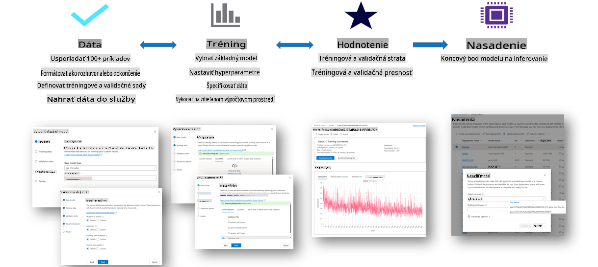

### Vytvorenie nového projektu

1. Prihláste sa do [Azure AI Foundry](https://ai.azure.com).

1. Vyberte **+New project** na vytvorenie nového projektu v Azure AI Foundry.

    

1. Vykonajte nasledujúce kroky:

    - **Názov hubu projektu**. Musí byť unikátny.
    - Vyberte **Hub**, ktorý chcete použiť (v prípade potreby vytvorte nový).

    

1. Na vytvorenie nového hubu vykonajte nasledujúce kroky:

    - Zadajte **Názov hubu**. Musí byť unikátny.
    - Vyberte predplatné **Azure**.
    - Vyberte **Skupinu zdrojov**, ktorú chcete použiť (v prípade potreby vytvorte novú).
    - Vyberte **Lokalitu**, ktorú chcete použiť.
    - Vyberte **Pripojiť služby Azure AI** (v prípade potreby vytvorte nové).
    - Vyberte **Pripojiť Azure AI Search** na **Preskočiť pripojenie**.

    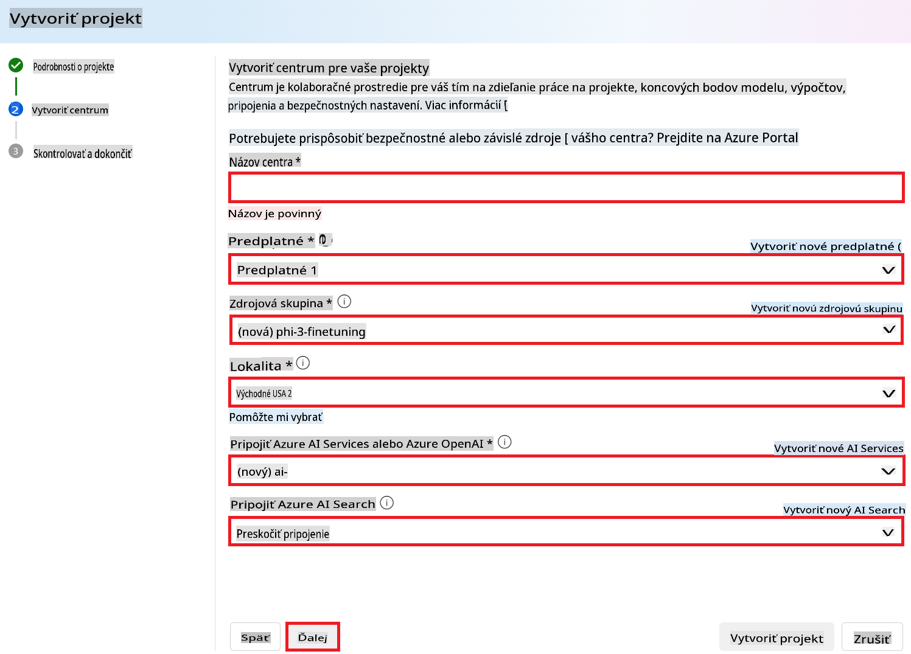

1. Vyberte **Next**.
1. Vyberte **Vytvoriť projekt**.

### Príprava dát

Pred prispôsobením zhromaždite alebo vytvorte dataset relevantný pre vašu úlohu, ako sú inštrukcie na chat, páry otázok a odpovedí alebo iné textové dáta. Vyčistite a predspracujte tieto dáta odstránením šumu, riešením chýbajúcich hodnôt a tokenizáciou textu.

### Prispôsobenie modelov Phi-3 v Azure AI Foundry

> [!NOTE]
> Prispôsobenie modelov Phi-3 je momentálne podporované v projektoch nachádzajúcich sa v East US 2.

1. Z ľavého menu vyberte **Katalóg modelov**.

1. Do **vyhľadávacieho poľa** zadajte *phi-3* a vyberte model phi-3, ktorý chcete použiť.

    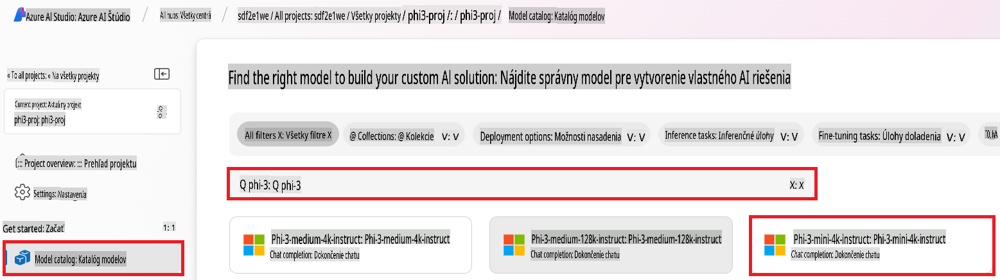

1. Vyberte **Fine-tune**.

    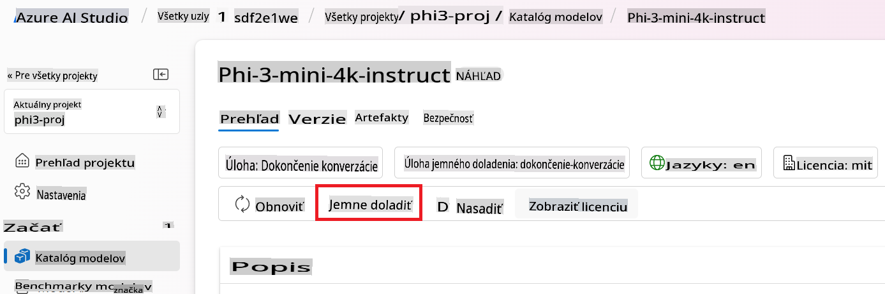

1. Zadajte **Názov prispôsobeného modelu**.

    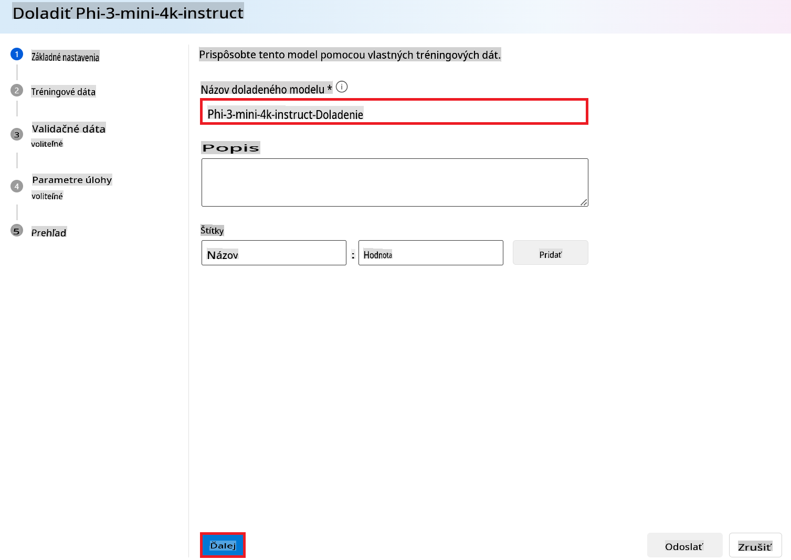

1. Vyberte **Next**.

1. Vykonajte nasledujúce kroky:

    - Vyberte **typ úlohy** na **Chat completion**.
    - Vyberte **Tréningové dáta**, ktoré chcete použiť. Môžete ich nahrať cez Azure AI Foundry alebo z lokálneho prostredia.

    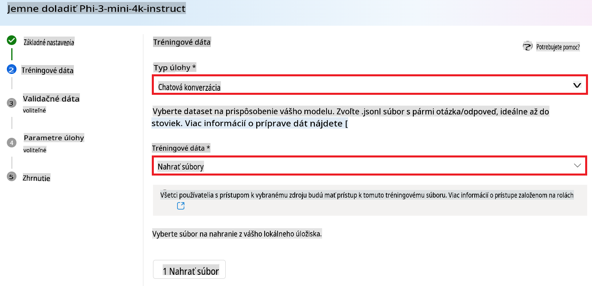

1. Vyberte **Next**.

1. Nahrajte **Validačné dáta**, ktoré chcete použiť, alebo vyberte **Automatické rozdelenie tréningových dát**.

    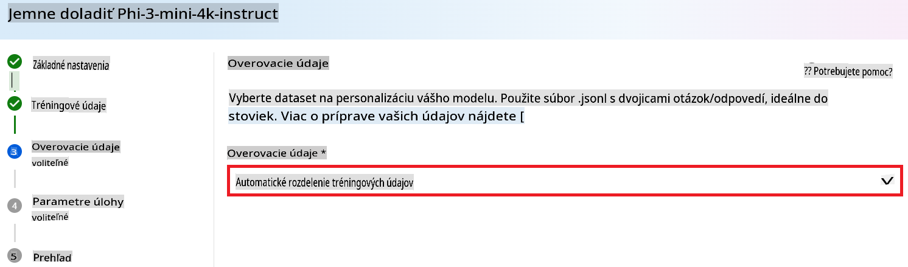

1. Vyberte **Next**.

1. Vykonajte nasledujúce kroky:

    - Vyberte **Multiplikátor veľkosti batchu**, ktorý chcete použiť.
    - Vyberte **Rýchlosť učenia**, ktorú chcete použiť.
    - Vyberte **Počet epoch**, ktorý chcete použiť.

    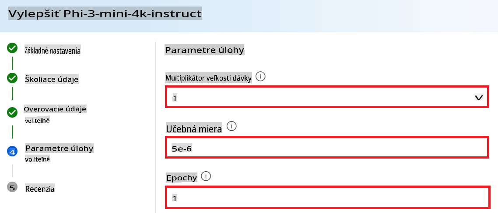

1. Vyberte **Submit** na spustenie procesu prispôsobenia.

    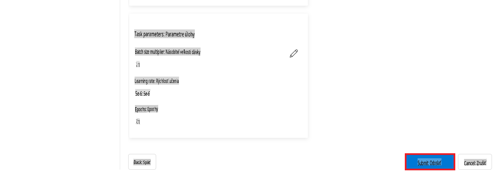

1. Po dokončení prispôsobenia sa stav modelu zobrazí ako **Completed**, ako je znázornené na obrázku nižšie. Teraz môžete model nasadiť a použiť vo svojej aplikácii, v prostredí playground alebo v prompt flow. Viac informácií nájdete v [Ako nasadiť modely rodiny Phi-3 v Azure AI Foundry](https://learn.microsoft.com/azure/ai-studio/how-to/deploy-models-phi-3?tabs=phi-3-5&pivots=programming-language-python).

    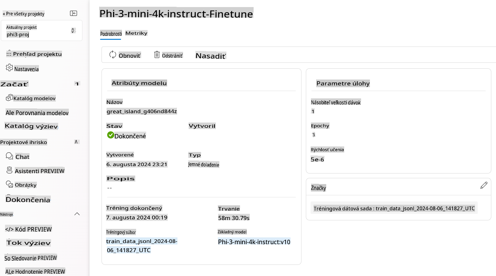

> [!NOTE]
> Podrobnejšie informácie o prispôsobení Phi-3 nájdete v [Prispôsobenie modelov Phi-3 v Azure AI Foundry](https://learn.microsoft.com/azure/ai-studio/how-to/fine-tune-phi-3?tabs=phi-3-mini).

## Odstránenie prispôsobených modelov

Prispôsobený model môžete odstrániť zo zoznamu modelov na prispôsobenie v [Azure AI Foundry](https://ai.azure.com) alebo zo stránky s detailmi modelu. Vyberte prispôsobený model, ktorý chcete odstrániť, na stránke Prispôsobenie a potom vyberte tlačidlo Odstrániť.

> [!NOTE]
> Vlastný model nemôžete odstrániť, ak má existujúce nasadenie. Najprv musíte odstrániť nasadenie modelu, aby ste mohli odstrániť vlastný model.

## Náklady a kvóty

### Úvahy o nákladoch a kvótach pre modely Phi-3 prispôsobené ako služba

Modely Phi prispôsobené ako služba sú ponúkané spoločnosťou Microsoft a integrované s Azure AI Foundry na použitie. Ceny nájdete pri [nasadzovaní](https://learn.microsoft.com/azure/ai-studio/how-to/deploy-models-phi-3?tabs=phi-3-5&pivots=programming-language-python) alebo prispôsobovaní modelov pod záložkou Ceny a podmienky v sprievodcovi nasadzovaním.

## Filtrovanie obsahu

Modely nasadené ako služba s platbou za použitie sú chránené Azure AI Content Safety. Pri nasadení na real-time endpointy môžete túto funkciu vypnúť. S povolenou ochranou Azure AI Content Safety prechádzajú vstupné výzvy aj výstupy modelu klasifikačnými modelmi na detekciu a prevenciu škodlivého obsahu. Systém filtrovania obsahu deteguje a reaguje na konkrétne kategórie potenciálne škodlivého obsahu vo vstupoch aj výstupoch. Viac informácií nájdete v [Azure AI Content Safety](https://learn.microsoft.com/azure/ai-studio/concepts/content-filtering).

**Konfigurácia prispôsobenia**

Hyperparametre: Definujte hyperparametre, ako je rýchlosť učenia, veľkosť batchu a počet tréningových epoch.

**Funkcia straty**

Vyberte vhodnú funkciu straty pre svoju úlohu (napr. cross-entropy).

**Optimalizátor**

Zvoľte optimalizátor (napr. Adam) na aktualizáciu gradientov počas tréningu.

**Proces prispôsobenia**

- Načítajte predtrénovaný model: Načítajte checkpoint Phi-3 Mini.
- Pridajte vlastné vrstvy: Pridajte vrstvy špecifické pre úlohu (napr. klasifikačnú hlavu pre chat inštrukcie).

**Tréning modelu**
Prispôsobte model pomocou vášho pripraveného datasetu. Sledujte priebeh tréningu a podľa potreby upravte hyperparametre.

**Hodnotenie a validácia**

Validačný set: Rozdeľte svoje dáta na tréningové a validačné sady.

**Vyhodnotenie výkonu**

Na hodnotenie výkonu modelu použite metriky ako presnosť, F1-skóre alebo perplexitu.

## Uloženie prispôsobeného modelu

**Checkpoint**
Uložte checkpoint prispôsobeného modelu na budúce použitie.

## Nasadenie

- Nasadenie ako webová služba: Nasadte svoj prispôsobený model ako webovú službu v Azure AI Foundry.
- Testovanie endpointu: Pošlite testovacie dotazy na nasadený endpoint, aby ste overili jeho funkčnosť.

## Iterácia a zlepšenie

Iterácia: Ak výkon nie je uspokojivý, iterujte úpravou hyperparametrov, pridávaním dát alebo prispôsobením počas ďalších epoch.

## Monitorovanie a dolaďovanie

Neustále sledujte správanie modelu a dolaďujte podľa potreby.

## Prispôsobenie a rozšírenie

Vlastné úlohy: Phi-3 Mini môže byť prispôsobený pre rôzne úlohy mimo chat inštrukcií. Preskúmajte ďalšie možnosti použitia!
Experimentovanie: Skúšajte rôzne architektúry, kombinácie vrstiev a techniky na zlepšenie výkonu.

> [!NOTE]
> Prispôsobenie je iteratívny proces. Experimentujte, učte sa a prispôsobujte svoj model, aby ste dosiahli čo najlepšie výsledky pre svoju špecifickú úlohu!

**Upozornenie**:  
Tento dokument bol preložený pomocou strojových AI prekladateľských služieb. Hoci sa snažíme o presnosť, prosím, majte na pamäti, že automatizované preklady môžu obsahovať chyby alebo nepresnosti. Pôvodný dokument v jeho pôvodnom jazyku by mal byť považovaný za autoritatívny zdroj. Pre dôležité informácie sa odporúča profesionálny ľudský preklad. Nezodpovedáme za akékoľvek nedorozumenia alebo nesprávne interpretácie vyplývajúce z použitia tohto prekladu.