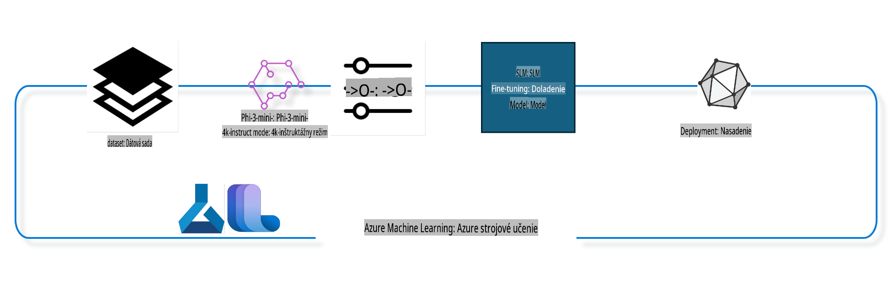

## Ako používať chat-completion komponenty z registru Azure ML na doladenie modelu

V tomto príklade sa budeme venovať doladeniu modelu Phi-3-mini-4k-instruct na dokončenie rozhovoru medzi dvoma ľuďmi pomocou datasetu ultrachat_200k.



Tento príklad vám ukáže, ako doladiť model pomocou Azure ML SDK a Pythonu a následne nasadiť doladený model na online endpoint pre inferenciu v reálnom čase.

### Tréningové dáta

Použijeme dataset ultrachat_200k. Ide o silno filtrovanú verziu datasetu UltraChat, ktorý bol použitý na tréning modelu Zephyr-7B-β, špičkového 7B chat modelu.

### Model

Použijeme model Phi-3-mini-4k-instruct, aby sme ukázali, ako môže používateľ doladiť model pre úlohu chat-completion. Ak ste otvorili tento notebook zo špecifickej karty modelu, nezabudnite nahradiť názov modelu.

### Úlohy

- Vybrať model na doladenie.
- Vybrať a preskúmať tréningové dáta.
- Nastaviť konfiguráciu pre doladenie.
- Spustiť doladenie.
- Skontrolovať metriky tréningu a hodnotenia.
- Registrovať doladený model.
- Nasadiť doladený model pre inferenciu v reálnom čase.
- Vyčistiť zdroje.

## 1. Nastavenie predpokladov

- Nainštalovať závislosti.
- Pripojiť sa k AzureML Workspace. Viac informácií nájdete v nastavení autentifikácie SDK. Nahraďte <WORKSPACE_NAME>, <RESOURCE_GROUP> a <SUBSCRIPTION_ID>.
- Pripojiť sa k registru systému AzureML.
- Nastaviť voliteľný názov experimentu.
- Skontrolovať alebo vytvoriť výpočtový prostriedok.

> [!NOTE]
> Požiadavky: jeden GPU uzol môže mať viac GPU kariet. Napríklad, v jednom uzle Standard_NC24rs_v3 sú 4 NVIDIA V100 GPU, zatiaľ čo v Standard_NC12s_v3 sú 2 NVIDIA V100 GPU. Viac informácií nájdete v dokumentácii. Počet GPU kariet na uzol je nastavený v parametri gpus_per_node nižšie. Správne nastavenie tejto hodnoty zabezpečí využitie všetkých GPU na uzle. Odporúčané GPU SKU nájdete tu a tu.

### Python knižnice

Nainštalujte závislosti spustením nižšie uvedenej bunky. Tento krok nie je voliteľný, ak pracujete v novom prostredí.

```bash
pip install azure-ai-ml
pip install azure-identity
pip install datasets==2.9.0
pip install mlflow
pip install azureml-mlflow
```

### Interakcia s Azure ML

1. Tento Python skript slúži na interakciu so službou Azure Machine Learning (Azure ML). Tu je jeho prehľad:

    - Importuje potrebné moduly z balíkov azure.ai.ml, azure.identity a azure.ai.ml.entities. Importuje aj modul time.

    - Pokúša sa autentifikovať pomocou DefaultAzureCredential(), čo poskytuje jednoduchú autentifikáciu na rýchly štart vývoja aplikácií v Azure cloude. Ak to zlyhá, prejde na InteractiveBrowserCredential(), ktorý poskytuje interaktívne prihlasovanie.

    - Následne sa pokúša vytvoriť inštanciu MLClient pomocou metódy from_config, ktorá číta konfiguráciu z predvoleného konfiguračného súboru (config.json). Ak to zlyhá, vytvorí inštanciu MLClient manuálnym poskytnutím subscription_id, resource_group_name a workspace_name.

    - Vytvára ďalšiu inštanciu MLClient, tentokrát pre register Azure ML s názvom "azureml". Tento register obsahuje modely, pipeline pre doladenie a prostredia.

    - Nastaví experiment_name na "chat_completion_Phi-3-mini-4k-instruct".

    - Generuje jedinečný časový pečiatok konverziou aktuálneho času (v sekundách od epochy) na celé číslo a potom na reťazec. Tento časový pečiatok môže byť použitý na vytváranie jedinečných názvov a verzií.

    ```python
    # Import necessary modules from Azure ML and Azure Identity
    from azure.ai.ml import MLClient
    from azure.identity import (
        DefaultAzureCredential,
        InteractiveBrowserCredential,
    )
    from azure.ai.ml.entities import AmlCompute
    import time  # Import time module
    
    # Try to authenticate using DefaultAzureCredential
    try:
        credential = DefaultAzureCredential()
        credential.get_token("https://management.azure.com/.default")
    except Exception as ex:  # If DefaultAzureCredential fails, use InteractiveBrowserCredential
        credential = InteractiveBrowserCredential()
    
    # Try to create an MLClient instance using the default config file
    try:
        workspace_ml_client = MLClient.from_config(credential=credential)
    except:  # If that fails, create an MLClient instance by manually providing the details
        workspace_ml_client = MLClient(
            credential,
            subscription_id="<SUBSCRIPTION_ID>",
            resource_group_name="<RESOURCE_GROUP>",
            workspace_name="<WORKSPACE_NAME>",
        )
    
    # Create another MLClient instance for the Azure ML registry named "azureml"
    # This registry is where models, fine-tuning pipelines, and environments are stored
    registry_ml_client = MLClient(credential, registry_name="azureml")
    
    # Set the experiment name
    experiment_name = "chat_completion_Phi-3-mini-4k-instruct"
    
    # Generate a unique timestamp that can be used for names and versions that need to be unique
    timestamp = str(int(time.time()))
    ```

## 2. Vyberte základný model na doladenie

1. Phi-3-mini-4k-instruct je model s 3.8 miliardami parametrov, ľahký, špičkový otvorený model postavený na datasetoch použitých pre Phi-2. Model patrí do rodiny Phi-3 a verzia Mini je dostupná v dvoch variantoch: 4K a 128K, čo je dĺžka kontextu (v tokenoch), ktorú podporuje. Model potrebujeme doladiť na náš konkrétny účel. Tieto modely môžete prezerať v Model Catalog v AzureML Studio, filtrovaním podľa úlohy chat-completion. V tomto príklade používame model Phi-3-mini-4k-instruct. Ak ste otvorili tento notebook pre iný model, nahraďte názov a verziu modelu podľa potreby.

    > [!NOTE]
    > Vlastnosť model id. Táto hodnota bude odovzdaná ako vstup pre úlohu doladenia. Táto hodnota je dostupná aj ako pole Asset ID na stránke detailov modelu v AzureML Studio Model Catalog.

2. Tento Python skript interaguje so službou Azure Machine Learning (Azure ML). Tu je jeho prehľad:

    - Nastaví model_name na "Phi-3-mini-4k-instruct".

    - Použije metódu get z vlastnosti models objektu registry_ml_client na získanie najnovšej verzie modelu s daným názvom z registru Azure ML. Metóda get je volaná s dvoma argumentmi: názvom modelu a označením, ktoré špecifikuje, že by mala byť získaná najnovšia verzia modelu.

    - Vypíše správu do konzoly, ktorá uvádza názov, verziu a id modelu, ktorý bude použitý na doladenie. Metóda format reťazca sa používa na vloženie názvu, verzie a id modelu do správy. Názov, verzia a id modelu sú prístupné ako vlastnosti objektu foundation_model.

    ```python
    # Set the model name
    model_name = "Phi-3-mini-4k-instruct"
    
    # Get the latest version of the model from the Azure ML registry
    foundation_model = registry_ml_client.models.get(model_name, label="latest")
    
    # Print the model name, version, and id
    # This information is useful for tracking and debugging
    print(
        "\n\nUsing model name: {0}, version: {1}, id: {2} for fine tuning".format(
            foundation_model.name, foundation_model.version, foundation_model.id
        )
    )
    ```

## 3. Vytvorte výpočtový prostriedok na použitie s úlohou

Úloha doladenia funguje IBA s GPU výpočtovými prostriedkami. Veľkosť výpočtového prostriedku závisí od veľkosti modelu a vo väčšine prípadov môže byť náročné identifikovať správny výpočtový prostriedok pre úlohu. V tejto bunke používateľovi pomáhame vybrať správny výpočtový prostriedok.

> [!NOTE]
> Výpočty uvedené nižšie fungujú s najoptimalizovanejšou konfiguráciou. Akékoľvek zmeny konfigurácie môžu viesť k chybe Cuda Out Of Memory. V takýchto prípadoch skúste upgradovať výpočet na väčšiu veľkosť.

> [!NOTE]
> Pri výbere compute_cluster_size nižšie sa uistite, že výpočet je dostupný vo vašej resource group. Ak konkrétny výpočet nie je dostupný, môžete požiadať o prístup k výpočtovým zdrojom.

### Kontrola modelu pre podporu doladenia

1. Tento Python skript interaguje s modelom v Azure Machine Learning (Azure ML). Tu je jeho prehľad:

    - Importuje modul ast, ktorý poskytuje funkcie na spracovanie stromov gramatiky abstraktnej syntaxe Pythonu.

    - Kontroluje, či objekt foundation_model (ktorý reprezentuje model v Azure ML) obsahuje tag s názvom finetune_compute_allow_list. Tagy v Azure ML sú dvojice kľúč-hodnota, ktoré môžete vytvárať a používať na filtrovanie a triedenie modelov.

    - Ak tag finetune_compute_allow_list existuje, použije funkciu ast.literal_eval na bezpečné parsovanie hodnoty tagu (reťazec) do Python listu. Tento list je potom priradený k premennej computes_allow_list. Následne vypíše správu, že výpočet by mal byť vytvorený zo zoznamu.

    - Ak tag finetune_compute_allow_list neexistuje, nastaví computes_allow_list na None a vypíše správu, že tag finetune_compute_allow_list nie je súčasťou tagov modelu.

    - Skript teda kontroluje špecifický tag v metadátach modelu, konvertuje hodnotu tagu na zoznam, ak existuje, a poskytuje používateľovi spätnú väzbu.

    ```python
    # Import the ast module, which provides functions to process trees of the Python abstract syntax grammar
    import ast
    
    # Check if the 'finetune_compute_allow_list' tag is present in the model's tags
    if "finetune_compute_allow_list" in foundation_model.tags:
        # If the tag is present, use ast.literal_eval to safely parse the tag's value (a string) into a Python list
        computes_allow_list = ast.literal_eval(
            foundation_model.tags["finetune_compute_allow_list"]
        )  # convert string to python list
        # Print a message indicating that a compute should be created from the list
        print(f"Please create a compute from the above list - {computes_allow_list}")
    else:
        # If the tag is not present, set computes_allow_list to None
        computes_allow_list = None
        # Print a message indicating that the 'finetune_compute_allow_list' tag is not part of the model's tags
        print("`finetune_compute_allow_list` is not part of model tags")
    ```

### Kontrola výpočtového prostriedku

1. Tento Python skript interaguje so službou Azure Machine Learning (Azure ML) a vykonáva niekoľko kontrol na výpočtovom prostriedku. Tu je jeho prehľad:

    - Pokúša sa načítať výpočtový prostriedok s názvom uloženým v compute_cluster z Azure ML workspace. Ak je stav provisioning state výpočtu "failed", vyvolá ValueError.

    - Kontroluje, či computes_allow_list nie je None. Ak nie je, konvertuje všetky veľkosti výpočtov v zozname na malé písmená a kontroluje, či veľkosť aktuálneho výpočtu je v zozname. Ak nie je, vyvolá ValueError.

    - Ak computes_allow_list je None, kontroluje, či veľkosť výpočtu je v zozname nepodporovaných GPU VM veľkostí. Ak áno, vyvolá ValueError.

    - Načíta zoznam všetkých dostupných veľkostí výpočtov v workspace. Potom iteruje cez tento zoznam a pre každú veľkosť výpočtu kontroluje, či jej názov zodpovedá veľkosti aktuálneho výpočtu. Ak áno, načíta počet GPU pre túto veľkosť výpočtu a nastaví gpu_count_found na True.

    - Ak gpu_count_found je True, vypíše počet GPU vo výpočtovom prostriedku. Ak gpu_count_found je False, vyvolá ValueError.

    - Skript teda vykonáva niekoľko kontrol na výpočtovom prostriedku v Azure ML workspace, vrátane kontroly stavu provisioning, veľkosti oproti zoznamu povolených alebo zakázaných veľkostí a počtu GPU.

    ```python
    # Print the exception message
    print(e)
    # Raise a ValueError if the compute size is not available in the workspace
    raise ValueError(
        f"WARNING! Compute size {compute_cluster_size} not available in workspace"
    )
    
    # Retrieve the compute instance from the Azure ML workspace
    compute = workspace_ml_client.compute.get(compute_cluster)
    # Check if the provisioning state of the compute instance is "failed"
    if compute.provisioning_state.lower() == "failed":
        # Raise a ValueError if the provisioning state is "failed"
        raise ValueError(
            f"Provisioning failed, Compute '{compute_cluster}' is in failed state. "
            f"please try creating a different compute"
        )
    
    # Check if computes_allow_list is not None
    if computes_allow_list is not None:
        # Convert all compute sizes in computes_allow_list to lowercase
        computes_allow_list_lower_case = [x.lower() for x in computes_allow_list]
        # Check if the size of the compute instance is in computes_allow_list_lower_case
        if compute.size.lower() not in computes_allow_list_lower_case:
            # Raise a ValueError if the size of the compute instance is not in computes_allow_list_lower_case
            raise ValueError(
                f"VM size {compute.size} is not in the allow-listed computes for finetuning"
            )
    else:
        # Define a list of unsupported GPU VM sizes
        unsupported_gpu_vm_list = [
            "standard_nc6",
            "standard_nc12",
            "standard_nc24",
            "standard_nc24r",
        ]
        # Check if the size of the compute instance is in unsupported_gpu_vm_list
        if compute.size.lower() in unsupported_gpu_vm_list:
            # Raise a ValueError if the size of the compute instance is in unsupported_gpu_vm_list
            raise ValueError(
                f"VM size {compute.size} is currently not supported for finetuning"
            )
    
    # Initialize a flag to check if the number of GPUs in the compute instance has been found
    gpu_count_found = False
    # Retrieve a list of all available compute sizes in the workspace
    workspace_compute_sku_list = workspace_ml_client.compute.list_sizes()
    available_sku_sizes = []
    # Iterate over the list of available compute sizes
    for compute_sku in workspace_compute_sku_list:
        available_sku_sizes.append(compute_sku.name)
        # Check if the name of the compute size matches the size of the compute instance
        if compute_sku.name.lower() == compute.size.lower():
            # If it does, retrieve the number of GPUs for that compute size and set gpu_count_found to True
            gpus_per_node = compute_sku.gpus
            gpu_count_found = True
    # If gpu_count_found is True, print the number of GPUs in the compute instance
    if gpu_count_found:
        print(f"Number of GPU's in compute {compute.size}: {gpus_per_node}")
    else:
        # If gpu_count_found is False, raise a ValueError
        raise ValueError(
            f"Number of GPU's in compute {compute.size} not found. Available skus are: {available_sku_sizes}."
            f"This should not happen. Please check the selected compute cluster: {compute_cluster} and try again."
        )
    ```

## 4. Vyberte dataset na doladenie modelu

1. Používame dataset ultrachat_200k. Dataset má štyri rozdelenia, vhodné pre Supervised fine-tuning (sft).  
Generačné hodnotenie (gen). Počet príkladov na rozdelenie je uvedený nasledovne:

    ```bash
    train_sft test_sft  train_gen  test_gen
    207865  23110  256032  28304
    ```

1. Nasledujúce bunky ukazujú základnú prípravu dát na doladenie:

### Vizualizácia niektorých riadkov dát

Chceme, aby tento príklad bežal rýchlo, takže uložíme train_sft, test_sft súbory obsahujúce 5 % už zredukovaných riadkov. To znamená, že doladený model bude mať nižšiu presnosť, a preto by nemal byť použitý v reálnom svete.  
Skript download-dataset.py sa používa na stiahnutie datasetu ultrachat_200k a transformáciu datasetu do formátu, ktorý môže spotrebovať pipeline komponent pre doladenie. Keďže dataset je veľký, použijeme iba časť datasetu.

1. Spustením nižšie uvedeného skriptu sa stiahne iba 5 % dát. Toto percento možno zvýšiť zmenou parametra dataset_split_pc na požadované percento.

    > [!NOTE]
    > Niektoré jazykové modely majú rôzne jazykové kódy, a preto by názvy stĺpcov v datasete mali odrážať to isté.

1. Tu je príklad, ako by dáta mali vyzerať:  
Dataset pre chat-completion je uložený vo formáte parquet, pričom každý záznam používa nasledujúcu schému:

    - Ide o JSON dokument, populárny formát na výmenu dát. Nie je to spustiteľný kód, ale spôsob ukladania a prenosu dát. Tu je jeho štruktúra:

    - "prompt": Tento kľúč obsahuje reťazcovú hodnotu, ktorá predstavuje úlohu alebo otázku položenú AI asistentovi.

    - "messages": Tento kľúč obsahuje pole objektov. Každý objekt predstavuje správu v rozhovore medzi používateľom a AI asistentom. Každý objekt správy má dva kľúče:

    - "content": Tento kľúč obsahuje reťazcovú hodnotu, ktorá predstavuje obsah správy.
    - "role": Tento kľúč obsahuje reťazcovú hodnotu, ktorá predstavuje rolu entity, ktorá správu poslala. Môže to byť buď "user" alebo "assistant".
    - "prompt_id": Tento kľúč obsahuje reťazcovú hodnotu, ktorá predstavuje jedinečný identifikátor pre prompt.

1. V tomto konkrétnom JSON dokumente je reprezentovaný rozhovor, kde používateľ požiada AI asistenta o vytvorenie protagonistu pre dystopický príbeh. Asistent odpovedá a používateľ následne žiada o viac detailov. Asistent súhlasí s poskytnutím detailov. Celý rozhovor je spojený so špecifickým prompt id.

    ```python
    {
        // The task or question posed to an AI assistant
        "prompt": "Create a fully-developed protagonist who is challenged to survive within a dystopian society under the rule of a tyrant. ...",
        
        // An array of objects, each representing a message in a conversation between a user and an AI assistant
        "messages":[
            {
                // The content of the user's message
                "content": "Create a fully-developed protagonist who is challenged to survive within a dystopian society under the rule of a tyrant. ...",
                // The role of the entity that sent the message
                "role": "user"
            },
            {
                // The content of the assistant's message
                "content": "Name: Ava\n\n Ava was just 16 years old when the world as she knew it came crashing down. The government had collapsed, leaving behind a chaotic and lawless society. ...",
                // The role of the entity that sent the message
                "role": "assistant"
            },
            {
                // The content of the user's message
                "content": "Wow, Ava's story is so intense and inspiring! Can you provide me with more details.  ...",
                // The role of the entity that sent the message
                "role": "user"
            }, 
            {
                // The content of the assistant's message
                "content": "Certainly! ....",
                // The role of the entity that sent the message
                "role": "assistant"
            }
        ],
        
        // A unique identifier for the prompt
        "prompt_id": "d938b65dfe31f05f80eb8572964c6673eddbd68eff3db6bd234d7f1e3b86c2af"
    }
    ```

### Stiahnutie dát

1. Tento Python skript slúži na stiahnutie datasetu pomocou pomocného skriptu download-dataset.py. Tu je jeho prehľad:

    - Importuje modul os, ktorý poskytuje prenosný spôsob používania funkcií závislých od operačného systému.

    - Používa funkciu os.system na spustenie skriptu download-dataset.py v shelli so špecifickými argumentmi príkazového riadku. Argumenty špecifikujú dataset na stiahnutie (HuggingFaceH4/ultrachat_200k), adresár, kam sa má stiahnuť (ultrachat_200k_dataset), a percento rozdelenia datasetu (5). Funkcia os.system vráti stav ukončenia vykonaného príkazu; tento stav je uložený v premennej exit_status.

    - Kontroluje, či exit_status nie je 0. V Unix-like operačných systémoch stav ukončenia 0 zvyčajne indikuje úspech príkazu, zatiaľ čo akékoľvek iné číslo indikuje chybu. Ak exit_status nie je 0, vyvolá výnimku s hlásením, že pri sťahovaní datasetu nastala chyba.

    - Skript teda spúšťa príkaz na stiahnutie datasetu pomocou pomocného skriptu a vyvolá výnimku, ak príkaz zlyhá.

    ```python
    # Import the os module, which provides a way of using operating system dependent functionality
    import os
    
    # Use the os.system function to run the download-dataset.py script in the shell with specific command-line arguments
    # The arguments specify the dataset to download (HuggingFaceH4/ultrachat_200k), the directory to download it to (ultrachat_200k_dataset), and the percentage of the dataset to split (5)
    # The os.system function returns the exit status of the command it executed; this status is stored in the exit_status variable
    exit_status = os.system(
        "python ./download-dataset.py --dataset HuggingFaceH4/ultrachat_200k --download_dir ultrachat_200k_dataset --dataset_split_pc 5"
    )
    
    # Check if exit_status is not 0
    # In Unix-like operating systems, an exit status of 0 usually indicates that a command has succeeded, while any other number indicates an error
    # If exit_status is not 0, raise an Exception with a message indicating that there was an error downloading the dataset
    if exit_status != 0:
        raise Exception("Error downloading dataset")
    ```

### Načítanie dát do DataFrame

1. Tento Python skript načítava JSON Lines súbor do pandas DataFrame a zobrazuje prvých 5 riadkov. Tu je jeho prehľad:

    - Importuje knižnicu pandas, ktorá je výkonným nástrojom na manipuláciu a analýzu dát.

    - Nastaví maximálnu šírku stĺpca pre pandas na 0. To znamená, že celý text každého stĺpca bude zobrazený bez skrátenia pri tlači DataFrame.

    - Používa funkciu pd.read_json na načítanie súboru train_sft.jsonl z adresára ultrachat_200k_dataset do DataFrame. Argument lines=True indikuje, že súbor je vo formáte JSON Lines, kde každý riadok je samostatný JSON objekt.

    - Používa metódu head na zobrazenie prvých 5 riadkov DataFrame. Ak má DataFrame menej ako 5 riadkov, zobrazí všetky.

    - Skript teda načítava JSON Lines súbor do DataFrame a zobrazuje prvých 5 riadkov s celým textom stĺpcov.

    ```python
    # Import the pandas library, which is a powerful data manipulation and analysis library
    import pandas as pd
    
    # Set the maximum column width for pandas' display options to 0
    # This means that the full text of each column will be displayed without truncation when the DataFrame is printed
    pd.set_option("display.max_colwidth", 0)
    
    # Use the pd.read_json function to load the train_sft.jsonl file from the ultrachat_200k_dataset directory into a DataFrame
    # The lines=True argument indicates that the file is in JSON Lines format, where each line is a separate JSON object
    df = pd.read_json("./ultrachat_200k_dataset/train_sft.jsonl", lines=True)
    
    # Use the head method to display the first 5 rows of the DataFrame
    # If the DataFrame has less than 5 rows, it will display all of them
    df.head()
    ```

## 5. Odoslanie úlohy doladenia s použitím modelu a dát ako vstupov

Vytvorte úlohu, ktorá používa pipeline komponent pre chat-completion. Viac informácií o všetkých podporovaných parametroch doladenia nájdete tu.

### Definovanie parametrov doladenia

1. Parametre doladenia možno rozdeliť do 2 kategórií - tréningové parametre a optimalizačné parametre.

1. Tréningové parametre definujú aspekty tréningu ako:

    - Optimalizátor, plánovač
    - Metrika na optimalizáciu doladenia
    - Počet tréningových krokov, veľkosť batchov a podobne.
    - Optimalizačné parametre pomáhajú optimalizovať GPU pamäť a efektívne využívať výpočtové zdroje.

1. Nižšie sú uvedené niektoré parametre, ktoré patria do tejto kategórie. Optimalizačné parametre sa líšia pre každý model a sú zabalené s modelom, aby sa tieto variácie zvládli.

    - Povoliť
### Konfigurácia Pipeline

Tento Python skript definuje a konfiguruje strojovo-učebnú pipeline pomocou Azure Machine Learning SDK. Tu je rozpis toho, čo robí:

1. Importuje potrebné moduly z Azure AI ML SDK.  
2. Načíta pipeline komponent s názvom "chat_completion_pipeline" z registru.  
3. Definuje pipeline úlohu pomocou `@pipeline` decorator and the function `create_pipeline`. The name of the pipeline is set to `pipeline_display_name`.

1. Inside the `create_pipeline` function, it initializes the fetched pipeline component with various parameters, including the model path, compute clusters for different stages, dataset splits for training and testing, the number of GPUs to use for fine-tuning, and other fine-tuning parameters.

1. It maps the output of the fine-tuning job to the output of the pipeline job. This is done so that the fine-tuned model can be easily registered, which is required to deploy the model to an online or batch endpoint.

1. It creates an instance of the pipeline by calling the `create_pipeline` function.

1. It sets the `force_rerun` setting of the pipeline to `True`, meaning that cached results from previous jobs will not be used.

1. It sets the `continue_on_step_failure` setting of the pipeline to `False`, čo znamená, že pipeline sa zastaví, ak niektorý krok zlyhá.  

V skratke, tento skript definuje a konfiguruje strojovo-učebnú pipeline pre úlohu dokončenia chatu pomocou Azure Machine Learning SDK.  

```python
    # Import necessary modules from the Azure AI ML SDK
    from azure.ai.ml.dsl import pipeline
    from azure.ai.ml import Input
    
    # Fetch the pipeline component named "chat_completion_pipeline" from the registry
    pipeline_component_func = registry_ml_client.components.get(
        name="chat_completion_pipeline", label="latest"
    )
    
    # Define the pipeline job using the @pipeline decorator and the function create_pipeline
    # The name of the pipeline is set to pipeline_display_name
    @pipeline(name=pipeline_display_name)
    def create_pipeline():
        # Initialize the fetched pipeline component with various parameters
        # These include the model path, compute clusters for different stages, dataset splits for training and testing, the number of GPUs to use for fine-tuning, and other fine-tuning parameters
        chat_completion_pipeline = pipeline_component_func(
            mlflow_model_path=foundation_model.id,
            compute_model_import=compute_cluster,
            compute_preprocess=compute_cluster,
            compute_finetune=compute_cluster,
            compute_model_evaluation=compute_cluster,
            # Map the dataset splits to parameters
            train_file_path=Input(
                type="uri_file", path="./ultrachat_200k_dataset/train_sft.jsonl"
            ),
            test_file_path=Input(
                type="uri_file", path="./ultrachat_200k_dataset/test_sft.jsonl"
            ),
            # Training settings
            number_of_gpu_to_use_finetuning=gpus_per_node,  # Set to the number of GPUs available in the compute
            **finetune_parameters
        )
        return {
            # Map the output of the fine tuning job to the output of pipeline job
            # This is done so that we can easily register the fine tuned model
            # Registering the model is required to deploy the model to an online or batch endpoint
            "trained_model": chat_completion_pipeline.outputs.mlflow_model_folder
        }
    
    # Create an instance of the pipeline by calling the create_pipeline function
    pipeline_object = create_pipeline()
    
    # Don't use cached results from previous jobs
    pipeline_object.settings.force_rerun = True
    
    # Set continue on step failure to False
    # This means that the pipeline will stop if any step fails
    pipeline_object.settings.continue_on_step_failure = False
    ```  

### Odoslanie Úlohy

1. Tento Python skript odosiela úlohu strojovo-učebnej pipeline do pracovného priestoru Azure Machine Learning a čaká na jej dokončenie. Tu je rozpis toho, čo robí:  

   - Zavolá metódu `create_or_update` objektu jobs v `workspace_ml_client`, aby odoslal pipeline úlohu. Pipeline, ktorá sa má spustiť, je špecifikovaná `pipeline_object`, a experiment, pod ktorým sa úloha spúšťa, je špecifikovaný `experiment_name`.  
   - Potom zavolá metódu `stream` objektu jobs v `workspace_ml_client`, aby počkal na dokončenie pipeline úlohy. Úloha, na ktorú čaká, je špecifikovaná atribútom `name` objektu `pipeline_job`.  

V skratke, tento skript odosiela úlohu strojovo-učebnej pipeline do pracovného priestoru Azure Machine Learning a čaká na jej dokončenie.  

```python
    # Submit the pipeline job to the Azure Machine Learning workspace
    # The pipeline to be run is specified by pipeline_object
    # The experiment under which the job is run is specified by experiment_name
    pipeline_job = workspace_ml_client.jobs.create_or_update(
        pipeline_object, experiment_name=experiment_name
    )
    
    # Wait for the pipeline job to complete
    # The job to wait for is specified by the name attribute of the pipeline_job object
    workspace_ml_client.jobs.stream(pipeline_job.name)
    ```  

## 6. Registrácia jemne doladeného modelu v pracovnom priestore  

Zaregistrujeme model z výstupu jemne doladenej úlohy. Týmto sa sleduje prepojenie medzi jemne doladeným modelom a úlohou jemného doladenia. Úloha jemného doladenia ďalej sleduje prepojenie na základný model, dáta a tréningový kód.  

### Registrácia ML Modelu  

1. Tento Python skript registruje strojovo-učebný model, ktorý bol trénovaný v pipeline Azure Machine Learning. Tu je rozpis toho, čo robí:  

   - Importuje potrebné moduly z Azure AI ML SDK.  
   - Overí, či je výstup `trained_model` dostupný z pipeline úlohy zavolaním metódy `get` objektu jobs v `workspace_ml_client` a prístupom k jeho atribútu `outputs`.  
   - Zostaví cestu k trénovanému modelu formátovaním reťazca s názvom pipeline úlohy a názvom výstupu ("trained_model").  
   - Definuje názov jemne doladeného modelu pridaním "-ultrachat-200k" k pôvodnému názvu modelu a nahradením akýchkoľvek lomiek pomlčkami.  
   - Pripraví sa na registráciu modelu vytvorením objektu `Model` s rôznymi parametrami, vrátane cesty k modelu, typu modelu (MLflow model), názvu a verzie modelu a popisu modelu.  
   - Zaregistruje model zavolaním metódy `create_or_update` objektu models v `workspace_ml_client` s objektom `Model` ako argumentom.  
   - Vytlačí zaregistrovaný model.  

V skratke, tento skript registruje strojovo-učebný model, ktorý bol trénovaný v pipeline Azure Machine Learning.  

```python
    # Import necessary modules from the Azure AI ML SDK
    from azure.ai.ml.entities import Model
    from azure.ai.ml.constants import AssetTypes
    
    # Check if the `trained_model` output is available from the pipeline job
    print("pipeline job outputs: ", workspace_ml_client.jobs.get(pipeline_job.name).outputs)
    
    # Construct a path to the trained model by formatting a string with the name of the pipeline job and the name of the output ("trained_model")
    model_path_from_job = "azureml://jobs/{0}/outputs/{1}".format(
        pipeline_job.name, "trained_model"
    )
    
    # Define a name for the fine-tuned model by appending "-ultrachat-200k" to the original model name and replacing any slashes with hyphens
    finetuned_model_name = model_name + "-ultrachat-200k"
    finetuned_model_name = finetuned_model_name.replace("/", "-")
    
    print("path to register model: ", model_path_from_job)
    
    # Prepare to register the model by creating a Model object with various parameters
    # These include the path to the model, the type of the model (MLflow model), the name and version of the model, and a description of the model
    prepare_to_register_model = Model(
        path=model_path_from_job,
        type=AssetTypes.MLFLOW_MODEL,
        name=finetuned_model_name,
        version=timestamp,  # Use timestamp as version to avoid version conflict
        description=model_name + " fine tuned model for ultrachat 200k chat-completion",
    )
    
    print("prepare to register model: \n", prepare_to_register_model)
    
    # Register the model by calling the create_or_update method of the models object in the workspace_ml_client with the Model object as the argument
    registered_model = workspace_ml_client.models.create_or_update(
        prepare_to_register_model
    )
    
    # Print the registered model
    print("registered model: \n", registered_model)
    ```  

## 7. Nasadenie jemne doladeného modelu na online endpoint  

Online endpointy poskytujú trvalé REST API, ktoré je možné integrovať s aplikáciami, ktoré potrebujú používať model.  

### Správa Endpointu  

1. Tento Python skript vytvára spravovaný online endpoint v Azure Machine Learning pre zaregistrovaný model. Tu je rozpis toho, čo robí:  

   - Importuje potrebné moduly z Azure AI ML SDK.  
   - Definuje jedinečný názov pre online endpoint pridaním časovej značky k reťazcu "ultrachat-completion-".  
   - Pripraví sa na vytvorenie online endpointu vytvorením objektu `ManagedOnlineEndpoint` s rôznymi parametrami, vrátane názvu endpointu, popisu endpointu a režimu autentifikácie ("key").  
   - Vytvorí online endpoint zavolaním metódy `begin_create_or_update` objektu `workspace_ml_client` s objektom `ManagedOnlineEndpoint` ako argumentom. Potom čaká na dokončenie operácie vytvorenia zavolaním metódy `wait`.  

V skratke, tento skript vytvára spravovaný online endpoint v Azure Machine Learning pre zaregistrovaný model.  

```python
    # Import necessary modules from the Azure AI ML SDK
    from azure.ai.ml.entities import (
        ManagedOnlineEndpoint,
        ManagedOnlineDeployment,
        ProbeSettings,
        OnlineRequestSettings,
    )
    
    # Define a unique name for the online endpoint by appending a timestamp to the string "ultrachat-completion-"
    online_endpoint_name = "ultrachat-completion-" + timestamp
    
    # Prepare to create the online endpoint by creating a ManagedOnlineEndpoint object with various parameters
    # These include the name of the endpoint, a description of the endpoint, and the authentication mode ("key")
    endpoint = ManagedOnlineEndpoint(
        name=online_endpoint_name,
        description="Online endpoint for "
        + registered_model.name
        + ", fine tuned model for ultrachat-200k-chat-completion",
        auth_mode="key",
    )
    
    # Create the online endpoint by calling the begin_create_or_update method of the workspace_ml_client with the ManagedOnlineEndpoint object as the argument
    # Then wait for the creation operation to complete by calling the wait method
    workspace_ml_client.begin_create_or_update(endpoint).wait()
    ```  

> [!NOTE]  
> Zoznam SKU podporovaných pre nasadenie nájdete tu - [Managed online endpoints SKU list](https://learn.microsoft.com/azure/machine-learning/reference-managed-online-endpoints-vm-sku-list)  

### Nasadenie ML Modelu  

1. Tento Python skript nasadzuje zaregistrovaný strojovo-učebný model na spravovaný online endpoint v Azure Machine Learning. Tu je rozpis toho, čo robí:  

   - Importuje modul `ast`, ktorý poskytuje funkcie na spracovanie stromov abstraktnej syntaxe Pythonu.  
   - Nastaví typ inštancie pre nasadenie na "Standard_NC6s_v3".  
   - Overí, či je značka `inference_compute_allow_list` prítomná v základnom modeli. Ak je, konvertuje hodnotu značky zo stringu na Python zoznam a priradí ju k `inference_computes_allow_list`. Ak nie je, nastaví `inference_computes_allow_list` na `None`.  
   - Overí, či je špecifikovaný typ inštancie v povolenom zozname. Ak nie je, vytlačí správu žiadajúcu používateľa, aby vybral typ inštancie zo zoznamu povolených typov.  
   - Pripraví sa na vytvorenie nasadenia vytvorením objektu `ManagedOnlineDeployment` s rôznymi parametrami, vrátane názvu nasadenia, názvu endpointu, ID modelu, typu a počtu inštancií, nastavení liveness probe a nastavení požiadaviek.  
   - Vytvorí nasadenie zavolaním metódy `begin_create_or_update` objektu `workspace_ml_client` s objektom `ManagedOnlineDeployment` ako argumentom. Potom čaká na dokončenie operácie vytvorenia zavolaním metódy `wait`.  
   - Nastaví prenos endpointu tak, aby smeroval 100 % prenosu na nasadenie "demo".  
   - Aktualizuje endpoint zavolaním metódy `begin_create_or_update` objektu `workspace_ml_client` s objektom endpoint ako argumentom. Potom čaká na dokončenie operácie aktualizácie zavolaním metódy `result`.  

V skratke, tento skript nasadzuje zaregistrovaný strojovo-učebný model na spravovaný online endpoint v Azure Machine Learning.  

```python
    # Import the ast module, which provides functions to process trees of the Python abstract syntax grammar
    import ast
    
    # Set the instance type for the deployment
    instance_type = "Standard_NC6s_v3"
    
    # Check if the `inference_compute_allow_list` tag is present in the foundation model
    if "inference_compute_allow_list" in foundation_model.tags:
        # If it is, convert the tag value from a string to a Python list and assign it to `inference_computes_allow_list`
        inference_computes_allow_list = ast.literal_eval(
            foundation_model.tags["inference_compute_allow_list"]
        )
        print(f"Please create a compute from the above list - {computes_allow_list}")
    else:
        # If it's not, set `inference_computes_allow_list` to `None`
        inference_computes_allow_list = None
        print("`inference_compute_allow_list` is not part of model tags")
    
    # Check if the specified instance type is in the allow list
    if (
        inference_computes_allow_list is not None
        and instance_type not in inference_computes_allow_list
    ):
        print(
            f"`instance_type` is not in the allow listed compute. Please select a value from {inference_computes_allow_list}"
        )
    
    # Prepare to create the deployment by creating a `ManagedOnlineDeployment` object with various parameters
    demo_deployment = ManagedOnlineDeployment(
        name="demo",
        endpoint_name=online_endpoint_name,
        model=registered_model.id,
        instance_type=instance_type,
        instance_count=1,
        liveness_probe=ProbeSettings(initial_delay=600),
        request_settings=OnlineRequestSettings(request_timeout_ms=90000),
    )
    
    # Create the deployment by calling the `begin_create_or_update` method of the `workspace_ml_client` with the `ManagedOnlineDeployment` object as the argument
    # Then wait for the creation operation to complete by calling the `wait` method
    workspace_ml_client.online_deployments.begin_create_or_update(demo_deployment).wait()
    
    # Set the traffic of the endpoint to direct 100% of the traffic to the "demo" deployment
    endpoint.traffic = {"demo": 100}
    
    # Update the endpoint by calling the `begin_create_or_update` method of the `workspace_ml_client` with the `endpoint` object as the argument
    # Then wait for the update operation to complete by calling the `result` method
    workspace_ml_client.begin_create_or_update(endpoint).result()
    ```  

## 8. Testovanie endpointu so vzorovými dátami  

Načítame niektoré vzorové dáta z testovacej množiny a odošleme ich na online endpoint na inferenciu. Potom zobrazíme predikované štítky vedľa pravdivých štítkov.  

### Čítanie výsledkov  

1. Tento Python skript číta JSON Lines súbor do pandas DataFrame, náhodne vyberá vzorku a resetuje index. Tu je rozpis toho, čo robí:  

   - Načíta súbor `./ultrachat_200k_dataset/test_gen.jsonl` do pandas DataFrame. Funkcia `read_json` sa používa s argumentom `lines=True`, pretože súbor je vo formáte JSON Lines, kde každý riadok je samostatný JSON objekt.  
   - Náhodne vyberá 1 riadok z DataFrame. Funkcia `sample` sa používa s argumentom `n=1`, aby sa špecifikoval počet náhodných riadkov na výber.  
   - Resetuje index DataFrame. Funkcia `reset_index` sa používa s argumentom `drop=True`, aby sa odstránil pôvodný index a nahradil ho nový index s predvolenými celočíselnými hodnotami.  
   - Zobrazuje prvé 2 riadky DataFrame pomocou funkcie `head` s argumentom `2`. Avšak, keďže DataFrame obsahuje iba jeden riadok po náhodnom výbere, zobrazí sa iba tento jeden riadok.  

V skratke, tento skript číta JSON Lines súbor do pandas DataFrame, náhodne vyberá 1 riadok, resetuje index a zobrazuje prvý riadok.  

```python
    # Import pandas library
    import pandas as pd
    
    # Read the JSON Lines file './ultrachat_200k_dataset/test_gen.jsonl' into a pandas DataFrame
    # The 'lines=True' argument indicates that the file is in JSON Lines format, where each line is a separate JSON object
    test_df = pd.read_json("./ultrachat_200k_dataset/test_gen.jsonl", lines=True)
    
    # Take a random sample of 1 row from the DataFrame
    # The 'n=1' argument specifies the number of random rows to select
    test_df = test_df.sample(n=1)
    
    # Reset the index of the DataFrame
    # The 'drop=True' argument indicates that the original index should be dropped and replaced with a new index of default integer values
    # The 'inplace=True' argument indicates that the DataFrame should be modified in place (without creating a new object)
    test_df.reset_index(drop=True, inplace=True)
    
    # Display the first 2 rows of the DataFrame
    # However, since the DataFrame only contains one row after the sampling, this will only display that one row
    test_df.head(2)
    ```  

### Vytvorenie JSON Objektu  

1. Tento Python skript vytvára JSON objekt so špecifickými parametrami a ukladá ho do súboru. Tu je rozpis toho, čo robí:  

   - Importuje modul `json`, ktorý poskytuje funkcie na prácu s JSON dátami.  
   - Vytvára slovník `parameters` s kľúčmi a hodnotami, ktoré reprezentujú parametre pre strojovo-učebný model. Kľúče sú "temperature", "top_p", "do_sample" a "max_new_tokens", a ich zodpovedajúce hodnoty sú 0.6, 0.9, True a 200.  
   - Vytvára ďalší slovník `test_json` s dvoma kľúčmi: "input_data" a "params". Hodnota "input_data" je ďalší slovník s kľúčmi "input_string" a "parameters". Hodnota "input_string" je zoznam obsahujúci prvú správu z `test_df` DataFrame. Hodnota "parameters" je slovník `parameters`, ktorý bol vytvorený skôr. Hodnota "params" je prázdny slovník.  
   - Otvorí súbor s názvom `sample_score.json`.  

```python
    # Import the json module, which provides functions to work with JSON data
    import json
    
    # Create a dictionary `parameters` with keys and values that represent parameters for a machine learning model
    # The keys are "temperature", "top_p", "do_sample", and "max_new_tokens", and their corresponding values are 0.6, 0.9, True, and 200 respectively
    parameters = {
        "temperature": 0.6,
        "top_p": 0.9,
        "do_sample": True,
        "max_new_tokens": 200,
    }
    
    # Create another dictionary `test_json` with two keys: "input_data" and "params"
    # The value of "input_data" is another dictionary with keys "input_string" and "parameters"
    # The value of "input_string" is a list containing the first message from the `test_df` DataFrame
    # The value of "parameters" is the `parameters` dictionary created earlier
    # The value of "params" is an empty dictionary
    test_json = {
        "input_data": {
            "input_string": [test_df["messages"][0]],
            "parameters": parameters,
        },
        "params": {},
    }
    
    # Open a file named `sample_score.json` in the `./ultrachat_200k_dataset` directory in write mode
    with open("./ultrachat_200k_dataset/sample_score.json", "w") as f:
        # Write the `test_json` dictionary to the file in JSON format using the `json.dump` function
        json.dump(test_json, f)
    ```  

### Volanie Endpointu  

1. Tento Python skript volá online endpoint v Azure Machine Learning, aby ohodnotil JSON súbor. Tu je rozpis toho, čo robí:  

   - Zavolá metódu `invoke` vlastnosti `online_endpoints` objektu `workspace_ml_client`. Táto metóda sa používa na odoslanie požiadavky na online endpoint a získanie odpovede.  
   - Špecifikuje názov endpointu a nasadenia s argumentmi `endpoint_name` a `deployment_name`. V tomto prípade je názov endpointu uložený v premennej `online_endpoint_name` a názov nasadenia je "demo".  
   - Špecifikuje cestu k JSON súboru, ktorý sa má ohodnotiť, s argumentom `request_file`. V tomto prípade je súbor `./ultrachat_200k_dataset/sample_score.json`.  
   - Uloží odpoveď z endpointu do premennej `response`.  
   - Vytlačí surovú odpoveď.  

V skratke, tento skript volá online endpoint v Azure Machine Learning, aby ohodnotil JSON súbor, a vytlačí odpoveď.  

```python
    # Invoke the online endpoint in Azure Machine Learning to score the `sample_score.json` file
    # The `invoke` method of the `online_endpoints` property of the `workspace_ml_client` object is used to send a request to an online endpoint and get a response
    # The `endpoint_name` argument specifies the name of the endpoint, which is stored in the `online_endpoint_name` variable
    # The `deployment_name` argument specifies the name of the deployment, which is "demo"
    # The `request_file` argument specifies the path to the JSON file to be scored, which is `./ultrachat_200k_dataset/sample_score.json`
    response = workspace_ml_client.online_endpoints.invoke(
        endpoint_name=online_endpoint_name,
        deployment_name="demo",
        request_file="./ultrachat_200k_dataset/sample_score.json",
    )
    
    # Print the raw response from the endpoint
    print("raw response: \n", response, "\n")
    ```  

## 9. Vymazanie online endpointu  

1. Nezabudnite vymazať online endpoint, inak bude účtovanie za výpočty používané endpointom pokračovať. Tento riadok Python kódu vymazáva online endpoint v Azure Machine Learning. Tu je rozpis toho, čo robí:  

   - Zavolá metódu `begin_delete` vlastnosti `online_endpoints` objektu `workspace_ml_client`. Táto metóda sa používa na spustenie vymazania online endpointu.  
   - Špecifikuje názov endpointu, ktorý sa má vymazať, s argumentom `name`. V tomto prípade je názov endpointu uložený v premennej `online_endpoint_name`.  
   - Zavolá metódu `wait`, aby počkal na dokončenie operácie vymazania. Toto je blokujúca operácia, čo znamená, že zabráni skriptu pokračovať, kým nie je vymazanie dokončené.  

V skratke, tento riadok kódu spúšťa vymazanie online endpointu v Azure Machine Learning a čaká na dokončenie operácie.  

```python
    # Delete the online endpoint in Azure Machine Learning
    # The `begin_delete` method of the `online_endpoints` property of the `workspace_ml_client` object is used to start the deletion of an online endpoint
    # The `name` argument specifies the name of the endpoint to be deleted, which is stored in the `online_endpoint_name` variable
    # The `wait` method is called to wait for the deletion operation to complete. This is a blocking operation, meaning that it will prevent the script from continuing until the deletion is finished
    workspace_ml_client.online_endpoints.begin_delete(name=online_endpoint_name).wait()
    ```  

**Upozornenie**:  
Tento dokument bol preložený pomocou strojových AI prekladateľských služieb. Aj keď sa snažíme o presnosť, upozorňujeme, že automatizované preklady môžu obsahovať chyby alebo nepresnosti. Pôvodný dokument v jeho rodnom jazyku by mal byť považovaný za záväzný zdroj. Pre kritické informácie sa odporúča profesionálny ľudský preklad. Nezodpovedáme za žiadne nedorozumenia alebo nesprávne interpretácie vyplývajúce z použitia tohto prekladu.