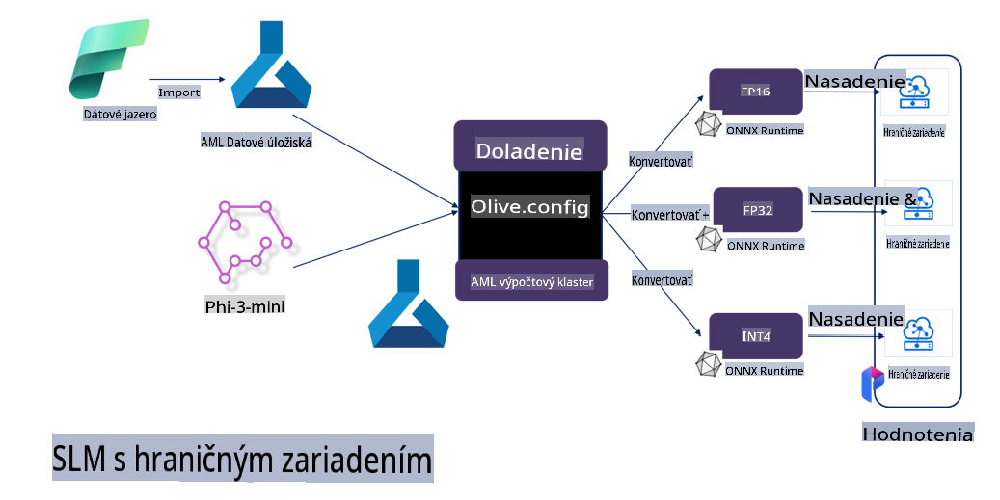

# **Doladenie Phi-3 s Microsoft Olive**

[Olive](https://github.com/microsoft/OLive?WT.mc_id=aiml-138114-kinfeylo) je jednoduchý nástroj na optimalizáciu modelov s ohľadom na hardvér, ktorý spája popredné techniky v oblasti kompresie, optimalizácie a kompilácie modelov.

Je navrhnutý tak, aby zjednodušil proces optimalizácie strojového učenia, čím zabezpečí maximálne efektívne využitie špecifických hardvérových architektúr.

Či už pracujete na aplikáciách v cloude alebo na zariadeniach na okraji siete, Olive vám umožní optimalizovať vaše modely jednoducho a efektívne.

## Kľúčové vlastnosti:
- Olive zhromažďuje a automatizuje optimalizačné techniky pre požadované hardvérové ciele.
- Neexistuje jedna univerzálna optimalizačná technika pre všetky scenáre, preto Olive umožňuje rozšíriteľnosť a zapojenie inovácií od odborníkov z odvetvia.

## Zníženie námahy pri vývoji:
- Vývojári často musia ovládať a používať rôzne nástroje špecifické pre hardvérových dodávateľov, aby pripravili a optimalizovali trénované modely na nasadenie.
- Olive tento proces zjednodušuje automatizáciou optimalizačných techník pre požadovaný hardvér.

## Pripravené riešenie pre komplexnú optimalizáciu:

Kombináciou a doladením integrovaných techník ponúka Olive jednotné riešenie pre komplexnú optimalizáciu.
Pri optimalizácii modelov zohľadňuje obmedzenia ako presnosť a latencia.

## Použitie Microsoft Olive na doladenie

Microsoft Olive je veľmi jednoduchý open-source nástroj na optimalizáciu modelov, ktorý pokrýva doladenie aj referencovanie v oblasti generatívnej umelej inteligencie. Vyžaduje len jednoduchú konfiguráciu, v kombinácii s použitím open-source jazykových modelov a príslušných runtime prostredí (AzureML / lokálne GPU, CPU, DirectML). Môžete automatickou optimalizáciou dokončiť doladenie alebo referencovanie modelu a nájsť najlepší model na nasadenie do cloudu alebo na okrajové zariadenia. Umožňuje podnikom vytvárať vlastné modely pre konkrétne odvetvia lokálne aj v cloude.


## Doladenie Phi-3 s Microsoft Olive 



## Ukážkový kód a príklad pre Phi-3 Olive
V tomto príklade použijete Olive na:

- Doladenie LoRA adaptéra na klasifikáciu fráz do kategórií Smútok, Radosť, Strach, Prekvapenie.
- Zlúčenie váh adaptéra do základného modelu.
- Optimalizáciu a kvantizáciu modelu na int4.

[Ukážkový kód](../../code/03.Finetuning/olive-ort-example/README.md)

### Inštalácia Microsoft Olive

Inštalácia Microsoft Olive je veľmi jednoduchá a môže byť vykonaná pre CPU, GPU, DirectML a Azure ML.

```bash
pip install olive-ai
```

Ak chcete spustiť ONNX model na CPU, môžete použiť

```bash
pip install olive-ai[cpu]
```

Ak chcete spustiť ONNX model na GPU, môžete použiť

```python
pip install olive-ai[gpu]
```

Ak chcete použiť Azure ML, použite

```python
pip install git+https://github.com/microsoft/Olive#egg=olive-ai[azureml]
```

**Poznámka**
Požiadavky na OS: Ubuntu 20.04 / 22.04 

### **Konfigurácia Config.json pre Microsoft Olive**

Po inštalácii môžete cez konfiguračný súbor nastavovať rôzne špecifické parametre modelu, vrátane údajov, výpočtov, trénovania, nasadenia a generovania modelu.

**1. Dáta**

Na Microsoft Olive je možné trénovať na lokálnych aj cloudových dátach, ktoré je možné nastaviť v konfigurácii.

*Konfigurácia lokálnych dát*

Jednoducho nastavíte dátový súbor, ktorý je potrebné doladiť, zvyčajne vo formáte json, a prispôsobíte ho šablóne dát. Toto je potrebné upraviť podľa požiadaviek modelu (napríklad prispôsobiť formátu požadovanému Microsoft Phi-3-mini. Ak máte iné modely, riaďte sa požadovanými formátmi doladenia pre tieto modely).

```json

    "data_configs": [
        {
            "name": "dataset_default_train",
            "type": "HuggingfaceContainer",
            "load_dataset_config": {
                "params": {
                    "data_name": "json", 
                    "data_files":"dataset/dataset-classification.json",
                    "split": "train"
                }
            },
            "pre_process_data_config": {
                "params": {
                    "dataset_type": "corpus",
                    "text_cols": [
                            "phrase",
                            "tone"
                    ],
                    "text_template": "### Text: {phrase}\n### The tone is:\n{tone}",
                    "corpus_strategy": "join",
                    "source_max_len": 2048,
                    "pad_to_max_len": false,
                    "use_attention_mask": false
                }
            }
        }
    ],
```

**Nastavenie cloudového zdroja dát**

Prepojením úložiska Azure AI Studio/Azure Machine Learning Service môžete zaviesť rôzne zdroje dát cez Microsoft Fabric a Azure Data ako podporu pre doladenie dát.

```json

    "data_configs": [
        {
            "name": "dataset_default_train",
            "type": "HuggingfaceContainer",
            "load_dataset_config": {
                "params": {
                    "data_name": "json", 
                    "data_files": {
                        "type": "azureml_datastore",
                        "config": {
                            "azureml_client": {
                                "subscription_id": "Your Azure Subscrition ID",
                                "resource_group": "Your Azure Resource Group",
                                "workspace_name": "Your Azure ML Workspaces name"
                            },
                            "datastore_name": "workspaceblobstore",
                            "relative_path": "Your train_data.json Azure ML Location"
                        }
                    },
                    "split": "train"
                }
            },
            "pre_process_data_config": {
                "params": {
                    "dataset_type": "corpus",
                    "text_cols": [
                            "Question",
                            "Best Answer"
                    ],
                    "text_template": "<|user|>\n{Question}<|end|>\n<|assistant|>\n{Best Answer}\n<|end|>",
                    "corpus_strategy": "join",
                    "source_max_len": 2048,
                    "pad_to_max_len": false,
                    "use_attention_mask": false
                }
            }
        }
    ],
    
```

**2. Konfigurácia výpočtov**

Ak potrebujete pracovať lokálne, môžete priamo využiť lokálne zdroje dát. Ak potrebujete využiť zdroje Azure AI Studio / Azure Machine Learning Service, musíte nastaviť príslušné parametre Azure, názov výpočtového výkonu atď.

```json

    "systems": {
        "aml": {
            "type": "AzureML",
            "config": {
                "accelerators": ["gpu"],
                "hf_token": true,
                "aml_compute": "Your Azure AI Studio / Azure Machine Learning Service Compute Name",
                "aml_docker_config": {
                    "base_image": "Your Azure AI Studio / Azure Machine Learning Service docker",
                    "conda_file_path": "conda.yaml"
                }
            }
        },
        "azure_arc": {
            "type": "AzureML",
            "config": {
                "accelerators": ["gpu"],
                "aml_compute": "Your Azure AI Studio / Azure Machine Learning Service Compute Name",
                "aml_docker_config": {
                    "base_image": "Your Azure AI Studio / Azure Machine Learning Service docker",
                    "conda_file_path": "conda.yaml"
                }
            }
        }
    },
```

***Poznámka***

Pretože sa vykonáva cez kontajner na Azure AI Studio/Azure Machine Learning Service, je potrebné nastaviť požadované prostredie. Toto sa nastavuje v conda.yaml prostredí.

```yaml

name: project_environment
channels:
  - defaults
dependencies:
  - python=3.8.13
  - pip=22.3.1
  - pip:
      - einops
      - accelerate
      - azure-keyvault-secrets
      - azure-identity
      - bitsandbytes
      - datasets
      - huggingface_hub
      - peft
      - scipy
      - sentencepiece
      - torch>=2.2.0
      - transformers
      - git+https://github.com/microsoft/Olive@jiapli/mlflow_loading_fix#egg=olive-ai[gpu]
      - --extra-index-url https://aiinfra.pkgs.visualstudio.com/PublicPackages/_packaging/ORT-Nightly/pypi/simple/ 
      - ort-nightly-gpu==1.18.0.dev20240307004
      - --extra-index-url https://aiinfra.pkgs.visualstudio.com/PublicPackages/_packaging/onnxruntime-genai/pypi/simple/
      - onnxruntime-genai-cuda

    

```

**3. Výber vášho SLM**

Môžete použiť model priamo z Hugging Face, alebo ho môžete kombinovať s Model Catalog v Azure AI Studio / Azure Machine Learning na výber modelu. V nižšie uvedenom príklade použijeme Microsoft Phi-3-mini.

Ak máte model lokálne, môžete použiť tento spôsob

```json

    "input_model":{
        "type": "PyTorchModel",
        "config": {
            "hf_config": {
                "model_name": "model-cache/microsoft/phi-3-mini",
                "task": "text-generation",
                "model_loading_args": {
                    "trust_remote_code": true
                }
            }
        }
    },
```

Ak chcete použiť model z Azure AI Studio / Azure Machine Learning Service, môžete použiť tento spôsob

```json

    "input_model":{
        "type": "PyTorchModel",
        "config": {
            "model_path": {
                "type": "azureml_registry_model",
                "config": {
                    "name": "microsoft/Phi-3-mini-4k-instruct",
                    "registry_name": "azureml-msr",
                    "version": "11"
                }
            },
             "model_file_format": "PyTorch.MLflow",
             "hf_config": {
                "model_name": "microsoft/Phi-3-mini-4k-instruct",
                "task": "text-generation",
                "from_pretrained_args": {
                    "trust_remote_code": true
                }
            }
        }
    },
```

**Poznámka:**
Je potrebné integrovať Azure AI Studio / Azure Machine Learning Service, takže pri nastavovaní modelu sa riaďte číslom verzie a príslušným pomenovaním.

Všetky modely na Azure musia byť nastavené na PyTorch.MLflow.

Musíte mať účet Hugging Face a priradiť kľúč ku Key value v Azure AI Studio / Azure Machine Learning.

**4. Algoritmus**

Microsoft Olive dobre zapuzdruje algoritmy Lora a QLora na doladenie. Stačí nastaviť niektoré príslušné parametre. Tu uvádzam QLora ako príklad.

```json
        "lora": {
            "type": "LoRA",
            "config": {
                "target_modules": [
                    "o_proj",
                    "qkv_proj"
                ],
                "double_quant": true,
                "lora_r": 64,
                "lora_alpha": 64,
                "lora_dropout": 0.1,
                "train_data_config": "dataset_default_train",
                "eval_dataset_size": 0.3,
                "training_args": {
                    "seed": 0,
                    "data_seed": 42,
                    "per_device_train_batch_size": 1,
                    "per_device_eval_batch_size": 1,
                    "gradient_accumulation_steps": 4,
                    "gradient_checkpointing": false,
                    "learning_rate": 0.0001,
                    "num_train_epochs": 3,
                    "max_steps": 10,
                    "logging_steps": 10,
                    "evaluation_strategy": "steps",
                    "eval_steps": 187,
                    "group_by_length": true,
                    "adam_beta2": 0.999,
                    "max_grad_norm": 0.3
                }
            }
        },
```

Ak chcete vykonať kvantizačnú konverziu, hlavná vetva Microsoft Olive už podporuje metódu onnxruntime-genai. Môžete ju nastaviť podľa svojich potrieb:

1. zlúčiť váhy adaptéra do základného modelu
2. previesť model na ONNX model s požadovanou presnosťou pomocou ModelBuilder

napríklad prevod na kvantizovaný INT4

```json

        "merge_adapter_weights": {
            "type": "MergeAdapterWeights"
        },
        "builder": {
            "type": "ModelBuilder",
            "config": {
                "precision": "int4"
            }
        }
```

**Poznámka** 
- Ak používate QLoRA, kvantizačná konverzia cez ONNXRuntime-genai zatiaľ nie je podporovaná.

- Je potrebné zdôrazniť, že vyššie uvedené kroky môžete nastaviť podľa svojich potrieb. Nie je nutné kompletne nastavovať všetky kroky. Podľa svojich potrieb môžete použiť len algoritmické kroky bez doladenia. Nakoniec je potrebné nastaviť príslušné enginy.

```json

    "engine": {
        "log_severity_level": 0,
        "host": "aml",
        "target": "aml",
        "search_strategy": false,
        "execution_providers": ["CUDAExecutionProvider"],
        "cache_dir": "../model-cache/models/phi3-finetuned/cache",
        "output_dir" : "../model-cache/models/phi3-finetuned"
    }
```

**5. Dokončenie doladenia**

Na príkazovom riadku vykonajte v adresári olive-config.json

```bash
olive run --config olive-config.json  
```

**Upozornenie**:  
Tento dokument bol preložený pomocou strojových prekladových služieb založených na umelej inteligencii. Hoci sa snažíme o presnosť, upozorňujeme, že automatické preklady môžu obsahovať chyby alebo nepresnosti. Pôvodný dokument v jeho rodnom jazyku by mal byť považovaný za autoritatívny zdroj. Pre kritické informácie sa odporúča profesionálny preklad od človeka. Nezodpovedáme za akékoľvek nedorozumenia alebo nesprávne interpretácie vyplývajúce z použitia tohto prekladu.