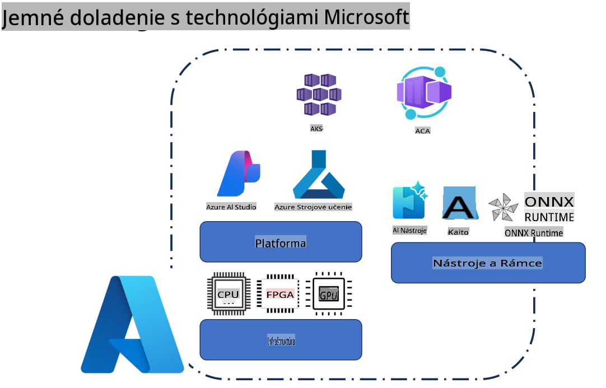
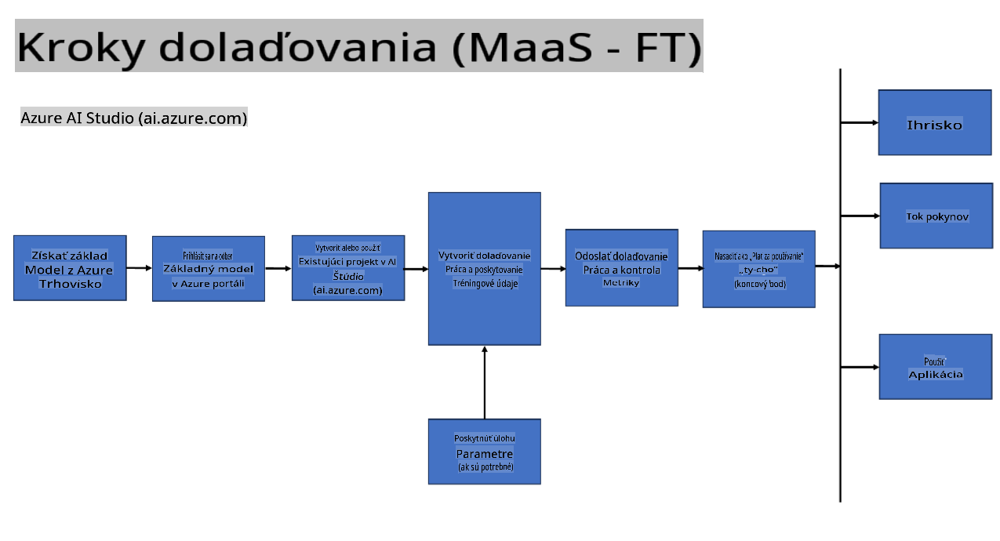
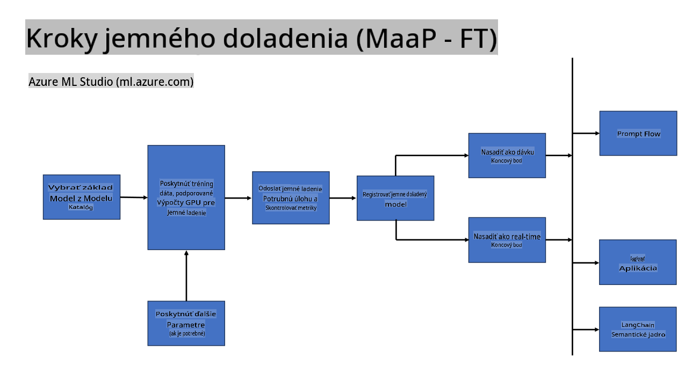
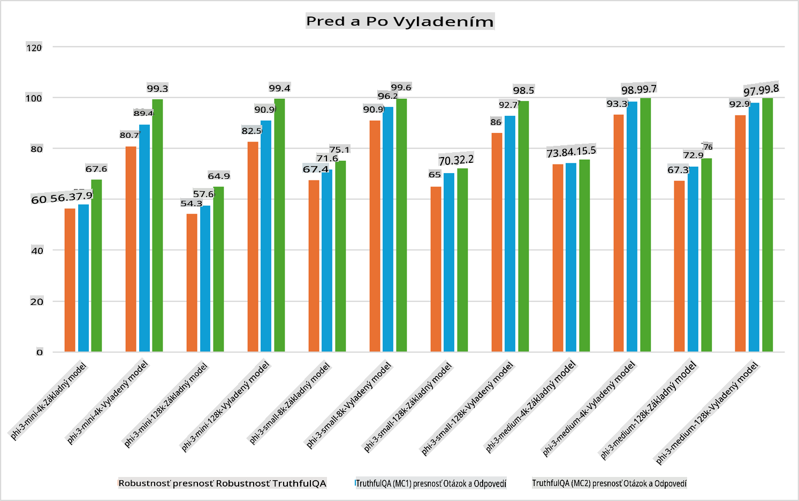

## Scenáre jemného doladenia

**Platforma** Zahrňuje rôzne technológie ako Azure AI Foundry, Azure Machine Learning, AI Tools, Kaito a ONNX Runtime. 

**Infraštruktúra** Obsahuje CPU a FPGA, ktoré sú kľúčové pre proces jemného doladenia. Ukážem vám ikony pre každú z týchto technológií.

**Nástroje a rámce** Zahŕňajú ONNX Runtime a ONNX Runtime. Ukážem vám ikony pre každú z týchto technológií.
[Pridať ikony pre ONNX Runtime a ONNX Runtime]

Proces jemného doladenia s technológiami Microsoft zahŕňa rôzne komponenty a nástroje. Porozumením a využívaním týchto technológií môžeme efektívne jemne doladiť naše aplikácie a vytvárať lepšie riešenia. 

## Model ako služba

Jemne doladíte model pomocou hostovaného jemného doladenia bez potreby vytvárať a spravovať výpočtové zdroje.

Serverless jemné doladenie je dostupné pre modely Phi-3-mini a Phi-3-medium, čo vývojárom umožňuje rýchlo a jednoducho prispôsobiť modely pre cloudové a edge scenáre bez potreby zabezpečenia výpočtových zdrojov. Oznámili sme tiež, že model Phi-3-small je teraz dostupný prostredníctvom našej ponuky Models-as-a-Service, čo vývojárom umožňuje rýchly a jednoduchý začiatok s vývojom AI bez nutnosti spravovať podkladovú infraštruktúru.

## Model ako platforma

Používatelia si spravujú vlastné výpočtové zdroje na jemné doladenie svojich modelov.

[Príklad jemného doladenia](https://github.com/Azure/azureml-examples/blob/main/sdk/python/foundation-models/system/finetune/chat-completion/chat-completion.ipynb)

## Scenáre jemného doladenia 

| | | | | | | |
|-|-|-|-|-|-|-|
|Scenár|LoRA|QLoRA|PEFT|DeepSpeed|ZeRO|DORA|
|Prispôsobenie predtrénovaných LLM pre špecifické úlohy alebo domény|Áno|Áno|Áno|Áno|Áno|Áno|
|Jemné doladenie pre NLP úlohy, ako je klasifikácia textu, rozpoznávanie pomenovaných entít a strojový preklad|Áno|Áno|Áno|Áno|Áno|Áno|
|Jemné doladenie pre úlohy otázok a odpovedí|Áno|Áno|Áno|Áno|Áno|Áno|
|Jemné doladenie na generovanie odpovedí podobných ľuďom v chatbotov|Áno|Áno|Áno|Áno|Áno|Áno|
|Jemné doladenie na generovanie hudby, umenia alebo iných foriem kreativity|Áno|Áno|Áno|Áno|Áno|Áno|
|Znižovanie výpočtových a finančných nákladov|Áno|Áno|Nie|Áno|Áno|Nie|
|Znižovanie pamäťovej náročnosti|Nie|Áno|Nie|Áno|Áno|Áno|
|Použitie menšieho počtu parametrov na efektívne jemné doladenie|Nie|Áno|Áno|Nie|Nie|Áno|
|Pamäťovo efektívna forma dátovej paralelizácie, ktorá umožňuje prístup k agregovanej GPU pamäti všetkých dostupných GPU zariadení|Nie|Nie|Nie|Áno|Áno|Áno|

## Príklady výkonu jemného doladenia

**Upozornenie**:  
Tento dokument bol preložený pomocou strojových prekladových služieb AI. Aj keď sa snažíme o presnosť, prosím, berte na vedomie, že automatizované preklady môžu obsahovať chyby alebo nepresnosti. Pôvodný dokument v jeho pôvodnom jazyku by mal byť považovaný za záväzný zdroj. Pre kritické informácie sa odporúča profesionálny ľudský preklad. Nezodpovedáme za žiadne nedorozumenia alebo nesprávne interpretácie vyplývajúce z použitia tohto prekladu.