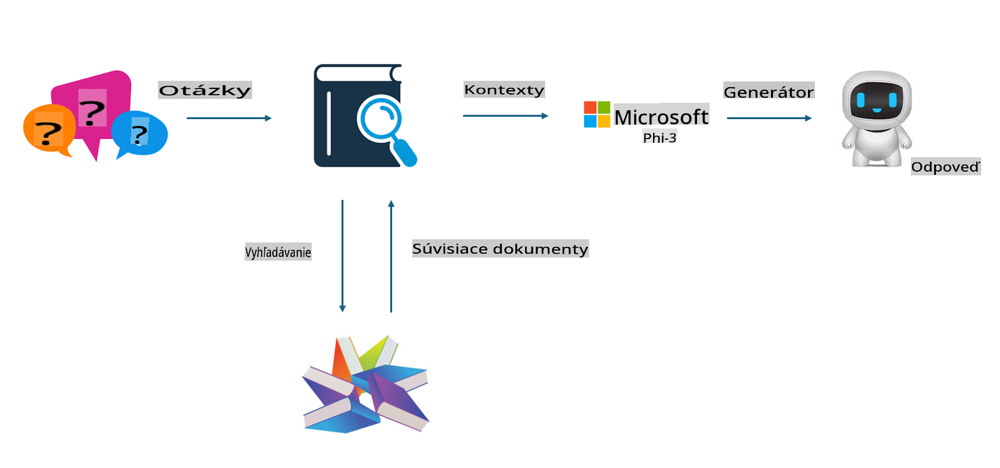

## Doladenie vs RAG

## Retrieval Augmented Generation

RAG je kombináciou získavania dát a generovania textu. Štruktúrované a neštruktúrované dáta podniku sú uložené vo vektorovej databáze. Pri vyhľadávaní relevantného obsahu sa nájdu príslušné zhrnutia a obsah, ktoré tvoria kontext, a v kombinácii so schopnosťou dokončovania textu modelov LLM/SLM sa generuje obsah.

## Proces RAG

## Doladenie
Doladenie je založené na zlepšení konkrétneho modelu. Nie je potrebné začínať od algoritmu modelu, ale je potrebné neustále zhromažďovať dáta. Ak chcete presnejšiu terminológiu a jazykové vyjadrenie v priemyselných aplikáciách, doladenie je lepšou voľbou. Ak sa však vaše dáta často menia, doladenie môže byť komplikované.

## Ako si vybrať
Ak naša odpoveď vyžaduje zavedenie externých dát, RAG je najlepšia voľba.

Ak potrebujete poskytovať stabilné a presné znalosti z konkrétneho odvetvia, doladenie bude dobrou voľbou. RAG uprednostňuje získavanie relevantného obsahu, ale nemusí vždy zachytiť špecializované nuansy.

Doladenie vyžaduje vysoko kvalitnú dátovú sadu, a ak ide len o malý rozsah dát, nebude to mať veľký význam. RAG je flexibilnejší.  
Doladenie je ako čierna skrinka, metafyzika, a je ťažké pochopiť jeho vnútorný mechanizmus. RAG však umožňuje jednoduchšie nájsť zdroj dát, čím účinne upravuje halucinácie alebo chyby v obsahu a poskytuje lepšiu transparentnosť.

**Upozornenie**:  
Tento dokument bol preložený pomocou strojových AI prekladateľských služieb. Aj keď sa snažíme o presnosť, upozorňujeme, že automatické preklady môžu obsahovať chyby alebo nepresnosti. Pôvodný dokument v jeho pôvodnom jazyku by mal byť považovaný za autoritatívny zdroj. Pre kritické informácie sa odporúča profesionálny ľudský preklad. Nezodpovedáme za žiadne nedorozumenia alebo nesprávne interpretácie vyplývajúce z použitia tohto prekladu.