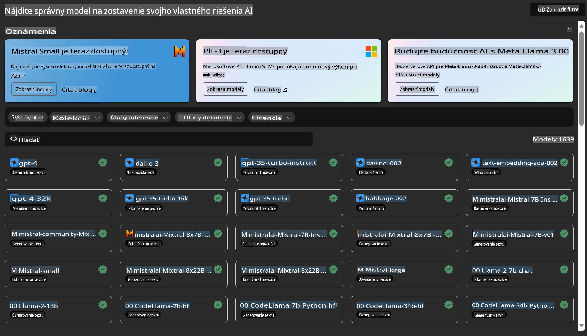

# **Predstavujeme Azure Machine Learning Service**

[Azure Machine Learning](https://ml.azure.com?WT.mc_id=aiml-138114-kinfeylo) je cloudová služba na urýchlenie a správu životného cyklu projektov strojového učenia (ML).

Profesionáli v oblasti ML, dátoví vedci a inžinieri ju môžu používať vo svojich každodenných pracovných postupoch na:

- Trénovanie a nasadzovanie modelov.
- Správu operácií strojového učenia (MLOps).
- Môžete vytvoriť model v Azure Machine Learning alebo použiť model vytvorený na open-source platformách, ako sú PyTorch, TensorFlow alebo scikit-learn.
- Nástroje MLOps vám pomôžu monitorovať, znovu trénovať a znovu nasadzovať modely.

## Pre koho je Azure Machine Learning určený?

**Dátoví vedci a ML inžinieri**

Môžu používať nástroje na zrýchlenie a automatizáciu svojich každodenných pracovných postupov.  
Azure ML poskytuje funkcie pre spravodlivosť, vysvetliteľnosť, sledovanie a auditovateľnosť.

**Vývojári aplikácií**

Môžu bezproblémovo integrovať modely do aplikácií alebo služieb.

**Platformoví vývojári**

Majú prístup k robustnej sade nástrojov podporovaných odolnými API služby Azure Resource Manager.  
Tieto nástroje umožňujú vytvárať pokročilé nástroje pre strojové učenie.

**Podniky**

Pri práci v cloude Microsoft Azure majú podniky výhodu známej bezpečnosti a riadenia prístupu na základe rolí.  
Môžu nastaviť projekty na kontrolu prístupu k chráneným údajom a špecifickým operáciám.

## Produktivita pre celý tím
ML projekty často vyžadujú tím s rôznorodými zručnosťami na ich vytváranie a údržbu.

Azure ML poskytuje nástroje, ktoré vám umožnia:
- Spolupracovať s tímom prostredníctvom zdieľaných poznámkových blokov, výpočtových zdrojov, serverless výpočtov, údajov a prostredí.
- Vyvíjať modely so spravodlivosťou, vysvetliteľnosťou, sledovaním a auditovateľnosťou na splnenie požiadaviek na rodokmeň a audit.
- Rýchlo a jednoducho nasadzovať ML modely v rozsahu a efektívne ich spravovať a riadiť pomocou MLOps.
- Spúšťať úlohy strojového učenia kdekoľvek so zabudovaným riadením, bezpečnosťou a dodržiavaním predpisov.

## Nástroje kompatibilné s rôznymi platformami

Každý člen ML tímu môže použiť svoje preferované nástroje na vykonanie svojej práce.  
Či už spúšťate rýchle experimenty, dolaďujete hyperparametre, vytvárate pipeline alebo spravujete inferencie, môžete použiť známe rozhrania vrátane:
- Azure Machine Learning Studio
- Python SDK (v2)
- Azure CLI (v2)
- REST API služby Azure Resource Manager

Keď zdokonaľujete modely a spolupracujete počas celého vývojového cyklu, môžete zdieľať a vyhľadávať aktíva, zdroje a metriky v používateľskom rozhraní Azure Machine Learning Studio.

## **LLM/SLM v Azure ML**

Azure ML pridalo mnoho funkcií súvisiacich s LLM/SLM, kombinujúc LLMOps a SLMOps na vytvorenie podnikového technologického platformy generatívnej umelej inteligencie.

### **Katalóg modelov**

Podnikoví používatelia môžu nasadzovať rôzne modely podľa rôznych obchodných scenárov prostredníctvom Katalógu modelov a poskytovať služby ako Model as Service pre podnikových vývojárov alebo používateľov.

Katalóg modelov v Azure Machine Learning Studio je centrum na objavovanie a používanie širokej škály modelov, ktoré umožňujú budovať aplikácie s generatívnou AI. Katalóg modelov obsahuje stovky modelov od poskytovateľov, ako sú Azure OpenAI Service, Mistral, Meta, Cohere, Nvidia, Hugging Face, vrátane modelov trénovaných spoločnosťou Microsoft. Modely od iných poskytovateľov ako Microsoft sú definované ako produkty tretích strán v podmienkach produktov spoločnosti Microsoft a podliehajú podmienkam poskytovaným s modelom.

### **Job Pipeline**

Jadro pipeline strojového učenia spočíva v rozdelení kompletnej úlohy strojového učenia na viacstupňový pracovný tok. Každý krok je zvládnuteľná komponenta, ktorú je možné individuálne vyvíjať, optimalizovať, konfigurovať a automatizovať. Kroky sú prepojené prostredníctvom dobre definovaných rozhraní. Služba pipeline v Azure Machine Learning automaticky koordinuje všetky závislosti medzi krokmi pipeline.

Pri dolaďovaní SLM / LLM môžeme spravovať naše údaje, tréning a procesy generovania prostredníctvom Pipeline.

### **Prompt flow**

Výhody používania Azure Machine Learning prompt flow  
Azure Machine Learning prompt flow ponúka množstvo výhod, ktoré pomáhajú používateľom prejsť od nápadu cez experimentovanie až po produkčne pripravené aplikácie založené na LLM:

**Agilita pri navrhovaní promptov**

Interaktívne autorské prostredie: Azure Machine Learning prompt flow poskytuje vizuálnu reprezentáciu štruktúry flowu, ktorá používateľom umožňuje ľahko pochopiť a navigovať svoje projekty. Ponúka tiež kódovacie prostredie podobné poznámkovým blokom na efektívny vývoj a ladenie flowu.  
Varianty pre ladenie promptov: Používatelia môžu vytvárať a porovnávať viacero variantov promptov, čo uľahčuje iteratívny proces zdokonaľovania.

Hodnotenie: Zabudované hodnotiace flowy umožňujú používateľom posúdiť kvalitu a účinnosť ich promptov a flowov.

Komplexné zdroje: Azure Machine Learning prompt flow obsahuje knižnicu zabudovaných nástrojov, ukážok a šablón, ktoré slúžia ako východiskový bod pre vývoj, inšpirujú kreativitu a urýchľujú proces.

**Pripravenosť na podnikové aplikácie založené na LLM**

Spolupráca: Azure Machine Learning prompt flow podporuje tímovú spoluprácu, umožňuje viacerým používateľom spolupracovať na projektoch návrhu promptov, zdieľať vedomosti a udržiavať kontrolu verzií.

Všetko na jednej platforme: Azure Machine Learning prompt flow zjednodušuje celý proces návrhu promptov, od vývoja a hodnotenia až po nasadenie a monitorovanie. Používatelia môžu svoje flowy jednoducho nasadiť ako endpointy Azure Machine Learning a monitorovať ich výkon v reálnom čase, čím zabezpečia optimálnu prevádzku a neustále zlepšovanie.

Riešenia podnikovej pripravenosti Azure Machine Learning: Prompt flow využíva robustné riešenia podnikovej pripravenosti Azure Machine Learning, poskytujúc bezpečný, škálovateľný a spoľahlivý základ pre vývoj, experimentovanie a nasadenie flowov.

S Azure Machine Learning prompt flow môžu používatelia uvoľniť svoju agilitu pri navrhovaní promptov, efektívne spolupracovať a využiť podnikové riešenia na úspešný vývoj a nasadenie aplikácií založených na LLM.

Kombináciou výpočtového výkonu, údajov a rôznych komponentov Azure ML môžu podnikoví vývojári jednoducho vytvárať vlastné aplikácie umelej inteligencie.

**Upozornenie**:  
Tento dokument bol preložený pomocou strojových AI prekladových služieb. Aj keď sa snažíme o presnosť, prosím, berte na vedomie, že automatizované preklady môžu obsahovať chyby alebo nepresnosti. Pôvodný dokument v jeho pôvodnom jazyku by mal byť považovaný za autoritatívny zdroj. Pre kritické informácie sa odporúča profesionálny ľudský preklad. Nenesieme zodpovednosť za akékoľvek nedorozumenia alebo nesprávne interpretácie vyplývajúce z použitia tohto prekladu.