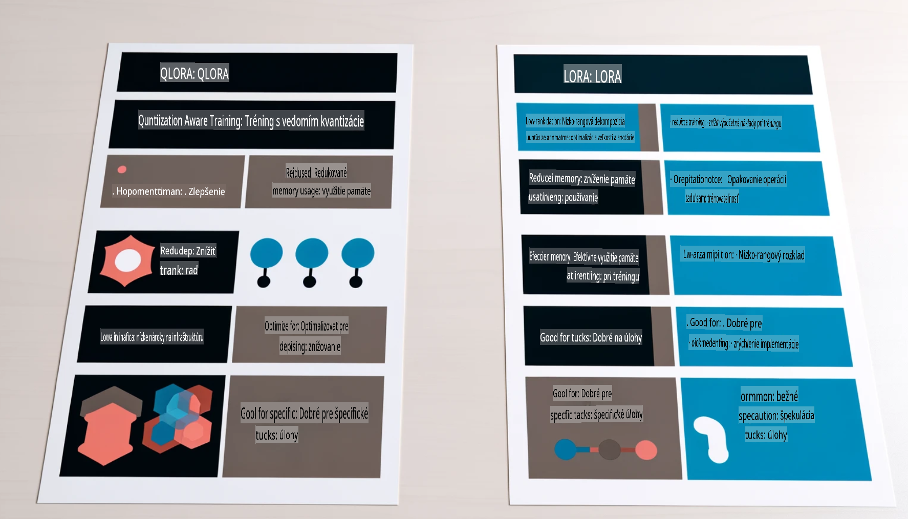

# **Nechajte Phi-3 stať sa odborníkom v odvetví**

Aby ste mohli model Phi-3 použiť v konkrétnom odvetví, je potrebné pridať do modelu Phi-3 dáta z podnikovej sféry. Máme dve rôzne možnosti: prvou je RAG (Retrieval Augmented Generation) a druhou je Fine-Tuning.

## **RAG vs Fine-Tuning**

### **Retrieval Augmented Generation**

RAG kombinuje vyhľadávanie dát a generovanie textu. Štruktúrované a neštruktúrované dáta podniku sú uložené vo vektorovej databáze. Pri hľadaní relevantného obsahu sa nájde príslušné zhrnutie a obsah, ktoré vytvoria kontext, a následne sa využije schopnosť dopĺňania textu modelmi LLM/SLM na generovanie obsahu.

### **Fine-tuning**

Fine-tuning je založený na úprave existujúceho modelu. Nie je potrebné začínať od algoritmu modelu, ale je potrebné neustále zhromažďovať dáta. Ak potrebujete presnejšiu terminológiu a jazykový prejav v aplikáciách pre konkrétne odvetvia, fine-tuning je lepšou voľbou. Ak sa však vaše dáta často menia, fine-tuning môže byť komplikovaný.

### **Ako si vybrať**

1. Ak naša odpoveď vyžaduje použitie externých dát, RAG je najlepšia voľba.

2. Ak potrebujete stabilné a presné znalosti pre konkrétne odvetvie, fine-tuning bude dobrou voľbou. RAG síce uprednostňuje vyhľadanie relevantného obsahu, ale nemusí vždy zachytiť špecifické detaily.

3. Fine-tuning vyžaduje vysokokvalitný dataset. Ak však ide len o malé množstvo dát, rozdiel nebude veľký. RAG je flexibilnejší.

4. Fine-tuning je ako "čierna skrinka", jeho vnútorný mechanizmus je ťažko pochopiteľný. Na druhej strane, RAG umožňuje jednoduchšie sledovanie zdrojov dát, čím efektívne upravuje nesprávne informácie alebo chyby v obsahu a zlepšuje transparentnosť.

### **Scenáre**

1. Vertikálne odvetvia vyžadujúce špecifickú odbornú terminológiu a výrazy - ***Fine-tuning*** je najlepšia voľba.

2. Systém otázok a odpovedí, ktorý zahŕňa syntézu rôznych poznatkov - ***RAG*** je najlepšia voľba.

3. Kombinácia automatizovaných podnikových procesov - ***RAG + Fine-tuning*** je najlepšia voľba.

## **Ako používať RAG**

Vektorová databáza je zbierka dát uložených v matematickej forme. Vektorové databázy uľahčujú modelom strojového učenia zapamätanie si predchádzajúcich vstupov, čo umožňuje využitie strojového učenia na podporu prípadov použitia, ako je vyhľadávanie, odporúčania a generovanie textu. Dáta môžu byť identifikované na základe metrík podobnosti namiesto presných zhôd, čo umožňuje modelom pochopiť kontext dát.

Vektorová databáza je kľúčom k realizácii RAG. Dáta môžeme previesť na vektorové úložisko pomocou vektorových modelov, ako sú text-embedding-3, jina-ai-embedding, atď.

Viac o vytváraní aplikácie RAG sa dozviete na [https://github.com/microsoft/Phi-3CookBook](https://github.com/microsoft/Phi-3CookBook?WT.mc_id=aiml-138114-kinfeylo) 

## **Ako používať Fine-tuning**

Bežne používané algoritmy pri Fine-tuningu sú Lora a QLora. Ako si vybrať?
- [Viac sa dozviete v tomto ukážkovom notebooku](../../../../code/04.Finetuning/Phi_3_Inference_Finetuning.ipynb)
- [Príklad Python FineTuning ukážky](../../../../code/04.Finetuning/FineTrainingScript.py)

### **Lora a QLora**

LoRA (Low-Rank Adaptation) a QLoRA (Quantized Low-Rank Adaptation) sú techniky používané na doladenie veľkých jazykových modelov (LLMs) pomocou Parameter Efficient Fine Tuning (PEFT). PEFT techniky sú navrhnuté tak, aby umožnili efektívnejší tréning modelov než tradičné metódy.  
LoRA je samostatná technika doladenia, ktorá znižuje pamäťovú náročnosť použitím nízkorozmernej aproximácie matice aktualizácie váh. Ponúka rýchle časy tréningu a zachováva výkon blízky tradičným metódam doladenia.

QLoRA je rozšírená verzia LoRA, ktorá zahŕňa kvantizačné techniky na ďalšie zníženie pamäťovej náročnosti. QLoRA kvantizuje presnosť váhových parametrov v predtrénovanom LLM na 4-bitovú presnosť, čo je pamäťovo efektívnejšie ako LoRA. Avšak tréning s QLoRA je približne o 30 % pomalší než tréning s LoRA kvôli dodatočným krokom kvantizácie a dekvantizácie.

QLoRA používa LoRA ako doplnok na opravu chýb spôsobených kvantizáciou. QLoRA umožňuje doladenie masívnych modelov s miliardami parametrov na relatívne malých a ľahko dostupných GPU. Napríklad, QLoRA dokáže doladiť model s 70 miliardami parametrov, ktorý bežne vyžaduje 36 GPU, len s 2 GPU.

**Upozornenie**:  
Tento dokument bol preložený pomocou strojových prekladových služieb AI. Hoci sa snažíme o presnosť, prosím, vezmite na vedomie, že automatizované preklady môžu obsahovať chyby alebo nepresnosti. Pôvodný dokument v jeho pôvodnom jazyku by mal byť považovaný za autoritatívny zdroj. Pre kritické informácie sa odporúča profesionálny ľudský preklad. Nezodpovedáme za akékoľvek nedorozumenia alebo nesprávne interpretácie vyplývajúce z použitia tohto prekladu.