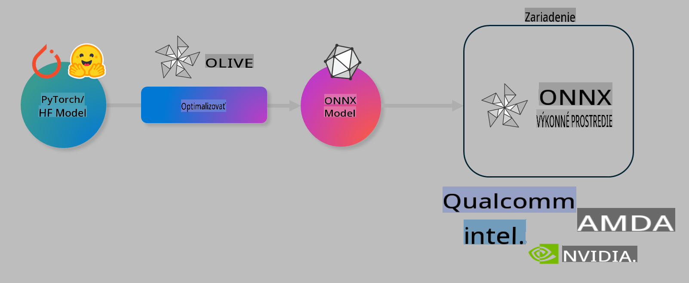

# Lab. Optimalizácia AI modelov pre inferenciu na zariadení

## Úvod

> [!IMPORTANT]
> Tento lab vyžaduje **Nvidia A10 alebo A100 GPU** s nainštalovanými príslušnými ovládačmi a CUDA toolkitom (verzia 12+).

> [!NOTE]
> Tento lab trvá **35 minút** a poskytne vám praktický úvod do základných konceptov optimalizácie modelov pre inferenciu na zariadení pomocou OLIVE.

## Ciele učenia

Na konci tohto labu budete schopní používať OLIVE na:

- Kvantizáciu AI modelu pomocou metódy AWQ.
- Doladenie AI modelu pre špecifickú úlohu.
- Generovanie LoRA adaptérov (doladeného modelu) pre efektívnu inferenciu na zariadení pomocou ONNX Runtime.

### Čo je Olive

Olive (*O*NNX *live*) je nástroj na optimalizáciu modelov s pripojeným CLI, ktorý umožňuje nasadzovať modely pre ONNX runtime +++https://onnxruntime.ai+++ s vysokou kvalitou a výkonom.



Vstupom pre Olive je zvyčajne model PyTorch alebo Hugging Face a výstupom je optimalizovaný ONNX model, ktorý je spustený na zariadení (cieľ nasadenia) s ONNX runtime. Olive optimalizuje model pre AI akcelerátor (NPU, GPU, CPU) cieľového zariadenia, ktorý poskytuje hardvérový dodávateľ ako Qualcomm, AMD, Nvidia alebo Intel.

Olive vykonáva *workflow*, čo je usporiadaná sekvencia jednotlivých úloh optimalizácie modelu nazývaných *passes* - príkladmi sú: kompresia modelu, zachytenie grafu, kvantizácia, optimalizácia grafu. Každý *pass* má sadu parametrov, ktoré je možné doladiť na dosiahnutie najlepších metrík, napríklad presnosti a latencie, ktoré sú hodnotené príslušným evaluátorom. Olive využíva vyhľadávaciu stratégiu, ktorá používa algoritmus na automatické ladenie jednotlivých alebo viacerých *passes* naraz.

#### Výhody Olive

- **Zníženie frustrácie a času** potrebného na manuálne experimentovanie s rôznymi technikami optimalizácie grafov, kompresie a kvantizácie. Definujte svoje požiadavky na kvalitu a výkon a nechajte Olive automaticky nájsť najlepší model pre vás.
- **40+ vstavaných komponentov na optimalizáciu modelov**, ktoré pokrývajú najnovšie techniky v oblasti kvantizácie, kompresie, optimalizácie grafov a doladenia.
- **Jednoduché CLI** pre bežné úlohy optimalizácie modelov. Napríklad: olive quantize, olive auto-opt, olive finetune.
- Zabudované balenie a nasadzovanie modelov.
- Podpora generovania modelov pre **Multi LoRA serving**.
- Vytváranie workflowov pomocou YAML/JSON na orchestráciu úloh optimalizácie a nasadzovania modelov.
- Integrácia s **Hugging Face** a **Azure AI**.
- Zabudovaný **caching** mechanizmus na **šetrenie nákladov**.

## Inštrukcie k labu
> [!NOTE]
> Uistite sa, že ste si nastavili Azure AI Hub a Projekt a nakonfigurovali A100 výpočtový uzol podľa Labu 1.

### Krok 0: Pripojenie k Azure AI Compute

Pripojíte sa k Azure AI Compute pomocou vzdialenej funkcie v **VS Code.** 

1. Otvorte svoju **VS Code** desktopovú aplikáciu:
1. Otvorte **príkazovú paletu** pomocou **Shift+Ctrl+P**.
1. V príkazovej palete vyhľadajte **AzureML - remote: Connect to compute instance in New Window**.
1. Postupujte podľa pokynov na obrazovke na pripojenie k Compute. To zahŕňa výber vášho Azure Subscription, Resource Group, Projektu a názvu Compute, ktoré ste nastavili v Labe 1.
1. Po pripojení k vášmu Azure ML Compute uzlu sa toto pripojenie zobrazí v **ľavom dolnom rohu Visual Code** `><Azure ML: Compute Name`.

### Krok 1: Klonovanie tohto repozitára

Vo VS Code môžete otvoriť nový terminál pomocou **Ctrl+J** a klonovať tento repozitár:

V termináli by ste mali vidieť výzvu:

```
azureuser@computername:~/cloudfiles/code$ 
```
Klonujte riešenie:

```bash
cd ~/localfiles
git clone https://github.com/microsoft/phi-3cookbook.git
```

### Krok 2: Otvorenie priečinka vo VS Code

Na otvorenie VS Code v príslušnom priečinku vykonajte v termináli nasledujúci príkaz, ktorý otvorí nové okno:

```bash
code phi-3cookbook/code/04.Finetuning/Olive-lab
```

Prípadne môžete priečinok otvoriť výberom **File** > **Open Folder**.

### Krok 3: Závislosti

Otvorte terminálové okno vo VS Code na vašom Azure AI Compute Instance (tip: **Ctrl+J**) a vykonajte nasledujúce príkazy na inštaláciu závislostí:

```bash
conda create -n olive-ai python=3.11 -y
conda activate olive-ai
pip install -r requirements.txt
az extension remove -n azure-cli-ml
az extension add -n ml
```

> [!NOTE]
> Inštalácia všetkých závislostí bude trvať približne 5 minút.

V tomto labe budete sťahovať a nahrávať modely do katalógu modelov Azure AI. Aby ste mali prístup ku katalógu modelov, budete sa musieť prihlásiť do Azure pomocou:

```bash
az login
```

> [!NOTE]
> Pri prihlásení budete vyzvaní vybrať si svoje predplatné. Uistite sa, že vyberiete predplatné pridelené pre tento lab.

### Krok 4: Spustenie príkazov Olive

Otvorte terminálové okno vo VS Code na vašom Azure AI Compute Instance (tip: **Ctrl+J**) a uistite sa, že je aktivované prostredie `olive-ai` conda:

```bash
conda activate olive-ai
```

Potom vykonajte nasledujúce príkazy Olive v príkazovom riadku.

1. **Skontrolujte dáta:** V tomto príklade budete doladiť model Phi-3.5-Mini tak, aby sa špecializoval na odpovede na otázky týkajúce sa cestovania. Kód nižšie zobrazí prvé záznamy datasetu vo formáte JSON lines:

    ```bash
    head data/data_sample_travel.jsonl
    ```
1. **Kvantizácia modelu:** Pred trénovaním modelu ho najskôr kvantizujte pomocou nasledujúceho príkazu, ktorý využíva techniku Active Aware Quantization (AWQ) +++https://arxiv.org/abs/2306.00978+++. AWQ kvantizuje váhy modelu s ohľadom na aktivácie generované počas inferencie. To znamená, že proces kvantizácie berie do úvahy skutočné rozloženie dát v aktiváciách, čo vedie k lepšiemu zachovaniu presnosti modelu v porovnaní s tradičnými metódami kvantizácie váh.

    ```bash
    olive quantize \
       --model_name_or_path microsoft/Phi-3.5-mini-instruct \
       --trust_remote_code \
       --algorithm awq \
       --output_path models/phi/awq \
       --log_level 1
    ```
    
    Kvantizácia AWQ trvá **približne 8 minút** a zmenší veľkosť modelu z **približne 7,5 GB na približne 2,5 GB**.

   V tomto labe vám ukážeme, ako importovať modely z Hugging Face (napríklad: `microsoft/Phi-3.5-mini-instruct`). However, Olive also allows you to input models from the Azure AI catalog by updating the `model_name_or_path` argument to an Azure AI asset ID (for example:  `azureml://registries/azureml/models/Phi-3.5-mini-instruct/versions/4`). 

1. **Train the model:** Next, the `olive finetune` príkaz doladí kvantizovaný model. Kvantizácia modelu *pred* doladením namiesto po doladení poskytuje lepšiu presnosť, pretože proces doladenia obnoví časť strát spôsobených kvantizáciou.

    ```bash
    olive finetune \
        --method lora \
        --model_name_or_path models/phi/awq \
        --data_files "data/data_sample_travel.jsonl" \
        --data_name "json" \
        --text_template "<|user|>\n{prompt}<|end|>\n<|assistant|>\n{response}<|end|>" \
        --max_steps 100 \
        --output_path ./models/phi/ft \
        --log_level 1
    ```
    
    Doladenie (so 100 krokmi) trvá **približne 6 minút**.

1. **Optimalizácia:** S doladeným modelom teraz optimalizujte model pomocou príkazu Olive `auto-opt` command, which will capture the ONNX graph and automatically perform a number of optimizations to improve the model performance for CPU by compressing the model and doing fusions. It should be noted, that you can also optimize for other devices such as NPU or GPU by just updating the `--device` and `--provider` - pre účely tohto labu použijeme CPU.

    ```bash
    olive auto-opt \
       --model_name_or_path models/phi/ft/model \
       --adapter_path models/phi/ft/adapter \
       --device cpu \
       --provider CPUExecutionProvider \
       --use_ort_genai \
       --output_path models/phi/onnx-ao \
       --log_level 1
    ```
    
    Optimalizácia trvá **približne 5 minút**.

### Krok 5: Rýchly test inferencie modelu

Na otestovanie inferencie modelu vytvorte Python súbor vo vašom priečinku s názvom **app.py** a skopírujte a vložte nasledujúci kód:

```python
import onnxruntime_genai as og
import numpy as np

print("loading model and adapters...", end="", flush=True)
model = og.Model("models/phi/onnx-ao/model")
adapters = og.Adapters(model)
adapters.load("models/phi/onnx-ao/model/adapter_weights.onnx_adapter", "travel")
print("DONE!")

tokenizer = og.Tokenizer(model)
tokenizer_stream = tokenizer.create_stream()

params = og.GeneratorParams(model)
params.set_search_options(max_length=100, past_present_share_buffer=False)
user_input = "what is the best thing to see in chicago"
params.input_ids = tokenizer.encode(f"<|user|>\n{user_input}<|end|>\n<|assistant|>\n")

generator = og.Generator(model, params)

generator.set_active_adapter(adapters, "travel")

print(f"{user_input}")

while not generator.is_done():
    generator.compute_logits()
    generator.generate_next_token()

    new_token = generator.get_next_tokens()[0]
    print(tokenizer_stream.decode(new_token), end='', flush=True)

print("\n")
```

Spustite kód pomocou:

```bash
python app.py
```

### Krok 6: Nahranie modelu do Azure AI

Nahraním modelu do repozitára modelov Azure AI sa model stáva zdieľateľným s ostatnými členmi vášho vývojového tímu a zároveň sa zabezpečuje verzovanie modelu. Na nahranie modelu spustite nasledujúci príkaz:

> [!NOTE]
> Aktualizujte `{}` placeholders with the name of your resource group and Azure AI Project Name. 

To find your resource group `"resourceGroup" a názov projektu Azure AI a spustite nasledujúci príkaz.

```
az ml workspace show
```

Alebo navštívte +++ai.azure.com+++ a vyberte **management center**, **project**, **overview**.

Aktualizujte zástupné symboly `{}` názvom vašej resource group a názvom projektu Azure AI.

```bash
az ml model create \
    --name ft-for-travel \
    --version 1 \
    --path ./models/phi/onnx-ao \
    --resource-group {RESOURCE_GROUP_NAME} \
    --workspace-name {PROJECT_NAME}
```
Potom môžete vidieť svoj nahraný model a nasadiť ho na https://ml.azure.com/model/list

**Upozornenie**:  
Tento dokument bol preložený pomocou strojových AI prekladateľských služieb. Aj keď sa snažíme o presnosť, prosím, vezmite na vedomie, že automatizované preklady môžu obsahovať chyby alebo nepresnosti. Pôvodný dokument v jeho pôvodnom jazyku by mal byť považovaný za záväzný zdroj. Pre kritické informácie sa odporúča profesionálny ľudský preklad. Nenesieme zodpovednosť za akékoľvek nedorozumenia alebo nesprávne interpretácie vyplývajúce z použitia tohto prekladu.