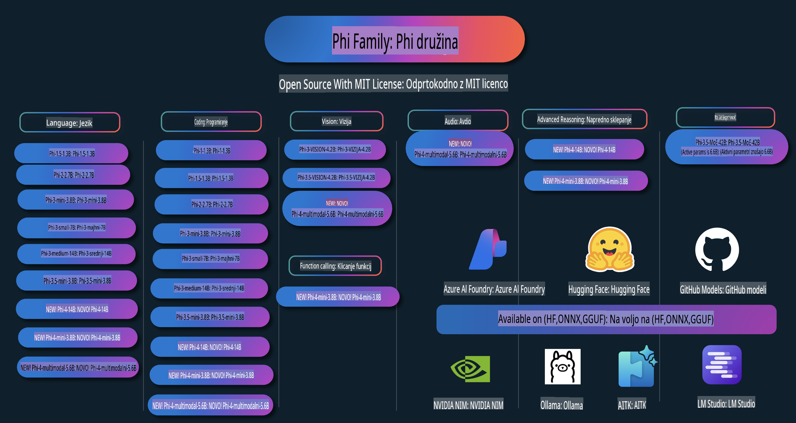

# Phi Cookbook: Praktični primeri z Microsoftovimi Phi modeli

  

  
  
  

  
  

Phi je serija odprtokodnih AI modelov, ki jih je razvilo podjetje Microsoft.

Phi je trenutno najzmogljivejši in stroškovno najučinkovitejši majhen jezikovni model (SLM), ki dosega odlične rezultate na večjezičnih testih, pri sklepanju, generiranju besedil/klepetov, kodiranju, slikah, zvoku in drugih scenarijih.

Phi lahko namestite v oblak ali na robne naprave, prav tako pa lahko z omejeno računalniško močjo enostavno gradite generativne AI aplikacije.

Sledite tem korakom, da začnete uporabljati te vire:
1. **Razvejite repozitorij**: Kliknite   
2. **Klonirajte repozitorij**: `git clone https://github.com/microsoft/PhiCookBook.git`  
3. [**Pridružite se Microsoft AI Discord skupnosti in spoznajte strokovnjake ter druge razvijalce**](https://discord.com/invite/ByRwuEEgH4?WT.mc_id=aiml-137032-kinfeylo)

## Kazalo

- Uvod  
  - [Dobrodošli v družini Phi](./md/01.Introduction/01/01.PhiFamily.md)  
  - [Nastavitev okolja](./md/01.Introduction/01/01.EnvironmentSetup.md)  
  - [Razumevanje ključnih tehnologij](./md/01.Introduction/01/01.Understandingtech.md)  
  - [Varnost AI za Phi modele](./md/01.Introduction/01/01.AISafety.md)  
  - [Podpora za strojno opremo Phi](./md/01.Introduction/01/01.Hardwaresupport.md)  
  - [Phi modeli in njihova razpoložljivost na različnih platformah](./md/01.Introduction/01/01.Edgeandcloud.md)  
  - [Uporaba Guidance-ai in Phi](./md/01.Introduction/01/01.Guidance.md)  
  - [GitHub Marketplace modeli](https://github.com/marketplace/models)  
  - [Azure AI Model Catalog](https://ai.azure.com)  

- Inference Phi v različnih okoljih  
  - [Hugging Face](./md/01.Introduction/02/01.HF.md)  
  - [GitHub modeli](./md/01.Introduction/02/02.GitHubModel.md)  
  - [Azure AI Foundry Model Catalog](./md/01.Introduction/02/03.AzureAIFoundry.md)  
  - [Ollama](./md/01.Introduction/02/04.Ollama.md)  
  - [AI Toolkit VSCode (AITK)](./md/01.Introduction/02/05.AITK.md)  
  - [NVIDIA NIM](./md/01.Introduction/02/06.NVIDIA.md)  

- Inference družine Phi  
  - [Inference Phi na iOS](./md/01.Introduction/03/iOS_Inference.md)  
  - [Inference Phi na Android](./md/01.Introduction/03/Android_Inference.md)  
- [Inferenca Phi na Jetsonu](./md/01.Introduction/03/Jetson_Inference.md)
    - [Inferenca Phi na AI PC](./md/01.Introduction/03/AIPC_Inference.md)
    - [Inferenca Phi z uporabo Apple MLX Frameworka](./md/01.Introduction/03/MLX_Inference.md)
    - [Inferenca Phi na lokalnem strežniku](./md/01.Introduction/03/Local_Server_Inference.md)
    - [Oddaljena inferenca Phi na strežniku z uporabo AI Toolkit](./md/01.Introduction/03/Remote_Interence.md)
    - [Inferenca Phi z uporabo Rust-a](./md/01.Introduction/03/Rust_Inference.md)
    - [Inferenca Phi--Vision lokalno](./md/01.Introduction/03/Vision_Inference.md)
    - [Inferenca Phi z uporabo Kaito AKS, Azure Containers (uradna podpora)](./md/01.Introduction/03/Kaito_Inference.md)
- [Kvantifikacija družine Phi](./md/01.Introduction/04/QuantifyingPhi.md)
    - [Kvantifikacija Phi-3.5 / 4 z uporabo llama.cpp](./md/01.Introduction/04/UsingLlamacppQuantifyingPhi.md)
    - [Kvantifikacija Phi-3.5 / 4 z uporabo Generative AI razširitev za onnxruntime](./md/01.Introduction/04/UsingORTGenAIQuantifyingPhi.md)
    - [Kvantifikacija Phi-3.5 / 4 z uporabo Intel OpenVINO](./md/01.Introduction/04/UsingIntelOpenVINOQuantifyingPhi.md)
    - [Kvantifikacija Phi-3.5 / 4 z uporabo Apple MLX Frameworka](./md/01.Introduction/04/UsingAppleMLXQuantifyingPhi.md)

- Evalvacija Phi
    - [Odgovorna AI](./md/01.Introduction/05/ResponsibleAI.md)
    - [Azure AI Foundry za evalvacijo](./md/01.Introduction/05/AIFoundry.md)
    - [Uporaba Promptflow za evalvacijo](./md/01.Introduction/05/Promptflow.md)

- RAG z Azure AI Search
    - [Kako uporabljati Phi-4-mini in Phi-4-multimodal (RAG) z Azure AI Search](https://github.com/microsoft/PhiCookBook/blob/main/code/06.E2E/E2E_Phi-4-RAG-Azure-AI-Search.ipynb)

- Primeri razvoja aplikacij s Phi
  - Besedilne in klepetalne aplikacije
    - Primeri Phi-4 🆕
      - [📓] [Klepet s Phi-4-mini ONNX modelom](./md/02.Application/01.TextAndChat/Phi4/ChatWithPhi4ONNX/README.md)
      - [Klepet z lokalnim Phi-4 ONNX modelom .NET](../../md/04.HOL/dotnet/src/LabsPhi4-Chat-01OnnxRuntime)
      - [Konzolna aplikacija .NET za klepet s Phi-4 ONNX z uporabo Semantic Kernel](../../md/04.HOL/dotnet/src/LabsPhi4-Chat-02SK)
    - Primeri Phi-3 / 3.5
      - [Lokalni chatbot v brskalniku z uporabo Phi3, ONNX Runtime Web in WebGPU](https://github.com/microsoft/onnxruntime-inference-examples/tree/main/js/chat)
      - [OpenVino klepet](./md/02.Application/01.TextAndChat/Phi3/E2E_OpenVino_Chat.md)
      - [Večmodelni - interaktivni Phi-3-mini in OpenAI Whisper](./md/02.Application/01.TextAndChat/Phi3/E2E_Phi-3-mini_with_whisper.md)
      - [MLFlow - izdelava ovojnice in uporaba Phi-3 z MLFlow](./md//02.Application/01.TextAndChat/Phi3/E2E_Phi-3-MLflow.md)
      - [Optimizacija modela - kako optimizirati Phi-3-mini model za ONNX Runtime Web z Olive](https://github.com/microsoft/Olive/tree/main/examples/phi3)
      - [WinUI3 aplikacija s Phi-3 mini-4k-instruct-onnx](https://github.com/microsoft/Phi3-Chat-WinUI3-Sample/)
      - [WinUI3 večmodelna aplikacija za AI pogovorne zapiske](https://github.com/microsoft/ai-powered-notes-winui3-sample)
      - [Prilagoditev in integracija prilagojenih modelov Phi-3 z uporabo Prompt flow](./md/02.Application/01.TextAndChat/Phi3/E2E_Phi-3-FineTuning_PromptFlow_Integration.md)
      - [Prilagoditev in integracija prilagojenih modelov Phi-3 z uporabo Prompt flow v Azure AI Foundry](./md/02.Application/01.TextAndChat/Phi3/E2E_Phi-3-FineTuning_PromptFlow_Integration_AIFoundry.md)
      - [Evalvacija prilagojenega modela Phi-3 / Phi-3.5 v Azure AI Foundry s poudarkom na Microsoftovih načelih odgovorne AI](./md/02.Application/01.TextAndChat/Phi3/E2E_Phi-3-Evaluation_AIFoundry.md)
- [📓] [Vzorec napovedi jezika Phi-3.5-mini-instruct (Kitajščina/Angleščina)](../../md/02.Application/01.TextAndChat/Phi3/phi3-instruct-demo.ipynb)
      - [Phi-3.5-Instruct WebGPU RAG Chatbot](./md/02.Application/01.TextAndChat/Phi3/WebGPUWithPhi35Readme.md)
      - [Uporaba Windows GPU za ustvarjanje rešitve Prompt flow s Phi-3.5-Instruct ONNX](./md/02.Application/01.TextAndChat/Phi3/UsingPromptFlowWithONNX.md)
      - [Uporaba Microsoft Phi-3.5 tflite za ustvarjanje Android aplikacije](./md/02.Application/01.TextAndChat/Phi3/UsingPhi35TFLiteCreateAndroidApp.md)
      - [Primer Q&A .NET z lokalnim ONNX Phi-3 modelom z uporabo Microsoft.ML.OnnxRuntime](../../md/04.HOL/dotnet/src/LabsPhi301)
      - [Konzolna aplikacija za klepet .NET s Semantic Kernel in Phi-3](../../md/04.HOL/dotnet/src/LabsPhi302)

  - Azure AI Inference SDK Vzorčne Kode 
    - Phi-4 Vzorci 🆕
      - [📓] [Generiranje kode projekta z uporabo Phi-4-multimodal](./md/02.Application/02.Code/Phi4/GenProjectCode/README.md)
    - Phi-3 / 3.5 Vzorci
      - [Ustvarite svoj Visual Studio Code GitHub Copilot Chat z Microsoft Phi-3 družino](./md/02.Application/02.Code/Phi3/VSCodeExt/README.md)
      - [Ustvarite svojega Visual Studio Code Chat Copilot Agenta s Phi-3.5 z modeli GitHub](/md/02.Application/02.Code/Phi3/CreateVSCodeChatAgentWithGitHubModels.md)

  - Vzorci Naprednega Razmišljanja
    - Phi-4 Vzorci 🆕
      - [📓] [Phi-4-mini vzorci razmišljanja](./md/02.Application/03.AdvancedReasoning/Phi4/AdvancedResoningPhi4mini/README.md)
  
  - Demos
      - [Phi-4-mini demoji, gostovani na Hugging Face Spaces](https://huggingface.co/spaces/microsoft/phi-4-mini?WT.mc_id=aiml-137032-kinfeylo)
      - [Phi-4-multimodal demoji, gostovani na Hugging Face Spaces](https://huggingface.co/spaces/microsoft/phi-4-multimodal?WT.mc_id=aiml-137032-kinfeylo)
  - Vzorci Vizije
    - Phi-4 Vzorci 🆕
      - [📓] [Uporaba Phi-4-multimodal za branje slik in generiranje kode](./md/02.Application/04.Vision/Phi4/CreateFrontend/README.md) 
    - Phi-3 / 3.5 Vzorci
      -  [📓][Phi-3-vision-Prevod slike v besedilo](../../md/02.Application/04.Vision/Phi3/E2E_Phi-3-vision-image-text-to-text-online-endpoint.ipynb)
      - [Phi-3-vision-ONNX](https://onnxruntime.ai/docs/genai/tutorials/phi3-v.html)
      - [📓][Phi-3-vision CLIP Embedding](../../md/02.Application/04.Vision/Phi3/E2E_Phi-3-vision-image-text-to-text-online-endpoint.ipynb)
      - [DEMO: Phi-3 Recikliranje](https://github.com/jennifermarsman/PhiRecycling/)
      - [Phi-3-vision - Vizualni jezikovni asistent - s Phi3-Vision in OpenVINO](https://docs.openvino.ai/nightly/notebooks/phi-3-vision-with-output.html)
      - [Phi-3 Vision Nvidia NIM](./md/02.Application/04.Vision/Phi3/E2E_Nvidia_NIM_Vision.md)
      - [Phi-3 Vision OpenVino](./md/02.Application/04.Vision/Phi3/E2E_OpenVino_Phi3Vision.md)
      - [📓][Phi-3.5 Vision vzorec za več okvirjev ali več slik](../../md/02.Application/04.Vision/Phi3/phi3-vision-demo.ipynb)
      - [Phi-3 Vision Lokalni ONNX Model z uporabo Microsoft.ML.OnnxRuntime .NET](../../md/04.HOL/dotnet/src/LabsPhi303)
      - [Meni temelječi Phi-3 Vision Lokalni ONNX Model z uporabo Microsoft.ML.OnnxRuntime .NET](../../md/04.HOL/dotnet/src/LabsPhi304)

  - Vzorci Zvoka
    - Phi-4 Vzorci 🆕
      - [📓] [Izvleček avdio prepisov z uporabo Phi-4-multimodal](./md/02.Application/05.Audio/Phi4/Transciption/README.md)
      - [📓] [Phi-4-multimodal Vzorec zvoka](../../md/02.Application/05.Audio/Phi4/Siri/demo.ipynb)
      - [📓] [Phi-4-multimodal Vzorec prevajanja govora](../../md/02.Application/05.Audio/Phi4/Translate/demo.ipynb)
      - [.NET konzolna aplikacija z uporabo Phi-4-multimodal za analizo avdio datoteke in generiranje prepisa](../../md/04.HOL/dotnet/src/LabsPhi4-MultiModal-02Audio)

  - MOE Vzorci
    - Phi-3 / 3.5 Vzorci
      - [📓] [Phi-3.5 Mixture of Experts Models (MoEs) Vzorec za socialna omrežja](../../md/02.Application/06.MoE/Phi3/phi3_moe_demo.ipynb)
      - [📓] [Izdelava Retrieval-Augmented Generation (RAG) pipeline z NVIDIA NIM Phi-3 MOE, Azure AI Search in LlamaIndex](../../md/02.Application/06.MoE/Phi3/azure-ai-search-nvidia-rag.ipynb)
  - Vzorci Klicanja Funkcij
    - Phi-4 Vzorci 🆕
      -  [📓] [Uporaba klicanja funkcij s Phi-4-mini](./md/02.Application/07.FunctionCalling/Phi4/FunctionCallingBasic/README.md)
  - Vzorci Mešanja Multimodalnosti
    - Phi-4 Vzorci 🆕
- [📓] [Uporaba Phi-4-multimodal kot tehnološki novinar](../../md/02.Application/08.Multimodel/Phi4/TechJournalist/phi_4_mm_audio_text_publish_news.ipynb)  
  - [.NET konzolna aplikacija z uporabo Phi-4-multimodal za analizo slik](../../md/04.HOL/dotnet/src/LabsPhi4-MultiModal-01Images)

- Fino prilagajanje vzorcev Phi  
  - [Scenariji finega prilagajanja](./md/03.FineTuning/FineTuning_Scenarios.md)  
  - [Fine-tuning proti RAG](./md/03.FineTuning/FineTuning_vs_RAG.md)  
  - [Fine-tuning: Naj Phi-3 postane industrijski strokovnjak](./md/03.FineTuning/LetPhi3gotoIndustriy.md)  
  - [Fine-tuning Phi-3 z AI Toolkit za VS Code](./md/03.FineTuning/Finetuning_VSCodeaitoolkit.md)  
  - [Fine-tuning Phi-3 z Azure Machine Learning Service](./md/03.FineTuning/Introduce_AzureML.md)  
  - [Fine-tuning Phi-3 z Lora](./md/03.FineTuning/FineTuning_Lora.md)  
  - [Fine-tuning Phi-3 z QLora](./md/03.FineTuning/FineTuning_Qlora.md)  
  - [Fine-tuning Phi-3 z Azure AI Foundry](./md/03.FineTuning/FineTuning_AIFoundry.md)  
  - [Fine-tuning Phi-3 z Azure ML CLI/SDK](./md/03.FineTuning/FineTuning_MLSDK.md)  
  - [Fine-tuning z Microsoft Olive](./md/03.FineTuning/FineTuning_MicrosoftOlive.md)  
  - [Fine-tuning z Microsoft Olive Hands-On Lab](./md/03.FineTuning/olive-lab/readme.md)  
  - [Fine-tuning Phi-3-vision z Weights and Bias](./md/03.FineTuning/FineTuning_Phi-3-visionWandB.md)  
  - [Fine-tuning Phi-3 z Apple MLX Framework](./md/03.FineTuning/FineTuning_MLX.md)  
  - [Fine-tuning Phi-3-vision (uradna podpora)](./md/03.FineTuning/FineTuning_Vision.md)  
  - [Fine-tuning Phi-3 z Kaito AKS, Azure Containers (uradna podpora)](./md/03.FineTuning/FineTuning_Kaito.md)  
  - [Fine-tuning Phi-3 in 3.5 Vision](https://github.com/2U1/Phi3-Vision-Finetune)  

- Praktične delavnice  
  - [Raziskovanje najsodobnejših modelov: LLM, SLM, lokalni razvoj in več](https://github.com/microsoft/aitour-exploring-cutting-edge-models)  
  - [Odklepanje potenciala NLP: Fine-tuning z Microsoft Olive](https://github.com/azure/Ignite_FineTuning_workshop)  

- Akademske raziskave in publikacije  
  - [Učbeniki so vse, kar potrebujete II: tehnično poročilo phi-1.5](https://arxiv.org/abs/2309.05463)  
  - [Tehnično poročilo Phi-3: Zmogljiv jezikovni model na vašem telefonu](https://arxiv.org/abs/2404.14219)  
  - [Tehnično poročilo Phi-4](https://arxiv.org/abs/2412.08905)  
  - [Optimizacija majhnih jezikovnih modelov za klic funkcij v vozilih](https://arxiv.org/abs/2501.02342)  
  - [(WhyPHI) Fine-tuning PHI-3 za odgovarjanje na vprašanja z več izbirami: metodologija, rezultati in izzivi](https://arxiv.org/abs/2501.01588)  

## Uporaba modelov Phi  

### Phi na Azure AI Foundry  

Lahko se naučite, kako uporabljati Microsoft Phi in kako graditi E2E rešitve na različnih strojnih napravah. Da bi sami izkusili Phi, začnite z raziskovanjem modelov in prilagodite Phi za svoje scenarije z uporabo [Azure AI Foundry Azure AI Model Catalog](https://aka.ms/phi3-azure-ai). Več lahko izveste v razdelku Začetek z [Azure AI Foundry](/md/02.QuickStart/AzureAIFoundry_QuickStart.md).  

**Igralnica**  
Vsak model ima namensko igralnico za testiranje modela [Azure AI Playground](https://aka.ms/try-phi3).  

### Phi na GitHub Modelih  

Lahko se naučite, kako uporabljati Microsoft Phi in kako graditi E2E rešitve na različnih strojnih napravah. Da bi sami izkusili Phi, začnite z raziskovanjem modela in prilagodite Phi za svoje scenarije z uporabo [GitHub Model Catalog](https://github.com/marketplace/models?WT.mc_id=aiml-137032-kinfeylo). Več lahko izveste v razdelku Začetek z [GitHub Model Catalog](/md/02.QuickStart/GitHubModel_QuickStart.md).  

**Igralnica**
Vsak model ima namenjen [prostor za testiranje modela](/md/02.QuickStart/GitHubModel_QuickStart.md).

### Phi na Hugging Face

Model je na voljo tudi na [Hugging Face](https://huggingface.co/microsoft).

**Prostor za testiranje**  
[Hugging Chat playground](https://huggingface.co/chat/models/microsoft/Phi-3-mini-4k-instruct)

## Odgovorna uporaba AI 

Microsoft se zavezuje, da bo svojim strankam pomagal odgovorno uporabljati AI produkte, delil svoje izkušnje in gradil partnerske odnose, temelječe na zaupanju, s pomočjo orodij, kot so Transparentnost zapiskov in Ocene vplivov. Veliko teh virov je na voljo na [https://aka.ms/RAI](https://aka.ms/RAI).  
Microsoftov pristop k odgovorni uporabi AI temelji na naših načelih umetne inteligence: pravičnost, zanesljivost in varnost, zasebnost in varovanje podatkov, vključenost, transparentnost in odgovornost.

Veliki modeli za obdelavo naravnega jezika, slik in govora - kot tisti, uporabljeni v tem primeru - se lahko obnašajo na načine, ki so nepravični, nezanesljivi ali žaljivi, kar lahko povzroči škodo. Prosimo, preberite [Transparentnost zapiska storitve Azure OpenAI](https://learn.microsoft.com/legal/cognitive-services/openai/transparency-note?tabs=text), da se seznanite z morebitnimi tveganji in omejitvami.

Priporočeni pristop za zmanjšanje teh tveganj je vključitev varnostnega sistema v vašo arhitekturo, ki lahko zazna in prepreči škodljivo vedenje. [Azure AI Content Safety](https://learn.microsoft.com/azure/ai-services/content-safety/overview) zagotavlja neodvisno plast zaščite, sposobno zaznati škodljivo vsebino, ki jo ustvarijo uporabniki ali AI, v aplikacijah in storitvah. Azure AI Content Safety vključuje API-je za besedilo in slike, ki omogočajo zaznavanje škodljivega materiala. V okviru Azure AI Foundry storitev Content Safety omogoča pregledovanje, raziskovanje in preizkušanje vzorčne kode za zaznavanje škodljive vsebine v različnih modalitetah. Naslednja [dokumentacija za hiter začetek](https://learn.microsoft.com/azure/ai-services/content-safety/quickstart-text?tabs=visual-studio%2Clinux&pivots=programming-language-rest) vas vodi skozi postopek pošiljanja zahtevkov storitvi.

Drugi vidik, ki ga je treba upoštevati, je splošna zmogljivost aplikacije. Pri aplikacijah z več modalitetami in modeli zmogljivost pomeni, da sistem deluje, kot pričakujete vi in vaši uporabniki, vključno s tem, da ne ustvarja škodljivih rezultatov. Pomembno je oceniti zmogljivost vaše aplikacije s pomočjo [Evaluatorjev za zmogljivost in kakovost ter tveganje in varnost](https://learn.microsoft.com/azure/ai-studio/concepts/evaluation-metrics-built-in). Prav tako imate možnost ustvariti in oceniti z [lastnimi evaluatorji](https://learn.microsoft.com/azure/ai-studio/how-to/develop/evaluate-sdk#custom-evaluators).

Vašo AI aplikacijo lahko ocenite v vašem razvojnem okolju z uporabo [Azure AI Evaluation SDK](https://microsoft.github.io/promptflow/index.html). Na podlagi testnega nabora podatkov ali cilja se generacije vaše generativne AI aplikacije kvantitativno merijo z vgrajenimi evaluatorji ali evaluatorji po vaši izbiri. Za začetek z Azure AI Evaluation SDK za oceno vašega sistema lahko sledite [vodniku za hiter začetek](https://learn.microsoft.com/azure/ai-studio/how-to/develop/flow-evaluate-sdk). Ko izvedete ocenjevalni proces, lahko [vizualizirate rezultate v Azure AI Foundry](https://learn.microsoft.com/azure/ai-studio/how-to/evaluate-flow-results).

## Blagovne znamke

Ta projekt lahko vsebuje blagovne znamke ali logotipe za projekte, izdelke ali storitve. Dovoljena uporaba Microsoftovih blagovnih znamk ali logotipov je predmet in mora slediti [Microsoftovim smernicam za blagovne znamke in znamčenje](https://www.microsoft.com/legal/intellectualproperty/trademarks/usage/general).  
Uporaba Microsoftovih blagovnih znamk ali logotipov v spremenjenih različicah tega projekta ne sme povzročati zmede ali nakazovati, da jih sponzorira Microsoft. Vsaka uporaba blagovnih znamk ali logotipov tretjih oseb je predmet politik teh tretjih oseb.

**Omejitev odgovornosti**:  
Ta dokument je bil preveden s pomočjo strojnih storitev umetne inteligence za prevajanje. Čeprav si prizadevamo za natančnost, vas opozarjamo, da lahko avtomatski prevodi vsebujejo napake ali netočnosti. Izvirni dokument v njegovem maternem jeziku je treba obravnavati kot avtoritativni vir. Za ključne informacije priporočamo profesionalni človeški prevod. Ne prevzemamo odgovornosti za morebitna nesporazumevanja ali napačne razlage, ki izhajajo iz uporabe tega prevoda.