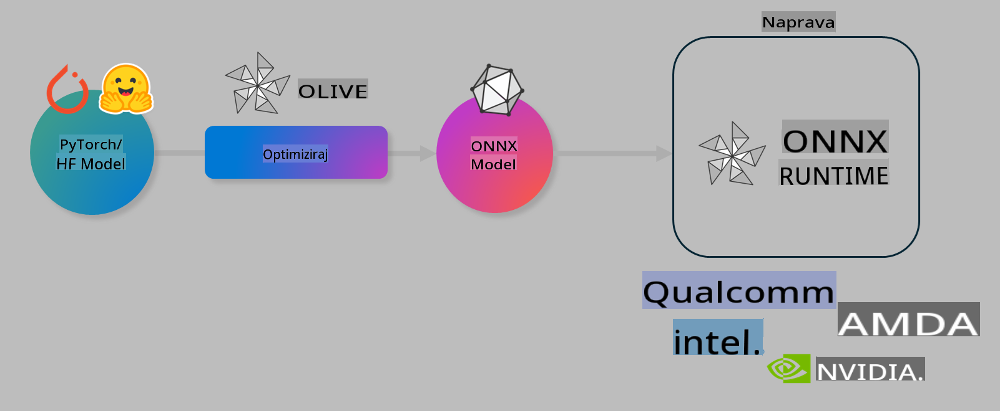

# Laboratorij. Optimizacija AI modelov za inferenco na napravi

## Uvod 

> [!IMPORTANT]
> Ta laboratorij zahteva **Nvidia A10 ali A100 GPU** z ustreznimi gonilniki in nameščenim CUDA orodjem (različica 12+).

> [!NOTE]
> To je **35-minutni** laboratorij, ki vam bo omogočil praktičen uvod v osnovne koncepte optimizacije modelov za inferenco na napravi z uporabo OLIVE.

## Cilji učenja

Na koncu tega laboratorija boste lahko z OLIVE:

- Kvantizirali AI model z metodo kvantizacije AWQ.
- Prilagodili AI model za specifično nalogo.
- Ustvarili LoRA adapterje (prilagojen model) za učinkovito inferenco na napravi z uporabo ONNX Runtime.

### Kaj je Olive

Olive (*O*NNX *live*) je orodje za optimizacijo modelov s pripadajočim CLI, ki vam omogoča dostavo modelov za ONNX runtime +++https://onnxruntime.ai+++ z visoko kakovostjo in zmogljivostjo.



Vhod za Olive je običajno PyTorch ali Hugging Face model, izhod pa je optimiziran ONNX model, ki se izvaja na napravi (cilj za uvajanje) z ONNX runtime. Olive optimizira model za AI pospeševalnik ciljne naprave (NPU, GPU, CPU), ki ga zagotovi proizvajalec strojne opreme, kot so Qualcomm, AMD, Nvidia ali Intel.

Olive izvaja *potek dela*, ki je urejeno zaporedje posameznih nalog optimizacije modela, imenovanih *passi* - primeri passov vključujejo: stiskanje modela, zajem grafa, kvantizacijo, optimizacijo grafa. Vsak pass ima nabor parametrov, ki jih je mogoče prilagoditi za dosego najboljših metrik, na primer natančnost in zakasnitev, ki jih ocenjuje ustrezni evaluator. Olive uporablja strategijo iskanja z algoritmom iskanja za samodejno prilagoditev vsakega passa posebej ali skupine passov skupaj.

#### Prednosti Olive

- **Zmanjšanje frustracij in časa** zaradi poskusov in napak pri ročnem eksperimentiranju z različnimi tehnikami optimizacije grafa, stiskanja in kvantizacije. Določite svoje omejitve kakovosti in zmogljivosti, Olive pa bo samodejno našel najboljši model za vas.
- **Več kot 40 vgrajenih komponent za optimizacijo modela**, ki pokrivajo najsodobnejše tehnike kvantizacije, stiskanja, optimizacije grafa in prilagajanja.
- **Preprosta CLI** za pogoste naloge optimizacije modela. Na primer: olive quantize, olive auto-opt, olive finetune.
- Vgrajeno pakiranje in uvajanje modela.
- Podpira generiranje modelov za **Multi LoRA strežbo**.
- Konstrukcija potekov dela z uporabo YAML/JSON za orkestracijo nalog optimizacije in uvajanja modelov.
- Integracija s **Hugging Face** in **Azure AI**.
- Vgrajen mehanizem **predpomnjenja** za **zmanjšanje stroškov**.

## Navodila za laboratorij
> [!NOTE]
> Prepričajte se, da ste pripravili svoj Azure AI Hub in projekt ter nastavili svoj A100 računalnik, kot je opisano v Laboratoriju 1.

### Korak 0: Povezava z vašim Azure AI Compute

Povezali se boste z Azure AI računalnikom z uporabo funkcije oddaljenega dostopa v **VS Code.** 

1. Odprite svojo **VS Code** namizno aplikacijo:
1. Odprite **ukazno paleto** z uporabo **Shift+Ctrl+P**
1. V ukazni paleti poiščite **AzureML - remote: Connect to compute instance in New Window**.
1. Sledite navodilom na zaslonu za povezavo z računalnikom. To bo vključevalo izbiro vaše Azure naročnine, skupine virov, projekta in imena računalnika, ki ste ga nastavili v Laboratoriju 1.
1. Ko ste povezani z Azure ML Compute vozliščem, bo to prikazano v **spodnjem levem delu Visual Code** `><Azure ML: Compute Name`

### Korak 1: Klonirajte to repozitorij

V VS Code lahko odprete nov terminal z **Ctrl+J** in klonirate ta repozitorij:

V terminalu bi morali videti poziv

```
azureuser@computername:~/cloudfiles/code$ 
```
Klonirajte rešitev 

```bash
cd ~/localfiles
git clone https://github.com/microsoft/phi-3cookbook.git
```

### Korak 2: Odprite mapo v VS Code

Za odpiranje VS Code v ustrezni mapi izvedite naslednji ukaz v terminalu, ki bo odprl novo okno:

```bash
code phi-3cookbook/code/04.Finetuning/Olive-lab
```

Lahko pa mapo odprete tudi tako, da izberete **File** > **Open Folder**. 

### Korak 3: Odvisnosti

Odprite okno terminala v VS Code na svojem Azure AI računalniškem vozlišču (nasvet: **Ctrl+J**) in izvedite naslednje ukaze za namestitev odvisnosti:

```bash
conda create -n olive-ai python=3.11 -y
conda activate olive-ai
pip install -r requirements.txt
az extension remove -n azure-cli-ml
az extension add -n ml
```

> [!NOTE]
> Namestitev vseh odvisnosti bo trajala približno 5 minut.

V tem laboratoriju boste prenašali in nalagali modele v katalog modelov Azure AI. Da boste lahko dostopali do kataloga modelov, se boste morali prijaviti v Azure z:

```bash
az login
```

> [!NOTE]
> Ob prijavi boste pozvani, da izberete svojo naročnino. Prepričajte se, da ste nastavili naročnino, ki je predvidena za ta laboratorij.

### Korak 4: Izvedba Olive ukazov 

Odprite okno terminala v VS Code na svojem Azure AI računalniškem vozlišču (nasvet: **Ctrl+J**) in se prepričajte, da je aktivirano okolje `olive-ai` conda:

```bash
conda activate olive-ai
```

Nato izvedite naslednje Olive ukaze v ukazni vrstici.

1. **Pregled podatkov:** V tem primeru boste prilagodili model Phi-3.5-Mini, da bo specializiran za odgovarjanje na vprašanja o potovanjih. Koda spodaj prikaže prvih nekaj zapisov podatkovnega nabora, ki so v formatu JSON lines:
   
    ```bash
    head data/data_sample_travel.jsonl
    ```
1. **Kvantizirajte model:** Pred treniranjem modela ga najprej kvantizirajte z naslednjim ukazom, ki uporablja tehniko imenovano Active Aware Quantization (AWQ) +++https://arxiv.org/abs/2306.00978+++. AWQ kvantizira uteži modela z upoštevanjem aktivacij, ki nastanejo med inferenco. To pomeni, da postopek kvantizacije upošteva dejansko porazdelitev podatkov v aktivacijah, kar vodi do boljšega ohranjanja natančnosti modela v primerjavi s tradicionalnimi metodami kvantizacije uteži.
    
    ```bash
    olive quantize \
       --model_name_or_path microsoft/Phi-3.5-mini-instruct \
       --trust_remote_code \
       --algorithm awq \
       --output_path models/phi/awq \
       --log_level 1
    ```
    
    Kvantizacija AWQ traja približno **8 minut** in **zmanjša velikost modela s približno 7,5 GB na približno 2,5 GB**.
   
   V tem laboratoriju vam bomo pokazali, kako vnesti modele iz Hugging Face (na primer: `microsoft/Phi-3.5-mini-instruct`). However, Olive also allows you to input models from the Azure AI catalog by updating the `model_name_or_path` argument to an Azure AI asset ID (for example:  `azureml://registries/azureml/models/Phi-3.5-mini-instruct/versions/4`). 

1. **Train the model:** Next, the `olive finetune` ukaz prilagodi kvantiziran model. Kvantizacija modela *pred* prilagajanjem namesto po njem zagotavlja boljšo natančnost, saj postopek prilagajanja povrne nekaj izgube zaradi kvantizacije.
    
    ```bash
    olive finetune \
        --method lora \
        --model_name_or_path models/phi/awq \
        --data_files "data/data_sample_travel.jsonl" \
        --data_name "json" \
        --text_template "<|user|>\n{prompt}<|end|>\n<|assistant|>\n{response}<|end|>" \
        --max_steps 100 \
        --output_path ./models/phi/ft \
        --log_level 1
    ```
    
    Prilagajanje traja približno **6 minut** (s 100 koraki).

1. **Optimizacija:** Ko je model treniran, ga zdaj optimizirate z Olive ukazom `auto-opt` command, which will capture the ONNX graph and automatically perform a number of optimizations to improve the model performance for CPU by compressing the model and doing fusions. It should be noted, that you can also optimize for other devices such as NPU or GPU by just updating the `--device` and `--provider` - za namen tega laboratorija bomo uporabili CPU.

    ```bash
    olive auto-opt \
       --model_name_or_path models/phi/ft/model \
       --adapter_path models/phi/ft/adapter \
       --device cpu \
       --provider CPUExecutionProvider \
       --use_ort_genai \
       --output_path models/phi/onnx-ao \
       --log_level 1
    ```
    
    Optimizacija traja približno **5 minut**.

### Korak 5: Hitri test inferenciranja modela

Za testiranje inferenciranja modela ustvarite Python datoteko v svoji mapi z imenom **app.py** in kopirajte ter prilepite naslednjo kodo:

```python
import onnxruntime_genai as og
import numpy as np

print("loading model and adapters...", end="", flush=True)
model = og.Model("models/phi/onnx-ao/model")
adapters = og.Adapters(model)
adapters.load("models/phi/onnx-ao/model/adapter_weights.onnx_adapter", "travel")
print("DONE!")

tokenizer = og.Tokenizer(model)
tokenizer_stream = tokenizer.create_stream()

params = og.GeneratorParams(model)
params.set_search_options(max_length=100, past_present_share_buffer=False)
user_input = "what is the best thing to see in chicago"
params.input_ids = tokenizer.encode(f"<|user|>\n{user_input}<|end|>\n<|assistant|>\n")

generator = og.Generator(model, params)

generator.set_active_adapter(adapters, "travel")

print(f"{user_input}")

while not generator.is_done():
    generator.compute_logits()
    generator.generate_next_token()

    new_token = generator.get_next_tokens()[0]
    print(tokenizer_stream.decode(new_token), end='', flush=True)

print("\n")
```

Izvedite kodo z:

```bash
python app.py
```

### Korak 6: Nalaganje modela v Azure AI

Nalaganje modela v repozitorij modelov Azure AI omogoča deljenje modela z drugimi člani vaše razvojne ekipe in upravljanje različic modela. Za nalaganje modela izvedite naslednji ukaz:

> [!NOTE]
> Posodobite `{}` placeholders with the name of your resource group and Azure AI Project Name. 

To find your resource group `"resourceGroup"` in ime projekta Azure AI, nato izvedite naslednji ukaz 

```
az ml workspace show
```

Ali pa obiščite +++ai.azure.com+++ in izberite **management center** **project** **overview**.

Posodobite `{}` z imenom vaše skupine virov in imenom projekta Azure AI.

```bash
az ml model create \
    --name ft-for-travel \
    --version 1 \
    --path ./models/phi/onnx-ao \
    --resource-group {RESOURCE_GROUP_NAME} \
    --workspace-name {PROJECT_NAME}
```
Nato lahko vidite svoj naloženi model in ga uvedete na https://ml.azure.com/model/list

**Zavrnitev odgovornosti**:  
Ta dokument je bil preveden z uporabo strojnih AI prevajalskih storitev. Čeprav si prizadevamo za natančnost, vas prosimo, da upoštevate, da lahko avtomatski prevodi vsebujejo napake ali netočnosti. Izvirni dokument v svojem izvirnem jeziku je treba obravnavati kot avtoritativni vir. Za ključne informacije priporočamo profesionalen človeški prevod. Ne prevzemamo odgovornosti za morebitna nesporazumevanja ali napačne razlage, ki bi nastale zaradi uporabe tega prevoda.