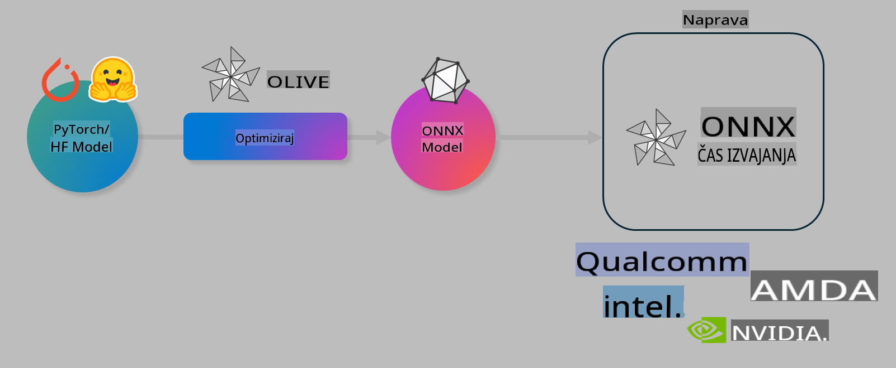

# Lab. Optimizirajte AI modele za lokalno sklepanje sklepov

## Uvod 

> [!IMPORTANT]
> Ta laboratorijska vaja zahteva **Nvidia A10 ali A100 GPU** z ustreznimi gonilniki in nameščenim orodjem CUDA toolkit (različica 12+).

> [!NOTE]
> To je **35-minutna** laboratorijska vaja, ki vam bo omogočila praktičen uvod v osnovne koncepte optimizacije modelov za lokalno sklepanje sklepov z uporabo OLIVE.

## Cilji učenja

Do konca te laboratorijske vaje boste znali uporabljati OLIVE za:

- Kvantizacijo AI modela z uporabo metode kvantizacije AWQ.
- Fino nastavljanje AI modela za specifično nalogo.
- Generiranje LoRA adapterjev (fino nastavljenega modela) za učinkovito lokalno sklepanje sklepov z ONNX Runtime.

### Kaj je Olive

Olive (*O*NNX *live*) je orodje za optimizacijo modelov z dodatnim CLI, ki omogoča dostavo modelov za ONNX runtime +++https://onnxruntime.ai+++ z zagotavljanjem kakovosti in zmogljivosti.



Vhod za Olive je običajno PyTorch ali Hugging Face model, izhod pa je optimiziran ONNX model, ki se izvaja na napravi (ciljni platformi za uvajanje), kjer teče ONNX runtime. Olive bo optimiziral model za AI pospeševalnik ciljne platforme (NPU, GPU, CPU), ki ga zagotovi proizvajalec strojne opreme, kot so Qualcomm, AMD, Nvidia ali Intel.

Olive izvaja *delovni tok*, ki je urejeno zaporedje posameznih nalog optimizacije modela, imenovanih *passi* - primeri passov vključujejo: stiskanje modela, zajem grafa, kvantizacijo, optimizacijo grafa. Vsak pass ima niz parametrov, ki jih je mogoče prilagoditi za dosego najboljših metrik, na primer natančnost in zakasnitev, ki jih ocenjuje ustrezni evaluator. Olive uporablja strategijo iskanja z algoritmom za iskanje, ki samodejno prilagodi vsak pass posebej ali nabor passov skupaj.

#### Prednosti Olive

- **Zmanjšajte frustracijo in čas** poskusov in napak pri ročnem eksperimentiranju z različnimi tehnikami za optimizacijo grafa, stiskanje in kvantizacijo. Določite svoje omejitve glede kakovosti in zmogljivosti, Olive pa bo samodejno našel najboljši model za vas.
- **40+ vgrajenih komponent za optimizacijo modelov**, ki pokrivajo najsodobnejše tehnike kvantizacije, stiskanja, optimizacije grafa in finega nastavljanja.
- **Enostaven CLI** za običajne naloge optimizacije modelov. Na primer, olive quantize, olive auto-opt, olive finetune.
- Vgrajeno pakiranje in uvajanje modelov.
- Podpora za generiranje modelov za **Multi LoRA serving**.
- Gradnja delovnih tokov z uporabo YAML/JSON za orkestracijo nalog optimizacije in uvajanja modelov.
- Integracija s **Hugging Face** in **Azure AI**.
- Vgrajen mehanizem **predpomnjenja** za **prihranek stroškov**.

## Navodila za laboratorijsko vajo
> [!NOTE]
> Poskrbite, da ste pripravili svoj Azure AI Hub in projekt ter nastavili svojo A100 infrastrukturo, kot je opisano v Laboratorijski vaji 1.

### Korak 0: Povežite se z Azure AI Compute

Povezali se boste z Azure AI Compute z uporabo oddaljene funkcije v **VS Code.**

1. Odprite svojo namizno aplikacijo **VS Code**:
1. Odprite **ukazno paleto** z **Shift+Ctrl+P**
1. V ukazni paleti poiščite **AzureML - remote: Connect to compute instance in New Window**.
1. Sledite navodilom na zaslonu za povezavo s Compute. To vključuje izbiro vaše Azure naročnine, skupine virov, projekta in imena infrastrukture, ki ste jo nastavili v Laboratorijski vaji 1.
1. Ko ste povezani z vašim Azure ML Compute vozliščem, bo to prikazano v **spodnjem levem kotu Visual Code** `><Azure ML: Compute Name`

### Korak 1: Klonirajte to repozitorij

V VS Code lahko odprete nov terminal z **Ctrl+J** in klonirate ta repozitorij:

V terminalu bi morali videti poziv

```
azureuser@computername:~/cloudfiles/code$ 
```
Klonirajte rešitev 

```bash
cd ~/localfiles
git clone https://github.com/microsoft/phi-3cookbook.git
```

### Korak 2: Odprite mapo v VS Code

Za odpiranje VS Code v ustrezni mapi izvedite naslednji ukaz v terminalu, kar bo odprlo novo okno:

```bash
code phi-3cookbook/code/04.Finetuning/Olive-lab
```

Lahko pa mapo odprete z izbiro **File** > **Open Folder**. 

### Korak 3: Odvisnosti

Odprite okno terminala v VS Code v svojem Azure AI Compute vozlišču (nasvet: **Ctrl+J**) in izvedite naslednje ukaze za namestitev odvisnosti:

```bash
conda create -n olive-ai python=3.11 -y
conda activate olive-ai
pip install -r requirements.txt
az extension remove -n azure-cli-ml
az extension add -n ml
```

> [!NOTE]
> Namestitev vseh odvisnosti bo trajala ~5 minut.

V tej laboratorijski vaji boste prenesli in naložili modele v Azure AI Model katalog. Da boste lahko dostopali do kataloga modelov, se boste morali prijaviti v Azure z uporabo:

```bash
az login
```

> [!NOTE]
> Med prijavo boste morali izbrati svojo naročnino. Prepričajte se, da ste nastavili naročnino, ki je bila zagotovljena za to laboratorijsko vajo.

### Korak 4: Izvedite Olive ukaze 

Odprite okno terminala v VS Code v svojem Azure AI Compute vozlišču (nasvet: **Ctrl+J**) in preverite, da je aktivirano okolje `olive-ai` conda:

```bash
conda activate olive-ai
```

Nato izvedite naslednje Olive ukaze v ukazni vrstici.

1. **Preglejte podatke:** V tem primeru boste fino nastavili model Phi-3.5-Mini, da bo specializiran za odgovarjanje na vprašanja, povezana s potovanji. Spodnja koda prikaže prvih nekaj zapisov v naboru podatkov, ki so v formatu JSON lines:
   
    ```bash
    head data/data_sample_travel.jsonl
    ```
1. **Kvantizirajte model:** Preden model trenirate, ga najprej kvantizirajte z naslednjim ukazom, ki uporablja tehniko, imenovano Active Aware Quantization (AWQ) +++https://arxiv.org/abs/2306.00978+++. AWQ kvantizira uteži modela z upoštevanjem aktivacij, ki nastanejo med sklepanjem. To pomeni, da kvantizacijski proces upošteva dejansko porazdelitev podatkov v aktivacijah, kar vodi do boljšega ohranjanja natančnosti modela v primerjavi s tradicionalnimi metodami kvantizacije uteži.
    
    ```bash
    olive quantize \
       --model_name_or_path microsoft/Phi-3.5-mini-instruct \
       --trust_remote_code \
       --algorithm awq \
       --output_path models/phi/awq \
       --log_level 1
    ```
    
    Postopek kvantizacije AWQ traja **~8 minut**, kar bo **zmanjšalo velikost modela s ~7.5GB na ~2.5GB**.
   
   V tej laboratorijski vaji vam bomo pokazali, kako vnašati modele iz Hugging Face (na primer: `microsoft/Phi-3.5-mini-instruct`). However, Olive also allows you to input models from the Azure AI catalog by updating the `model_name_or_path` argument to an Azure AI asset ID (for example:  `azureml://registries/azureml/models/Phi-3.5-mini-instruct/versions/4`). 

1. **Train the model:** Next, the `olive finetune` ukaz fino nastavi kvantiziran model. Kvantizacija modela *pred* finim nastavljanjem namesto po njem zagotavlja boljšo natančnost, saj postopek finega nastavljanja povrne nekaj izgube zaradi kvantizacije.
    
    ```bash
    olive finetune \
        --method lora \
        --model_name_or_path models/phi/awq \
        --data_files "data/data_sample_travel.jsonl" \
        --data_name "json" \
        --text_template "<|user|>\n{prompt}<|end|>\n<|assistant|>\n{response}<|end|>" \
        --max_steps 100 \
        --output_path ./models/phi/ft \
        --log_level 1
    ```
    
    Postopek finega nastavljanja (s 100 koraki) traja **~6 minut**.

1. **Optimizirajte:** Ko je model izurjen, zdaj optimizirajte model z uporabo Olive ukaza `auto-opt` command, which will capture the ONNX graph and automatically perform a number of optimizations to improve the model performance for CPU by compressing the model and doing fusions. It should be noted, that you can also optimize for other devices such as NPU or GPU by just updating the `--device` and `--provider` argumentov - vendar bomo za potrebe te laboratorijske vaje uporabili CPU.

    ```bash
    olive auto-opt \
       --model_name_or_path models/phi/ft/model \
       --adapter_path models/phi/ft/adapter \
       --device cpu \
       --provider CPUExecutionProvider \
       --use_ort_genai \
       --output_path models/phi/onnx-ao \
       --log_level 1
    ```
    
    Postopek optimizacije traja **~5 minut**.

### Korak 5: Hitri test sklepanja modela

Za testiranje sklepanja modela ustvarite Python datoteko v svoji mapi z imenom **app.py** in vanjo kopirajte naslednjo kodo:

```python
import onnxruntime_genai as og
import numpy as np

print("loading model and adapters...", end="", flush=True)
model = og.Model("models/phi/onnx-ao/model")
adapters = og.Adapters(model)
adapters.load("models/phi/onnx-ao/model/adapter_weights.onnx_adapter", "travel")
print("DONE!")

tokenizer = og.Tokenizer(model)
tokenizer_stream = tokenizer.create_stream()

params = og.GeneratorParams(model)
params.set_search_options(max_length=100, past_present_share_buffer=False)
user_input = "what is the best thing to see in chicago"
params.input_ids = tokenizer.encode(f"<|user|>\n{user_input}<|end|>\n<|assistant|>\n")

generator = og.Generator(model, params)

generator.set_active_adapter(adapters, "travel")

print(f"{user_input}")

while not generator.is_done():
    generator.compute_logits()
    generator.generate_next_token()

    new_token = generator.get_next_tokens()[0]
    print(tokenizer_stream.decode(new_token), end='', flush=True)

print("\n")
```

Kodo izvedite z ukazom:

```bash
python app.py
```

### Korak 6: Naložite model v Azure AI

Nalaganje modela v Azure AI repozitorij modelov omogoča deljenje modela z drugimi člani vaše razvojne ekipe in prav tako upravlja verzije modela. Za nalaganje modela izvedite naslednji ukaz:

> [!NOTE]
> Posodobite `{}` placeholders with the name of your resource group and Azure AI Project Name. 

To find your resource group `"resourceGroup"` in ime Azure AI projekta, nato izvedite naslednji ukaz 

```
az ml workspace show
```

Ali pa pojdite na +++ai.azure.com+++ in izberite **management center** **project** **overview**

Posodobite `{}` nadomestne znake z imenom vaše skupine virov in imenom projekta Azure AI.

```bash
az ml model create \
    --name ft-for-travel \
    --version 1 \
    --path ./models/phi/onnx-ao \
    --resource-group {RESOURCE_GROUP_NAME} \
    --workspace-name {PROJECT_NAME}
```
Nato lahko vidite naložen model in ga uvedete na https://ml.azure.com/model/list

**Izjava o omejitvi odgovornosti**:  
Ta dokument je bil preveden s pomočjo storitev strojnega prevajanja z umetno inteligenco. Čeprav si prizadevamo za natančnost, vas prosimo, da upoštevate, da lahko avtomatski prevodi vsebujejo napake ali netočnosti. Izvirni dokument v njegovem izvirnem jeziku je treba obravnavati kot verodostojen vir. Za ključne informacije priporočamo strokovno prevajanje s strani človeškega prevajalca. Ne prevzemamo odgovornosti za morebitne nesporazume ali napačne razlage, ki bi nastale zaradi uporabe tega prevoda.