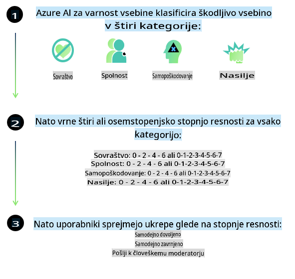
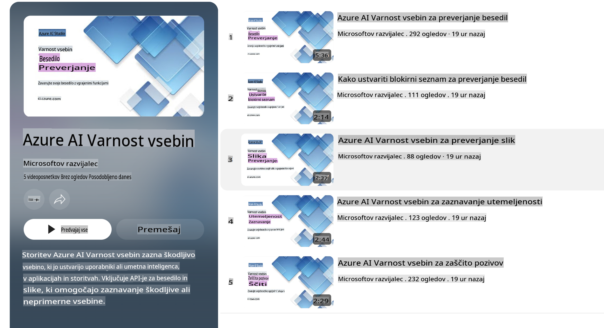

# Varnost umetne inteligence za modele Phi
Družina modelov Phi je bila razvita v skladu z [Microsoftovim standardom za odgovorno umetno inteligenco](https://query.prod.cms.rt.microsoft.com/cms/api/am/binary/RE5cmFl), ki je niz zahtev na ravni podjetja, temelječih na naslednjih šestih načelih: odgovornost, transparentnost, pravičnost, zanesljivost in varnost, zasebnost in varovanje podatkov ter vključevanje, ki skupaj tvorijo [Microsoftova načela odgovorne umetne inteligence](https://www.microsoft.com/ai/responsible-ai). 

Podobno kot prejšnji modeli Phi je bil tudi tokrat uporabljen večplasten pristop za ocenjevanje varnosti in naknadno usposabljanje za varnost, pri čemer so bili sprejeti dodatni ukrepi za upoštevanje večjezičnih zmožnosti te izdaje. Naš pristop k varnostnemu usposabljanju in ocenjevanju, vključno s testiranjem v več jezikih in različnih kategorijah tveganj, je opisan v [članku o naknadnem usposabljanju za varnost modelov Phi](https://arxiv.org/abs/2407.13833). Čeprav modeli Phi koristijo temu pristopu, bi morali razvijalci uporabljati najboljše prakse odgovorne umetne inteligence, vključno z mapiranjem, merjenjem in ublažitvijo tveganj, povezanih s specifično uporabo in kulturnim ter jezikovnim kontekstom.

## Najboljše prakse

Podobno kot drugi modeli lahko tudi modeli družine Phi delujejo na načine, ki so nepravični, nezanesljivi ali žaljivi.

Nekatera omejujoča vedenja SLM in LLM, na katera morate biti pozorni, vključujejo:

- **Kakovost storitve:** Modeli Phi so primarno usposobljeni na angleških besedilih. Jeziki, ki niso angleščina, bodo dosegali slabše rezultate. Angleški jezikovni različici z manjšo zastopanostjo v učnih podatkih, kot je standardna ameriška angleščina, lahko prav tako dosegata slabše rezultate.
- **Zastopanje škod in utrjevanje stereotipov:** Ti modeli lahko prekomerno ali premalo zastopajo določene skupine ljudi, izbrišejo zastopanost nekaterih skupin ali utrjujejo ponižujoče ali negativne stereotipe. Kljub naknadnemu usposabljanju za varnost te omejitve še vedno lahko obstajajo zaradi različnih ravni zastopanosti različnih skupin ali pogostosti primerov negativnih stereotipov v učnih podatkih, ki odražajo resnične vzorce in družbene pristranskosti.
- **Neprimerno ali žaljivo vsebino:** Ti modeli lahko ustvarijo druge vrste neprimerne ali žaljive vsebine, zaradi česar morda niso primerni za uporabo v občutljivih kontekstih brez dodatnih prilagoditev, specifičnih za določen primer uporabe.
- **Zanesljivost informacij:** Jezikovni modeli lahko ustvarjajo nesmiselne vsebine ali izmišljajo informacije, ki se zdijo razumne, vendar so netočne ali zastarele.
- **Omejen obseg za kodo:** Večina učnih podatkov za Phi-3 temelji na Pythonu in uporablja pogoste knjižnice, kot so "typing, math, random, collections, datetime, itertools". Če model generira Python skripte, ki uporabljajo druge knjižnice ali skripte v drugih jezikih, uporabnikom močno priporočamo ročno preverjanje vseh uporabljenih API-jev.

Razvijalci bi morali uporabljati najboljše prakse odgovorne umetne inteligence in so odgovorni za zagotavljanje, da specifičen primer uporabe ustreza ustreznim zakonom in predpisom (npr. zasebnost, trgovina itd.).

## Premisleki o odgovorni umetni inteligenci

Podobno kot drugi jezikovni modeli lahko tudi modeli serije Phi delujejo na načine, ki so nepravični, nezanesljivi ali žaljivi. Nekatera omejujoča vedenja, na katera morate biti pozorni, vključujejo:

**Kakovost storitve:** Modeli Phi so primarno usposobljeni na angleških besedilih. Jeziki, ki niso angleščina, bodo dosegali slabše rezultate. Angleški jezikovni različici z manjšo zastopanostjo v učnih podatkih, kot je standardna ameriška angleščina, lahko prav tako dosegata slabše rezultate.

**Zastopanje škod in utrjevanje stereotipov:** Ti modeli lahko prekomerno ali premalo zastopajo določene skupine ljudi, izbrišejo zastopanost nekaterih skupin ali utrjujejo ponižujoče ali negativne stereotipe. Kljub naknadnemu usposabljanju za varnost te omejitve še vedno lahko obstajajo zaradi različnih ravni zastopanosti različnih skupin ali pogostosti primerov negativnih stereotipov v učnih podatkih, ki odražajo resnične vzorce in družbene pristranskosti.

**Neprimerno ali žaljivo vsebino:** Ti modeli lahko ustvarijo druge vrste neprimerne ali žaljive vsebine, zaradi česar morda niso primerni za uporabo v občutljivih kontekstih brez dodatnih prilagoditev, specifičnih za določen primer uporabe.  
**Zanesljivost informacij:** Jezikovni modeli lahko ustvarjajo nesmiselne vsebine ali izmišljajo informacije, ki se zdijo razumne, vendar so netočne ali zastarele.

**Omejen obseg za kodo:** Večina učnih podatkov za Phi-3 temelji na Pythonu in uporablja pogoste knjižnice, kot so "typing, math, random, collections, datetime, itertools". Če model generira Python skripte, ki uporabljajo druge knjižnice ali skripte v drugih jezikih, uporabnikom močno priporočamo ročno preverjanje vseh uporabljenih API-jev.

Razvijalci bi morali uporabljati najboljše prakse odgovorne umetne inteligence in so odgovorni za zagotavljanje, da specifičen primer uporabe ustreza ustreznim zakonom in predpisom (npr. zasebnost, trgovina itd.). Pomembna področja za premislek vključujejo:

**Dodeljevanje:** Modeli morda niso primerni za scenarije, ki bi lahko imeli pomemben vpliv na pravni status ali dodeljevanje virov ali življenjskih priložnosti (npr. stanovanja, zaposlovanje, kredit itd.) brez nadaljnjih ocen in dodatnih tehnik za odpravljanje pristranskosti.

**Visoko tvegani scenariji:** Razvijalci bi morali oceniti ustreznost uporabe modelov v visoko tveganih scenarijih, kjer bi lahko nepravični, nezanesljivi ali žaljivi rezultati povzročili visoke stroške ali škodo. To vključuje podajanje nasvetov v občutljivih ali strokovnih domenah, kjer sta natančnost in zanesljivost ključnega pomena (npr. pravni ali zdravstveni nasveti). Na ravni aplikacije bi bilo treba implementirati dodatne varnostne ukrepe, prilagojene kontekstu uporabe.

**Dezinformacije:** Modeli lahko ustvarijo netočne informacije. Razvijalci bi morali upoštevati najboljše prakse za transparentnost in obvestiti končne uporabnike, da komunicirajo z AI sistemom. Na ravni aplikacije lahko razvijalci zgradijo mehanizme povratnih informacij in procese za povezovanje odgovorov s specifičnimi, kontekstualnimi informacijami za primer uporabe, kar je tehnika, znana kot Retrieval Augmented Generation (RAG).

**Ustvarjanje škodljive vsebine:** Razvijalci bi morali oceniti rezultate glede na njihov kontekst in uporabiti razpoložljive varnostne klasifikatorje ali prilagojene rešitve, primerne za njihov primer uporabe.

**Zloraba:** Druge oblike zlorabe, kot so goljufije, neželena pošta ali ustvarjanje zlonamerne programske opreme, so možne, zato bi morali razvijalci zagotoviti, da njihove aplikacije ne kršijo veljavnih zakonov in predpisov.

### Fino prilagajanje in varnost vsebine AI

Po finem prilagajanju modela zelo priporočamo uporabo [Azure AI Content Safety](https://learn.microsoft.com/azure/ai-services/content-safety/overview) za spremljanje vsebine, ki jo generirajo modeli, prepoznavanje in blokiranje morebitnih tveganj, groženj in težav s kakovostjo.

[Azure AI Content Safety](https://learn.microsoft.com/azure/ai-services/content-safety/overview) podpira tako besedilno kot slikovno vsebino. Lahko se uporablja v oblaku, v ločenih vsebnikih in na robnih/vgrajenih napravah.

## Pregled Azure AI Content Safety

Azure AI Content Safety ni univerzalna rešitev; lahko jo prilagodite tako, da je usklajena s specifičnimi politikami podjetja. Poleg tega njeni večjezični modeli omogočajo razumevanje več jezikov hkrati.

- **Azure AI Content Safety**
- **Microsoft Developer**
- **5 videov**

Storitev Azure AI Content Safety zaznava škodljivo vsebino, ki jo ustvarijo uporabniki ali AI, v aplikacijah in storitvah. Vključuje API-je za besedilo in slike, ki omogočajo zaznavanje škodljive ali neprimerne vsebine.

[Seznam predvajanja AI Content Safety](https://www.youtube.com/playlist?list=PLlrxD0HtieHjaQ9bJjyp1T7FeCbmVcPkQ)

**Omejitev odgovornosti**:  
Ta dokument je bil preveden z uporabo strojnih prevajalskih storitev, ki temeljijo na umetni inteligenci. Čeprav si prizadevamo za natančnost, vas opozarjamo, da lahko avtomatizirani prevodi vsebujejo napake ali netočnosti. Izvirni dokument v njegovem izvirnem jeziku je treba obravnavati kot avtoritativni vir. Za ključne informacije priporočamo profesionalen človeški prevod. Ne prevzemamo odgovornosti za morebitne nesporazume ali napačne razlage, ki izhajajo iz uporabe tega prevoda.