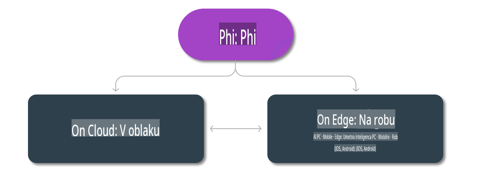

# Phi modeli in razpoložljivost na različnih platformah

## Scenariji za rob in oblak

## Razpoložljivost modelov in viri

| | | | | | | | | |
|-|-|-|-|-|-|-|-|-|
|Model|Vnos|Dolžina vsebine|Azure AI (MaaS)|Azure ML (MaaP)|ONNX|Hugging Face|Ollama|Nvidia NIM|
|Phi-3-vision-128k-instruct|Besedilo+Slika|128k|[Playground in uvajanje](https://ai.azure.com/explore/models/Phi-3-vision-128k-instruct/version/2/registry/azureml)|[Playground, uvajanje in prilagajanje](https://ml.azure.com/registries/azureml/models/Phi-3-vision-128k-instruct/version/2)|[CUDA](https://huggingface.co/microsoft/Phi-3-vision-128k-instruct-onnx-cuda/tree/main),[CPU](https://huggingface.co/microsoft/Phi-3-vision-128k-instruct-onnx-cpu/tree/main), [DirectML](https://huggingface.co/microsoft/Phi-3-vision-128k-instruct-onnx-directml/tree/main)|[Prenos](https://huggingface.co/microsoft/Phi-3-vision-128k-instruct)|-NA-|[NIM API-ji](https://build.nvidia.com/microsoft/phi-3-vision-128k-instruct)|
|Phi-3-mini-4k-instruct|Besedilo|4k|[Playground in uvajanje](https://aka.ms/phi3-mini-4k-azure-ml)|[Playground, uvajanje](https://aka.ms/phi3-mini-4k-azure-ml) in prilagajanje|[CUDA](https://huggingface.co/microsoft/Phi-3-mini-4k-instruct-onnx), [Splet](https://huggingface.co/microsoft/Phi-3-mini-4k-instruct-onnx)|[Playground in prenos](https://huggingface.co/chat/models/microsoft/Phi-3-mini-4k-instruct)|[GGUF](https://huggingface.co/microsoft/Phi-3-mini-4k-instruct-gguf)|[NIM API-ji](https://build.nvidia.com/microsoft/phi-3-mini-4k)|
|Phi-3-mini-128k-instruct|Besedilo|128k|[Playground in uvajanje](https://ai.azure.com/explore/models/Phi-3-mini-128k-instruct/version/9/registry/azureml)|[Playground, uvajanje](https://ai.azure.com/explore/models/Phi-3-mini-128k-instruct/version/9/registry/azureml) in prilagajanje|[CUDA](https://huggingface.co/microsoft/Phi-3-mini-128k-instruct-onnx)|[Prenos](https://huggingface.co/microsoft/Phi-3-mini-128k-instruct-onnx)|-NA-|[NIM API-ji](https://build.nvidia.com/microsoft/phi-3-mini)|
|Phi-3-small-8k-instruct|Besedilo|8k|[Playground in uvajanje](https://ml.azure.com/registries/azureml/models/Phi-3-small-8k-instruct/version/2)|[Playground, uvajanje](https://ai.azure.com/explore/models/Phi-3-small-8k-instruct/version/2/registry/azureml) in prilagajanje|[CUDA](https://huggingface.co/microsoft/Phi-3-small-8k-instruct-onnx-cuda)|[Prenos](https://huggingface.co/microsoft/Phi-3-small-8k-instruct-onnx-cuda)|-NA-|[NIM API-ji](https://build.nvidia.com/microsoft/phi-3-small-8k-instruct?docker=false)|
|Phi-3-small-128k-instruct|Besedilo|128k|[Playground in uvajanje](https://ai.azure.com/explore/models/Phi-3-small-128k-instruct/version/2/registry/azureml)|[Playground, uvajanje](https://ml.azure.com/registries/azureml/models/Phi-3-small-128k-instruct/version/2) in prilagajanje|[CUDA](https://huggingface.co/microsoft/Phi-3-medium-128k-instruct-onnx-cuda)|[Prenos](https://huggingface.co/microsoft/Phi-3-small-128k-instruct)|-NA-|[NIM API-ji](https://build.nvidia.com/microsoft/phi-3-small-128k-instruct?docker=false)|
|Phi-3-medium-4k-instruct|Besedilo|4k|[Playground & Namestitev](https://huggingface.co/microsoft/Phi-3-medium-4k-instruct)|[Playground, Namestitev](https://ml.azure.com/registries/azureml/models/Phi-3-medium-4k-instruct/version/2) & Prilagajanje|[CUDA](https://huggingface.co/microsoft/Phi-3-medium-4k-instruct-onnx-cuda/tree/main), [CPU](https://huggingface.co/microsoft/Phi-3-medium-4k-instruct-onnx-cpu/tree/main), [DirectML](https://huggingface.co/microsoft/Phi-3-medium-4k-instruct-onnx-directml/tree/main)|[Prenos](https://huggingface.co/microsoft/Phi-3-medium-4k-instruct)|-NA-|[NIM API-ji](https://build.nvidia.com/microsoft/phi-3-medium-4k-instruct?docker=false)|
|Phi-3-medium-128k-instruct|Besedilo|128k|[Playground & Namestitev](https://ai.azure.com/explore/models/Phi-3-medium-128k-instruct/version/2)|[Playground, Namestitev](https://ml.azure.com/registries/azureml/models/Phi-3-medium-128k-instruct/version/2) & Prilagajanje|[CUDA](https://huggingface.co/microsoft/Phi-3-medium-128k-instruct-onnx-cuda/tree/main), [CPU](https://huggingface.co/microsoft/Phi-3-medium-128k-instruct-onnx-cpu/tree/main), [DirectML](https://huggingface.co/microsoft/Phi-3-medium-128k-instruct-onnx-directml/tree/main)|[Prenos](https://huggingface.co/microsoft/Phi-3-medium-128k-instruct)|-NA-|-NA-|

**Omejitev odgovornosti**:  
Ta dokument je bil preveden s pomočjo strojnih storitev umetne inteligence za prevajanje. Čeprav si prizadevamo za natančnost, vas prosimo, da upoštevate, da lahko avtomatizirani prevodi vsebujejo napake ali netočnosti. Izvirni dokument v svojem maternem jeziku je treba obravnavati kot avtoritativni vir. Za ključne informacije priporočamo strokovni človeški prevod. Ne prevzemamo odgovornosti za morebitne nesporazume ali napačne razlage, ki izhajajo iz uporabe tega prevoda.