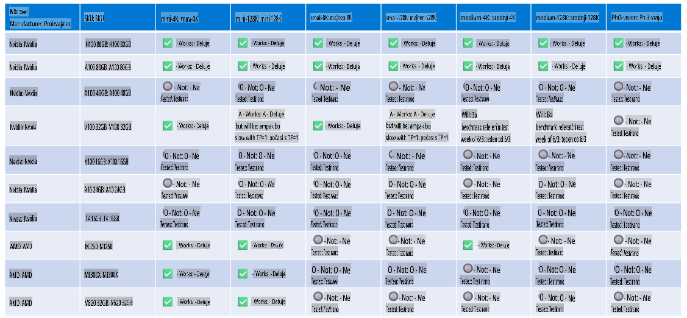

# Podpora strojne opreme Phi

Microsoft Phi je optimiziran za ONNX Runtime in podpira Windows DirectML. Dobro deluje na različnih vrstah strojne opreme, vključno z GPU-ji, CPU-ji in celo mobilnimi napravami.

## Strojna oprema naprave
Podprta strojna oprema vključuje:

- GPU SKU: RTX 4090 (DirectML)
- GPU SKU: 1 A100 80GB (CUDA)
- CPU SKU: Standard F64s v2 (64 vCPU-jev, 128 GiB pomnilnika)

## Mobilni SKU

- Android - Samsung Galaxy S21
- Apple iPhone 14 ali novejši z A16/A17 procesorjem

## Specifikacije strojne opreme Phi

- Zahtevana minimalna konfiguracija.
- Windows: GPU, združljiv z DirectX 12, in najmanj 4 GB skupnega RAM-a

CUDA: NVIDIA GPU z zmogljivostjo Compute Capability >= 7.02



## Zagon onnxruntime na več GPU-jih

Trenutno so na voljo Phi ONNX modeli samo za 1 GPU. Možno je omogočiti podporo za več GPU-jev pri Phi modelih, vendar ORT z 2 GPU-jema ne zagotavlja, da bo dosežena večja prepustnost v primerjavi z dvema ločenima instancama ORT. Za najnovejše posodobitve si oglejte [ONNX Runtime](https://onnxruntime.ai/).

Na [Build 2024 je ekipa GenAI ONNX](https://youtu.be/WLW4SE8M9i8?si=EtG04UwDvcjunyfC) objavila, da so omogočili več instanc namesto več GPU-jev za Phi modele.

Trenutno to omogoča zagon ene instance onnxruntime ali onnxruntime-genai z uporabo spremenljivke okolja CUDA_VISIBLE_DEVICES, kot je prikazano tukaj.

```Python
CUDA_VISIBLE_DEVICES=0 python infer.py
CUDA_VISIBLE_DEVICES=1 python infer.py
```

Raziskujte Phi še naprej na [Azure AI Foundry](https://ai.azure.com)

**Omejitev odgovornosti**:  
Ta dokument je bil preveden s pomočjo storitev strojnega prevajanja z umetno inteligenco. Čeprav si prizadevamo za natančnost, vas prosimo, da upoštevate, da lahko avtomatski prevodi vsebujejo napake ali netočnosti. Izvirni dokument v svojem izvirnem jeziku je treba obravnavati kot avtoritativni vir. Za ključne informacije priporočamo strokovni prevod s strani človeka. Ne prevzemamo odgovornosti za morebitna nesporazumevanja ali napačne razlage, ki bi izhajale iz uporabe tega prevoda.