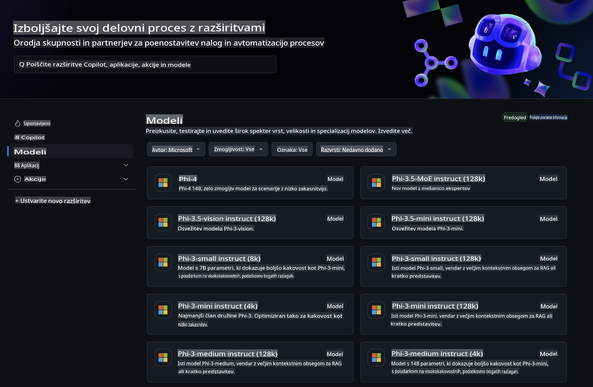
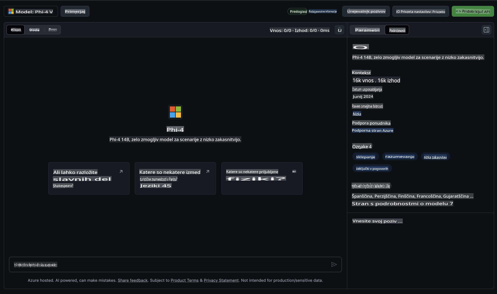
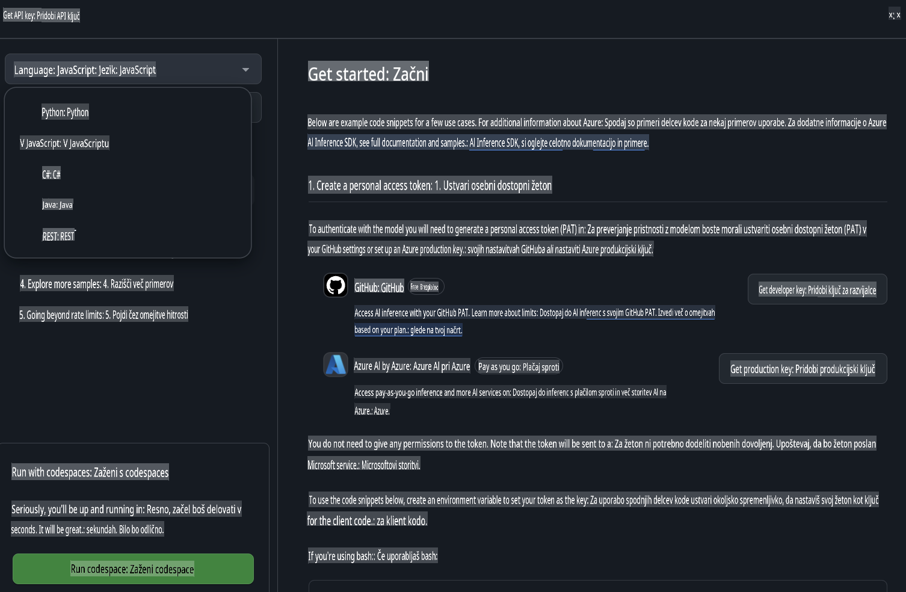
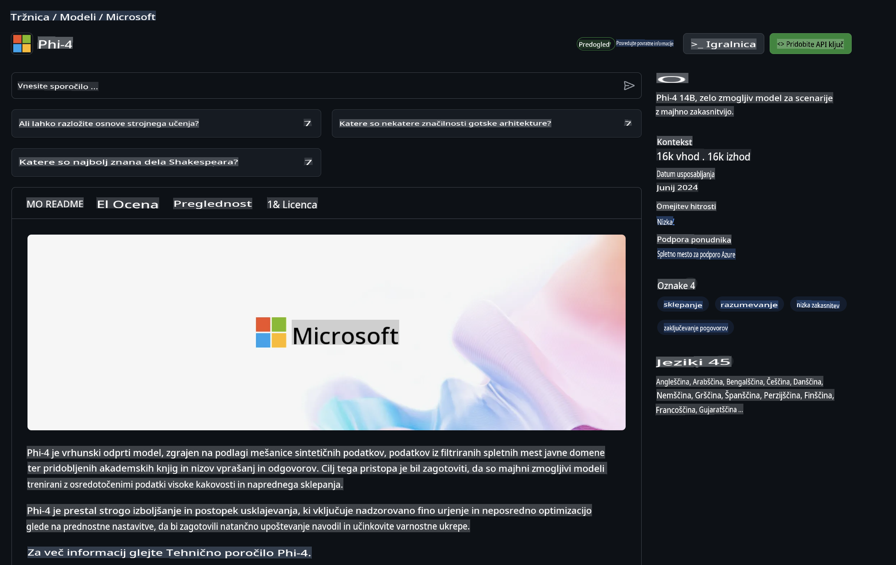

## Družina Phi v GitHub Modelih

Dobrodošli v [GitHub Modelih](https://github.com/marketplace/models)! Vse je pripravljeno, da raziskujete AI modele, gostovane na Azure AI.



Za več informacij o modelih, ki so na voljo v GitHub Modelih, obiščite [GitHub Model Marketplace](https://github.com/marketplace/models).

## Razpoložljivi modeli

Vsak model ima svoj namenski prostor za testiranje in vzorčno kodo.



### Družina Phi v GitHub Katalogu Modelov

- [Phi-4](https://github.com/marketplace/models/azureml/Phi-4)

- [Phi-3.5-MoE instruct (128k)](https://github.com/marketplace/models/azureml/Phi-3-5-MoE-instruct)

- [Phi-3.5-vision instruct (128k)](https://github.com/marketplace/models/azureml/Phi-3-5-vision-instruct)

- [Phi-3.5-mini instruct (128k)](https://github.com/marketplace/models/azureml/Phi-3-5-mini-instruct)

- [Phi-3-Medium-128k-Instruct](https://github.com/marketplace/models/azureml/Phi-3-medium-128k-instruct)

- [Phi-3-medium-4k-instruct](https://github.com/marketplace/models/azureml/Phi-3-medium-4k-instruct)

- [Phi-3-mini-128k-instruct](https://github.com/marketplace/models/azureml/Phi-3-mini-128k-instruct)

- [Phi-3-mini-4k-instruct](https://github.com/marketplace/models/azureml/Phi-3-mini-4k-instruct)

- [Phi-3-small-128k-instruct](https://github.com/marketplace/models/azureml/Phi-3-small-128k-instruct)

- [Phi-3-small-8k-instruct](https://github.com/marketplace/models/azureml/Phi-3-small-8k-instruct)

## Začetek

Na voljo je nekaj osnovnih primerov, ki so pripravljeni za uporabo. Najdete jih v mapi s primeri. Če želite takoj preiti na svoj najljubši programski jezik, so primeri na voljo v naslednjih jezikih:

- Python
- JavaScript
- C#
- Java
- cURL

Na voljo je tudi namensko okolje Codespaces za izvajanje primerov in modelov.



## Vzorec kode

Spodaj so prikazani odlomki kode za nekaj primerov uporabe. Za dodatne informacije o Azure AI Inference SDK si oglejte celotno dokumentacijo in primere.

## Nastavitev

1. Ustvarite osebni dostopni žeton  
Za ta žeton ni treba dodeliti nobenih dovoljenj. Upoštevajte, da bo žeton poslan Microsoftovi storitvi.

Za uporabo spodnjih odlomkov kode ustvarite okoljsko spremenljivko, da nastavite svoj žeton kot ključ za odjemalsko kodo.

Če uporabljate bash:  
```
export GITHUB_TOKEN="<your-github-token-goes-here>"
```  
Če uporabljate PowerShell:  

```
$Env:GITHUB_TOKEN="<your-github-token-goes-here>"
```  

Če uporabljate Windows ukazno vrstico:  

```
set GITHUB_TOKEN=<your-github-token-goes-here>
```  

## Python Primer

### Namestitev odvisnosti  
Namestite Azure AI Inference SDK z uporabo pip (zahteva: Python >=3.8):  

```
pip install azure-ai-inference
```  

### Zagon osnovnega primera kode  

Ta primer prikazuje osnovni klic API-ja za dokončanje pogovora. Uporablja GitHub AI model in vaš GitHub žeton. Klic je sinhron.  

```python
import os
from azure.ai.inference import ChatCompletionsClient
from azure.ai.inference.models import SystemMessage, UserMessage
from azure.core.credentials import AzureKeyCredential

endpoint = "https://models.inference.ai.azure.com"
model_name = "Phi-4"
token = os.environ["GITHUB_TOKEN"]

client = ChatCompletionsClient(
    endpoint=endpoint,
    credential=AzureKeyCredential(token),
)

response = client.complete(
    messages=[
        UserMessage(content="I have $20,000 in my savings account, where I receive a 4% profit per year and payments twice a year. Can you please tell me how long it will take for me to become a millionaire? Also, can you please explain the math step by step as if you were explaining it to an uneducated person?"),
    ],
    temperature=0.4,
    top_p=1.0,
    max_tokens=2048,
    model=model_name
)

print(response.choices[0].message.content)
```  

### Zagon pogovora z več koraki  

Ta primer prikazuje pogovor z več koraki z API-jem za dokončanje pogovora. Pri uporabi modela za pogovorno aplikacijo morate upravljati zgodovino pogovora in modelu poslati najnovejša sporočila.  

```
import os
from azure.ai.inference import ChatCompletionsClient
from azure.ai.inference.models import AssistantMessage, SystemMessage, UserMessage
from azure.core.credentials import AzureKeyCredential

token = os.environ["GITHUB_TOKEN"]
endpoint = "https://models.inference.ai.azure.com"
# Replace Model_Name
model_name = "Phi-4"

client = ChatCompletionsClient(
    endpoint=endpoint,
    credential=AzureKeyCredential(token),
)

messages = [
    SystemMessage(content="You are a helpful assistant."),
    UserMessage(content="What is the capital of France?"),
    AssistantMessage(content="The capital of France is Paris."),
    UserMessage(content="What about Spain?"),
]

response = client.complete(messages=messages, model=model_name)

print(response.choices[0].message.content)
```  

### Pretok izhoda  

Za boljšo uporabniško izkušnjo boste želeli pretakati odziv modela, da se prvi token prikaže čim prej in se izognete čakanju na dolge odzive.  

```
import os
from azure.ai.inference import ChatCompletionsClient
from azure.ai.inference.models import SystemMessage, UserMessage
from azure.core.credentials import AzureKeyCredential

token = os.environ["GITHUB_TOKEN"]
endpoint = "https://models.inference.ai.azure.com"
# Replace Model_Name
model_name = "Phi-4"

client = ChatCompletionsClient(
    endpoint=endpoint,
    credential=AzureKeyCredential(token),
)

response = client.complete(
    stream=True,
    messages=[
        SystemMessage(content="You are a helpful assistant."),
        UserMessage(content="Give me 5 good reasons why I should exercise every day."),
    ],
    model=model_name,
)

for update in response:
    if update.choices:
        print(update.choices[0].delta.content or "", end="")

client.close()
```  

## BREZPLAČNA uporaba in omejitve hitrosti za GitHub Modele  



[Omejitve hitrosti za testni prostor in brezplačno uporabo API-ja](https://docs.github.com/en/github-models/prototyping-with-ai-models#rate-limits) so zasnovane za eksperimentiranje z modeli in prototipiranje vaše AI aplikacije. Za uporabo, ki presega te omejitve, in za širitev vaše aplikacije, morate zagotoviti vire iz Azure računa in se od tam avtenticirati namesto z vašim GitHub osebnim dostopnim žetonom. V kodi vam ni treba ničesar spreminjati. Uporabite to povezavo, da odkrijete, kako preseči omejitve brezplačnega sloja v Azure AI.  

### Razkritja  

Ne pozabite, da pri interakciji z modelom eksperimentirate z AI, zato so možne napake v vsebini.  

Funkcija je podvržena različnim omejitvam (vključno s številom zahtev na minuto, na dan, tokeni na zahtevo in sočasnimi zahtevami) in ni zasnovana za produkcijske primere uporabe.  

GitHub Modeli uporabljajo Azure AI Content Safety. Te filtre ni mogoče izklopiti kot del izkušnje z GitHub Modeli. Če se odločite za uporabo modelov prek plačljive storitve, konfigurirajte svoje filtre vsebine tako, da ustrezajo vašim zahtevam.  

Ta storitev je pod GitHubovimi pogoji predizdaje.  

**Omejitev odgovornosti**:  
Ta dokument je bil preveden z uporabo storitev strojnega prevajanja, ki jih omogoča umetna inteligenca. Čeprav si prizadevamo za natančnost, vas opozarjamo, da lahko avtomatizirani prevodi vsebujejo napake ali netočnosti. Izvirni dokument v njegovem izvirnem jeziku je treba obravnavati kot avtoritativni vir. Za ključne informacije priporočamo strokovni človeški prevod. Ne prevzemamo odgovornosti za morebitne nesporazume ali napačne razlage, ki izhajajo iz uporabe tega prevoda.