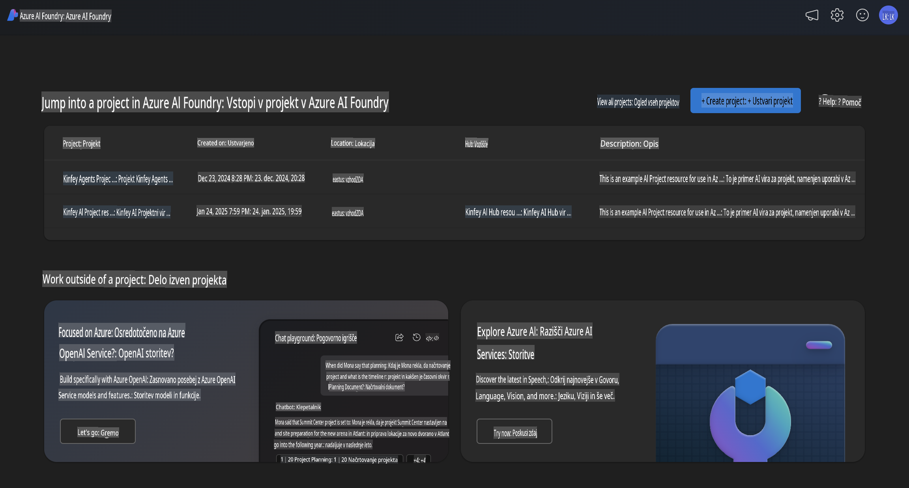
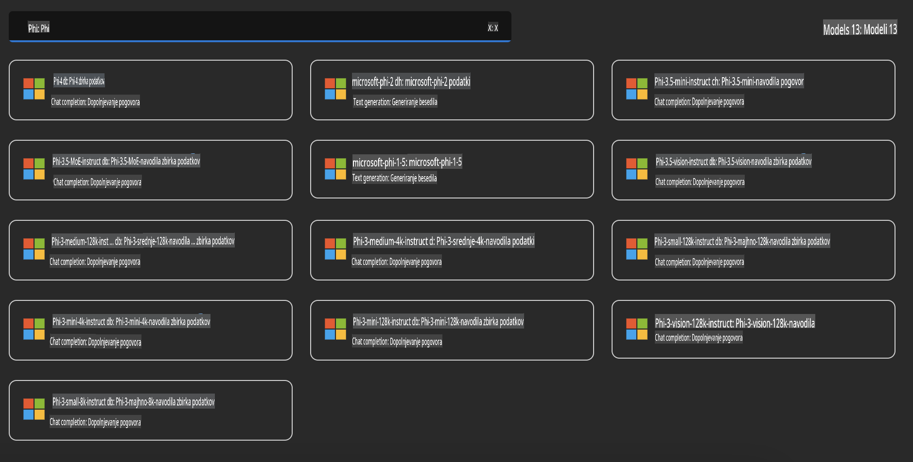
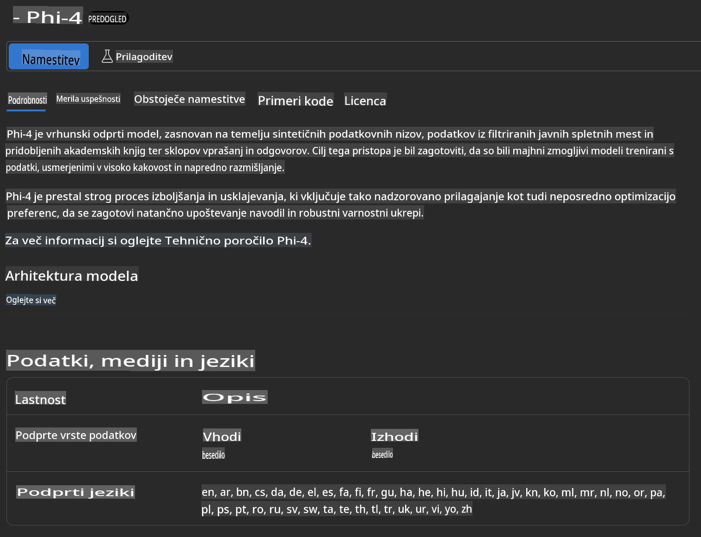
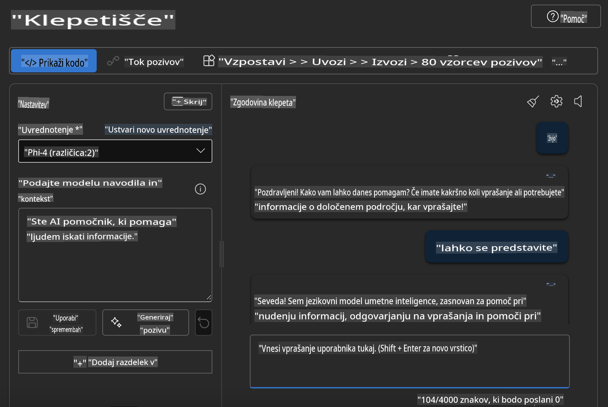

## Družina Phi v Azure AI Foundry

[Azure AI Foundry](https://ai.azure.com) je zaupanja vredna platforma, ki razvijalcem omogoča spodbujanje inovacij in oblikovanje prihodnosti z umetno inteligenco na varen, zanesljiv in odgovoren način.

[Azure AI Foundry](https://ai.azure.com) je zasnovan za razvijalce, da lahko:

- Gradijo generativne aplikacije z umetno inteligenco na platformi podjetniškega razreda.
- Raziskujejo, gradijo, testirajo in uvajajo z uporabo najsodobnejših orodij za umetno inteligenco in modelov strojnega učenja, ki temeljijo na načelih odgovorne umetne inteligence.
- Sodelujejo z ekipo skozi celoten življenjski cikel razvoja aplikacij.

Z Azure AI Foundry lahko raziskujete širok spekter modelov, storitev in zmogljivosti ter začnete graditi AI aplikacije, ki najbolje služijo vašim ciljem. Platforma Azure AI Foundry omogoča enostavno prilagoditev za preoblikovanje prototipov v popolnoma razvite produkcijske aplikacije. Nenehno spremljanje in izboljšave podpirajo dolgoročni uspeh.



Poleg uporabe Azure AOAI Service v Azure AI Foundry lahko v katalogu modelov Azure AI Foundry uporabljate tudi modele tretjih oseb. To je dobra izbira, če želite uporabiti Azure AI Foundry kot svojo platformo za AI rešitve.

Modele družine Phi lahko hitro uvedemo prek kataloga modelov v Azure AI Foundry.



### **Uvedba Phi-4 v Azure AI Foundry**



### **Testiranje Phi-4 v Azure AI Foundry Playground**



### **Zagon Python kode za klic Azure AI Foundry Phi-4**

```python

import os  
import base64
from openai import AzureOpenAI  
from azure.identity import DefaultAzureCredential, get_bearer_token_provider  
        
endpoint = os.getenv("ENDPOINT_URL", "Your Azure AOAI Service Endpoint")  
deployment = os.getenv("DEPLOYMENT_NAME", "Phi-4")  
      
token_provider = get_bearer_token_provider(  
    DefaultAzureCredential(),  
    "https://cognitiveservices.azure.com/.default"  
)  
  
client = AzureOpenAI(  
    azure_endpoint=endpoint,  
    azure_ad_token_provider=token_provider,  
    api_version="2024-05-01-preview",  
)  
  

chat_prompt = [
    {
        "role": "system",
        "content": "You are an AI assistant that helps people find information."
    },
    {
        "role": "user",
        "content": "can you introduce yourself"
    }
] 
    
# Include speech result if speech is enabled  
messages = chat_prompt 

completion = client.chat.completions.create(  
    model=deployment,  
    messages=messages,
    max_tokens=800,  
    temperature=0.7,  
    top_p=0.95,  
    frequency_penalty=0,  
    presence_penalty=0,
    stop=None,  
    stream=False  
)  
  
print(completion.to_json())  

```

**Omejitev odgovornosti**:  
Ta dokument je bil preveden z uporabo storitev strojnega prevajanja, ki temeljijo na umetni inteligenci. Čeprav si prizadevamo za natančnost, vas opozarjamo, da lahko avtomatski prevodi vsebujejo napake ali netočnosti. Izvirni dokument v njegovem izvirnem jeziku je treba obravnavati kot avtoritativni vir. Za ključne informacije je priporočljivo uporabiti profesionalni človeški prevod. Ne prevzemamo odgovornosti za morebitne nesporazume ali napačne razlage, ki izhajajo iz uporabe tega prevoda.