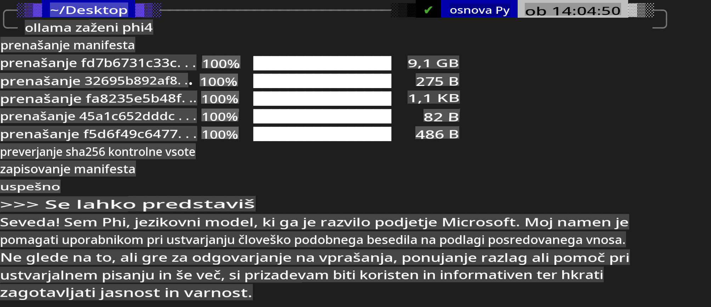
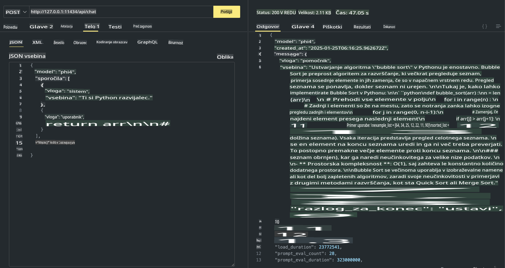

## Phi družina v Ollama

[Ollama](https://ollama.com) omogoča več ljudem neposredno uporabo odprtokodnih LLM ali SLM prek preprostih skriptov, poleg tega pa omogoča tudi gradnjo API-jev za podporo lokalnim aplikacijam Copilot.

## **1. Namestitev**

Ollama podpira delovanje na Windows, macOS in Linux. Ollamo lahko namestite prek te povezave ([https://ollama.com/download](https://ollama.com/download)). Po uspešni namestitvi lahko neposredno uporabite Ollama skript za klic Phi-3 prek terminalskega okna. Vse [dostopne knjižnice v Ollama](https://ollama.com/library) si lahko ogledate tukaj. Če to repozitorij odprete v Codespace, bo Ollama že nameščena.

```bash

ollama run phi4

```

> [!NOTE]
> Model se bo prvič ob zagonu prenesel. Seveda lahko tudi neposredno določite že preneseni model Phi-4. Za primer vzemimo WSL, kjer zaženemo ukaz. Ko je model uspešno prenesen, lahko neposredno komunicirate prek terminala.



## **2. Klic API-ja phi-4 iz Ollama**

Če želite klicati API phi-4, ki ga ustvari Ollama, lahko uporabite ta ukaz v terminalu za zagon Ollama strežnika.

```bash

ollama serve

```

> [!NOTE]
> Če uporabljate macOS ali Linux, bodite pozorni, da se lahko pojavi naslednja napaka **"Error: listen tcp 127.0.0.1:11434: bind: address already in use"**. To napako lahko prejmete ob zagonu ukaza. Napako lahko prezrete, saj običajno pomeni, da strežnik že deluje, ali pa Ollama ustavite in ponovno zaženete:

**macOS**

```bash

brew services restart ollama

```

**Linux**

```bash

sudo systemctl stop ollama

```

Ollama podpira dva API-ja: generate in chat. Model API, ki ga Ollama ponuja, lahko kličete glede na vaše potrebe, tako da pošljete zahteve lokalni storitvi, ki deluje na portu 11434.

**Chat**

```bash

curl http://127.0.0.1:11434/api/chat -d '{
  "model": "phi3",
  "messages": [
    {
      "role": "system",
      "content": "Your are a python developer."
    },
    {
      "role": "user",
      "content": "Help me generate a bubble algorithm"
    }
  ],
  "stream": false
  
}'

This is the result in Postman



## Additional Resources

Check the list of available models in Ollama in [their library](https://ollama.com/library).

Pull your model from the Ollama server using this command

```bash
ollama pull phi4
```

Run the model using this command

```bash
ollama run phi4
```

***Note:*** Visit this link [https://github.com/ollama/ollama/blob/main/docs/api.md](https://github.com/ollama/ollama/blob/main/docs/api.md) to learn more

## Calling Ollama from Python

You can use `requests` or `urllib3` to make requests to the local server endpoints used above. However, a popular way to use Ollama in Python is via the [openai](https://pypi.org/project/openai/) SDK, since Ollama provides OpenAI-compatible server endpoints as well.

Here is an example for phi3-mini:

```python
import openai

client = openai.OpenAI(
    base_url="http://localhost:11434/v1",
    api_key="nokeyneeded",
)

response = client.chat.completions.create(
    model="phi4",
    temperature=0.7,
    n=1,
    messages=[
        {"role": "system", "content": "You are a helpful assistant."},
        {"role": "user", "content": "Write a haiku about a hungry cat"},
    ],
)

print("Response:")
print(response.choices[0].message.content)
```

## Calling Ollama from JavaScript 

```javascript
// Primer povzetka datoteke s Phi-4
script({
    model: "ollama:phi4",
    title: "Povzetek s Phi-4",
    system: ["system"],
})

// Primer povzetka
const file = def("FILE", env.files)
$`Povzemi ${file} v enem odstavku.`
```

## Calling Ollama from C#

Create a new C# Console application and add the following NuGet package:

```bash
dotnet add package Microsoft.SemanticKernel --version 1.34.0
```

Then replace this code in the `Program.cs` file

```csharp
using Microsoft.SemanticKernel;
using Microsoft.SemanticKernel.ChatCompletion;

// dodaj storitev za klepet s pomočjo lokalne ollama strežniške točke
#pragma warning disable SKEXP0001, SKEXP0003, SKEXP0010, SKEXP0011, SKEXP0050, SKEXP0052
builder.AddOpenAIChatCompletion(
    modelId: "phi4",
    endpoint: new Uri("http://localhost:11434/"),
    apiKey: "non required");

// pošlji preprosto zahtevo storitvi za klepet
string prompt = "Napiši šalo o muckih";
var response = await kernel.InvokePromptAsync(prompt);
Console.WriteLine(response.GetValue<string>());
```

Run the app with the command:

```bash
dotnet run
```

**Omejitev odgovornosti**:  
Ta dokument je bil preveden z uporabo storitev strojnega prevajanja z umetno inteligenco. Čeprav si prizadevamo za natančnost, vas prosimo, da se zavedate, da lahko avtomatski prevodi vsebujejo napake ali netočnosti. Izvirni dokument v svojem maternem jeziku je treba obravnavati kot avtoritativni vir. Za ključne informacije priporočamo strokovno človeško prevajanje. Ne prevzemamo odgovornosti za morebitne nesporazume ali napačne razlage, ki izhajajo iz uporabe tega prevoda.