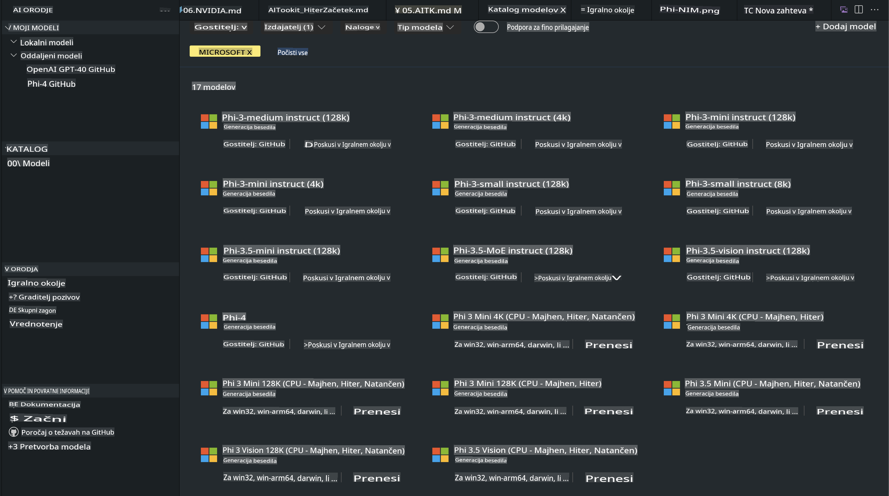
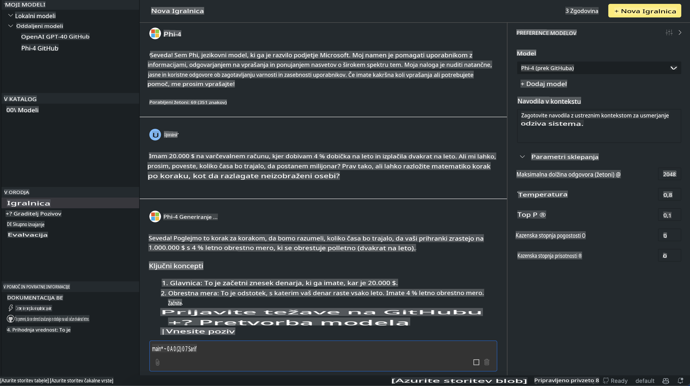

# Phi Family v AITK

[AI Toolkit za VS Code](https://marketplace.visualstudio.com/items?itemName=ms-windows-ai-studio.windows-ai-studio) poenostavi razvoj aplikacij z generativno umetno inteligenco, saj združuje najsodobnejša orodja in modele iz kataloga Azure AI Foundry ter drugih katalogov, kot je Hugging Face. Omogoča vam pregledovanje kataloga modelov umetne inteligence, ki ga poganjata GitHub Models in Azure AI Foundry Model Catalogs, njihovo lokalno ali oddaljeno prenašanje, prilagajanje, testiranje in uporabo v vaši aplikaciji.

Predogled AI Toolkit se izvaja lokalno. Lokalno sklepanje ali prilagajanje je odvisno od izbranega modela, za kar boste morda potrebovali GPU, kot je NVIDIA CUDA GPU. GitHub modele lahko z AITK izvajate neposredno.

## Začetek

[Več o tem, kako namestiti Windows Subsystem for Linux](https://learn.microsoft.com/windows/wsl/install?WT.mc_id=aiml-137032-kinfeylo)

in [spreminjanje privzete distribucije](https://learn.microsoft.com/windows/wsl/install#change-the-default-linux-distribution-installed).

[AI Toolkit GitHub repozitorij](https://github.com/microsoft/vscode-ai-toolkit/)

- Windows, Linux, macOS
  
- Za prilagajanje na Windows in Linux potrebujete Nvidia GPU. Poleg tega **Windows** zahteva subsystem for Linux z distribucijo Ubuntu 18.4 ali novejšo. [Več o tem, kako namestiti Windows Subsystem for Linux](https://learn.microsoft.com/windows/wsl/install) in [spreminjanje privzete distribucije](https://learn.microsoft.com/windows/wsl/install#change-the-default-linux-distribution-installed).

### Namestitev AI Toolkit

AI Toolkit je na voljo kot [Visual Studio Code razširitev](https://code.visualstudio.com/docs/setup/additional-components#_vs-code-extensions), zato morate najprej namestiti [VS Code](https://code.visualstudio.com/docs/setup/windows?WT.mc_id=aiml-137032-kinfeylo) in nato prenesti AI Toolkit iz [VS Marketplace](https://marketplace.visualstudio.com/items?itemName=ms-windows-ai-studio.windows-ai-studio).  
[AI Toolkit je na voljo v Visual Studio Marketplace](https://marketplace.visualstudio.com/items?itemName=ms-windows-ai-studio.windows-ai-studio) in ga je mogoče namestiti kot katero koli drugo razširitev za VS Code.

Če niste seznanjeni z nameščanjem razširitev za VS Code, sledite tem korakom:

### Prijava

1. V Activity Bar v VS Code izberite **Extensions**  
1. V iskalno vrstico za razširitve vnesite "AI Toolkit"  
1. Izberite "AI Toolkit for Visual Studio Code"  
1. Kliknite **Install**  

Zdaj ste pripravljeni za uporabo razširitve!

Pozvani boste, da se prijavite v GitHub, zato kliknite "Allow" za nadaljevanje. Preusmerjeni boste na stran za prijavo v GitHub.

Prijavite se in sledite korakom postopka. Po uspešnem zaključku boste preusmerjeni nazaj v VS Code.

Ko je razširitev nameščena, se bo ikona AI Toolkit prikazala v vašem Activity Bar.

Raziščimo razpoložljive možnosti!

### Razpoložljive možnosti

Glavna stranska vrstica AI Toolkit je organizirana v naslednje razdelke:  

- **Models**  
- **Resources**  
- **Playground**  
- **Fine-tuning**  
- **Evaluation**  

Ti so na voljo v razdelku Resources. Za začetek izberite **Model Catalog**.

### Prenos modela iz kataloga

Ko zaženete AI Toolkit iz stranske vrstice VS Code, lahko izbirate med naslednjimi možnostmi:



- Poiščite podprt model v **Model Catalog** in ga prenesite lokalno  
- Testirajte sklepanje modela v **Model Playground**  
- Lokalno ali oddaljeno prilagodite model v **Model Fine-tuning**  
- Namestite prilagojene modele v oblak prek ukazne palete za AI Toolkit  
- Ocenite modele  

> [!NOTE]
>
> **GPU proti CPU**
>
> Opazili boste, da kartice modelov prikazujejo velikost modela, platformo in vrsto pospeševalnika (CPU, GPU). Za optimizirano delovanje na **Windows napravah, ki imajo vsaj en GPU**, izberite različice modelov, ki ciljajo le na Windows.
>
> To zagotavlja, da imate model, optimiziran za pospeševalnik DirectML.
>
> Imena modelov so v obliki:
>
> - `{model_name}-{accelerator}-{quantization}-{format}`.
>
> Če želite preveriti, ali imate GPU na vaši Windows napravi, odprite **Task Manager** in izberite zavihek **Performance**. Če imate GPU-je, bodo navedeni pod imeni, kot so "GPU 0" ali "GPU 1".

### Zagon modela v Playground

Ko so vsi parametri nastavljeni, kliknite **Generate Project**.

Ko je vaš model prenesen, izberite **Load in Playground** na kartici modela v katalogu:

- Zaženite prenos modela  
- Namestite vse predpogoje in odvisnosti  
- Ustvarite VS Code delovni prostor  



### Uporaba REST API v vaši aplikaciji

AI Toolkit vključuje lokalni REST API spletni strežnik **na portu 5272**, ki uporablja [OpenAI chat completions format](https://platform.openai.com/docs/api-reference/chat/create).

To vam omogoča testiranje vaše aplikacije lokalno, brez odvisnosti od storitev AI modelov v oblaku. Na primer, naslednja JSON datoteka prikazuje, kako konfigurirati telo zahteve:

```json
{
    "model": "Phi-4",
    "messages": [
        {
            "role": "user",
            "content": "what is the golden ratio?"
        }
    ],
    "temperature": 0.7,
    "top_p": 1,
    "top_k": 10,
    "max_tokens": 100,
    "stream": true
}
```

REST API lahko testirate z orodji, kot je [Postman](https://www.postman.com/) ali pripomočkom CURL (Client URL):

```bash
curl -vX POST http://127.0.0.1:5272/v1/chat/completions -H 'Content-Type: application/json' -d @body.json
```

### Uporaba OpenAI knjižnice za Python

```python
from openai import OpenAI

client = OpenAI(
    base_url="http://127.0.0.1:5272/v1/", 
    api_key="x" # required for the API but not used
)

chat_completion = client.chat.completions.create(
    messages=[
        {
            "role": "user",
            "content": "what is the golden ratio?",
        }
    ],
    model="Phi-4",
)

print(chat_completion.choices[0].message.content)
```

### Uporaba Azure OpenAI knjižnice za .NET

Dodajte [Azure OpenAI knjižnico za .NET](https://www.nuget.org/packages/Azure.AI.OpenAI/) v svoj projekt z uporabo NuGet:

```bash
dotnet add {project_name} package Azure.AI.OpenAI --version 1.0.0-beta.17
```

Dodajte datoteko C# z imenom **OverridePolicy.cs** v svoj projekt in prilepite naslednjo kodo:

```csharp
// OverridePolicy.cs
using Azure.Core.Pipeline;
using Azure.Core;

internal partial class OverrideRequestUriPolicy(Uri overrideUri)
    : HttpPipelineSynchronousPolicy
{
    private readonly Uri _overrideUri = overrideUri;

    public override void OnSendingRequest(HttpMessage message)
    {
        message.Request.Uri.Reset(_overrideUri);
    }
}
```

Nato prilepite naslednjo kodo v svojo datoteko **Program.cs**:

```csharp
// Program.cs
using Azure.AI.OpenAI;

Uri localhostUri = new("http://localhost:5272/v1/chat/completions");

OpenAIClientOptions clientOptions = new();
clientOptions.AddPolicy(
    new OverrideRequestUriPolicy(localhostUri),
    Azure.Core.HttpPipelinePosition.BeforeTransport);
OpenAIClient client = new(openAIApiKey: "unused", clientOptions);

ChatCompletionsOptions options = new()
{
    DeploymentName = "Phi-4",
    Messages =
    {
        new ChatRequestSystemMessage("You are a helpful assistant. Be brief and succinct."),
        new ChatRequestUserMessage("What is the golden ratio?"),
    }
};

StreamingResponse<StreamingChatCompletionsUpdate> streamingChatResponse
    = await client.GetChatCompletionsStreamingAsync(options);

await foreach (StreamingChatCompletionsUpdate chatChunk in streamingChatResponse)
{
    Console.Write(chatChunk.ContentUpdate);
}
```

## Prilagajanje z AI Toolkit

- Začnite z odkrivanjem modelov in Playground.  
- Prilagajanje in sklepanje modelov z uporabo lokalnih računalniških virov.  
- Oddaljeno prilagajanje in sklepanje z uporabo Azure virov.  

[Prilagajanje z AI Toolkit](../../03.FineTuning/Finetuning_VSCodeaitoolkit.md)

## AI Toolkit Q&A Viri

Za najpogostejše težave in rešitve obiščite našo [stran z vprašanji in odgovori](https://github.com/microsoft/vscode-ai-toolkit/blob/main/archive/QA.md).

**Omejitev odgovornosti**:  
Ta dokument je bil preveden z uporabo storitev strojnega prevajanja na osnovi umetne inteligence. Čeprav si prizadevamo za natančnost, prosimo, upoštevajte, da lahko samodejni prevodi vsebujejo napake ali netočnosti. Izvirni dokument v njegovem maternem jeziku je treba obravnavati kot avtoritativni vir. Za ključne informacije priporočamo profesionalni človeški prevod. Ne prevzemamo odgovornosti za morebitna nesporazumevanja ali napačne razlage, ki izhajajo iz uporabe tega prevoda.