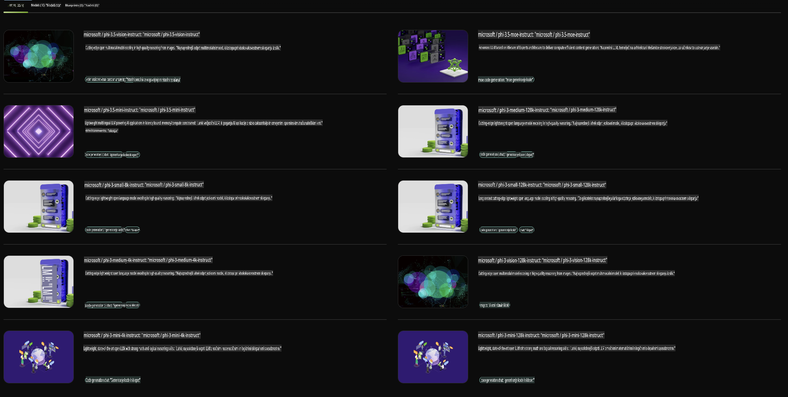

## Phi Family v NVIDIA NIM

NVIDIA NIM je niz enostavno uporabnih mikrostoritev, zasnovanih za pospeševanje uvajanja generativnih AI modelov v oblaku, podatkovnih centrih in delovnih postajah. NIM-i so razvrščeni po družinah modelov in posameznih modelih. Na primer, NVIDIA NIM za velike jezikovne modele (LLM) prinaša zmogljivosti najsodobnejših LLM-jev v poslovne aplikacije ter omogoča vrhunsko obdelavo in razumevanje naravnega jezika.

NIM omogoča IT in DevOps ekipam, da sami gostijo velike jezikovne modele (LLM) v svojih upravljanih okoljih, hkrati pa razvijalcem ponuja industrijsko standardne API-je, s katerimi lahko gradijo zmogljive kopilote, klepetalne bote in AI asistente, ki lahko preoblikujejo njihovo poslovanje. Z uporabo najnaprednejšega GPU pospeševanja in skalabilnega uvajanja NVIDIA NIM ponuja najhitrejšo pot do sklepanja z neprekosljivo zmogljivostjo.

Z NVIDIA NIM lahko izvajate sklepanja z modeli družine Phi.



### **Primeri - Phi-3-Vision v NVIDIA NIM**

Predstavljajte si, da imate sliko (`demo.png`) in želite ustvariti Python kodo, ki obdela to sliko in shrani njeno novo različico (`phi-3-vision.jpg`). 

Zgornja koda avtomatizira ta proces tako, da:

1. Nastavi okolje in potrebne konfiguracije.
2. Ustvari poziv, ki modelu naroči generiranje zahtevane Python kode.
3. Pošlje poziv modelu in zbere generirano kodo.
4. Izvleče in zažene generirano kodo.
5. Prikaže izvirno in obdelano sliko.

Ta pristop izkorišča moč AI za avtomatizacijo nalog obdelave slik, kar omogoča hitrejše in lažje doseganje ciljev.

[Rešitev vzorčne kode](../../../../../code/06.E2E/E2E_Nvidia_NIM_Phi3_Vision.ipynb)

Razčlenimo, kaj celotna koda naredi korak za korakom:

1. **Namestitev potrebnega paketa**:
    ```python
    !pip install langchain_nvidia_ai_endpoints -U
    ```
    Ta ukaz namesti paket `langchain_nvidia_ai_endpoints` in zagotovi, da je v najnovejši različici.

2. **Uvoz potrebnih modulov**:
    ```python
    from langchain_nvidia_ai_endpoints import ChatNVIDIA
    import getpass
    import os
    import base64
    ```
    Ti uvozi omogočajo interakcijo z NVIDIA AI končnimi točkami, varno upravljanje gesel, delo z operacijskim sistemom in kodiranje/dekodiranje podatkov v base64 formatu.

3. **Nastavitev API ključa**:
    ```python
    if not os.getenv("NVIDIA_API_KEY"):
        os.environ["NVIDIA_API_KEY"] = getpass.getpass("Enter your NVIDIA API key: ")
    ```
    Ta koda preveri, ali je okoljska spremenljivka `NVIDIA_API_KEY` nastavljena. Če ni, uporabnika pozove, naj varno vnese svoj API ključ.

4. **Določitev modela in poti slike**:
    ```python
    model = 'microsoft/phi-3-vision-128k-instruct'
    chat = ChatNVIDIA(model=model)
    img_path = './imgs/demo.png'
    ```
    To določi model, ki se bo uporabljal, ustvari primerek `ChatNVIDIA` z določenim modelom in določi pot do slikovne datoteke.

5. **Ustvarjanje besedilnega poziva**:
    ```python
    text = "Please create Python code for image, and use plt to save the new picture under imgs/ and name it phi-3-vision.jpg."
    ```
    To definira besedilni poziv, ki modelu naroči generiranje Python kode za obdelavo slike.

6. **Kodiranje slike v base64**:
    ```python
    with open(img_path, "rb") as f:
        image_b64 = base64.b64encode(f.read()).decode()
    image = f''
    ```
    Ta koda prebere slikovno datoteko, jo kodira v base64 in ustvari HTML oznako slike z zakodiranimi podatki.

7. **Združevanje besedila in slike v poziv**:
    ```python
    prompt = f"{text} {image}"
    ```
    To združi besedilni poziv in HTML oznako slike v eno samo besedilo.

8. **Generiranje kode z uporabo ChatNVIDIA**:
    ```python
    code = ""
    for chunk in chat.stream(prompt):
        print(chunk.content, end="")
        code += chunk.content
    ```
    Ta koda pošlje poziv v `ChatNVIDIA` model and collects the generated code in chunks, printing and appending each chunk to the `code` niz.

9. **Izvleček Python kode iz generirane vsebine**:
    ```python
    begin = code.index('```python') + 9
    code = code[begin:]
    end = code.index('```')
    code = code[:end]
    ```
    Ta del izvleče dejansko Python kodo iz generirane vsebine tako, da odstrani markdown oblikovanje.

10. **Zagon generirane kode**:
    ```python
    import subprocess
    result = subprocess.run(["python", "-c", code], capture_output=True)
    ```
    Ta del zažene izvlečeno Python kodo kot podproces in zajame njen izhod.

11. **Prikaz slik**:
    ```python
    from IPython.display import Image, display
    display(Image(filename='./imgs/phi-3-vision.jpg'))
    display(Image(filename='./imgs/demo.png'))
    ```
    Te vrstice prikažejo slike z uporabo modula `IPython.display`.

**Omejitev odgovornosti**:  
Ta dokument je bil preveden z uporabo storitev strojnega prevajanja z umetno inteligenco. Čeprav si prizadevamo za natančnost, vas prosimo, da upoštevate, da lahko samodejni prevodi vsebujejo napake ali netočnosti. Izvirni dokument v njegovem maternem jeziku je treba obravnavati kot avtoritativni vir. Za ključne informacije priporočamo profesionalni prevod s strani človeka. Ne prevzemamo odgovornosti za morebitne nesporazume ali napačne razlage, ki izhajajo iz uporabe tega prevoda.