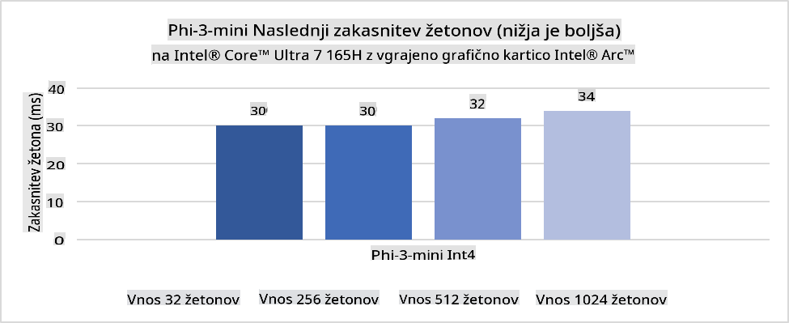
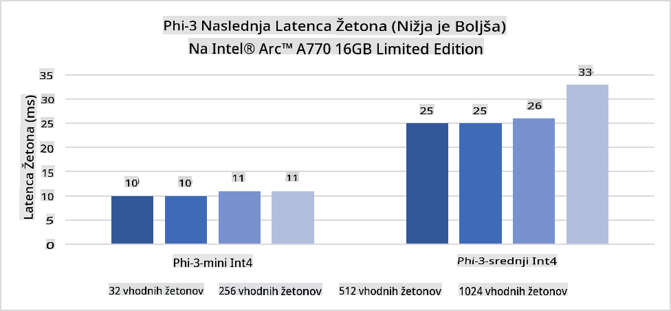
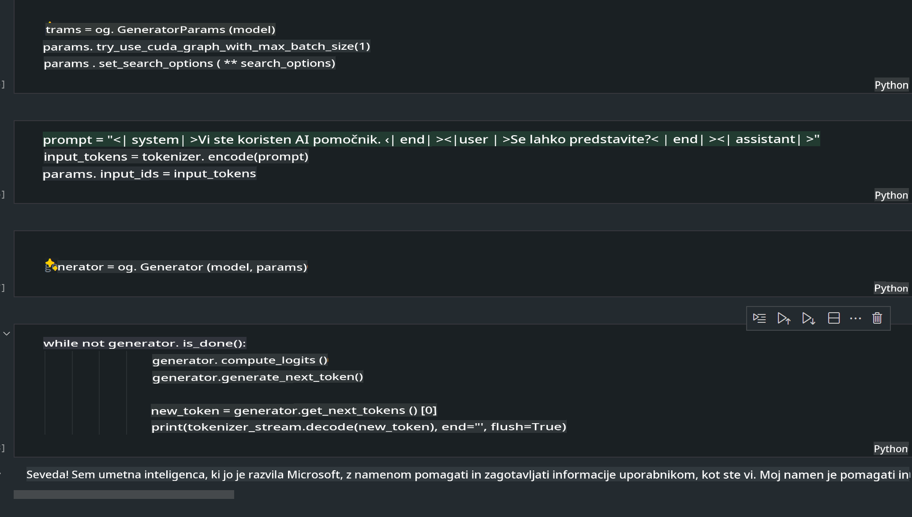
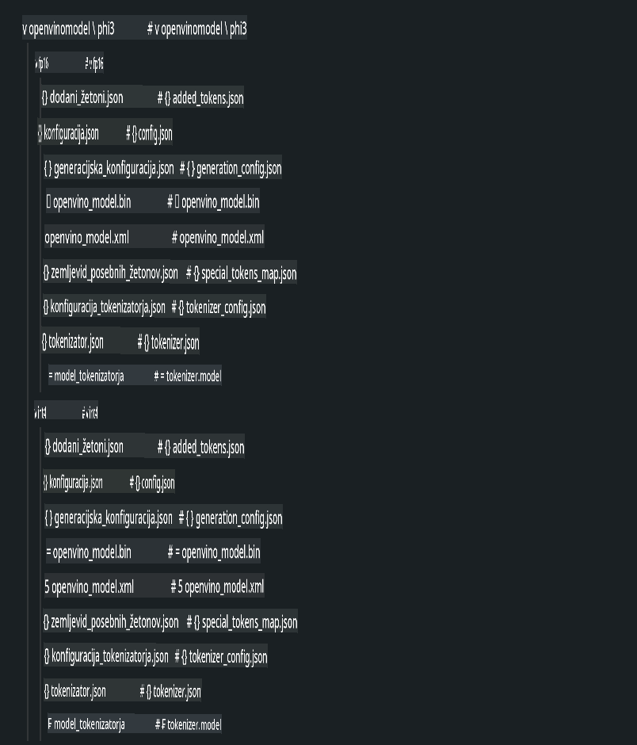
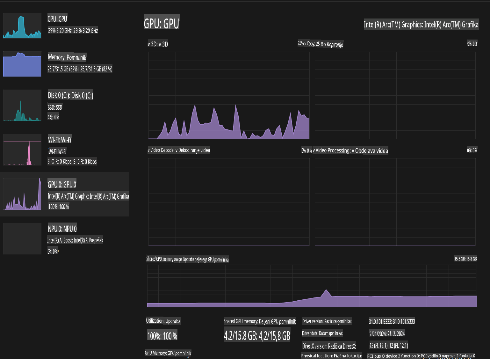

# **Inferenca Phi-3 na AI PC**

Z razvojem generativne umetne inteligence in izboljšanjem strojne opreme naprav na robu postaja vse več generativnih AI modelov združljivih z napravami, ki jih prinesejo uporabniki sami (BYOD). AI PC-ji so del teh modelov. Od leta 2024 dalje so Intel, AMD in Qualcomm v sodelovanju s proizvajalci računalnikov uvedli AI PC-je, ki omogočajo izvajanje lokaliziranih generativnih AI modelov prek prilagoditev strojne opreme. V tej razpravi se bomo osredotočili na Intel AI PC-je in raziskali, kako namestiti Phi-3 na Intel AI PC.

### Kaj je NPU

NPU (Neural Processing Unit) je namenski procesor ali procesna enota v okviru večjega SoC, zasnovana posebej za pospeševanje operacij nevronskih mrež in nalog umetne inteligence. Za razliko od splošno namenskih CPU-jev in GPU-jev so NPU-ji optimizirani za podatkovno gnano vzporedno računanje, zaradi česar so zelo učinkoviti pri obdelavi obsežnih multimedijskih podatkov, kot so videoposnetki in slike, ter pri obdelavi podatkov za nevronske mreže. Posebej so primerni za izvajanje nalog, povezanih z umetno inteligenco, kot so prepoznavanje govora, zameglitev ozadja med video klici in postopki urejanja fotografij ali videoposnetkov, kot je zaznavanje objektov.

## NPU vs GPU

Čeprav se številne naloge umetne inteligence in strojnega učenja izvajajo na GPU-jih, obstaja pomembna razlika med GPU-ji in NPU-ji.  
GPU-ji so znani po svojih sposobnostih vzporednega računanja, vendar niso vsi GPU-ji enako učinkoviti pri opravilih, ki presegajo obdelavo grafike. NPU-ji pa so namensko zasnovani za zapletene izračune, povezane z delovanjem nevronskih mrež, zaradi česar so izjemno učinkoviti za naloge umetne inteligence.

Skratka, NPU-ji so matematični geniji, ki pospešujejo izračune umetne inteligence in igrajo ključno vlogo v prihajajoči dobi AI PC-jev!

***Ta primer temelji na najnovejšem procesorju Intel Core Ultra.***

## **1. Uporaba NPU za zagon modela Phi-3**

Intel® NPU naprava je pospeševalnik inferenc umetne inteligence, integriran z Intel procesorji za končne uporabnike, od generacije Intel® Core™ Ultra procesorjev (prej znani kot Meteor Lake). Omogoča energetsko učinkovito izvajanje nalog umetnih nevronskih mrež.





**Knjižnica za pospeševanje Intel NPU**

Knjižnica Intel NPU Acceleration Library [https://github.com/intel/intel-npu-acceleration-library](https://github.com/intel/intel-npu-acceleration-library) je Python knjižnica, zasnovana za povečanje učinkovitosti aplikacij z uporabo zmogljivosti Intel Neural Processing Unit (NPU) za izvajanje hitrih izračunov na združljivi strojni opremi.

Primer Phi-3-mini na AI PC, ki ga poganjajo procesorji Intel® Core™ Ultra.


Namestite Python knjižnico z ukazom pip:

```bash

   pip install intel-npu-acceleration-library

```

***Opomba*** Projekt je še v razvoju, vendar je referenčni model že zelo izpopolnjen.

### **Zagon Phi-3 z uporabo knjižnice Intel NPU Acceleration Library**

Z uporabo pospeševanja Intel NPU ta knjižnica ne vpliva na tradicionalni proces kodiranja. Potrebno je le uporabiti to knjižnico za kvantizacijo originalnega modela Phi-3, kot so FP16, INT8, INT4, na primer:

```python
from transformers import AutoTokenizer, pipeline,TextStreamer
from intel_npu_acceleration_library import NPUModelForCausalLM, int4
from intel_npu_acceleration_library.compiler import CompilerConfig
import warnings

model_id = "microsoft/Phi-3-mini-4k-instruct"

compiler_conf = CompilerConfig(dtype=int4)
model = NPUModelForCausalLM.from_pretrained(
    model_id, use_cache=True, config=compiler_conf, attn_implementation="sdpa"
).eval()

tokenizer = AutoTokenizer.from_pretrained(model_id)

text_streamer = TextStreamer(tokenizer, skip_prompt=True)
```

Ko je kvantizacija uspešno izvedena, nadaljujte z izvajanjem in pokličite NPU za zagon modela Phi-3.

```python
generation_args = {
   "max_new_tokens": 1024,
   "return_full_text": False,
   "temperature": 0.3,
   "do_sample": False,
   "streamer": text_streamer,
}

pipe = pipeline(
   "text-generation",
   model=model,
   tokenizer=tokenizer,
)

query = "<|system|>You are a helpful AI assistant.<|end|><|user|>Can you introduce yourself?<|end|><|assistant|>"

with warnings.catch_warnings():
    warnings.simplefilter("ignore")
    pipe(query, **generation_args)
```

Med izvajanjem kode lahko preko Upravitelja opravil (Task Manager) spremljamo stanje delovanja NPU.


***Primeri*** : [AIPC_NPU_DEMO.ipynb](../../../../../code/03.Inference/AIPC/AIPC_NPU_DEMO.ipynb)

## **2. Uporaba DirectML + ONNX Runtime za zagon modela Phi-3**

### **Kaj je DirectML**

[DirectML](https://github.com/microsoft/DirectML) je visoko zmogljiva, strojno pospešena knjižnica DirectX 12 za strojno učenje. DirectML omogoča pospeševanje GPU za pogoste naloge strojnega učenja na širokem spektru združljive strojne opreme in gonilnikov, vključno z vsemi GPU-ji, združljivimi z DirectX 12, proizvajalcev, kot so AMD, Intel, NVIDIA in Qualcomm.

Ko se uporablja samostojno, je API DirectML nizkonivojska knjižnica DirectX 12, primerna za aplikacije z visoko zmogljivostjo in nizko zakasnitvijo, kot so ogrodja, igre in druge aplikacije v realnem času. Zaradi brezhibne interoperabilnosti DirectML z Direct3D 12, nizkih stroškov in skladnosti na različnih strojnih opremah je DirectML idealen za pospeševanje strojnega učenja, kadar so pomembni tako visoka zmogljivost kot zanesljivost in predvidljivost rezultatov na različnih strojnih opremah.

***Opomba***: Najnovejši DirectML že podpira NPU (https://devblogs.microsoft.com/directx/introducing-neural-processor-unit-npu-support-in-directml-developer-preview/)

### DirectML in CUDA glede na zmogljivosti in učinkovitost:

**DirectML** je knjižnica za strojno učenje, ki jo je razvila Microsoft. Namenjena je pospeševanju nalog strojnega učenja na napravah z operacijskim sistemom Windows, vključno z namiznimi računalniki, prenosniki in napravami na robu.
- Na osnovi DX12: DirectML je zgrajen na vrhu DirectX 12 (DX12), kar omogoča široko podporo strojni opremi GPU, vključno z NVIDIA in AMD.
- Širša podpora: Ker izkorišča DX12, lahko DirectML deluje z vsakim GPU, ki podpira DX12, celo z integriranimi GPU-ji.
- Obdelava slik: DirectML obdeluje slike in druge podatke z uporabo nevronskih mrež, kar je primerno za naloge, kot so prepoznavanje slik, zaznavanje objektov itd.
- Enostavna nastavitev: Nastavitev DirectML je preprosta in ne zahteva posebnih SDK-jev ali knjižnic proizvajalcev GPU.
- Učinkovitost: V nekaterih primerih DirectML deluje dobro in je lahko hitrejši od CUDA, zlasti pri določenih nalogah.
- Omejitve: Vendar pa so primeri, kjer je DirectML lahko počasnejši, zlasti pri velikih serijah float16.

**CUDA** je NVIDIA-ina platforma za vzporedno računanje in programski model. Razvijalcem omogoča izkoriščanje moči NVIDIA GPU-jev za splošne namene, vključno s strojno učenjem in znanstvenimi simulacijami.
- Specifična za NVIDIA: CUDA je tesno integrirana z NVIDIA GPU-ji in posebej zasnovana zanje.
- Visoko optimizirana: Ponuja odlično zmogljivost za naloge, pospešene z GPU, še posebej pri uporabi NVIDIA GPU-jev.
- Široko uporabljena: Številna ogrodja in knjižnice za strojno učenje (kot sta TensorFlow in PyTorch) imajo podporo za CUDA.
- Prilagodljivost: Razvijalci lahko natančno prilagodijo nastavitve CUDA za določene naloge, kar lahko privede do optimalne učinkovitosti.
- Omejitve: Vendar pa je odvisnost CUDA od NVIDIA strojne opreme lahko omejujoča, če želite širšo združljivost z različnimi GPU-ji.

### Izbira med DirectML in CUDA

Izbira med DirectML in CUDA je odvisna od vašega specifičnega primera uporabe, razpoložljive strojne opreme in preferenc.  
Če iščete širšo združljivost in enostavno nastavitev, je DirectML morda dobra izbira. Če pa imate NVIDIA GPU-je in potrebujete visoko optimizirano zmogljivost, ostaja CUDA močna možnost. Skratka, tako DirectML kot CUDA imata svoje prednosti in slabosti, zato pri izbiri upoštevajte svoje zahteve in razpoložljivo strojno opremo.

### **Generativna umetna inteligenca z ONNX Runtime**

V dobi umetne inteligence je prenosljivost AI modelov zelo pomembna. ONNX Runtime omogoča enostavno uvajanje izurjenih modelov na različne naprave. Razvijalcem ni treba posvečati pozornosti okvirju za inferenco, temveč lahko z uporabo enotnega API-ja izvedejo inferenco modela. V dobi generativne umetne inteligence je ONNX Runtime izvedel tudi optimizacijo kode (https://onnxruntime.ai/docs/genai/). S pomočjo optimiziranega ONNX Runtime je mogoče kvantiziran generativni AI model izvesti na različnih napravah. Z ONNX Runtime lahko API za AI modele uporabljate prek Python, C# ali C / C++. Seveda lahko na iPhonu uporabite tudi API Generative AI z ONNX Runtime v jeziku C++.

[Primer kode](https://github.com/Azure-Samples/Phi-3MiniSamples/tree/main/onnx)

***Kompilacija knjižnice za generativno umetno inteligenco z ONNX Runtime***

```bash

winget install --id=Kitware.CMake  -e

git clone https://github.com/microsoft/onnxruntime.git

cd .\onnxruntime\

./build.bat --build_shared_lib --skip_tests --parallel --use_dml --config Release

cd ../

git clone https://github.com/microsoft/onnxruntime-genai.git

cd .\onnxruntime-genai\

mkdir ort

cd ort

mkdir include

mkdir lib

copy ..\onnxruntime\include\onnxruntime\core\providers\dml\dml_provider_factory.h ort\include

copy ..\onnxruntime\include\onnxruntime\core\session\onnxruntime_c_api.h ort\include

copy ..\onnxruntime\build\Windows\Release\Release\*.dll ort\lib

copy ..\onnxruntime\build\Windows\Release\Release\onnxruntime.lib ort\lib

python build.py --use_dml


```

**Namestitev knjižnice**

```bash

pip install .\onnxruntime_genai_directml-0.3.0.dev0-cp310-cp310-win_amd64.whl

```

To je rezultat izvajanja:



***Primeri*** : [AIPC_DirectML_DEMO.ipynb](../../../../../code/03.Inference/AIPC/AIPC_DirectML_DEMO.ipynb)

## **3. Uporaba Intel OpenVino za zagon modela Phi-3**

### **Kaj je OpenVINO**

[OpenVINO](https://github.com/openvinotoolkit/openvino) je odprtokodni komplet orodij za optimizacijo in uvajanje modelov globokega učenja. Ponuja izboljšano zmogljivost globokega učenja za modele za vizijo, zvok in jezik iz priljubljenih ogrodij, kot sta TensorFlow in PyTorch. Začnite z OpenVINO. OpenVINO se lahko uporablja tudi v kombinaciji z CPU in GPU za zagon modela Phi-3.

***Opomba***: Trenutno OpenVINO ne podpira NPU.

### **Namestitev knjižnice OpenVINO**

```bash

 pip install git+https://github.com/huggingface/optimum-intel.git

 pip install git+https://github.com/openvinotoolkit/nncf.git

 pip install openvino-nightly

```

### **Zagon Phi-3 z OpenVINO**

Tako kot NPU tudi OpenVINO omogoča klic generativnih AI modelov z izvajanjem kvantiziranih modelov. Najprej moramo kvantizirati model Phi-3 in kvantizacijo modela dokončati prek ukazne vrstice z uporabo orodja optimum-cli.

**INT4**

```bash

optimum-cli export openvino --model "microsoft/Phi-3-mini-4k-instruct" --task text-generation-with-past --weight-format int4 --group-size 128 --ratio 0.6  --sym  --trust-remote-code ./openvinomodel/phi3/int4

```

**FP16**

```bash

optimum-cli export openvino --model "microsoft/Phi-3-mini-4k-instruct" --task text-generation-with-past --weight-format fp16 --trust-remote-code ./openvinomodel/phi3/fp16

```

Pretvorjeni format je videti takole:



Naložite poti modela (model_dir), povezane konfiguracije (ov_config = {"PERFORMANCE_HINT": "LATENCY", "NUM_STREAMS": "1", "CACHE_DIR": ""}) in strojno pospešene naprave (GPU.0) prek OVModelForCausalLM.

```python

ov_model = OVModelForCausalLM.from_pretrained(
     model_dir,
     device='GPU.0',
     ov_config=ov_config,
     config=AutoConfig.from_pretrained(model_dir, trust_remote_code=True),
     trust_remote_code=True,
)

```

Med izvajanjem kode lahko preko Upravitelja opravil spremljamo stanje delovanja GPU.



***Primeri*** : [AIPC_OpenVino_Demo.ipynb](../../../../../code/03.Inference/AIPC/AIPC_OpenVino_Demo.ipynb)

### ***Opomba*** : Zgornje tri metode imajo vsaka svoje prednosti, vendar je za inferenco na AI PC priporočljivo uporabiti pospeševanje z NPU.

**Omejitev odgovornosti**:  
Ta dokument je bil preveden z uporabo storitev strojnega prevajanja na osnovi umetne inteligence. Čeprav si prizadevamo za natančnost, vas prosimo, da upoštevate, da lahko avtomatski prevodi vsebujejo napake ali netočnosti. Izvirni dokument v njegovem izvirnem jeziku je treba obravnavati kot avtoritativni vir. Za ključne informacije priporočamo strokovno človeško prevajanje. Ne prevzemamo odgovornosti za morebitna nesporazumevanja ali napačne razlage, ki bi nastale zaradi uporabe tega prevoda.