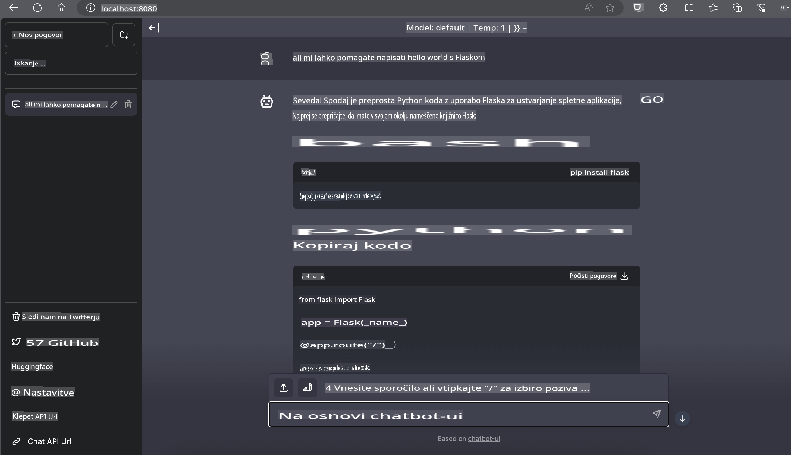

# **Inferenca Phi-3 na Nvidia Jetson**

Nvidia Jetson je serija vgrajenih računalniških plošč podjetja Nvidia. Modeli Jetson TK1, TX1 in TX2 vsebujejo Tegra procesor (ali SoC) podjetja Nvidia, ki vključuje centralno procesno enoto (CPU) z arhitekturo ARM. Jetson je sistem z nizko porabo energije, zasnovan za pospeševanje aplikacij strojnega učenja. Nvidia Jetson uporabljajo profesionalni razvijalci za ustvarjanje prelomnih AI izdelkov v vseh industrijah, pa tudi študenti in navdušenci za praktično učenje AI in ustvarjanje izjemnih projektov. SLM je nameščen na robnih napravah, kot je Jetson, kar omogoča boljšo izvedbo industrijskih scenarijev generativnih AI aplikacij.

## Namestitev na NVIDIA Jetson:
Razvijalci, ki delajo na avtonomni robotiki in vgrajenih napravah, lahko izkoristijo Phi-3 Mini. Relativno majhna velikost Phi-3 je idealna za uporabo na robu. Parametri so bili med treningom skrbno prilagojeni, kar zagotavlja visoko natančnost odgovorov.

### Optimizacija TensorRT-LLM:
NVIDIA-jeva [TensorRT-LLM knjižnica](https://github.com/NVIDIA/TensorRT-LLM?WT.mc_id=aiml-138114-kinfeylo) optimizira izvajanje velikih jezikovnih modelov. Podpira dolgo kontekstno okno Phi-3 Mini, kar izboljša tako pretočnost kot zakasnitev. Optimizacije vključujejo tehnike, kot so LongRoPE, FP8 in "inflight batching".

### Razpoložljivost in namestitev:
Razvijalci lahko raziskujejo Phi-3 Mini s 128K kontekstnim oknom na [NVIDIA's AI](https://www.nvidia.com/en-us/ai-data-science/generative-ai/). Na voljo je kot NVIDIA NIM, mikroservis s standardnim API-jem, ki ga je mogoče namestiti kjerkoli. Poleg tega so na voljo [TensorRT-LLM implementacije na GitHubu](https://github.com/NVIDIA/TensorRT-LLM).

## **1. Priprava**

a. Jetson Orin NX / Jetson NX

b. JetPack 5.1.2+
   
c. Cuda 11.8
   
d. Python 3.8+

## **2. Zagon Phi-3 na Jetson**

Lahko izberemo [Ollama](https://ollama.com) ali [LlamaEdge](https://llamaedge.com).

Če želite uporabljati gguf hkrati v oblaku in na robnih napravah, lahko LlamaEdge razumemo kot WasmEdge (WasmEdge je lahek, visokozmogljiv in razširljiv WebAssembly runtime, primeren za oblačne, robne in decentralizirane aplikacije. Podpira strežniške aplikacije, vgrajene funkcije, mikroservise, pametne pogodbe in IoT naprave). S kvantitativnim modelom gguf lahko prek LlamaEdge namestite na robne naprave in v oblak.


Tukaj so koraki za uporabo:

1. Namestite in prenesite povezane knjižnice in datoteke

```bash

curl -sSf https://raw.githubusercontent.com/WasmEdge/WasmEdge/master/utils/install.sh | bash -s -- --plugin wasi_nn-ggml

curl -LO https://github.com/LlamaEdge/LlamaEdge/releases/latest/download/llama-api-server.wasm

curl -LO https://github.com/LlamaEdge/chatbot-ui/releases/latest/download/chatbot-ui.tar.gz

tar xzf chatbot-ui.tar.gz

```

**Opomba**: Datoteki llama-api-server.wasm in chatbot-ui morata biti v isti mapi.

2. Zaženite skripte v terminalu

```bash

wasmedge --dir .:. --nn-preload default:GGML:AUTO:{Your gguf path} llama-api-server.wasm -p phi-3-chat

```

Tukaj je rezultat zagona:



***Vzorec kode*** [Phi-3 mini WASM Notebook Sample](https://github.com/Azure-Samples/Phi-3MiniSamples/tree/main/wasm)

Za zaključek, Phi-3 Mini predstavlja pomemben napredek v jezikovnem modeliranju, saj združuje učinkovitost, zavedanje konteksta in optimizacijsko znanje podjetja NVIDIA. Ne glede na to, ali gradite robote ali robne aplikacije, je Phi-3 Mini močno orodje, ki ga velja poznati.

**Omejitev odgovornosti**:  
Ta dokument je bil preveden s pomočjo strojnih prevajalskih storitev, ki temeljijo na umetni inteligenci. Čeprav si prizadevamo za natančnost, vas prosimo, da upoštevate, da lahko avtomatizirani prevodi vsebujejo napake ali netočnosti. Izvirni dokument v njegovem maternem jeziku je treba obravnavati kot avtoritativni vir. Za kritične informacije je priporočljivo uporabiti profesionalni človeški prevod. Ne prevzemamo odgovornosti za morebitne nesporazume ali napačne razlage, ki bi nastale zaradi uporabe tega prevoda.