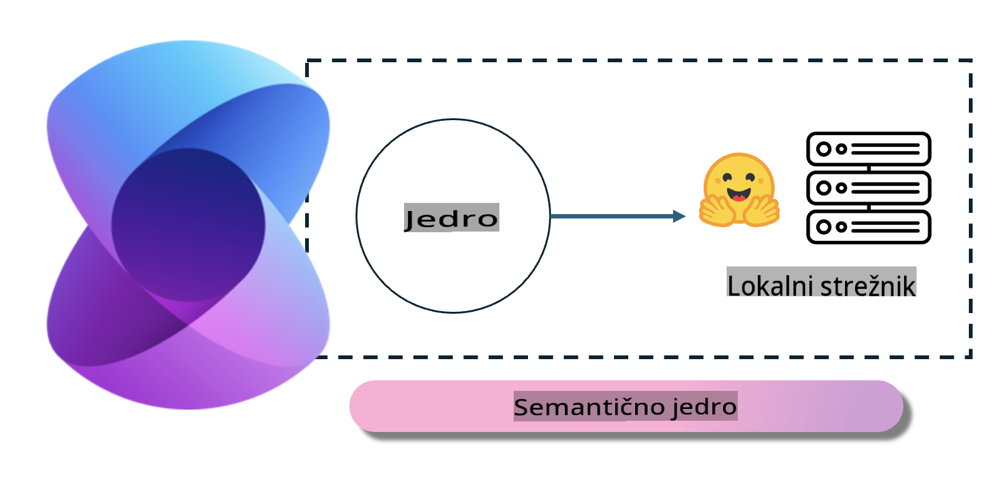
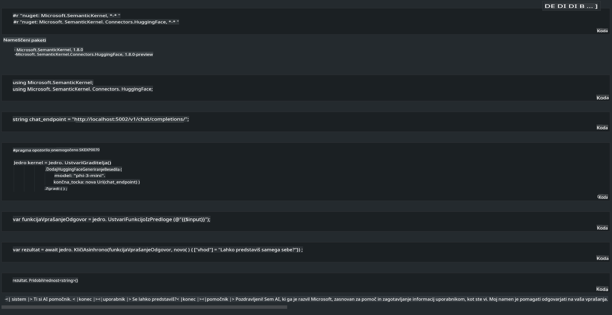

# **Inferenca Phi-3 na lokalnem strežniku**

Phi-3 lahko uvedemo na lokalnem strežniku. Uporabniki lahko izberejo rešitve [Ollama](https://ollama.com) ali [LM Studio](https://llamaedge.com), ali pa napišejo svojo lastno kodo. Lokalnim storitvam Phi-3 se lahko povežete prek [Semantic Kernel](https://github.com/microsoft/semantic-kernel?WT.mc_id=aiml-138114-kinfeylo) ali [Langchain](https://www.langchain.com/), da ustvarite aplikacije Copilot.

## **Uporaba Semantic Kernel za dostop do Phi-3-mini**

V aplikaciji Copilot ustvarjamo aplikacije prek Semantic Kernel / LangChain. Ta vrsta ogrodja za aplikacije je običajno združljiva z Azure OpenAI Service / OpenAI modeli, poleg tega pa podpira tudi odprtokodne modele na Hugging Face in lokalne modele. Kaj storiti, če želimo uporabiti Semantic Kernel za dostop do Phi-3-mini? Na primeru .NET lahko to združimo s Hugging Face Connector v Semantic Kernel. Privzeto se lahko poveže z modelom na Hugging Face (prvič, ko ga uporabite, se model prenese s Hugging Face, kar lahko traja dlje časa). Prav tako se lahko povežete z lastno lokalno storitvijo. Med obema možnostma priporočamo uporabo slednje, saj omogoča večjo stopnjo avtonomije, še posebej pri podjetniških aplikacijah.

Na sliki je prikazano, kako prek Semantic Kernel dostopati do lokalnih storitev, kar omogoča enostavno povezavo s samostojno postavljenim Phi-3-mini modelnim strežnikom. Tukaj je prikazan rezultat izvajanja:

***Vzorec kode*** https://github.com/kinfey/Phi3MiniSamples/tree/main/semantickernel

**Omejitev odgovornosti**:  
Ta dokument je bil preveden z uporabo storitev strojnega prevajanja z umetno inteligenco. Čeprav si prizadevamo za natančnost, vas opozarjamo, da lahko avtomatizirani prevodi vsebujejo napake ali netočnosti. Izvirni dokument v svojem maternem jeziku je treba obravnavati kot avtoritativni vir. Za ključne informacije priporočamo profesionalni prevod s strani človeškega prevajalca. Ne prevzemamo odgovornosti za morebitna nesporazumevanja ali napačne razlage, ki bi nastale zaradi uporabe tega prevoda.