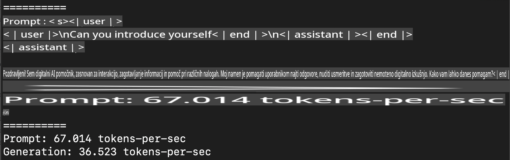
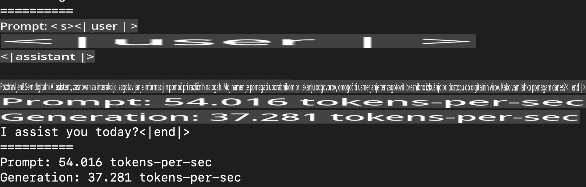
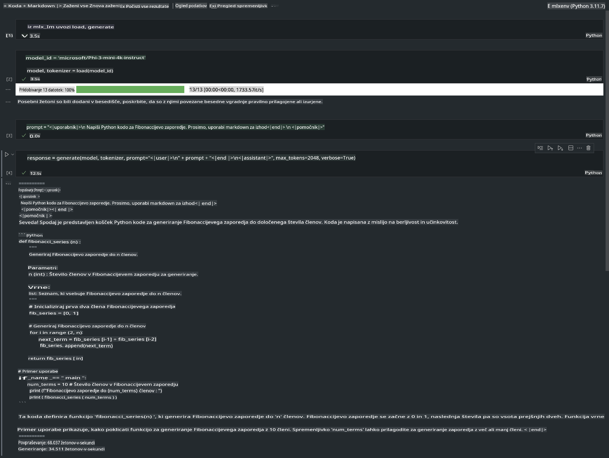

# **Inferenca Phi-3 z Apple MLX Frameworkom**

## **Kaj je MLX Framework**

MLX je okvir za raziskovanje strojnega učenja na Apple siliciju, ki ga je razvila Apple raziskovalna skupina za strojno učenje.

MLX je zasnovan za raziskovalce strojnega učenja, da je prijazen za uporabo, a hkrati učinkovit za treniranje in implementacijo modelov. Sam okvir je zasnovan konceptualno preprosto, da raziskovalcem omogoča enostavno razširjanje in izboljšanje MLX-a z namenom hitrega raziskovanja novih idej.

LLM-je lahko pospešimo na napravah z Apple silicijem prek MLX-a, modeli pa se lahko zelo priročno izvajajo lokalno.

## **Uporaba MLX za inferenco Phi-3-mini**

### **1. Priprava MLX okolja**

1. Python 3.11.x  
2. Namestite knjižnico MLX  

```bash

pip install mlx-lm

```

### **2. Zagon Phi-3-mini v terminalu z MLX**  

```bash

python -m mlx_lm.generate --model microsoft/Phi-3-mini-4k-instruct --max-token 2048 --prompt  "<|user|>\nCan you introduce yourself<|end|>\n<|assistant|>"

```  

Rezultat (moje okolje je Apple M1 Max, 64GB) je  

  

### **3. Kvantizacija Phi-3-mini z MLX v terminalu**  

```bash

python -m mlx_lm.convert --hf-path microsoft/Phi-3-mini-4k-instruct

```  

***Opomba:*** Model je mogoče kvantizirati z mlx_lm.convert, privzeta kvantizacija pa je INT4. Ta primer kvantizira Phi-3-mini v INT4.  

Model je mogoče kvantizirati z mlx_lm.convert, pri čemer je privzeta kvantizacija INT4. Ta primer prikazuje kvantizacijo Phi-3-mini v INT4. Po kvantizaciji bo shranjen v privzeti imenik ./mlx_model.  

Model, kvantiziran z MLX, lahko testiramo v terminalu.  

```bash

python -m mlx_lm.generate --model ./mlx_model/ --max-token 2048 --prompt  "<|user|>\nCan you introduce yourself<|end|>\n<|assistant|>"

```  

Rezultat je  

  

### **4. Zagon Phi-3-mini z MLX v Jupyter Notebooku**  

  

***Opomba:*** Preberite ta primer [kliknite to povezavo](../../../../../code/03.Inference/MLX/MLX_DEMO.ipynb)  

## **Viri**

1. Spoznajte Apple MLX Framework [https://ml-explore.github.io](https://ml-explore.github.io/mlx/build/html/index.html)  

2. Apple MLX GitHub repozitorij [https://github.com/ml-explore](https://github.com/ml-explore)  

**Omejitev odgovornosti**:  
Ta dokument je bil preveden z uporabo storitev strojnega prevajanja na osnovi umetne inteligence. Čeprav si prizadevamo za natančnost, vas prosimo, da se zavedate, da lahko avtomatski prevodi vsebujejo napake ali netočnosti. Izvirni dokument v njegovem izvirnem jeziku je treba obravnavati kot avtoritativni vir. Za ključne informacije priporočamo profesionalen prevod s strani človeškega prevajalca. Ne prevzemamo odgovornosti za morebitne nesporazume ali napačne interpretacije, ki bi izhajale iz uporabe tega prevoda.