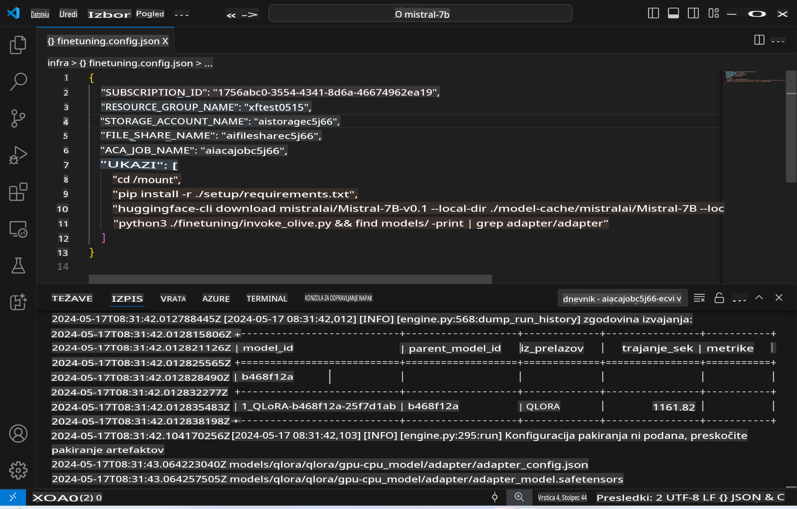
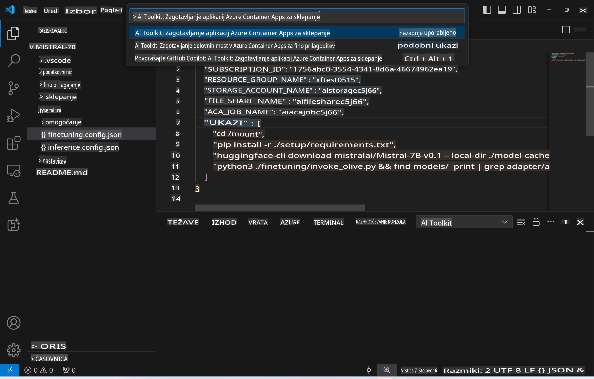
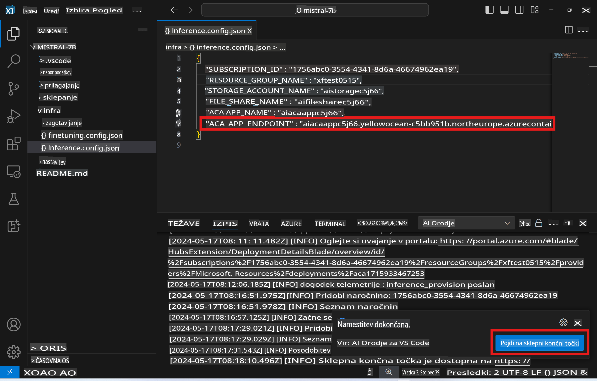

# Oddaljeno sklepanje z modelom, ki je bil prilagojen

Ko so adapterji usposobljeni v oddaljenem okolju, lahko uporabite preprosto aplikacijo Gradio za interakcijo z modelom.



### Priprava Azure virov
Za oddaljeno sklepanje morate nastaviti Azure vire, tako da iz ukazne palete zaženete ukaz `AI Toolkit: Provision Azure Container Apps for inference`. Med nastavitvijo boste pozvani, da izberete svojo Azure naročnino in skupino virov.  

   
Privzeto morata naročnina in skupina virov za sklepanje ustrezati tistim, ki so bile uporabljene za prilagajanje. Sklepanje bo uporabljalo isto okolje Azure Container App ter dostopalo do modela in adapterja modela, shranjenih v Azure Files, ki so bili ustvarjeni med korakom prilagajanja.

## Uporaba AI orodij

### Uvajanje za sklepanje  
Če želite spremeniti kodo za sklepanje ali ponovno naložiti model za sklepanje, zaženite ukaz `AI Toolkit: Deploy for inference`. S tem boste sinhronizirali svojo najnovejšo kodo z ACA in znova zagnali repliko.  


Ko je uvajanje uspešno zaključeno, je model pripravljen za evalvacijo z uporabo tega končnega točke.

### Dostop do API-ja za sklepanje

Do API-ja za sklepanje lahko dostopate s klikom na gumb "*Go to Inference Endpoint*", ki je prikazan v obvestilu VSCode. Druga možnost je, da spletno API končno točko najdete pod `ACA_APP_ENDPOINT` v `./infra/inference.config.json` in v izhodni plošči.



> **Opomba:** Končna točka za sklepanje lahko potrebuje nekaj minut, da postane popolnoma operativna.

## Komponente za sklepanje, vključene v predlogo
 
| Mapa | Vsebina |
| ------ |--------- |
| `infra` | Vsebuje vse potrebne konfiguracije za oddaljene operacije. |
| `infra/provision/inference.parameters.json` | Vsebuje parametre za bicep predloge, uporabljene za nastavitev Azure virov za sklepanje. |
| `infra/provision/inference.bicep` | Vsebuje predloge za nastavitev Azure virov za sklepanje. |
| `infra/inference.config.json` | Konfiguracijska datoteka, ki jo ustvari ukaz `AI Toolkit: Provision Azure Container Apps for inference`. Uporablja se kot vhod za druge oddaljene ukazne palete. |

### Uporaba AI orodij za konfiguracijo Azure virov
Konfigurirajte [AI Toolkit](https://marketplace.visualstudio.com/items?itemName=ms-windows-ai-studio.windows-ai-studio)

Nastavite Azure Container Apps za sklepanje` command.

You can find configuration parameters in `./infra/provision/inference.parameters.json` file. Here are the details:
| Parameter | Description |
| --------- |------------ |
| `defaultCommands` | This is the commands to initiate a web API. |
| `maximumInstanceCount` | This parameter sets the maximum capacity of GPU instances. |
| `location` | This is the location where Azure resources are provisioned. The default value is the same as the chosen resource group's location. |
| `storageAccountName`, `fileShareName` `acaEnvironmentName`, `acaEnvironmentStorageName`, `acaAppName`,  `acaLogAnalyticsName` | These parameters are used to name the Azure resources for provision. By default, they will be same to the fine-tuning resource name. You can input a new, unused resource name to create your own custom-named resources, or you can input the name of an already existing Azure resource if you'd prefer to use that. For details, refer to the section [Using existing Azure Resources](../../../../../md/01.Introduction/03). |

### Using Existing Azure Resources

By default, the inference provision use the same Azure Container App Environment, Storage Account, Azure File Share, and Azure Log Analytics that were used for fine-tuning. A separate Azure Container App is created solely for the inference API. 

If you have customized the Azure resources during the fine-tuning step or want to use your own existing Azure resources for inference, specify their names in the `./infra/inference.parameters.json` datoteka. Nato zaženite ukaz `AI Toolkit: Provision Azure Container Apps for inference` iz ukazne palete. S tem posodobite določene vire in ustvarite manjkajoče.

Na primer, če že imate obstoječe Azure okolje za vsebnike, bi moral vaš `./infra/finetuning.parameters.json` izgledati takole:

```json
{
    "$schema": "https://schema.management.azure.com/schemas/2019-04-01/deploymentParameters.json#",
    "contentVersion": "1.0.0.0",
    "parameters": {
      ...
      "acaEnvironmentName": {
        "value": "<your-aca-env-name>"
      },
      "acaEnvironmentStorageName": {
        "value": null
      },
      ...
    }
  }
```

### Ročna nastavitev  
Če raje ročno konfigurirate Azure vire, lahko uporabite priložene bicep datoteke v `./infra/provision` folders. If you have already set up and configured all the Azure resources without using the AI Toolkit command palette, you can simply enter the resource names in the `inference.config.json` datoteki.

Na primer:

```json
{
  "SUBSCRIPTION_ID": "<your-subscription-id>",
  "RESOURCE_GROUP_NAME": "<your-resource-group-name>",
  "STORAGE_ACCOUNT_NAME": "<your-storage-account-name>",
  "FILE_SHARE_NAME": "<your-file-share-name>",
  "ACA_APP_NAME": "<your-aca-name>",
  "ACA_APP_ENDPOINT": "<your-aca-endpoint>"
}
```

**Omejitev odgovornosti**:  
Ta dokument je bil preveden s pomočjo storitev strojnega prevajanja z umetno inteligenco. Čeprav si prizadevamo za natančnost, vas prosimo, da se zavedate, da lahko samodejni prevodi vsebujejo napake ali netočnosti. Izvirni dokument v njegovem izvirnem jeziku je treba obravnavati kot avtoritativni vir. Za ključne informacije je priporočljivo profesionalno človeško prevajanje. Ne prevzemamo odgovornosti za morebitne nesporazume ali napačne razlage, ki izhajajo iz uporabe tega prevoda.