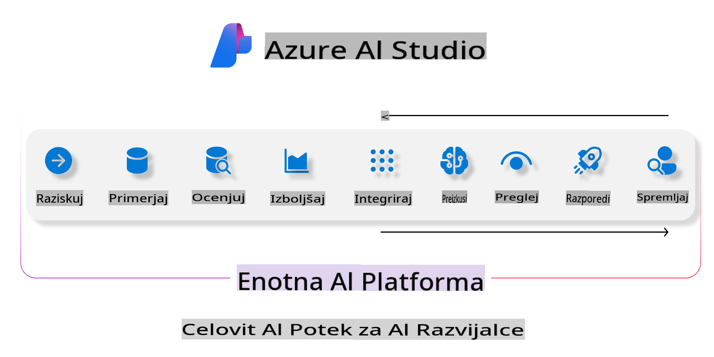
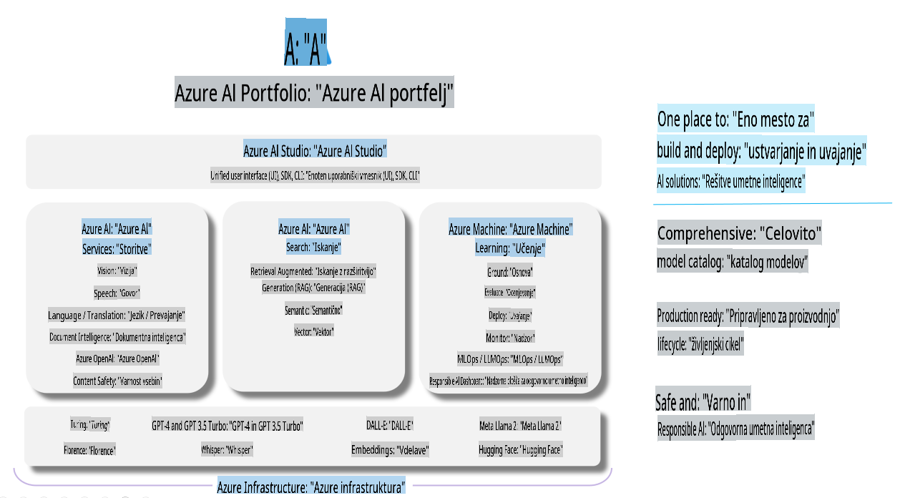

# **Uporaba Azure AI Foundry za ocenjevanje**

Kako oceniti svojo generativno AI aplikacijo z uporabo [Azure AI Foundry](https://ai.azure.com?WT.mc_id=aiml-138114-kinfeylo). Ne glede na to, ali ocenjujete enostavne ali večstopenjske pogovore, Azure AI Foundry ponuja orodja za ocenjevanje zmogljivosti in varnosti modela. 

## Kako oceniti generativne AI aplikacije z Azure AI Foundry
Za podrobnejša navodila si oglejte [dokumentacijo Azure AI Foundry](https://learn.microsoft.com/azure/ai-studio/how-to/evaluate-generative-ai-app?WT.mc_id=aiml-138114-kinfeylo).

Tukaj so koraki za začetek:

## Ocenjevanje generativnih AI modelov v Azure AI Foundry

**Predpogoji**

- Testni nabor podatkov v formatu CSV ali JSON.
- Nameščen generativni AI model (kot so Phi-3, GPT 3.5, GPT 4 ali Davinci modeli).
- Čas izvajanja z računalniškim virom za izvajanje ocenjevanja.

## Vgrajene metrike za ocenjevanje

Azure AI Foundry omogoča ocenjevanje tako enostavnih kot tudi kompleksnih večstopenjskih pogovorov.  
Za scenarije z Retrieval Augmented Generation (RAG), kjer je model utemeljen na specifičnih podatkih, lahko zmogljivost ocenite z vgrajenimi metrikami za ocenjevanje.  
Poleg tega lahko ocenjujete splošne scenarije z enostavnimi vprašanji in odgovori (ne-RAG).

## Ustvarjanje ocenjevalnega zagona

V uporabniškem vmesniku Azure AI Foundry se pomaknite na stran za ocenjevanje ali stran Prompt Flow.  
Sledite čarovniku za ustvarjanje ocenjevanja, da nastavite ocenjevalni zagon. Po želji lahko vnesete ime za svoje ocenjevanje.  
Izberite scenarij, ki ustreza ciljem vaše aplikacije.  
Izberite eno ali več metrik za ocenjevanje, da ocenite rezultate modela.

## Prilagojen potek ocenjevanja (neobvezno)

Za večjo prilagodljivost lahko vzpostavite prilagojen potek ocenjevanja. Prilagodite postopek ocenjevanja glede na svoje specifične zahteve.

## Ogled rezultatov

Po izvedenem ocenjevanju zabeležite, si oglejte in analizirajte podrobne metrike ocenjevanja v Azure AI Foundry. Pridobite vpogled v zmogljivosti in omejitve svoje aplikacije.

**Opomba** Azure AI Foundry je trenutno v javnem predogledu, zato ga uporabljajte za eksperimentiranje in razvojne namene. Za produkcijske delovne obremenitve razmislite o drugih možnostih. Raziščite uradno [dokumentacijo AI Foundry](https://learn.microsoft.com/azure/ai-studio/?WT.mc_id=aiml-138114-kinfeylo) za več podrobnosti in navodila po korakih.

**Izjava o omejitvi odgovornosti**:  
Ta dokument je bil preveden s pomočjo storitev strojnega prevajanja z umetno inteligenco. Čeprav si prizadevamo za natančnost, vas prosimo, da upoštevate, da lahko avtomatski prevodi vsebujejo napake ali netočnosti. Izvirni dokument v njegovem izvirnem jeziku naj se šteje za avtoritativni vir. Za kritične informacije priporočamo strokovni prevod s strani človeškega prevajalca. Ne prevzemamo odgovornosti za morebitna nesporazuma ali napačne razlage, ki bi nastale zaradi uporabe tega prevoda.