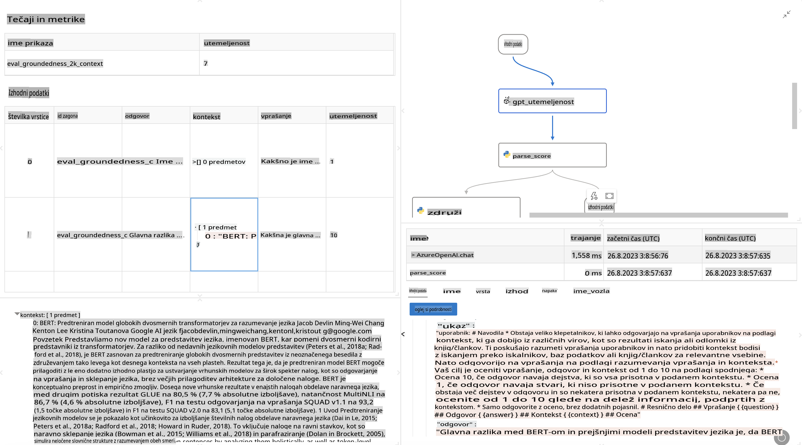

# **Predstavitev Promptflow**

[Microsoft Prompt Flow](https://microsoft.github.io/promptflow/index.html?WT.mc_id=aiml-138114-kinfeylo) je vizualno orodje za avtomatizacijo delovnih tokov, ki uporabnikom omogoča ustvarjanje avtomatiziranih delovnih procesov s pomočjo predhodno pripravljenih predlog in prilagojenih konektorjev. Namenjeno je razvijalcem in poslovnim analitikom, da hitro zgradijo avtomatizirane procese za naloge, kot so upravljanje podatkov, sodelovanje in optimizacija procesov. S Prompt Flow lahko uporabniki enostavno povežejo različne storitve, aplikacije in sisteme ter avtomatizirajo zapletene poslovne procese.

Microsoft Prompt Flow je zasnovan za poenostavitev celotnega razvojnega cikla aplikacij, ki temeljijo na velikih jezikovnih modelih (LLM). Ne glede na to, ali razvijate ideje, prototipe, testirate, ocenjujete ali uvajate aplikacije, ki temeljijo na LLM, Prompt Flow poenostavi postopek in omogoča izdelavo aplikacij LLM s produkcijsko kakovostjo.

## Tukaj so ključne značilnosti in prednosti uporabe Microsoft Prompt Flow:

**Interaktivna izkušnja pisanja**

Prompt Flow ponuja vizualno predstavitev strukture vašega toka, kar omogoča enostavno razumevanje in navigacijo po projektih.  
Ponuja izkušnjo kodiranja, podobno zvezkom, za učinkovito razvijanje in odpravljanje napak v tokovih.

**Različice pozivov in prilagoditev**

Ustvarite in primerjajte več različic pozivov za olajšanje iterativnega izboljševanja.  
Ocenite učinkovitost različnih pozivov in izberite najučinkovitejše.

**Vgrajeni evalvacijski tokovi**

Ocenite kakovost in učinkovitost vaših pozivov in tokov z uporabo vgrajenih orodij za evalvacijo.  
Razumite, kako dobro delujejo vaše aplikacije, ki temeljijo na LLM.

**Obsežni viri**

Prompt Flow vključuje knjižnico vgrajenih orodij, vzorcev in predlog. Ti viri služijo kot izhodišče za razvoj, spodbujajo kreativnost in pospešujejo postopek.

**Sodelovanje in pripravljenost za podjetja**

Podprite timsko sodelovanje, saj omogoča več uporabnikom skupno delo na projektih pozivnega inženiringa.  
Vzdržujte nadzor nad različicami in učinkovito delite znanje. Poenostavite celoten proces pozivnega inženiringa, od razvoja in evalvacije do uvedbe in spremljanja.

## Evalvacija v Prompt Flow

V Microsoft Prompt Flow ima evalvacija ključno vlogo pri ocenjevanju, kako dobro delujejo vaši modeli umetne inteligence. Oglejmo si, kako lahko prilagodite evalvacijske tokove in metrike znotraj Prompt Flow:

**Razumevanje evalvacije v Prompt Flow**

V Prompt Flow tok predstavlja zaporedje vozlišč, ki obdelujejo vhodne podatke in ustvarjajo izhodne rezultate. Evalvacijski tokovi so posebne vrste tokov, namenjene ocenjevanju uspešnosti izvedbe na podlagi določenih kriterijev in ciljev.

**Ključne značilnosti evalvacijskih tokov**

Evalvacijski tokovi običajno tečejo po testiranem toku, pri čemer uporabljajo njegove izhode.  
Izračunavajo ocene ali metrike za merjenje uspešnosti testiranega toka. Metrike lahko vključujejo natančnost, ocene ustreznosti ali druge pomembne meritve.

### Prilagajanje evalvacijskih tokov

**Določanje vhodov**

Evalvacijski tokovi morajo prejemati izhode testiranega toka. Vhode določite podobno kot pri standardnih tokovih.  
Na primer, če ocenjujete QnA tok, poimenujte vhod kot "odgovor." Če ocenjujete klasifikacijski tok, poimenujte vhod kot "kategorija." Prav tako bodo morda potrebni vhodni podatki za resnične vrednosti (npr. dejanske oznake).

**Izhodi in metrike**

Evalvacijski tokovi ustvarjajo rezultate, ki merijo uspešnost testiranega toka.  
Metrike lahko izračunate z uporabo Pythona ali LLM (Velikih jezikovnih modelov). Uporabite funkcijo log_metric(), da beležite ustrezne metrike.

**Uporaba prilagojenih evalvacijskih tokov**

Razvijte svoj evalvacijski tok, prilagojen vašim specifičnim nalogam in ciljem.  
Prilagodite metrike glede na cilje evalvacije.  
Uporabite ta prilagojen evalvacijski tok za serijsko izvajanje testov v večjem obsegu.

## Vgrajene metode evalvacije

Prompt Flow prav tako ponuja vgrajene metode evalvacije.  
Lahko pošljete serijske teste in uporabite te metode za oceno, kako dobro vaš tok deluje z velikimi nabori podatkov.  
Preglejte rezultate evalvacije, primerjajte metrike in po potrebi izboljšajte.  
Ne pozabite, da je evalvacija ključnega pomena za zagotavljanje, da vaši modeli umetne inteligence izpolnjujejo želene kriterije in cilje. Za podrobna navodila o razvoju in uporabi evalvacijskih tokov v Microsoft Prompt Flow si oglejte uradno dokumentacijo.

Na kratko, Microsoft Prompt Flow razvijalcem omogoča ustvarjanje visokokakovostnih aplikacij LLM z poenostavitvijo pozivnega inženiringa ter zagotavljanjem robustnega razvojnega okolja. Če delate z LLM, je Prompt Flow dragoceno orodje, ki ga je vredno raziskati. Raziščite [Dokumentacijo za evalvacijo Prompt Flow](https://learn.microsoft.com/azure/machine-learning/prompt-flow/how-to-develop-an-evaluation-flow?view=azureml-api-2?WT.mc_id=aiml-138114-kinfeylo) za podrobna navodila o razvoju in uporabi evalvacijskih tokov v Microsoft Prompt Flow.

**Izjava o omejitvi odgovornosti**:  
Ta dokument je bil preveden z uporabo storitev strojnega prevajanja, ki temeljijo na umetni inteligenci. Čeprav si prizadevamo za natančnost, vas prosimo, da se zavedate, da lahko avtomatski prevodi vsebujejo napake ali netočnosti. Izvirni dokument v svojem izvirnem jeziku naj velja za avtoritativni vir. Za kritične informacije je priporočljivo uporabiti strokovno človeško prevajanje. Ne prevzemamo odgovornosti za morebitna nesporazumevanja ali napačne razlage, ki izhajajo iz uporabe tega prevoda.