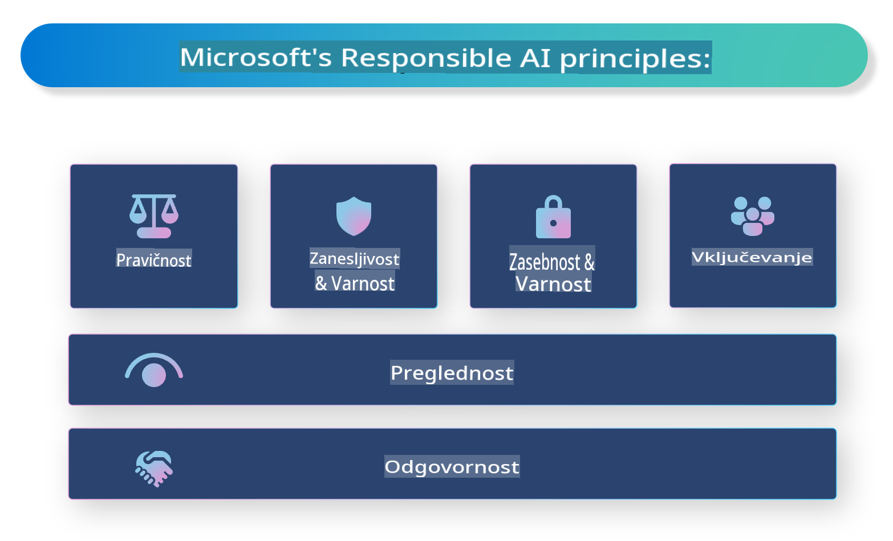

# **Uvedba odgovorne umetne inteligence**

[Microsoft Responsible AI](https://www.microsoft.com/ai/responsible-ai?WT.mc_id=aiml-138114-kinfeylo) je pobuda, ki želi pomagati razvijalcem in organizacijam pri gradnji sistemov umetne inteligence, ki so pregledni, zaupanja vredni in odgovorni. Pobuda ponuja smernice in vire za razvoj odgovornih rešitev umetne inteligence, ki so usklajene z etičnimi načeli, kot so zasebnost, pravičnost in preglednost. Prav tako bomo raziskali nekatere izzive in najboljše prakse, povezane z gradnjo odgovornih sistemov umetne inteligence.

## Pregled Microsoft Responsible AI

**Etična načela**

Microsoft Responsible AI se vodi po naboru etičnih načel, kot so zasebnost, pravičnost, preglednost, odgovornost in varnost. Ta načela so zasnovana za zagotavljanje razvoja sistemov umetne inteligence na etičen in odgovoren način.

**Pregledna umetna inteligenca**

Microsoft Responsible AI poudarja pomen preglednosti v sistemih umetne inteligence. To vključuje zagotavljanje jasnih razlag delovanja modelov umetne inteligence ter zagotavljanje, da so viri podatkov in algoritmi javno dostopni.

**Odgovorna umetna inteligenca**

[Microsoft Responsible AI](https://www.microsoft.com/ai/responsible-ai?WT.mc_id=aiml-138114-kinfeylo) spodbuja razvoj odgovornih sistemov umetne inteligence, ki omogočajo vpogled v to, kako modeli umetne inteligence sprejemajo odločitve. To lahko uporabnikom pomaga razumeti in zaupati rezultatom teh sistemov.

**Vključenost**

Sistemi umetne inteligence bi morali biti zasnovani tako, da koristijo vsem. Microsoft si prizadeva ustvariti vključujočo umetno inteligenco, ki upošteva različne perspektive in se izogiba pristranskosti ali diskriminaciji.

**Zanesljivost in varnost**

Zagotavljanje, da so sistemi umetne inteligence zanesljivi in varni, je ključnega pomena. Microsoft se osredotoča na gradnjo robustnih modelov, ki delujejo dosledno in preprečujejo škodljive posledice.

**Pravičnost v umetni inteligenci**

Microsoft Responsible AI priznava, da lahko sistemi umetne inteligence ohranjajo pristranskosti, če so usposobljeni na pristranskih podatkih ali algoritmih. Pobuda ponuja smernice za razvoj pravičnih sistemov umetne inteligence, ki ne diskriminirajo na podlagi dejavnikov, kot so rasa, spol ali starost.

**Zasebnost in varnost**

Microsoft Responsible AI poudarja pomen zaščite zasebnosti uporabnikov in varnosti podatkov v sistemih umetne inteligence. To vključuje izvajanje močnega šifriranja podatkov in nadzorov dostopa ter redne preglede ranljivosti sistemov umetne inteligence.

**Odgovornost in zavezanost**

Microsoft Responsible AI spodbuja odgovornost in zavezanost pri razvoju in uvajanju umetne inteligence. To vključuje zagotavljanje, da so razvijalci in organizacije seznanjeni s potencialnimi tveganji, povezanimi s sistemi umetne inteligence, in sprejemajo ukrepe za njihovo zmanjšanje.

## Najboljše prakse za gradnjo odgovornih sistemov umetne inteligence

**Razvijajte modele umetne inteligence z raznolikimi nabori podatkov**

Da bi se izognili pristranskosti v sistemih umetne inteligence, je pomembno uporabljati raznolike nabore podatkov, ki predstavljajo različne perspektive in izkušnje.

**Uporabljajte tehnike razložljive umetne inteligence**

Tehnike razložljive umetne inteligence lahko pomagajo uporabnikom razumeti, kako modeli umetne inteligence sprejemajo odločitve, kar lahko poveča zaupanje v sistem.

**Redno pregledujte sisteme umetne inteligence zaradi ranljivosti**

Redni pregledi sistemov umetne inteligence lahko pomagajo prepoznati potencialna tveganja in ranljivosti, ki jih je treba odpraviti.

**Izvajajte močno šifriranje podatkov in nadzore dostopa**

Šifriranje podatkov in nadzori dostopa lahko pomagajo zaščititi zasebnost in varnost uporabnikov v sistemih umetne inteligence.

**Sledite etičnim načelom pri razvoju umetne inteligence**

Sledenje etičnim načelom, kot so pravičnost, preglednost in odgovornost, lahko pomaga zgraditi zaupanje v sisteme umetne inteligence in zagotovi, da so razviti na odgovoren način.

## Uporaba AI Foundry za odgovorno umetno inteligenco

[Azure AI Foundry](https://ai.azure.com?WT.mc_id=aiml-138114-kinfeylo) je zmogljiva platforma, ki omogoča razvijalcem in organizacijam hitro ustvarjanje inteligentnih, naprednih, tržno pripravljenih in odgovornih aplikacij. Tukaj so nekatere ključne funkcije in zmogljivosti Azure AI Foundry:

**Vnaprej pripravljeni API-ji in modeli**

Azure AI Foundry ponuja vnaprej pripravljene in prilagodljive API-je in modele. Ti pokrivajo širok spekter nalog umetne inteligence, vključno z generativno umetno inteligenco, obdelavo naravnega jezika za pogovore, iskanjem, nadzorom, prevajanjem, govorom, vizijo in odločanjem.

**Prompt Flow**

Prompt Flow v Azure AI Foundry omogoča ustvarjanje pogovornih izkušenj z umetno inteligenco. Omogoča oblikovanje in upravljanje pogovornih tokov, kar olajša gradnjo klepetalnikov, virtualnih asistentov in drugih interaktivnih aplikacij.

**Retrieval Augmented Generation (RAG)**

RAG je tehnika, ki združuje pristope na osnovi iskanja in generacije. Izboljša kakovost generiranih odgovorov z izkoriščanjem obstoječega znanja (iskanje) in ustvarjalne generacije (generacija).

**Ocenjevanje in nadzor metrik za generativno umetno inteligenco**

Azure AI Foundry ponuja orodja za ocenjevanje in nadzor modelov generativne umetne inteligence. Lahko ocenjujete njihovo delovanje, pravičnost in druge pomembne metrike za zagotovitev odgovorne uporabe. Poleg tega, če ste ustvarili nadzorno ploščo, lahko z uporabo uporabniškega vmesnika brez kode v Azure Machine Learning Studio prilagodite in ustvarite nadzorno ploščo odgovorne umetne inteligence ter pripadajočo ocenjevalno kartico na osnovi [Responsible AI Toolbox](https://responsibleaitoolbox.ai/?WT.mc_id=aiml-138114-kinfeylo) Python knjižnic. Ta ocenjevalna kartica vam pomaga deliti ključne vpoglede, povezane s pravičnostjo, pomembnostjo lastnosti in drugimi vidiki odgovorne uporabe, z tehničnimi in netehničnimi deležniki.

Za uporabo AI Foundry z odgovorno umetno inteligenco lahko sledite tem najboljšim praksam:

**Opredelite problem in cilje vašega sistema umetne inteligence**

Pred začetkom razvojnega procesa je pomembno jasno opredeliti problem ali cilj, ki ga vaš sistem umetne inteligence želi rešiti. To vam bo pomagalo določiti podatke, algoritme in vire, potrebne za gradnjo učinkovitega modela.

**Zberite in predhodno obdelajte ustrezne podatke**

Kakovost in količina podatkov, uporabljenih za usposabljanje sistema umetne inteligence, lahko pomembno vplivata na njegovo delovanje. Zato je pomembno zbrati ustrezne podatke, jih očistiti, predhodno obdelati in zagotoviti, da so reprezentativni za populacijo ali problem, ki ga želite rešiti.

**Izberite ustrezno ocenjevanje**

Na voljo je več algoritmov za ocenjevanje. Pomembno je izbrati najprimernejšega glede na vaše podatke in problem.

**Ocenite in interpretirajte model**

Ko ste zgradili model umetne inteligence, je pomembno oceniti njegovo delovanje z uporabo ustreznih metrik in rezultate interpretirati na pregleden način. To vam bo pomagalo prepoznati morebitne pristranskosti ali omejitve modela ter izboljšati tam, kjer je potrebno.

**Zagotovite preglednost in razložljivost**

Sistemi umetne inteligence bi morali biti pregledni in razložljivi, da uporabniki razumejo, kako delujejo in kako so sprejete odločitve. To je še posebej pomembno za aplikacije, ki imajo velik vpliv na človeška življenja, kot so zdravstvo, finance in pravni sistemi.

**Nadzirajte in posodabljajte model**

Sisteme umetne inteligence je treba stalno nadzirati in posodabljati, da ostanejo natančni in učinkoviti skozi čas. To zahteva stalno vzdrževanje, testiranje in ponovno usposabljanje modela.

Na koncu, Microsoft Responsible AI je pobuda, ki želi pomagati razvijalcem in organizacijam pri gradnji sistemov umetne inteligence, ki so pregledni, zaupanja vredni in odgovorni. Ne pozabite, da je izvajanje odgovorne umetne inteligence ključnega pomena, Azure AI Foundry pa si prizadeva, da to postane praktično za organizacije. S sledenjem etičnim načelom in najboljšim praksam lahko zagotovimo, da so sistemi umetne inteligence razviti in uporabljeni na odgovoren način, ki koristi celotni družbi.

**Omejitev odgovornosti**:  
Ta dokument je bil preveden z uporabo storitev strojnega prevajanja, ki jih omogoča umetna inteligenca. Čeprav si prizadevamo za natančnost, vas prosimo, da se zavedate, da lahko avtomatski prevodi vsebujejo napake ali netočnosti. Izvirni dokument v njegovem maternem jeziku je treba obravnavati kot avtoritativni vir. Za ključne informacije priporočamo profesionalni prevod s strani človeka. Ne prevzemamo odgovornosti za morebitne nesporazume ali napačne razlage, ki bi nastale zaradi uporabe tega prevoda.