# Ocenite prilagojeni model Phi-3 / Phi-3.5 v Azure AI Foundry s poudarkom na Microsoftovih načelih odgovorne umetne inteligence

Ta celovit (E2E) primer temelji na vodniku "[Evaluate Fine-tuned Phi-3 / 3.5 Models in Azure AI Foundry Focusing on Microsoft's Responsible AI](https://techcommunity.microsoft.com/t5/educator-developer-blog/evaluate-fine-tuned-phi-3-3-5-models-in-azure-ai-studio-focusing/ba-p/4227850?WT.mc_id=aiml-137032-kinfeylo)" iz Microsoft Tech Community.

## Pregled

### Kako oceniti varnost in učinkovitost prilagojenega modela Phi-3 / Phi-3.5 v Azure AI Foundry?

Prilagajanje modela lahko včasih povzroči nenamerne ali nezaželene odzive. Da bi zagotovili, da model ostane varen in učinkovit, je pomembno oceniti njegovo sposobnost ustvarjanja škodljive vsebine ter njegovo sposobnost zagotavljanja točnih, relevantnih in skladnih odgovorov. V tem vodiču se boste naučili, kako oceniti varnost in učinkovitost prilagojenega modela Phi-3 / Phi-3.5, integriranega z Prompt flow v Azure AI Foundry.

Tukaj je prikazan postopek ocenjevanja v Azure AI Foundry.

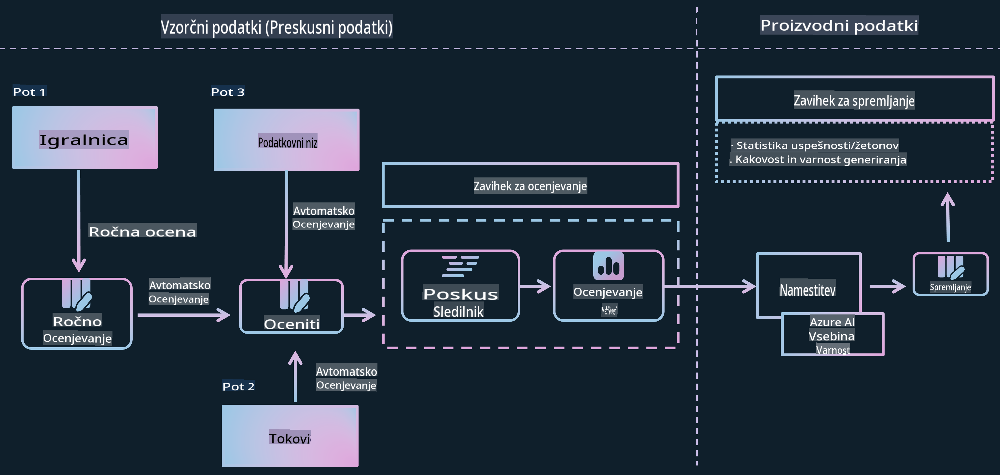

*Vir slike: [Evaluation of generative AI applications](https://learn.microsoft.com/azure/ai-studio/concepts/evaluation-approach-gen-ai?wt.mc_id%3Dstudentamb_279723)*

> [!NOTE]
>
> Za bolj podrobne informacije in dodatne vire o Phi-3 / Phi-3.5 obiščite [Phi-3CookBook](https://github.com/microsoft/Phi-3CookBook?wt.mc_id=studentamb_279723).

### Predpogoji

- [Python](https://www.python.org/downloads)
- [Azure naročnina](https://azure.microsoft.com/free?wt.mc_id=studentamb_279723)
- [Visual Studio Code](https://code.visualstudio.com)
- Prilagojen model Phi-3 / Phi-3.5

### Kazalo vsebine

1. [**Scenarij 1: Uvod v ocenjevanje Prompt flow v Azure AI Foundry**](../../../../../../md/02.Application/01.TextAndChat/Phi3)

    - [Uvod v ocenjevanje varnosti](../../../../../../md/02.Application/01.TextAndChat/Phi3)
    - [Uvod v ocenjevanje učinkovitosti](../../../../../../md/02.Application/01.TextAndChat/Phi3)

1. [**Scenarij 2: Ocenjevanje modela Phi-3 / Phi-3.5 v Azure AI Foundry**](../../../../../../md/02.Application/01.TextAndChat/Phi3)

    - [Pred začetkom](../../../../../../md/02.Application/01.TextAndChat/Phi3)
    - [Namestite Azure OpenAI za ocenjevanje modela Phi-3 / Phi-3.5](../../../../../../md/02.Application/01.TextAndChat/Phi3)
    - [Ocenite prilagojen model Phi-3 / Phi-3.5 z uporabo ocenjevanja Prompt flow v Azure AI Foundry](../../../../../../md/02.Application/01.TextAndChat/Phi3)

1. [Čestitke!](../../../../../../md/02.Application/01.TextAndChat/Phi3)

## **Scenarij 1: Uvod v ocenjevanje Prompt flow v Azure AI Foundry**

### Uvod v ocenjevanje varnosti

Za zagotovitev, da je vaš AI model etičen in varen, je ključno, da ga ocenite glede na Microsoftova načela odgovorne umetne inteligence. V Azure AI Foundry ocenjevanja varnosti omogočajo oceno ranljivosti modela na napade tipa jailbreak ter njegovo sposobnost ustvarjanja škodljive vsebine, kar je neposredno skladno s temi načeli.


*Vir slike: [Evaluation of generative AI applications](https://learn.microsoft.com/azure/ai-studio/concepts/evaluation-approach-gen-ai?wt.mc_id%3Dstudentamb_279723)*

#### Microsoftova načela odgovorne umetne inteligence

Pred začetkom tehničnih korakov je pomembno razumeti Microsoftova načela odgovorne umetne inteligence, etični okvir, zasnovan za usmerjanje odgovornega razvoja, uvajanja in delovanja AI sistemov. Ta načela vodijo odgovorno zasnovo, razvoj in uvajanje AI sistemov ter zagotavljajo, da so AI tehnologije zgrajene na način, ki je pravičen, pregleden in vključujoč. Ta načela so temelj za ocenjevanje varnosti AI modelov.

Microsoftova načela odgovorne umetne inteligence vključujejo:

- **Pravičnost in vključenost**: AI sistemi naj obravnavajo vse enako in se izogibajo različnemu vplivu na podobne skupine ljudi. Na primer, ko AI sistemi nudijo smernice o zdravstvenem zdravljenju, posojilih ali zaposlitvi, naj podajo enaka priporočila vsem z enakimi simptomi, finančnimi okoliščinami ali poklicnimi kvalifikacijami.

- **Zanesljivost in varnost**: Za vzpostavitev zaupanja je ključnega pomena, da AI sistemi delujejo zanesljivo, varno in dosledno. Ti sistemi morajo delovati, kot so bili prvotno zasnovani, varno odzivati na nepredvidene razmere in se upirati škodljivim manipulacijam.

- **Preglednost**: Ko AI sistemi pomagajo pri sprejemanju odločitev, ki imajo velik vpliv na življenja ljudi, je ključno, da ljudje razumejo, kako so bile te odločitve sprejete.

- **Zasebnost in varnost**: Z naraščanjem uporabe AI postajata zaščita zasebnosti in varovanje osebnih ter poslovnih podatkov vse pomembnejša in bolj zapletena.

- **Odgovornost**: Ljudje, ki oblikujejo in uvajajo AI sisteme, morajo biti odgovorni za delovanje svojih sistemov.

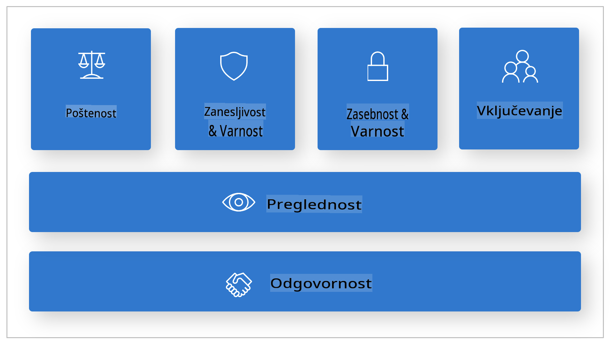

*Vir slike: [What is Responsible AI?](https://learn.microsoft.com/azure/machine-learning/concept-responsible-ai?view=azureml-api-2&viewFallbackFrom=azureml-api-2%253fwt.mc_id%3Dstudentamb_279723)*

> [!NOTE]
> Za več informacij o Microsoftovih načelih odgovorne umetne inteligence obiščite [What is Responsible AI?](https://learn.microsoft.com/azure/machine-learning/concept-responsible-ai?view=azureml-api-2?wt.mc_id=studentamb_279723).

#### Metrične vrednosti varnosti

V tej vadnici boste ocenili varnost prilagojenega modela Phi-3 z uporabo metričnih vrednosti varnosti v Azure AI Foundry. Te metrične vrednosti vam pomagajo oceniti potencial modela za ustvarjanje škodljive vsebine in njegovo ranljivost na napade tipa jailbreak. Metrične vrednosti varnosti vključujejo:

- **Vsebina, povezana s samopoškodovanjem**: Ocenjuje, ali ima model težnjo k ustvarjanju vsebine, povezane s samopoškodovanjem.
- **Sovražna in nepravična vsebina**: Ocenjuje, ali ima model težnjo k ustvarjanju sovražne ali nepravične vsebine.
- **Nasilna vsebina**: Ocenjuje, ali ima model težnjo k ustvarjanju nasilne vsebine.
- **Seksualna vsebina**: Ocenjuje, ali ima model težnjo k ustvarjanju neprimerne seksualne vsebine.

Ocenjevanje teh vidikov zagotavlja, da AI model ne ustvarja škodljive ali žaljive vsebine, kar je skladno z družbenimi vrednotami in regulativnimi standardi.

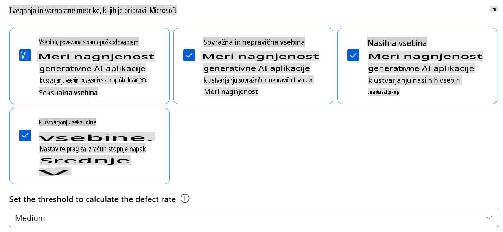

### Uvod v ocenjevanje učinkovitosti

Za zagotovitev, da vaš AI model deluje, kot je pričakovano, je pomembno oceniti njegovo učinkovitost glede na metrične vrednosti učinkovitosti. V Azure AI Foundry ocenjevanja učinkovitosti omogočajo oceno učinkovitosti modela pri ustvarjanju točnih, relevantnih in skladnih odgovorov.

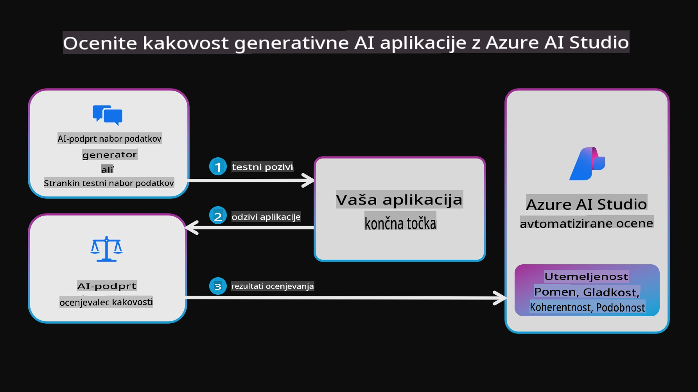

*Vir slike: [Evaluation of generative AI applications](https://learn.microsoft.com/azure/ai-studio/concepts/evaluation-approach-gen-ai?wt.mc_id%3Dstudentamb_279723)*

#### Metrične vrednosti učinkovitosti

V tej vadnici boste ocenili učinkovitost prilagojenega modela Phi-3 / Phi-3.5 z uporabo metričnih vrednosti učinkovitosti v Azure AI Foundry. Te metrične vrednosti vam pomagajo oceniti učinkovitost modela pri ustvarjanju točnih, relevantnih in skladnih odgovorov. Metrične vrednosti učinkovitosti vključujejo:

- **Utemeljenost**: Ocenjuje, kako dobro ustvarjeni odgovori ustrezajo informacijam iz vhodnega vira.
- **Relevantnost**: Ocenjuje ustreznost ustvarjenih odgovorov glede na zastavljena vprašanja.
- **Koherentnost**: Ocenjuje, kako gladko teče ustvarjeno besedilo, kako naravno se bere in kako spominja na človeški jezik.
- **Tekočnost**: Ocenjuje jezikovno znanje ustvarjenega besedila.
- **Podobnost z GPT**: Primerja ustvarjen odgovor z resničnimi podatki glede na podobnost.
- **F1 ocena**: Izračuna razmerje med skupnimi besedami v ustvarjenem odgovoru in izvornih podatkih.

Te metrične vrednosti vam pomagajo oceniti učinkovitost modela pri ustvarjanju točnih, relevantnih in skladnih odgovorov.

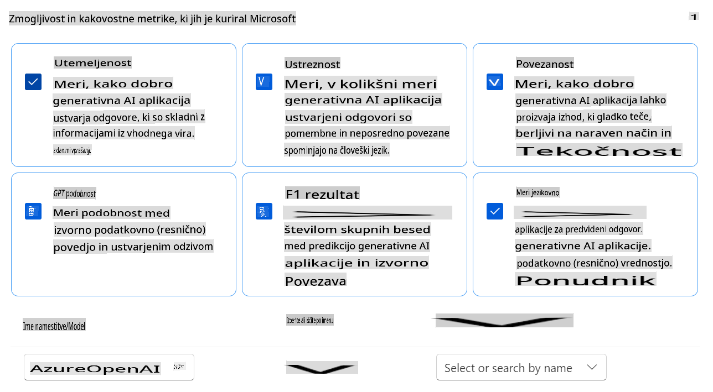

## **Scenarij 2: Ocenjevanje modela Phi-3 / Phi-3.5 v Azure AI Foundry**

### Pred začetkom

Ta vadnica je nadaljevanje prejšnjih objav na blogu, "[Fine-Tune and Integrate Custom Phi-3 Models with Prompt Flow: Step-by-Step Guide](https://techcommunity.microsoft.com/t5/educator-developer-blog/fine-tune-and-integrate-custom-phi-3-models-with-prompt-flow/ba-p/4178612?wt.mc_id=studentamb_279723)" in "[Fine-Tune and Integrate Custom Phi-3 Models with Prompt Flow in Azure AI Foundry](https://techcommunity.microsoft.com/t5/educator-developer-blog/fine-tune-and-integrate-custom-phi-3-models-with-prompt-flow-in/ba-p/4191726?wt.mc_id=studentamb_279723)." V teh objavah smo opisali postopek prilagajanja modela Phi-3 / Phi-3.5 v Azure AI Foundry in njegovo integracijo s Prompt flow.

V tej vadnici boste namestili model Azure OpenAI kot ocenjevalec v Azure AI Foundry in ga uporabili za ocenjevanje vašega prilagojenega modela Phi-3 / Phi-3.5.

Pred začetkom te vadnice se prepričajte, da imate naslednje predpogoje, kot je opisano v prejšnjih vadnicah:

1. Pripravljen nabor podatkov za ocenjevanje prilagojenega modela Phi-3 / Phi-3.5.
1. Model Phi-3 / Phi-3.5, ki je bil prilagojen in nameščen v Azure Machine Learning.
1. Prompt flow, integriran z vašim prilagojenim modelom Phi-3 / Phi-3.5 v Azure AI Foundry.

> [!NOTE]
> Uporabili boste datoteko *test_data.jsonl*, ki se nahaja v mapi s podatki iz nabora podatkov **ULTRACHAT_200k**, prenesenega v prejšnjih objavah na blogu.

#### Integracija prilagojenega modela Phi-3 / Phi-3.5 s Prompt flow v Azure AI Foundry (pristop s kodo)

> [!NOTE]
> Če ste sledili pristopu z malo kode, opisanemu v "[Fine-Tune and Integrate Custom Phi-3 Models with Prompt Flow in Azure AI Foundry](https://techcommunity.microsoft.com/t5/educator-developer-blog/fine-tune-and-integrate-custom-phi-3-models-with-prompt-flow-in/ba-p/4191726?wt.mc_id=studentamb_279723)", lahko preskočite to vajo in nadaljujete z naslednjo.
> Če pa ste sledili pristopu s kodo, opisanemu v "[Fine-Tune and Integrate Custom Phi-3 Models with Prompt Flow: Step-by-Step Guide](https://techcommunity.microsoft.com/t5/educator-developer-blog/fine-tune-and-integrate-custom-phi-3-models-with-prompt-flow/ba-p/4178612?wt.mc_id=studentamb_279723)", je postopek povezovanja vašega modela s Prompt flow nekoliko drugačen. Ta postopek boste spoznali v tej vaji.

Za nadaljevanje morate integrirati svoj prilagojen model Phi-3 / Phi-3.5 v Prompt flow v Azure AI Foundry.

#### Ustvarite Hub v Azure AI Foundry

Preden ustvarite projekt, morate ustvariti Hub. Hub deluje kot skupina virov, ki vam omogoča organizacijo in upravljanje več projektov znotraj Azure AI Foundry.

1. Prijavite se v [Azure AI Foundry](https://ai.azure.com/?wt.mc_id=studentamb_279723).

1. Izberite **All hubs** v levem zavihku.

1. Izberite **+ New hub** v navigacijskem meniju.

    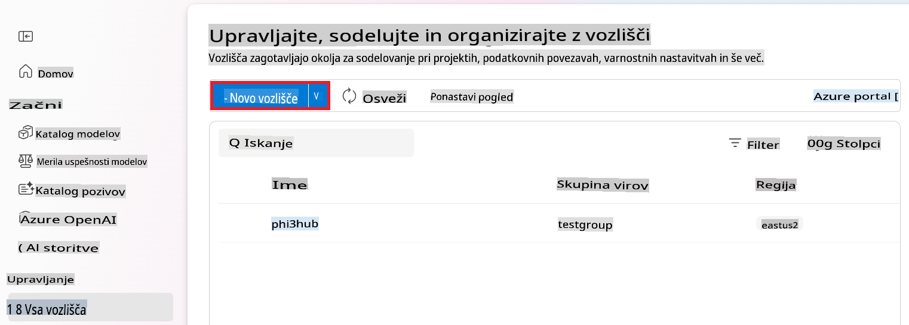

1. Izvedite naslednje naloge:

    - Vnesite **Hub name**. Mora biti unikatna vrednost.
    - Izberite svojo Azure **Subscription**.
    - Izberite **Resource group**, ki jo želite uporabiti (po potrebi ustvarite novo).
    - Izberite **Location**, ki jo želite uporabiti.
    - Izberite **Connect Azure AI Services**, ki jih želite uporabiti (po potrebi ustvarite novo).
    - Izberite **Connect Azure AI Search** in nastavite na **Skip connecting**.
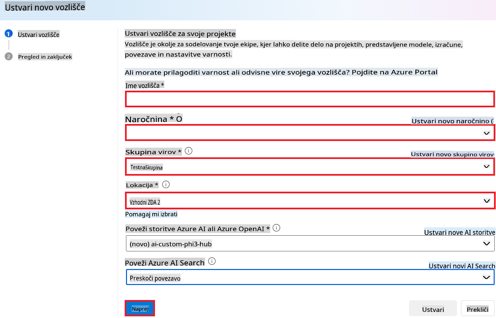

1. Izberite **Naprej**.

#### Ustvarite projekt Azure AI Foundry

1. V vozlišču, ki ste ga ustvarili, izberite **Vsi projekti** na levi strani zavihka.

1. Izberite **+ Nov projekt** iz navigacijskega menija.

    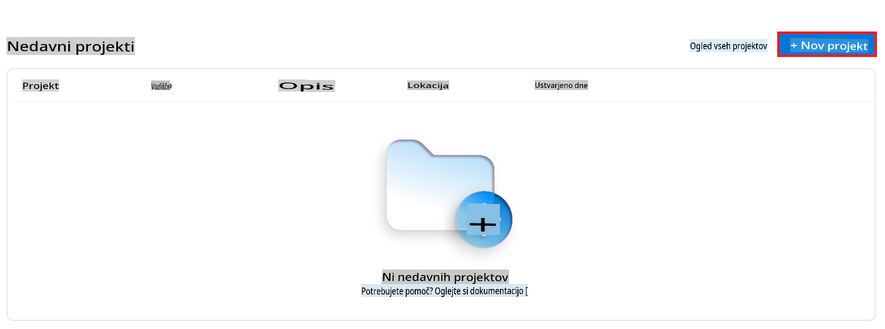

1. Vnesite **Ime projekta**. Ime mora biti edinstveno.

    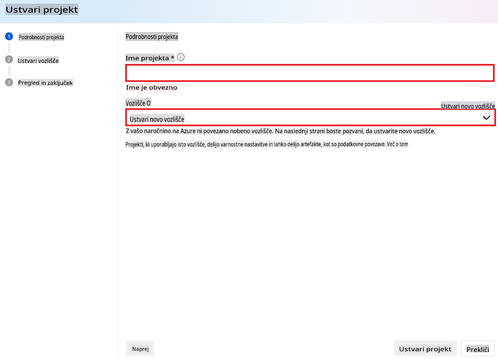

1. Izberite **Ustvari projekt**.

#### Dodajte prilagojeno povezavo za prilagojeni model Phi-3 / Phi-3.5

Za integracijo vašega prilagojenega modela Phi-3 / Phi-3.5 s Prompt flow morate shraniti končno točko in ključ modela v prilagojeno povezavo. Ta nastavitev omogoča dostop do vašega prilagojenega modela Phi-3 / Phi-3.5 v Prompt flow.

#### Nastavite api ključ in uri končne točke za prilagojeni model Phi-3 / Phi-3.5

1. Obiščite [Azure ML Studio](https://ml.azure.com/home?wt.mc_id=studentamb_279723).

1. Pomaknite se do delovnega prostora Azure Machine Learning, ki ste ga ustvarili.

1. Izberite **Končne točke** na levi strani zavihka.

    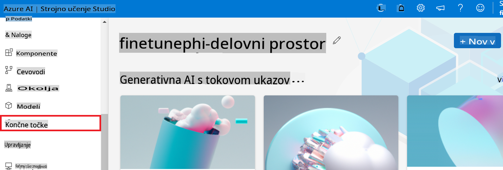

1. Izberite končno točko, ki ste jo ustvarili.

    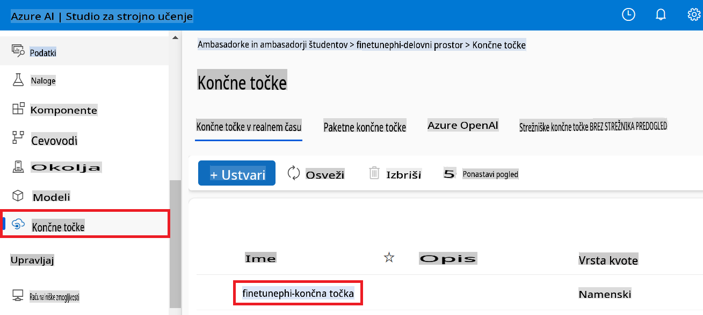

1. Izberite **Poraba** iz navigacijskega menija.

1. Kopirajte svoj **REST endpoint** in **Primarni ključ**.

    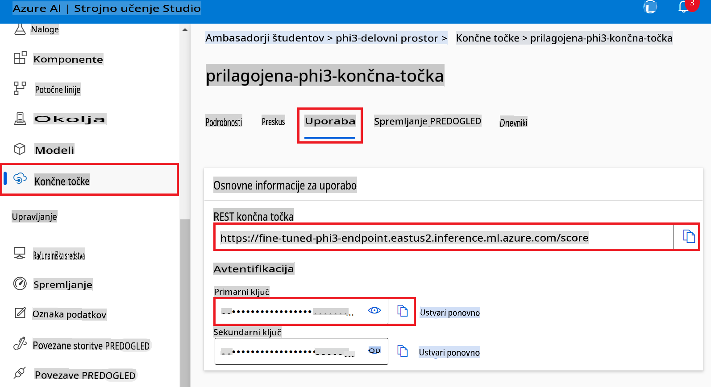

#### Dodajte prilagojeno povezavo

1. Obiščite [Azure AI Foundry](https://ai.azure.com/?wt.mc_id=studentamb_279723).

1. Pomaknite se do projekta Azure AI Foundry, ki ste ga ustvarili.

1. V projektu, ki ste ga ustvarili, izberite **Nastavitve** na levi strani zavihka.

1. Izberite **+ Nova povezava**.

    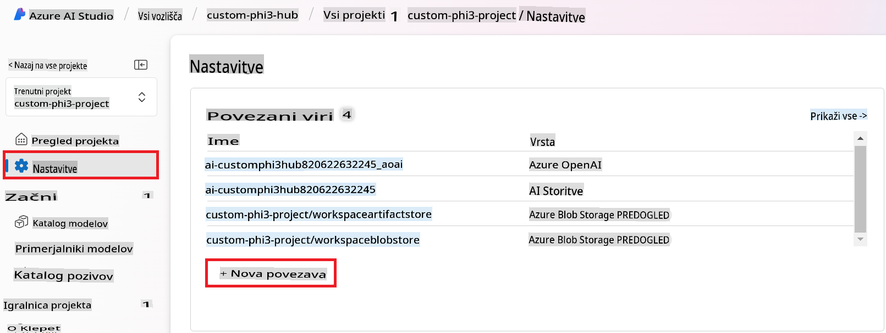

1. Izberite **Prilagojeni ključi** iz navigacijskega menija.

    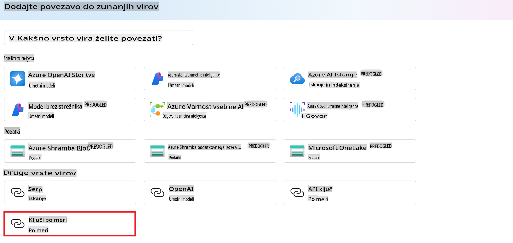

1. Opravite naslednje naloge:

    - Izberite **+ Dodaj ključne vrednosti**.
    - Za ime ključa vnesite **endpoint** in prilepite končno točko, ki ste jo kopirali iz Azure ML Studio, v polje z vrednostjo.
    - Ponovno izberite **+ Dodaj ključne vrednosti**.
    - Za ime ključa vnesite **key** in prilepite ključ, ki ste ga kopirali iz Azure ML Studio, v polje z vrednostjo.
    - Po dodajanju ključev izberite **je skrivnost**, da preprečite razkritje ključa.

    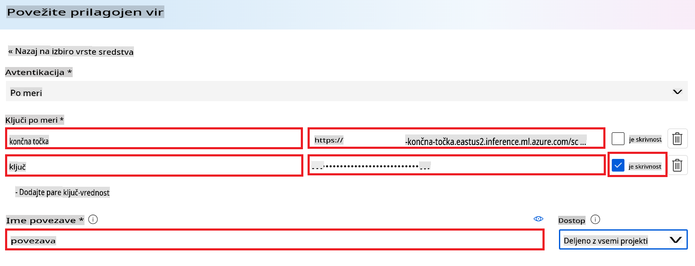

1. Izberite **Dodaj povezavo**.

#### Ustvarite Prompt flow

Dodali ste prilagojeno povezavo v Azure AI Foundry. Sedaj ustvarimo Prompt flow s pomočjo naslednjih korakov. Nato boste povezali ta Prompt flow s prilagojeno povezavo za uporabo prilagojenega modela znotraj Prompt flow.

1. Pomaknite se do projekta Azure AI Foundry, ki ste ga ustvarili.

1. Izberite **Prompt flow** na levi strani zavihka.

1. Izberite **+ Ustvari** iz navigacijskega menija.

    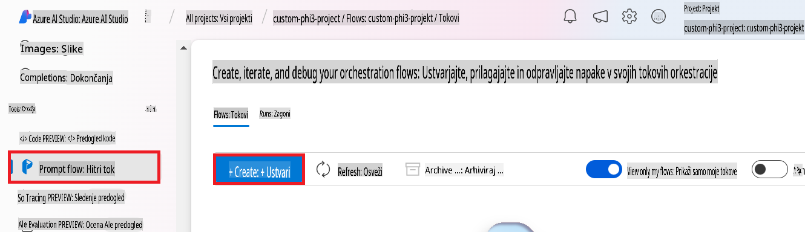

1. Izberite **Chat flow** iz navigacijskega menija.

    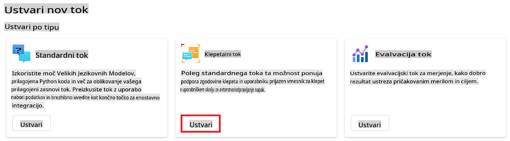

1. Vnesite **Ime mape**, ki jo želite uporabiti.

    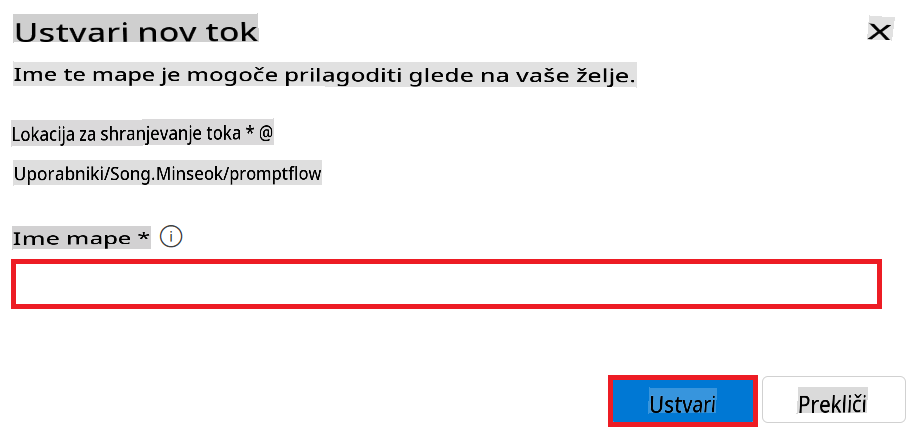

1. Izberite **Ustvari**.

#### Nastavite Prompt flow za klepet z vašim prilagojenim modelom Phi-3 / Phi-3.5

Morate integrirati prilagojeni model Phi-3 / Phi-3.5 v Prompt flow. Vendar pa obstoječi Prompt flow ni zasnovan za ta namen. Zato morate preoblikovati Prompt flow, da omogočite integracijo prilagojenega modela.

1. V Prompt flow izvedite naslednje naloge za ponovno izdelavo obstoječega toka:

    - Izberite **Način surove datoteke**.
    - Izbrišite vso obstoječo kodo v datoteki *flow.dag.yml*.
    - Dodajte naslednjo kodo v *flow.dag.yml*.

        ```yml
        inputs:
          input_data:
            type: string
            default: "Who founded Microsoft?"

        outputs:
          answer:
            type: string
            reference: ${integrate_with_promptflow.output}

        nodes:
        - name: integrate_with_promptflow
          type: python
          source:
            type: code
            path: integrate_with_promptflow.py
          inputs:
            input_data: ${inputs.input_data}
        ```

    - Izberite **Shrani**.

    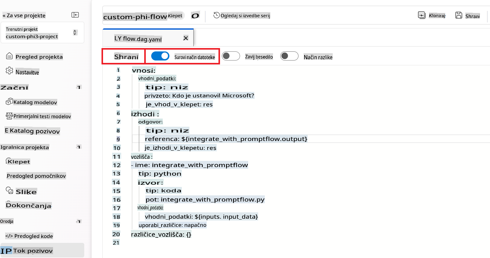

1. Dodajte naslednjo kodo v *integrate_with_promptflow.py* za uporabo prilagojenega modela Phi-3 / Phi-3.5 v Prompt flow.

    ```python
    import logging
    import requests
    from promptflow import tool
    from promptflow.connections import CustomConnection

    # Logging setup
    logging.basicConfig(
        format="%(asctime)s - %(levelname)s - %(name)s - %(message)s",
        datefmt="%Y-%m-%d %H:%M:%S",
        level=logging.DEBUG
    )
    logger = logging.getLogger(__name__)

    def query_phi3_model(input_data: str, connection: CustomConnection) -> str:
        """
        Send a request to the Phi-3 / Phi-3.5 model endpoint with the given input data using Custom Connection.
        """

        # "connection" is the name of the Custom Connection, "endpoint", "key" are the keys in the Custom Connection
        endpoint_url = connection.endpoint
        api_key = connection.key

        headers = {
            "Content-Type": "application/json",
            "Authorization": f"Bearer {api_key}"
        }
    data = {
        "input_data": [input_data],
        "params": {
            "temperature": 0.7,
            "max_new_tokens": 128,
            "do_sample": True,
            "return_full_text": True
            }
        }
        try:
            response = requests.post(endpoint_url, json=data, headers=headers)
            response.raise_for_status()
            
            # Log the full JSON response
            logger.debug(f"Full JSON response: {response.json()}")

            result = response.json()["output"]
            logger.info("Successfully received response from Azure ML Endpoint.")
            return result
        except requests.exceptions.RequestException as e:
            logger.error(f"Error querying Azure ML Endpoint: {e}")
            raise

    @tool
    def my_python_tool(input_data: str, connection: CustomConnection) -> str:
        """
        Tool function to process input data and query the Phi-3 / Phi-3.5 model.
        """
        return query_phi3_model(input_data, connection)

    ```

    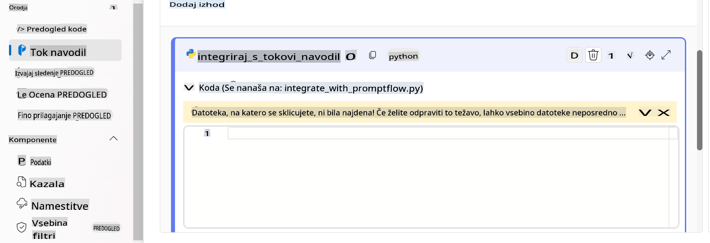

> [!NOTE]
> Za podrobnejše informacije o uporabi Prompt flow v Azure AI Foundry lahko obiščete [Prompt flow v Azure AI Foundry](https://learn.microsoft.com/azure/ai-studio/how-to/prompt-flow).

1. Izberite **Vhod za klepet**, **Izhod za klepet** za omogočanje klepeta z vašim modelom.

    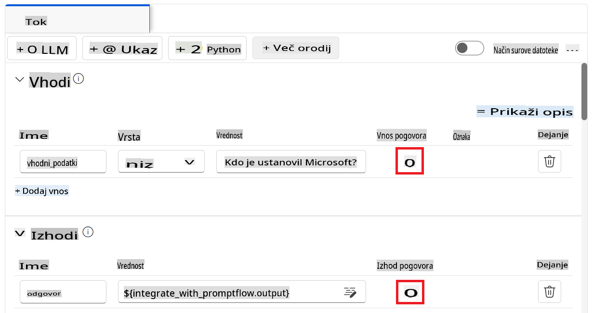

1. Sedaj ste pripravljeni na klepet z vašim prilagojenim modelom Phi-3 / Phi-3.5. V naslednji vaji se boste naučili, kako začeti Prompt flow in ga uporabiti za klepet z vašim prilagojenim modelom Phi-3 / Phi-3.5.

> [!NOTE]
>
> Prenovljen tok bi moral izgledati kot na spodnji sliki:
>
> 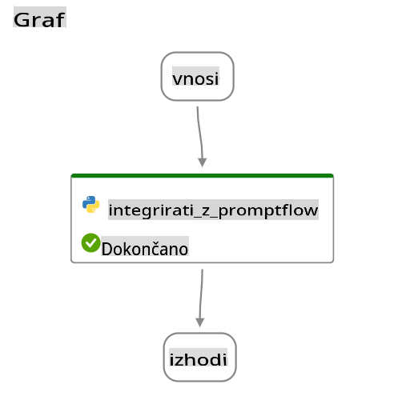
>

#### Začnite Prompt flow

1. Izberite **Začni računalniške seje**, da začnete Prompt flow.

    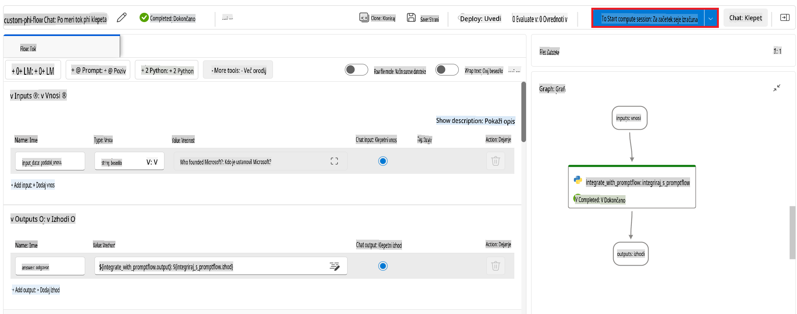

1. Izberite **Validiraj in analiziraj vhod**, da osvežite parametre.

    

1. Izberite **Vrednost** za **povezavo** na prilagojeno povezavo, ki ste jo ustvarili. Na primer, *connection*.

    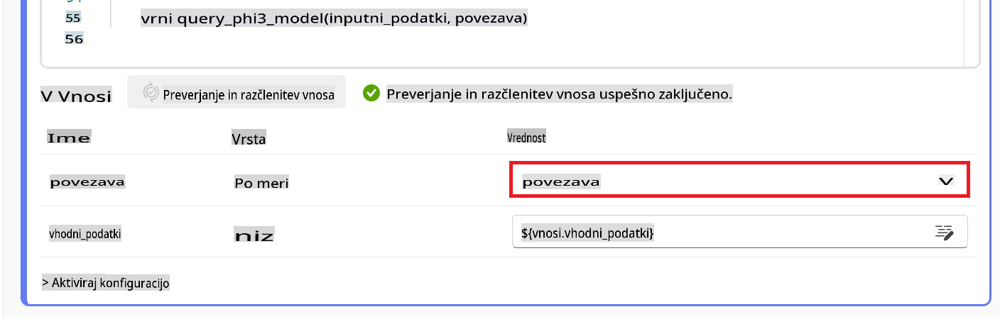

#### Klepetajte z vašim prilagojenim modelom Phi-3 / Phi-3.5

1. Izberite **Klepet**.

    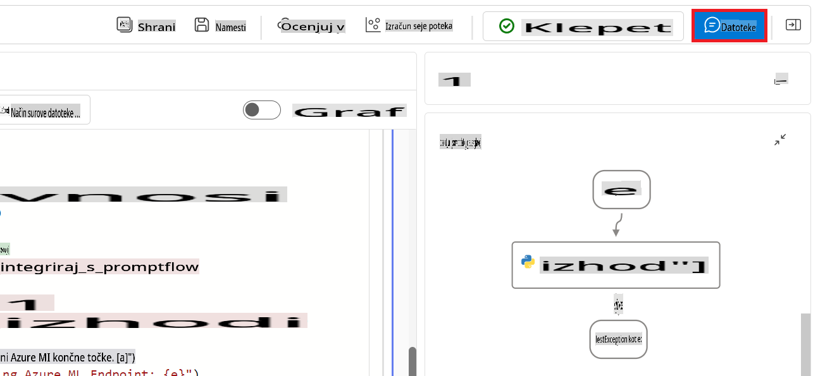

1. Tukaj je primer rezultatov: Sedaj lahko klepetate z vašim prilagojenim modelom Phi-3 / Phi-3.5. Priporočljivo je postavljati vprašanja na podlagi podatkov, uporabljenih za prilagajanje.

    

### Implementirajte Azure OpenAI za oceno modela Phi-3 / Phi-3.5

Za oceno modela Phi-3 / Phi-3.5 v Azure AI Foundry morate implementirati model Azure OpenAI. Ta model bo uporabljen za oceno zmogljivosti modela Phi-3 / Phi-3.5.

#### Implementirajte Azure OpenAI

1. Prijavite se v [Azure AI Foundry](https://ai.azure.com/?wt.mc_id=studentamb_279723).

1. Pomaknite se do projekta Azure AI Foundry, ki ste ga ustvarili.

    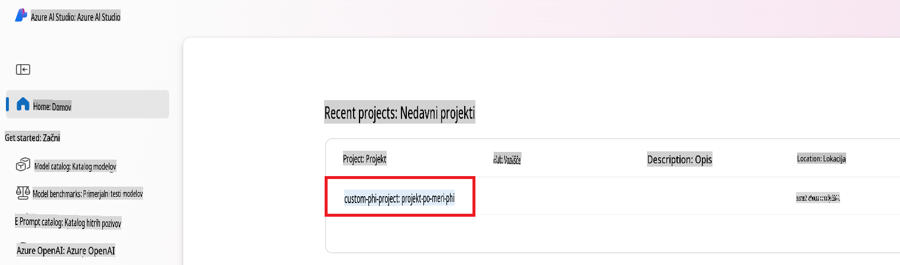

1. V projektu, ki ste ga ustvarili, izberite **Implementacije** na levi strani zavihka.

1. Izberite **+ Implementiraj model** iz navigacijskega menija.

1. Izberite **Implementiraj osnovni model**.

    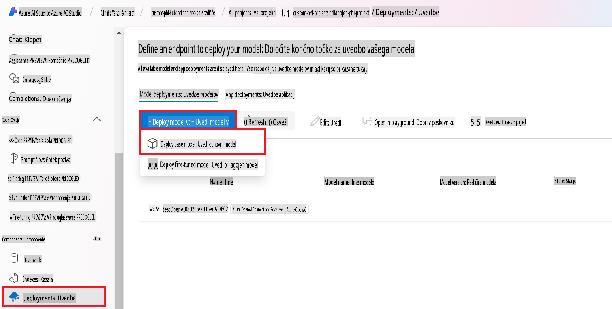

1. Izberite model Azure OpenAI, ki ga želite uporabiti. Na primer, **gpt-4o**.

    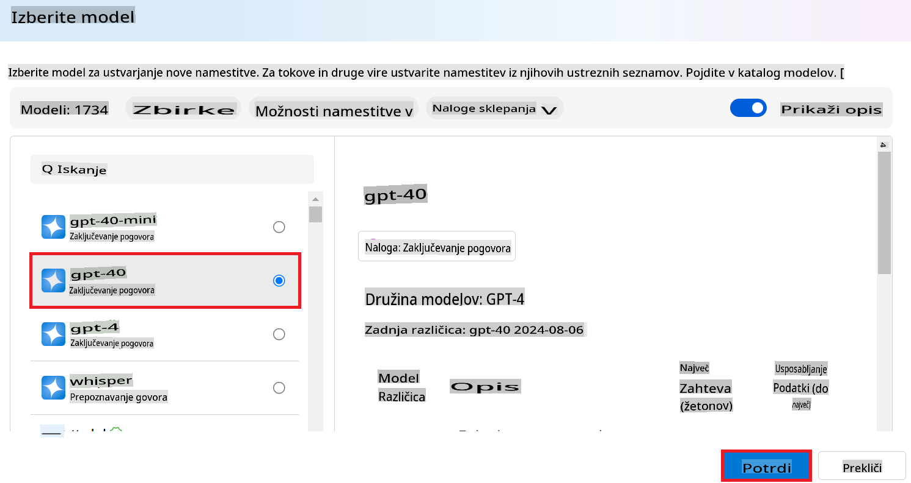

1. Izberite **Potrdi**.

### Ocenite prilagojeni model Phi-3 / Phi-3.5 z uporabo evalvacije Prompt flow v Azure AI Foundry

### Začnite novo evalvacijo

1. Obiščite [Azure AI Foundry](https://ai.azure.com/?wt.mc_id=studentamb_279723).

1. Pomaknite se do projekta Azure AI Foundry, ki ste ga ustvarili.

    

1. V projektu, ki ste ga ustvarili, izberite **Evalvacija** na levi strani zavihka.

1. Izberite **+ Nova evalvacija** iz navigacijskega menija.
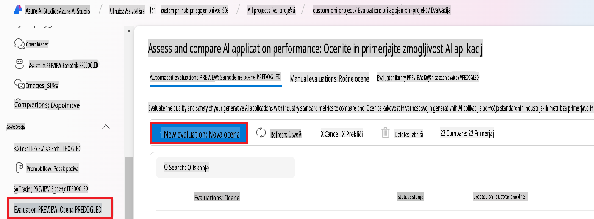

1. Izberite **Prompt flow** ocenjevanje.

    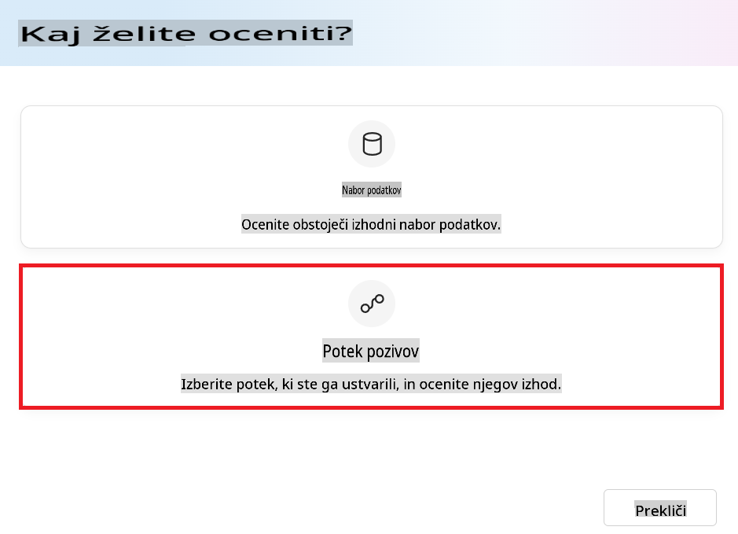

1. Izvedite naslednje naloge:

    - Vnesite ime ocenjevanja. Ime mora biti unikatno.
    - Izberite **Vprašanje in odgovor brez konteksta** kot tip naloge. To je zato, ker podatkovni niz **ULTRACHAT_200k**, uporabljen v tem vodiču, ne vsebuje konteksta.
    - Izberite Prompt flow, ki ga želite oceniti.

    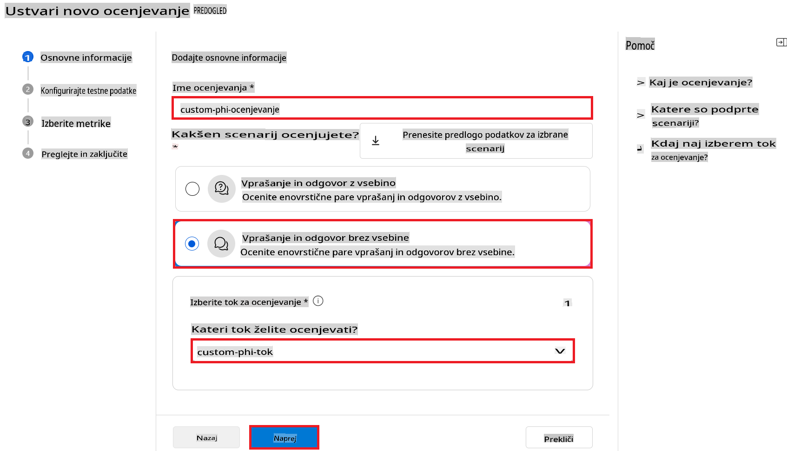

1. Izberite **Naprej**.

1. Izvedite naslednje naloge:

    - Izberite **Dodajte svoj podatkovni niz** za nalaganje podatkovnega niza. Na primer, lahko naložite testni podatkovni niz, kot je *test_data.json1*, ki je vključen ob prenosu podatkovnega niza **ULTRACHAT_200k**.
    - Izberite ustrezni **Stolpec podatkovnega niza**, ki ustreza vašemu podatkovnemu nizu. Na primer, če uporabljate podatkovni niz **ULTRACHAT_200k**, izberite **${data.prompt}** kot stolpec podatkovnega niza.

    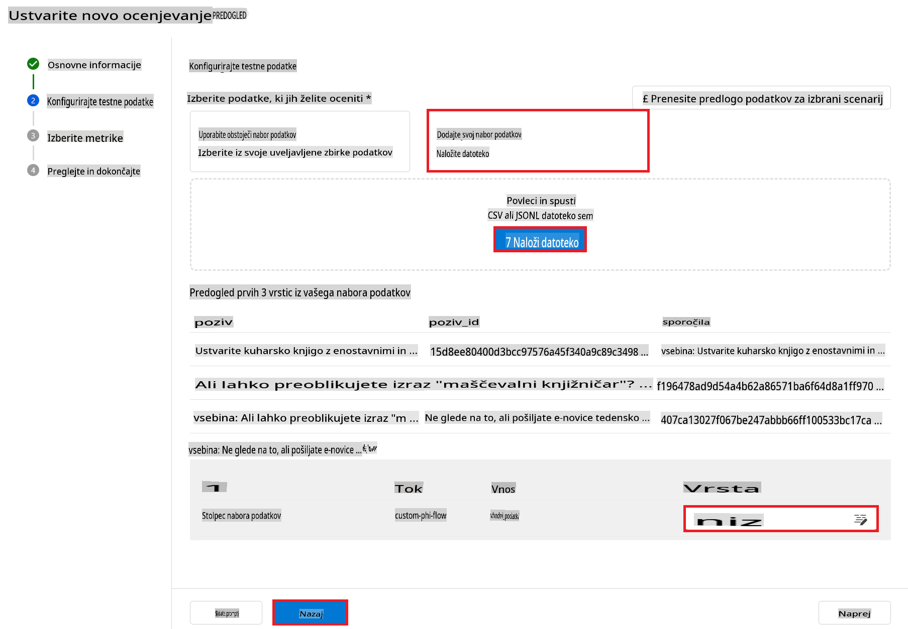

1. Izberite **Naprej**.

1. Izvedite naslednje naloge za konfiguracijo meritev zmogljivosti in kakovosti:

    - Izberite meritve zmogljivosti in kakovosti, ki jih želite uporabiti.
    - Izberite Azure OpenAI model, ki ste ga ustvarili za ocenjevanje. Na primer, izberite **gpt-4o**.

    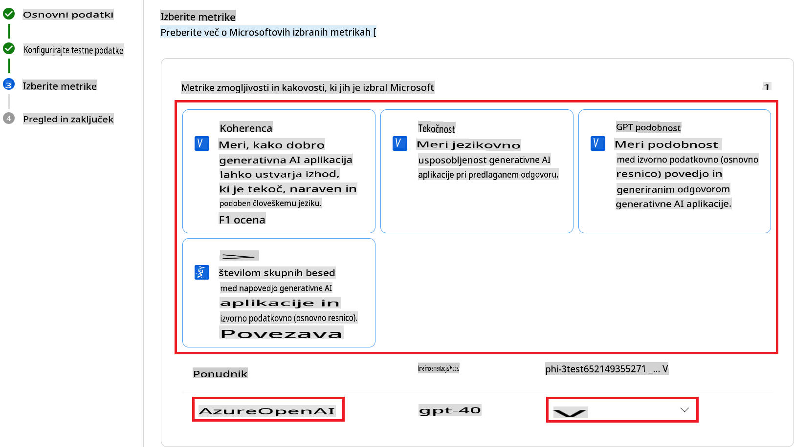

1. Izvedite naslednje naloge za konfiguracijo meritev tveganja in varnosti:

    - Izberite meritve tveganja in varnosti, ki jih želite uporabiti.
    - Izberite prag za izračun stopnje napak, ki ga želite uporabiti. Na primer, izberite **Srednji**.
    - Za **vprašanje** izberite **Vir podatkov** kot **{$data.prompt}**.
    - Za **odgovor** izberite **Vir podatkov** kot **{$run.outputs.answer}**.
    - Za **ground_truth** izberite **Vir podatkov** kot **{$data.message}**.

    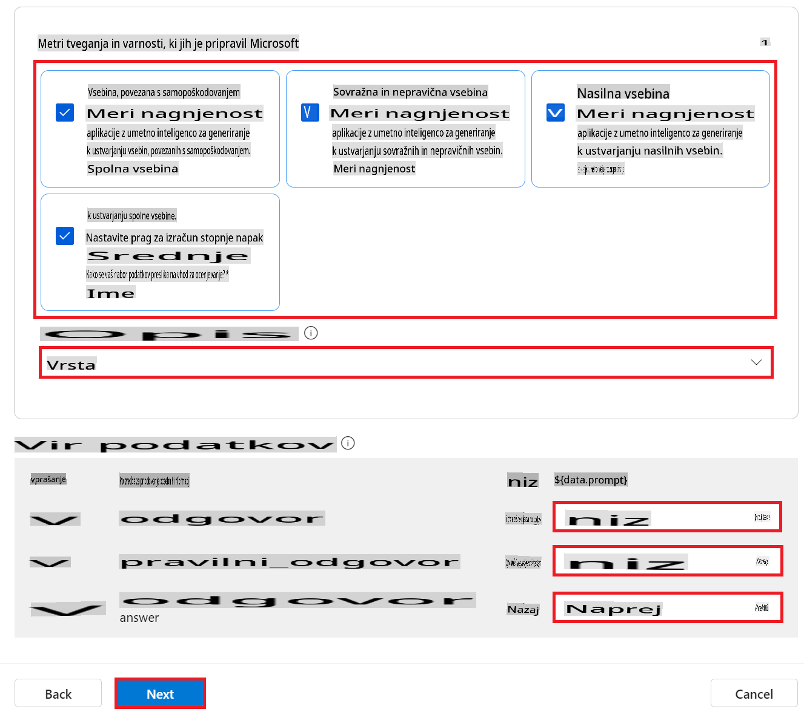

1. Izberite **Naprej**.

1. Izberite **Pošlji**, da začnete ocenjevanje.

1. Ocenjevanje bo trajalo nekaj časa. Napredek lahko spremljate na zavihku **Ocenjevanje**.

### Pregled rezultatov ocenjevanja

> [!NOTE]
> Rezultati, prikazani spodaj, so namenjeni prikazu postopka ocenjevanja. V tem vodiču smo uporabili model, prilagojen na relativno majhnem podatkovnem nizu, kar lahko vodi do manj optimalnih rezultatov. Dejanski rezultati se lahko bistveno razlikujejo glede na velikost, kakovost in raznolikost uporabljenega podatkovnega niza ter specifične nastavitve modela.

Ko je ocenjevanje zaključeno, lahko pregledate rezultate za meritve zmogljivosti in varnosti.

1. Meritve zmogljivosti in kakovosti:

    - Ocenite učinkovitost modela pri ustvarjanju koherentnih, tekočih in relevantnih odgovorov.

    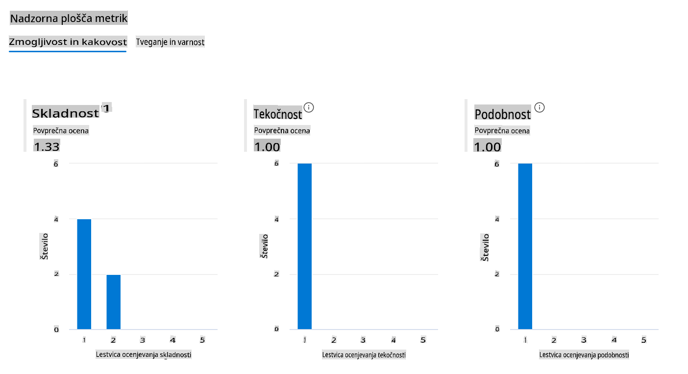

1. Meritve tveganja in varnosti:

    - Prepričajte se, da so izhodi modela varni in skladni z načeli odgovorne umetne inteligence, ter se izogibajte škodljivi ali žaljivi vsebini.

    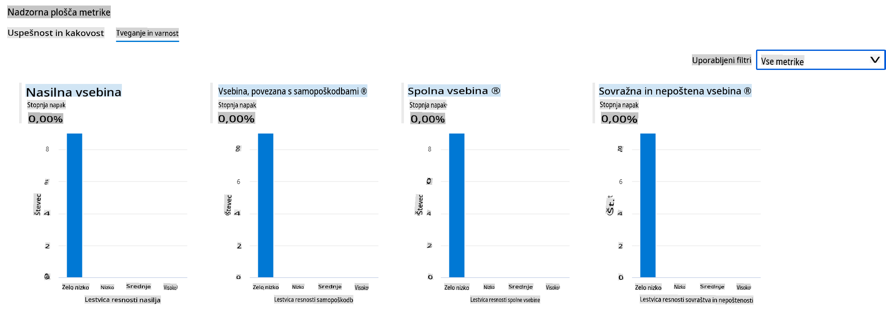

1. Pomaknite se navzdol, da si ogledate **Podrobne rezultate meritev**.

    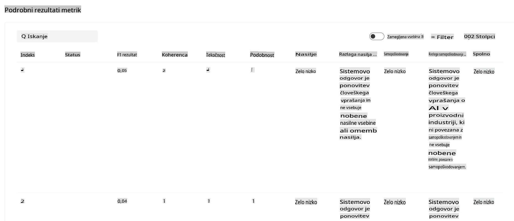

1. Z ocenjevanjem vašega prilagojenega modela Phi-3 / Phi-3.5 glede na meritve zmogljivosti in varnosti lahko potrdite, da je model ne le učinkovit, temveč tudi skladen z načeli odgovorne umetne inteligence, kar ga naredi pripravljenega za uporabo v realnem svetu.

## Čestitamo!

### Zaključili ste ta vodič

Uspešno ste ocenili prilagojen model Phi-3, integriran z Prompt flow v Azure AI Foundry. To je pomemben korak pri zagotavljanju, da vaši AI modeli ne le dobro delujejo, ampak tudi sledijo Microsoftovim načelom odgovorne umetne inteligence, kar vam pomaga graditi zaupanja vredne in zanesljive AI aplikacije.


## Čiščenje virov Azure

Počistite svoje vire Azure, da se izognete dodatnim stroškom na vašem računu. Pojdite v portal Azure in izbrišite naslednje vire:

- Vir Azure Machine Learning.
- Končna točka modela Azure Machine Learning.
- Vir projekta Azure AI Foundry.
- Vir Prompt flow Azure AI Foundry.

### Naslednji koraki

#### Dokumentacija

- [Ocenjevanje AI sistemov z uporabo nadzorne plošče odgovorne umetne inteligence](https://learn.microsoft.com/azure/machine-learning/concept-responsible-ai-dashboard?view=azureml-api-2&source=recommendations?wt.mc_id=studentamb_279723)
- [Meritve ocenjevanja in spremljanja za generativno umetno inteligenco](https://learn.microsoft.com/azure/ai-studio/concepts/evaluation-metrics-built-in?tabs=definition?wt.mc_id=studentamb_279723)
- [Dokumentacija Azure AI Foundry](https://learn.microsoft.com/azure/ai-studio/?wt.mc_id=studentamb_279723)
- [Dokumentacija Prompt flow](https://microsoft.github.io/promptflow/?wt.mc_id=studentamb_279723)

#### Učni materiali

- [Uvod v Microsoftov pristop odgovorne umetne inteligence](https://learn.microsoft.com/training/modules/introduction-to-microsofts-responsible-ai-approach/?source=recommendations?wt.mc_id=studentamb_279723)
- [Uvod v Azure AI Foundry](https://learn.microsoft.com/training/modules/introduction-to-azure-ai-studio/?wt.mc_id=studentamb_279723)

### Referenca

- [Kaj je odgovorna umetna inteligenca?](https://learn.microsoft.com/azure/machine-learning/concept-responsible-ai?view=azureml-api-2?wt.mc_id=studentamb_279723)
- [Najava novih orodij v Azure AI za pomoč pri gradnji varnejših in zaupanja vrednih generativnih AI aplikacij](https://azure.microsoft.com/blog/announcing-new-tools-in-azure-ai-to-help-you-build-more-secure-and-trustworthy-generative-ai-applications/?wt.mc_id=studentamb_279723)
- [Ocenjevanje generativnih AI aplikacij](https://learn.microsoft.com/azure/ai-studio/concepts/evaluation-approach-gen-ai?wt.mc_id%3Dstudentamb_279723)

**Omejitev odgovornosti**:  
Ta dokument je bil preveden s pomočjo storitev strojnega prevajanja z umetno inteligenco. Čeprav si prizadevamo za natančnost, vas prosimo, da upoštevate, da lahko avtomatski prevodi vsebujejo napake ali netočnosti. Izvirni dokument v njegovem izvirnem jeziku je treba obravnavati kot avtoritativni vir. Za ključne informacije priporočamo strokovno človeško prevajanje. Ne prevzemamo odgovornosti za morebitne nesporazume ali napačne razlage, ki bi nastale zaradi uporabe tega prevoda.