# Prilagoditev in integracija prilagojenih Phi-3 modelov z uporabo Prompt flow

Ta celovit primer (E2E) temelji na vodiču "[Fine-Tune and Integrate Custom Phi-3 Models with Prompt Flow: Step-by-Step Guide](https://techcommunity.microsoft.com/t5/educator-developer-blog/fine-tune-and-integrate-custom-phi-3-models-with-prompt-flow/ba-p/4178612?WT.mc_id=aiml-137032-kinfeylo)" iz Microsoft Tech Community. Vodi vas skozi procese prilagoditve, uvajanja in integracije prilagojenih Phi-3 modelov z uporabo Prompt flow.

## Pregled

V tem celovitem primeru se boste naučili, kako prilagoditi model Phi-3 in ga integrirati z uporabo Prompt flow. Z izkoriščanjem Azure Machine Learning in Prompt flow boste vzpostavili potek dela za uvajanje in uporabo prilagojenih AI modelov. Primer je razdeljen na tri scenarije:

**Scenarij 1: Nastavitev Azure virov in priprava na prilagoditev**

**Scenarij 2: Prilagoditev modela Phi-3 in uvajanje v Azure Machine Learning Studio**

**Scenarij 3: Integracija z Prompt flow in pogovor z vašim prilagojenim modelom**

Tukaj je pregled tega celovitega primera.

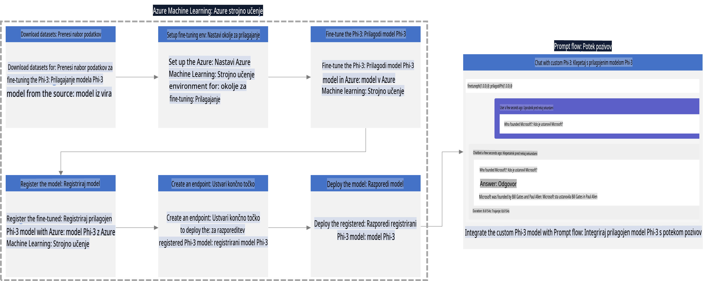

### Kazalo

1. **[Scenarij 1: Nastavitev Azure virov in priprava na prilagoditev](../../../../../../md/02.Application/01.TextAndChat/Phi3)**
    - [Ustvarjanje Azure Machine Learning delovnega prostora](../../../../../../md/02.Application/01.TextAndChat/Phi3)
    - [Zahteva za GPU kvote v Azure naročnini](../../../../../../md/02.Application/01.TextAndChat/Phi3)
    - [Dodajanje dodelitve vlog](../../../../../../md/02.Application/01.TextAndChat/Phi3)
    - [Nastavitev projekta](../../../../../../md/02.Application/01.TextAndChat/Phi3)
    - [Priprava podatkovnega nabora za prilagoditev](../../../../../../md/02.Application/01.TextAndChat/Phi3)

1. **[Scenarij 2: Prilagoditev modela Phi-3 in uvajanje v Azure Machine Learning Studio](../../../../../../md/02.Application/01.TextAndChat/Phi3)**
    - [Nastavitev Azure CLI](../../../../../../md/02.Application/01.TextAndChat/Phi3)
    - [Prilagoditev modela Phi-3](../../../../../../md/02.Application/01.TextAndChat/Phi3)
    - [Uvajanje prilagojenega modela](../../../../../../md/02.Application/01.TextAndChat/Phi3)

1. **[Scenarij 3: Integracija z Prompt flow in pogovor z vašim prilagojenim modelom](../../../../../../md/02.Application/01.TextAndChat/Phi3)**
    - [Integracija prilagojenega modela Phi-3 z Prompt flow](../../../../../../md/02.Application/01.TextAndChat/Phi3)
    - [Pogovor z vašim prilagojenim modelom](../../../../../../md/02.Application/01.TextAndChat/Phi3)

## Scenarij 1: Nastavitev Azure virov in priprava na prilagoditev

### Ustvarjanje Azure Machine Learning delovnega prostora

1. V zgornji **iskalni vrstici** portala vnesite *azure machine learning* in izberite **Azure Machine Learning** med prikazanimi možnostmi.

    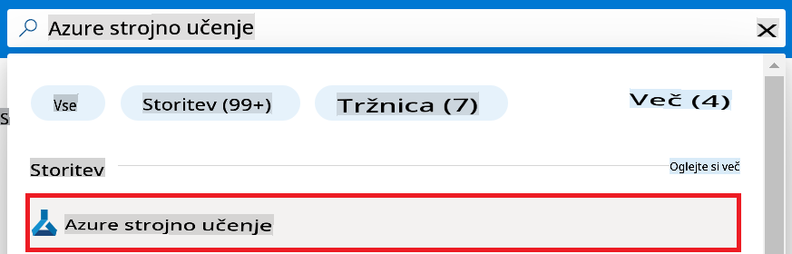

1. V navigacijskem meniju izberite **+ Create**.

1. Izberite **New workspace** v navigacijskem meniju.

    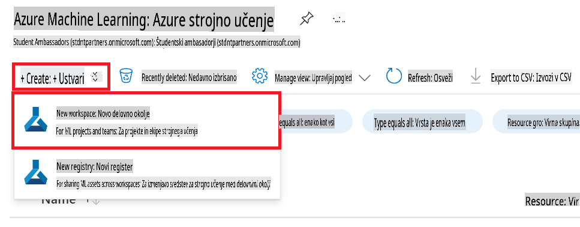

1. Izvedite naslednje naloge:

    - Izberite svojo Azure **Naročnino**.
    - Izberite **Skupino virov**, ki jo želite uporabiti (po potrebi ustvarite novo).
    - Vnesite **Ime delovnega prostora**. To mora biti unikatno ime.
    - Izberite **Regijo**, ki jo želite uporabiti.
    - Izberite **Shranjevalni račun**, ki ga želite uporabiti (po potrebi ustvarite novega).
    - Izberite **Key vault**, ki ga želite uporabiti (po potrebi ustvarite novega).
    - Izberite **Application insights**, ki jih želite uporabiti (po potrebi ustvarite novega).
    - Izberite **Container registry**, ki ga želite uporabiti (po potrebi ustvarite novega).

    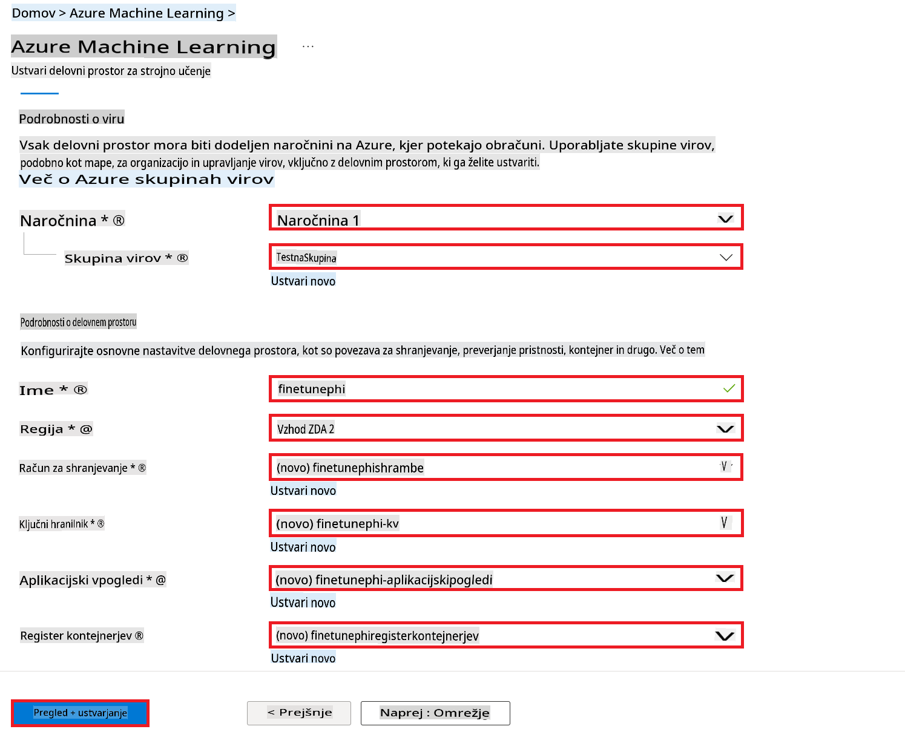

1. Izberite **Review + Create**.

1. Izberite **Create**.

### Zahteva za GPU kvote v Azure naročnini

V tem primeru boste za prilagoditev uporabili *Standard_NC24ads_A100_v4 GPU*, kar zahteva zahtevo za kvoto, in *Standard_E4s_v3* CPU za uvajanje, kar ne zahteva zahteve za kvoto.

> [!NOTE]
>
> Samo naročnine Pay-As-You-Go (standardna vrsta naročnine) so primerne za dodelitev GPU; naročnine z ugodnostmi trenutno niso podprte.
>
> Za tiste, ki uporabljajo naročnine z ugodnostmi (kot je naročnina Visual Studio Enterprise), ali za tiste, ki želijo hitro preizkusiti postopek prilagoditve in uvajanja, ta vodič vključuje tudi navodila za prilagoditev z minimalnim podatkovnim nizom z uporabo CPU. Vendar je pomembno opozoriti, da so rezultati prilagoditve bistveno boljši pri uporabi GPU z večjimi podatkovnimi nizi.

1. Obiščite [Azure ML Studio](https://ml.azure.com/home?wt.mc_id=studentamb_279723).

1. Izvedite naslednje naloge za zahtevo kvote *Standard NCADSA100v4 Family*:

    - Na levi strani izberite **Quota**.
    - Izberite **Virtual machine family**, ki jo želite uporabiti. Na primer, izberite **Standard NCADSA100v4 Family Cluster Dedicated vCPUs**, ki vključuje *Standard_NC24ads_A100_v4* GPU.
    - Izberite **Request quota** v navigacijskem meniju.

        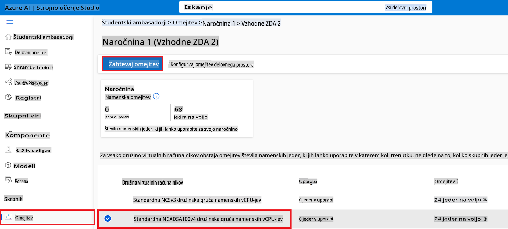

    - Na strani za zahtevo kvote vnesite **Novo omejitev jeder**, ki jo želite uporabiti. Na primer, 24.
    - Na strani za zahtevo kvote izberite **Submit** za zahtevo GPU kvote.

> [!NOTE]
> Ustrezne GPU ali CPU za vaše potrebe lahko izberete z ogledom dokumenta [Sizes for Virtual Machines in Azure](https://learn.microsoft.com/azure/virtual-machines/sizes/overview?tabs=breakdownseries%2Cgeneralsizelist%2Ccomputesizelist%2Cmemorysizelist%2Cstoragesizelist%2Cgpusizelist%2Cfpgasizelist%2Chpcsizelist).

### Dodajanje dodelitve vlog

Za prilagoditev in uvajanje modelov morate najprej ustvariti Uporabniško dodeljeno upravljano identiteto (UAI) in ji dodeliti ustrezna dovoljenja. Ta UAI bo uporabljena za preverjanje pristnosti med uvajanjem.

#### Ustvarjanje Uporabniško dodeljene upravljane identitete (UAI)

1. V zgornji **iskalni vrstici** portala vnesite *managed identities* in izberite **Managed Identities** med prikazanimi možnostmi.

    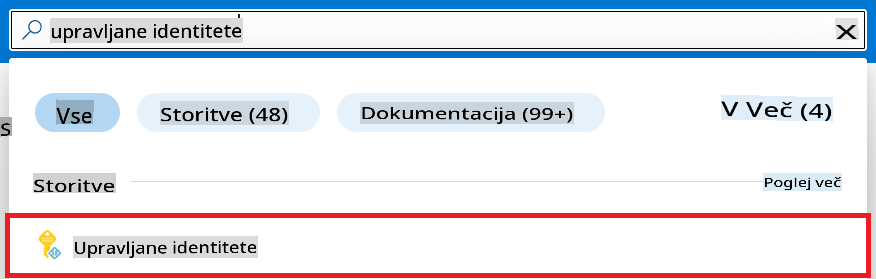

1. Izberite **+ Create**.

    

1. Izvedite naslednje naloge:

    - Izberite svojo Azure **Naročnino**.
    - Izberite **Skupino virov**, ki jo želite uporabiti (po potrebi ustvarite novo).
    - Izberite **Regijo**, ki jo želite uporabiti.
    - Vnesite **Ime**. To mora biti unikatno ime.

1. Izberite **Review + create**.

1. Izberite **+ Create**.

#### Dodajanje vloge "Contributor" upravljani identiteti

1. Pomaknite se do vira upravljane identitete, ki ste ga ustvarili.

1. Na levi strani izberite **Azure role assignments**.

1. Izberite **+Add role assignment** v navigacijskem meniju.

1. Na strani za dodajanje vloge izvedite naslednje naloge:
    - Izberite **Obseg** kot **Skupina virov**.
    - Izberite svojo Azure **Naročnino**.
    - Izberite **Skupino virov**, ki jo želite uporabiti.
    - Izberite **Vlogo** kot **Contributor**.

    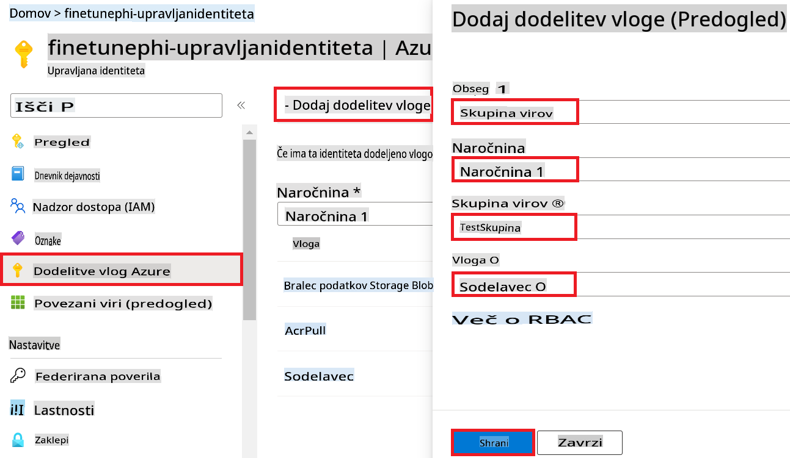

1. Izberite **Save**.

#### Dodajanje vloge "Storage Blob Data Reader" upravljani identiteti

1. V zgornji **iskalni vrstici** portala vnesite *storage accounts* in izberite **Storage accounts** med prikazanimi možnostmi.

    

1. Izberite shranjevalni račun, povezan z Azure Machine Learning delovnim prostorom, ki ste ga ustvarili. Na primer, *finetunephistorage*.

1. Izvedite naslednje naloge za navigacijo na stran za dodajanje vloge:

    - Pomaknite se do Azure Storage računa, ki ste ga ustvarili.
    - Na levi strani izberite **Access Control (IAM)**.
    - V navigacijskem meniju izberite **+ Add**.
    - Izberite **Add role assignment** v navigacijskem meniju.

    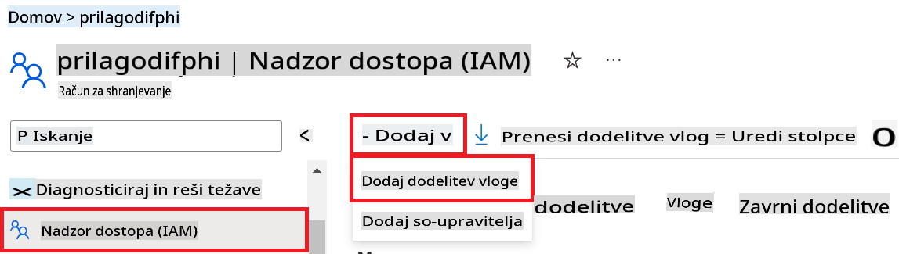

1. Na strani za dodajanje vloge izvedite naslednje naloge:

    - Na strani za vloge vnesite *Storage Blob Data Reader* v **iskalno vrstico** in izberite **Storage Blob Data Reader** med prikazanimi možnostmi.
    - Na strani za vloge izberite **Next**.
    - Na strani za člane izberite **Assign access to** kot **Managed identity**.
    - Na strani za člane izberite **+ Select members**.
    - Na strani za izbiro upravljanih identitet izberite svojo Azure **Naročnino**.
    - Na strani za izbiro upravljanih identitet izberite **Upravljano identiteto** kot **Manage Identity**.
    - Na strani za izbiro upravljanih identitet izberite upravljano identiteto, ki ste jo ustvarili. Na primer, *finetunephi-managedidentity*.
    - Na strani za izbiro upravljanih identitet izberite **Select**.

    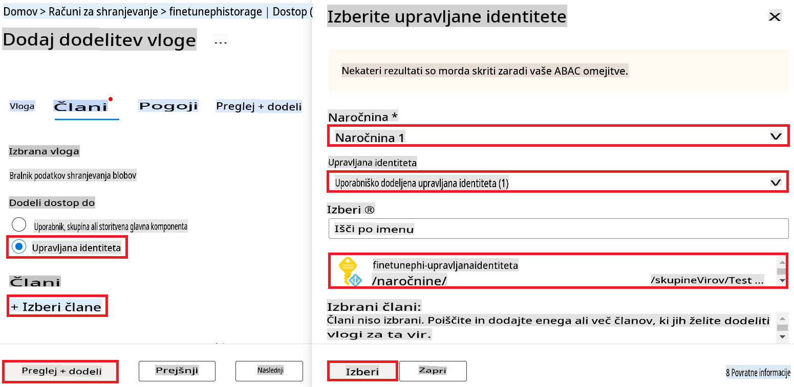

1. Izberite **Review + assign**.

#### Dodajanje vloge "AcrPull" upravljani identiteti

1. V zgornji **iskalni vrstici** portala vnesite *container registries* in izberite **Container registries** med prikazanimi možnostmi.

    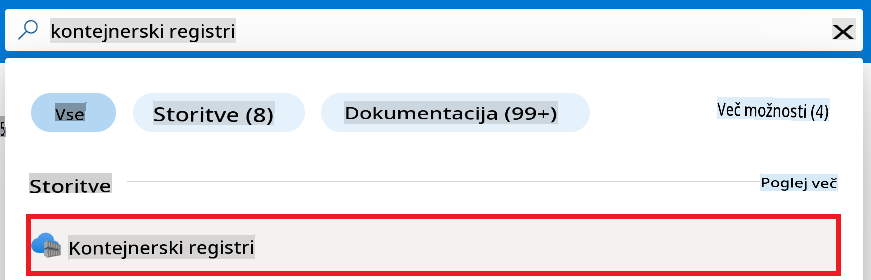

1. Izberite registracijo kontejnerjev, povezano z Azure Machine Learning delovnim prostorom. Na primer, *finetunephicontainerregistries*.

1. Izvedite naslednje naloge za navigacijo na stran za dodajanje vloge:

    - Na levi strani izberite **Access Control (IAM)**.
    - V navigacijskem meniju izberite **+ Add**.
    - Izberite **Add role assignment** v navigacijskem meniju.

1. Na strani za dodajanje vloge izvedite naslednje naloge:

    - Na strani za vloge vnesite *AcrPull* v **iskalno vrstico** in izberite **AcrPull** med prikazanimi možnostmi.
    - Na strani za vloge izberite **Next**.
    - Na strani za člane izberite **Assign access to** kot **Managed identity**.
    - Na strani za člane izberite **+ Select members**.
    - Na strani za izbiro upravljanih identitet izberite svojo Azure **Naročnino**.
    - Na strani za izbiro upravljanih identitet izberite **Upravljano identiteto** kot **Manage Identity**.
    - Na strani za izbiro upravljanih identitet izberite upravljano identiteto, ki ste jo ustvarili. Na primer, *finetunephi-managedidentity*.
    - Na strani za izbiro upravljanih identitet izberite **Select**.
    - Izberite **Review + assign**.

### Nastavitev projekta

Zdaj boste ustvarili mapo za delo in nastavili virtualno okolje za razvoj programa, ki bo komuniciral z uporabniki in uporabljal shranjeno zgodovino klepeta iz Azure Cosmos DB za izboljšanje svojih odgovorov.

#### Ustvarjanje mape za delo

1. Odprite terminal in vnesite naslednji ukaz za ustvarjanje mape z imenom *finetune-phi* v privzeti poti.

    ```console
    mkdir finetune-phi
    ```

1. V terminalu vnesite naslednji ukaz za navigacijo v ustvarjeno mapo *finetune-phi*.

    ```console
    cd finetune-phi
    ```

#### Ustvarjanje virtualnega okolja

1. V terminalu vnesite naslednji ukaz za ustvarjanje virtualnega okolja z imenom *.venv*.

    ```console
    python -m venv .venv
    ```

1. V terminalu vnesite naslednji ukaz za aktivacijo virtualnega okolja.

    ```console
    .venv\Scripts\activate.bat
    ```

> [!NOTE]
>
> Če je uspelo, bi morali videti *(.venv)* pred ukazno vrstico.

#### Namestitev potrebnih paketov

1. V terminalu vnesite naslednje ukaze za namestitev potrebnih paketov.

    ```console
    pip install datasets==2.19.1
    pip install transformers==4.41.1
    pip install azure-ai-ml==1.16.0
    pip install torch==2.3.1
    pip install trl==0.9.4
    pip install promptflow==1.12.0
    ```

#### Ustvarjanje projektnih datotek

V tej vaji boste ustvarili bistvene datoteke za projekt. Te datoteke vključujejo skripte za prenos podatkovnega nabora, nastavitev Azure Machine Learning okolja, prilagoditev modela Phi-3 in uvajanje prilagojenega modela. Prav tako boste ustvarili datoteko *conda.yml* za nastavitev okolja za prilagoditev.

V tej vaji boste:

- Ustvarili datoteko *download_dataset.py* za prenos podatkovnega nabora.
- Ustvarili datoteko *setup_ml.py* za nastavitev Azure Machine Learning okolja.
- Ustvarili datoteko *fine_tune.py* v mapi *finetuning_dir* za prilagoditev modela Phi-3 z uporabo podatkovnega nabora.
- Ustvarili datoteko *conda.yml* za nastavitev okolja za prilagoditev.
- Ustvarili datoteko *deploy_model.py* za uvajanje prilagojenega modela.
- Ustvarili datoteko *integrate_with_promptflow.py* za integracijo prilagojenega modela in njegovo izvajanje z uporabo Prompt flow.
- Ustvarili datoteko *flow.dag.yml* za nastavitev strukture poteka dela za Prompt flow.
- Ustvarili datoteko *config.py* za vnos Azure informacij.

> [!NOTE]
>
> Popolna struktura mape:
>
> ```text
> └── YourUserName
> .    └── finetune-phi
> .        ├── finetuning_dir
> .        │      └── fine_tune.py
> .        ├── conda.yml
> .        ├── config.py
> .        ├── deploy_model.py
> .        ├── download_dataset.py
> .        ├── flow.dag.yml
> .        ├── integrate_with_promptflow.py
> .        └── setup_ml.py
> ```

1. Odprite **Visual Studio Code**.

1. V menijski vrstici izberite **File**.

1. Izberite **Open Folder**.

1. Izberite mapo *finetune-phi*, ki ste jo ustvarili, in se nahaja na poti *C:\Users\yourUserName\finetune-phi*.

    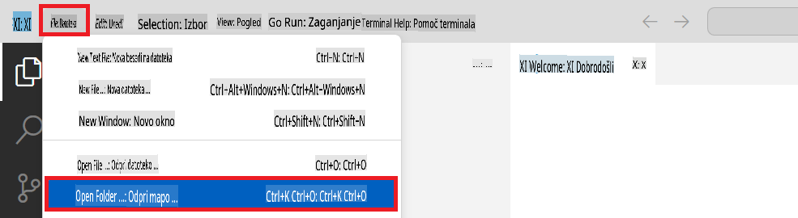

1. V levem podoknu Visual Studio Code z desnim klikom izberite **New File** za ustvarjanje nove datoteke z imenom *download_dataset.py*.

1. V levem podoknu Visual Studio Code z desnim klikom izberite **New File** za ustvarjanje nove datoteke z imenom *setup_ml.py*.

1. V levem podoknu Visual Studio Code z desnim klikom izberite **New File** za ustvarjanje nove datoteke z imenom *deploy_model.py*.

    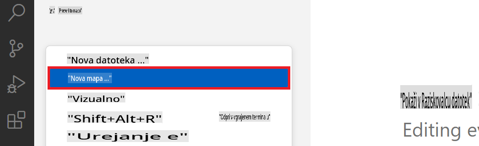

1. V levem podoknu Visual Studio Code z desnim klikom izberite **New Folder** za ustvarjanje nove mape z imenom *finetuning_dir*.

1. V mapi *finetuning_dir* ustvarite novo datoteko z imenom *fine_tune.py*.

#### Ustvarjanje in konfiguracija datoteke *conda.yml*

1. V levem podoknu Visual Studio Code z desnim klikom izberite **New File** za ustvarjanje nove datoteke z imenom *conda.yml*.

1. V datoteko *conda
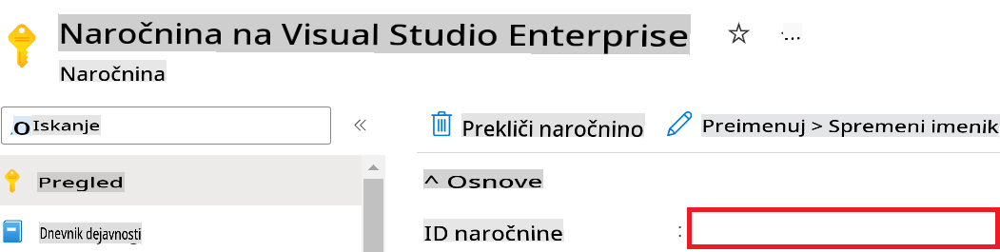

1. Izvedite naslednje korake za dodajanje imena Azure Workspace:

    - Pojdite na vir Azure Machine Learning, ki ste ga ustvarili.
    - Kopirajte in prilepite ime svojega računa v datoteko *config.py*.

    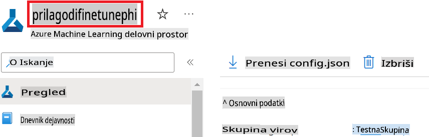

1. Izvedite naslednje korake za dodajanje imena Azure Resource Group:

    - Pojdite na vir Azure Machine Learning, ki ste ga ustvarili.
    - Kopirajte in prilepite ime svoje Azure Resource Group v datoteko *config.py*.

    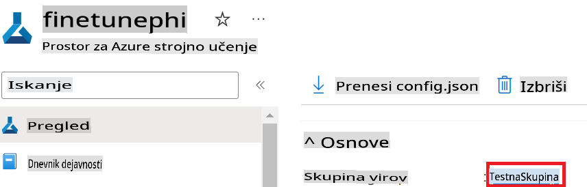

2. Izvedite naslednje korake za dodajanje imena Azure Managed Identity:

    - Pojdite na vir Managed Identities, ki ste ga ustvarili.
    - Kopirajte in prilepite ime svoje Azure Managed Identity v datoteko *config.py*.

    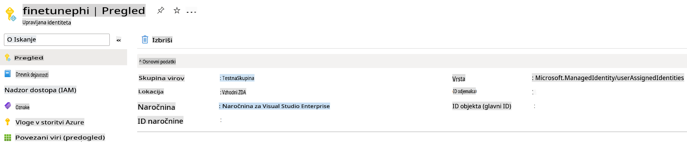

### Priprava podatkovnega nabora za prilagoditev

V tej vaji boste zagnali datoteko *download_dataset.py* za prenos podatkovnih nizov *ULTRACHAT_200k* v svoje lokalno okolje. Nato boste uporabili te podatkovne nize za prilagoditev modela Phi-3 v Azure Machine Learning.

#### Prenesite svoj podatkovni niz z uporabo *download_dataset.py*

1. Odprite datoteko *download_dataset.py* v Visual Studio Code.

1. Dodajte naslednjo kodo v datoteko *download_dataset.py*.

    ```python
    import json
    import os
    from datasets import load_dataset
    from config import (
        TRAIN_DATA_PATH,
        TEST_DATA_PATH)

    def load_and_split_dataset(dataset_name, config_name, split_ratio):
        """
        Load and split a dataset.
        """
        # Load the dataset with the specified name, configuration, and split ratio
        dataset = load_dataset(dataset_name, config_name, split=split_ratio)
        print(f"Original dataset size: {len(dataset)}")
        
        # Split the dataset into train and test sets (80% train, 20% test)
        split_dataset = dataset.train_test_split(test_size=0.2)
        print(f"Train dataset size: {len(split_dataset['train'])}")
        print(f"Test dataset size: {len(split_dataset['test'])}")
        
        return split_dataset

    def save_dataset_to_jsonl(dataset, filepath):
        """
        Save a dataset to a JSONL file.
        """
        # Create the directory if it does not exist
        os.makedirs(os.path.dirname(filepath), exist_ok=True)
        
        # Open the file in write mode
        with open(filepath, 'w', encoding='utf-8') as f:
            # Iterate over each record in the dataset
            for record in dataset:
                # Dump the record as a JSON object and write it to the file
                json.dump(record, f)
                # Write a newline character to separate records
                f.write('\n')
        
        print(f"Dataset saved to {filepath}")

    def main():
        """
        Main function to load, split, and save the dataset.
        """
        # Load and split the ULTRACHAT_200k dataset with a specific configuration and split ratio
        dataset = load_and_split_dataset("HuggingFaceH4/ultrachat_200k", 'default', 'train_sft[:1%]')
        
        # Extract the train and test datasets from the split
        train_dataset = dataset['train']
        test_dataset = dataset['test']

        # Save the train dataset to a JSONL file
        save_dataset_to_jsonl(train_dataset, TRAIN_DATA_PATH)
        
        # Save the test dataset to a separate JSONL file
        save_dataset_to_jsonl(test_dataset, TEST_DATA_PATH)

    if __name__ == "__main__":
        main()

    ```

> [!TIP]
>
> **Navodila za prilagoditev z minimalnim podatkovnim nizom z uporabo CPU**
>
> Če želite uporabiti CPU za prilagoditev, je ta pristop idealen za tiste z ugodnostnimi naročninami (npr. Visual Studio Enterprise Subscription) ali za hitro testiranje postopka prilagoditve in uvajanja.
>
> Zamenjajte `dataset = load_and_split_dataset("HuggingFaceH4/ultrachat_200k", 'default', 'train_sft[:1%]')` with `dataset = load_and_split_dataset("HuggingFaceH4/ultrachat_200k", 'default', 'train_sft[:10]')`
>

1. Vnesite naslednji ukaz v terminal, da zaženete skripto in prenesete podatkovni niz v svoje lokalno okolje.

    ```console
    python download_data.py
    ```

1. Preverite, ali so bili podatkovni nizi uspešno shranjeni v lokalni imenik *finetune-phi/data*.

> [!NOTE]
>
> **Velikost podatkovnega nabora in čas prilagoditve**
>
> V tem vzorcu E2E uporabljate le 1 % podatkovnega nabora (`train_sft[:1%]`). To znatno zmanjša količino podatkov, kar pospeši tako nalaganje kot tudi postopek prilagoditve. Lahko prilagodite odstotek, da najdete pravo ravnovesje med časom usposabljanja in zmogljivostjo modela. Uporaba manjšega dela podatkovnega nabora skrajša čas, potreben za prilagoditev, in omogoča obvladljivejši postopek za vzorec E2E.

## Scenarij 2: Prilagoditev modela Phi-3 in uvajanje v Azure Machine Learning Studio

### Nastavitev Azure CLI

Za avtentikacijo svojega okolja morate nastaviti Azure CLI. Azure CLI vam omogoča upravljanje virov Azure neposredno iz ukazne vrstice in zagotavlja poverilnice, potrebne za dostop do teh virov v Azure Machine Learning. Za začetek namestite [Azure CLI](https://learn.microsoft.com/cli/azure/install-azure-cli).

1. Odprite terminal in vnesite naslednji ukaz za prijavo v svoj Azure račun.

    ```console
    az login
    ```

1. Izberite svoj Azure račun za uporabo.

1. Izberite svojo Azure naročnino za uporabo.

    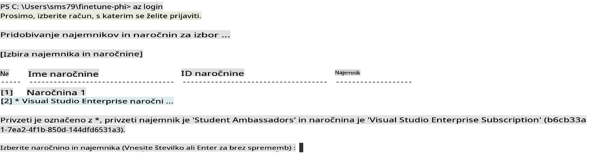

> [!TIP]
>
> Če imate težave s prijavo v Azure, poskusite uporabiti kodo naprave. Odprite terminal in vnesite naslednji ukaz za prijavo v svoj Azure račun:
>
> ```console
> az login --use-device-code
> ```
>

### Prilagoditev modela Phi-3

V tej vaji boste prilagodili model Phi-3 z uporabo priloženega podatkovnega nabora. Najprej boste definirali postopek prilagoditve v datoteki *fine_tune.py*. Nato boste konfigurirali okolje Azure Machine Learning in začeli postopek prilagoditve z zagonom datoteke *setup_ml.py*. Ta skripta zagotavlja, da prilagoditev poteka v okolju Azure Machine Learning.

Z zagonom *setup_ml.py* boste zagnali postopek prilagoditve v okolju Azure Machine Learning.

#### Dodajte kodo v datoteko *fine_tune.py*

1. Pojdite v mapo *finetuning_dir* in odprite datoteko *fine_tune.py* v Visual Studio Code.

1. Dodajte naslednjo kodo v datoteko *fine_tune.py*.

    ```python
    import argparse
    import sys
    import logging
    import os
    from datasets import load_dataset
    import torch
    import mlflow
    from transformers import AutoModelForCausalLM, AutoTokenizer, TrainingArguments
    from trl import SFTTrainer

    # To avoid the INVALID_PARAMETER_VALUE error in MLflow, disable MLflow integration
    os.environ["DISABLE_MLFLOW_INTEGRATION"] = "True"

    # Logging setup
    logging.basicConfig(
        format="%(asctime)s - %(levelname)s - %(name)s - %(message)s",
        datefmt="%Y-%m-%d %H:%M:%S",
        handlers=[logging.StreamHandler(sys.stdout)],
        level=logging.WARNING
    )
    logger = logging.getLogger(__name__)

    def initialize_model_and_tokenizer(model_name, model_kwargs):
        """
        Initialize the model and tokenizer with the given pretrained model name and arguments.
        """
        model = AutoModelForCausalLM.from_pretrained(model_name, **model_kwargs)
        tokenizer = AutoTokenizer.from_pretrained(model_name)
        tokenizer.model_max_length = 2048
        tokenizer.pad_token = tokenizer.unk_token
        tokenizer.pad_token_id = tokenizer.convert_tokens_to_ids(tokenizer.pad_token)
        tokenizer.padding_side = 'right'
        return model, tokenizer

    def apply_chat_template(example, tokenizer):
        """
        Apply a chat template to tokenize messages in the example.
        """
        messages = example["messages"]
        if messages[0]["role"] != "system":
            messages.insert(0, {"role": "system", "content": ""})
        example["text"] = tokenizer.apply_chat_template(
            messages, tokenize=False, add_generation_prompt=False
        )
        return example

    def load_and_preprocess_data(train_filepath, test_filepath, tokenizer):
        """
        Load and preprocess the dataset.
        """
        train_dataset = load_dataset('json', data_files=train_filepath, split='train')
        test_dataset = load_dataset('json', data_files=test_filepath, split='train')
        column_names = list(train_dataset.features)

        train_dataset = train_dataset.map(
            apply_chat_template,
            fn_kwargs={"tokenizer": tokenizer},
            num_proc=10,
            remove_columns=column_names,
            desc="Applying chat template to train dataset",
        )

        test_dataset = test_dataset.map(
            apply_chat_template,
            fn_kwargs={"tokenizer": tokenizer},
            num_proc=10,
            remove_columns=column_names,
            desc="Applying chat template to test dataset",
        )

        return train_dataset, test_dataset

    def train_and_evaluate_model(train_dataset, test_dataset, model, tokenizer, output_dir):
        """
        Train and evaluate the model.
        """
        training_args = TrainingArguments(
            bf16=True,
            do_eval=True,
            output_dir=output_dir,
            eval_strategy="epoch",
            learning_rate=5.0e-06,
            logging_steps=20,
            lr_scheduler_type="cosine",
            num_train_epochs=3,
            overwrite_output_dir=True,
            per_device_eval_batch_size=4,
            per_device_train_batch_size=4,
            remove_unused_columns=True,
            save_steps=500,
            seed=0,
            gradient_checkpointing=True,
            gradient_accumulation_steps=1,
            warmup_ratio=0.2,
        )

        trainer = SFTTrainer(
            model=model,
            args=training_args,
            train_dataset=train_dataset,
            eval_dataset=test_dataset,
            max_seq_length=2048,
            dataset_text_field="text",
            tokenizer=tokenizer,
            packing=True
        )

        train_result = trainer.train()
        trainer.log_metrics("train", train_result.metrics)

        mlflow.transformers.log_model(
            transformers_model={"model": trainer.model, "tokenizer": tokenizer},
            artifact_path=output_dir,
        )

        tokenizer.padding_side = 'left'
        eval_metrics = trainer.evaluate()
        eval_metrics["eval_samples"] = len(test_dataset)
        trainer.log_metrics("eval", eval_metrics)

    def main(train_file, eval_file, model_output_dir):
        """
        Main function to fine-tune the model.
        """
        model_kwargs = {
            "use_cache": False,
            "trust_remote_code": True,
            "torch_dtype": torch.bfloat16,
            "device_map": None,
            "attn_implementation": "eager"
        }

        # pretrained_model_name = "microsoft/Phi-3-mini-4k-instruct"
        pretrained_model_name = "microsoft/Phi-3.5-mini-instruct"

        with mlflow.start_run():
            model, tokenizer = initialize_model_and_tokenizer(pretrained_model_name, model_kwargs)
            train_dataset, test_dataset = load_and_preprocess_data(train_file, eval_file, tokenizer)
            train_and_evaluate_model(train_dataset, test_dataset, model, tokenizer, model_output_dir)

    if __name__ == "__main__":
        parser = argparse.ArgumentParser()
        parser.add_argument("--train-file", type=str, required=True, help="Path to the training data")
        parser.add_argument("--eval-file", type=str, required=True, help="Path to the evaluation data")
        parser.add_argument("--model_output_dir", type=str, required=True, help="Directory to save the fine-tuned model")
        args = parser.parse_args()
        main(args.train_file, args.eval_file, args.model_output_dir)

    ```

1. Shranite in zaprite datoteko *fine_tune.py*.

> [!TIP]
> **Lahko prilagodite model Phi-3.5**
>
> V datoteki *fine_tune.py* lahko spremenite polje `pretrained_model_name` from `"microsoft/Phi-3-mini-4k-instruct"` to any model you want to fine-tune. For example, if you change it to `"microsoft/Phi-3.5-mini-instruct"`, you'll be using the Phi-3.5-mini-instruct model for fine-tuning. To find and use the model name you prefer, visit [Hugging Face](https://huggingface.co/), search for the model you're interested in, and then copy and paste its name into the `pretrained_model_name` v svoji skripti.
>
> :::image type="content" source="../../imgs/03/FineTuning-PromptFlow/finetunephi3.5.png" alt-text="Prilagodi Phi-3.5.":::
>

#### Dodajte kodo v datoteko *setup_ml.py*

1. Odprite datoteko *setup_ml.py* v Visual Studio Code.

1. Dodajte naslednjo kodo v datoteko *setup_ml.py*.

    ```python
    import logging
    from azure.ai.ml import MLClient, command, Input
    from azure.ai.ml.entities import Environment, AmlCompute
    from azure.identity import AzureCliCredential
    from config import (
        AZURE_SUBSCRIPTION_ID,
        AZURE_RESOURCE_GROUP_NAME,
        AZURE_ML_WORKSPACE_NAME,
        TRAIN_DATA_PATH,
        TEST_DATA_PATH
    )

    # Constants

    # Uncomment the following lines to use a CPU instance for training
    # COMPUTE_INSTANCE_TYPE = "Standard_E16s_v3" # cpu
    # COMPUTE_NAME = "cpu-e16s-v3"
    # DOCKER_IMAGE_NAME = "mcr.microsoft.com/azureml/openmpi4.1.0-ubuntu20.04:latest"

    # Uncomment the following lines to use a GPU instance for training
    COMPUTE_INSTANCE_TYPE = "Standard_NC24ads_A100_v4"
    COMPUTE_NAME = "gpu-nc24s-a100-v4"
    DOCKER_IMAGE_NAME = "mcr.microsoft.com/azureml/curated/acft-hf-nlp-gpu:59"

    CONDA_FILE = "conda.yml"
    LOCATION = "eastus2" # Replace with the location of your compute cluster
    FINETUNING_DIR = "./finetuning_dir" # Path to the fine-tuning script
    TRAINING_ENV_NAME = "phi-3-training-environment" # Name of the training environment
    MODEL_OUTPUT_DIR = "./model_output" # Path to the model output directory in azure ml

    # Logging setup to track the process
    logger = logging.getLogger(__name__)
    logging.basicConfig(
        format="%(asctime)s - %(levelname)s - %(name)s - %(message)s",
        datefmt="%Y-%m-%d %H:%M:%S",
        level=logging.WARNING
    )

    def get_ml_client():
        """
        Initialize the ML Client using Azure CLI credentials.
        """
        credential = AzureCliCredential()
        return MLClient(credential, AZURE_SUBSCRIPTION_ID, AZURE_RESOURCE_GROUP_NAME, AZURE_ML_WORKSPACE_NAME)

    def create_or_get_environment(ml_client):
        """
        Create or update the training environment in Azure ML.
        """
        env = Environment(
            image=DOCKER_IMAGE_NAME,  # Docker image for the environment
            conda_file=CONDA_FILE,  # Conda environment file
            name=TRAINING_ENV_NAME,  # Name of the environment
        )
        return ml_client.environments.create_or_update(env)

    def create_or_get_compute_cluster(ml_client, compute_name, COMPUTE_INSTANCE_TYPE, location):
        """
        Create or update the compute cluster in Azure ML.
        """
        try:
            compute_cluster = ml_client.compute.get(compute_name)
            logger.info(f"Compute cluster '{compute_name}' already exists. Reusing it for the current run.")
        except Exception:
            logger.info(f"Compute cluster '{compute_name}' does not exist. Creating a new one with size {COMPUTE_INSTANCE_TYPE}.")
            compute_cluster = AmlCompute(
                name=compute_name,
                size=COMPUTE_INSTANCE_TYPE,
                location=location,
                tier="Dedicated",  # Tier of the compute cluster
                min_instances=0,  # Minimum number of instances
                max_instances=1  # Maximum number of instances
            )
            ml_client.compute.begin_create_or_update(compute_cluster).wait()  # Wait for the cluster to be created
        return compute_cluster

    def create_fine_tuning_job(env, compute_name):
        """
        Set up the fine-tuning job in Azure ML.
        """
        return command(
            code=FINETUNING_DIR,  # Path to fine_tune.py
            command=(
                "python fine_tune.py "
                "--train-file ${{inputs.train_file}} "
                "--eval-file ${{inputs.eval_file}} "
                "--model_output_dir ${{inputs.model_output}}"
            ),
            environment=env,  # Training environment
            compute=compute_name,  # Compute cluster to use
            inputs={
                "train_file": Input(type="uri_file", path=TRAIN_DATA_PATH),  # Path to the training data file
                "eval_file": Input(type="uri_file", path=TEST_DATA_PATH),  # Path to the evaluation data file
                "model_output": MODEL_OUTPUT_DIR
            }
        )

    def main():
        """
        Main function to set up and run the fine-tuning job in Azure ML.
        """
        # Initialize ML Client
        ml_client = get_ml_client()

        # Create Environment
        env = create_or_get_environment(ml_client)
        
        # Create or get existing compute cluster
        create_or_get_compute_cluster(ml_client, COMPUTE_NAME, COMPUTE_INSTANCE_TYPE, LOCATION)

        # Create and Submit Fine-Tuning Job
        job = create_fine_tuning_job(env, COMPUTE_NAME)
        returned_job = ml_client.jobs.create_or_update(job)  # Submit the job
        ml_client.jobs.stream(returned_job.name)  # Stream the job logs
        
        # Capture the job name
        job_name = returned_job.name
        print(f"Job name: {job_name}")

    if __name__ == "__main__":
        main()

    ```

1. Zamenjajte `COMPUTE_INSTANCE_TYPE`, `COMPUTE_NAME`, and `LOCATION` s svojimi specifičnimi podrobnostmi.

    ```python
   # Uncomment the following lines to use a GPU instance for training
    COMPUTE_INSTANCE_TYPE = "Standard_NC24ads_A100_v4"
    COMPUTE_NAME = "gpu-nc24s-a100-v4"
    ...
    LOCATION = "eastus2" # Replace with the location of your compute cluster
    ```

> [!TIP]
>
> **Navodila za prilagoditev z minimalnim podatkovnim nizom z uporabo CPU**
>
> Če želite uporabiti CPU za prilagoditev, je ta pristop idealen za tiste z ugodnostnimi naročninami (npr. Visual Studio Enterprise Subscription) ali za hitro testiranje postopka prilagoditve in uvajanja.
>
> 1. Odprite datoteko *setup_ml*.
> 1. Zamenjajte `COMPUTE_INSTANCE_TYPE`, `COMPUTE_NAME`, and `DOCKER_IMAGE_NAME` with the following. If you do not have access to *Standard_E16s_v3*, you can use an equivalent CPU instance or request a new quota.
> 1. Replace `LOCATION` s svojimi specifičnimi podrobnostmi.
>
>    ```python
>    # Uncomment the following lines to use a CPU instance for training
>    COMPUTE_INSTANCE_TYPE = "Standard_E16s_v3" # cpu
>    COMPUTE_NAME = "cpu-e16s-v3"
>    DOCKER_IMAGE_NAME = "mcr.microsoft.com/azureml/openmpi4.1.0-ubuntu20.04:latest"
>    LOCATION = "eastus2" # Replace with the location of your compute cluster
>    ```
>

1. Vnesite naslednji ukaz za zagon skripte *setup_ml.py* in začetek postopka prilagoditve v Azure Machine Learning.

    ```python
    python setup_ml.py
    ```

1. V tej vaji ste uspešno prilagodili model Phi-3 z uporabo Azure Machine Learning. Z zagonom skripte *setup_ml.py* ste nastavili okolje Azure Machine Learning in začeli postopek prilagoditve, definiran v datoteki *fine_tune.py*. Upoštevajte, da lahko postopek prilagoditve traja precej časa. Po zagonu `python setup_ml.py` command, you need to wait for the process to complete. You can monitor the status of the fine-tuning job by following the link provided in the terminal to the Azure Machine Learning portal.

    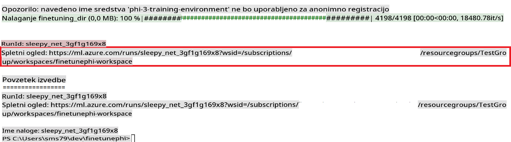

### Deploy the fine-tuned model

To integrate the fine-tuned Phi-3 model with Prompt Flow, you need to deploy the model to make it accessible for real-time inference. This process involves registering the model, creating an online endpoint, and deploying the model.

#### Set the model name, endpoint name, and deployment name for deployment

1. Open *config.py* file.

1. Replace `AZURE_MODEL_NAME = "your_fine_tuned_model_name"` with the desired name for your model.

1. Replace `AZURE_ENDPOINT_NAME = "your_fine_tuned_model_endpoint_name"` with the desired name for your endpoint.

1. Replace `AZURE_DEPLOYMENT_NAME = "your_fine_tuned_model_deployment_name"` uporabite želeno ime za svojo uvedbo.

#### Dodajte kodo v datoteko *deploy_model.py*

Zagon datoteke *deploy_model.py* avtomatizira celoten postopek uvajanja. Registrira model, ustvari končno točko in izvede uvajanje na podlagi nastavitev, določenih v datoteki config.py, ki vključuje ime modela, ime končne točke in ime uvajanja.

1. Odprite datoteko *deploy_model.py* v Visual Studio Code.

1. Dodajte naslednjo kodo v datoteko *deploy_model.py*.

    ```python
    import logging
    from azure.identity import AzureCliCredential
    from azure.ai.ml import MLClient
    from azure.ai.ml.entities import Model, ProbeSettings, ManagedOnlineEndpoint, ManagedOnlineDeployment, IdentityConfiguration, ManagedIdentityConfiguration, OnlineRequestSettings
    from azure.ai.ml.constants import AssetTypes

    # Configuration imports
    from config import (
        AZURE_SUBSCRIPTION_ID,
        AZURE_RESOURCE_GROUP_NAME,
        AZURE_ML_WORKSPACE_NAME,
        AZURE_MANAGED_IDENTITY_RESOURCE_ID,
        AZURE_MANAGED_IDENTITY_CLIENT_ID,
        AZURE_MODEL_NAME,
        AZURE_ENDPOINT_NAME,
        AZURE_DEPLOYMENT_NAME
    )

    # Constants
    JOB_NAME = "your-job-name"
    COMPUTE_INSTANCE_TYPE = "Standard_E4s_v3"

    deployment_env_vars = {
        "SUBSCRIPTION_ID": AZURE_SUBSCRIPTION_ID,
        "RESOURCE_GROUP_NAME": AZURE_RESOURCE_GROUP_NAME,
        "UAI_CLIENT_ID": AZURE_MANAGED_IDENTITY_CLIENT_ID,
    }

    # Logging setup
    logging.basicConfig(
        format="%(asctime)s - %(levelname)s - %(name)s - %(message)s",
        datefmt="%Y-%m-%d %H:%M:%S",
        level=logging.DEBUG
    )
    logger = logging.getLogger(__name__)

    def get_ml_client():
        """Initialize and return the ML Client."""
        credential = AzureCliCredential()
        return MLClient(credential, AZURE_SUBSCRIPTION_ID, AZURE_RESOURCE_GROUP_NAME, AZURE_ML_WORKSPACE_NAME)

    def register_model(ml_client, model_name, job_name):
        """Register a new model."""
        model_path = f"azureml://jobs/{job_name}/outputs/artifacts/paths/model_output"
        logger.info(f"Registering model {model_name} from job {job_name} at path {model_path}.")
        run_model = Model(
            path=model_path,
            name=model_name,
            description="Model created from run.",
            type=AssetTypes.MLFLOW_MODEL,
        )
        model = ml_client.models.create_or_update(run_model)
        logger.info(f"Registered model ID: {model.id}")
        return model

    def delete_existing_endpoint(ml_client, endpoint_name):
        """Delete existing endpoint if it exists."""
        try:
            endpoint_result = ml_client.online_endpoints.get(name=endpoint_name)
            logger.info(f"Deleting existing endpoint {endpoint_name}.")
            ml_client.online_endpoints.begin_delete(name=endpoint_name).result()
            logger.info(f"Deleted existing endpoint {endpoint_name}.")
        except Exception as e:
            logger.info(f"No existing endpoint {endpoint_name} found to delete: {e}")

    def create_or_update_endpoint(ml_client, endpoint_name, description=""):
        """Create or update an endpoint."""
        delete_existing_endpoint(ml_client, endpoint_name)
        logger.info(f"Creating new endpoint {endpoint_name}.")
        endpoint = ManagedOnlineEndpoint(
            name=endpoint_name,
            description=description,
            identity=IdentityConfiguration(
                type="user_assigned",
                user_assigned_identities=[ManagedIdentityConfiguration(resource_id=AZURE_MANAGED_IDENTITY_RESOURCE_ID)]
            )
        )
        endpoint_result = ml_client.online_endpoints.begin_create_or_update(endpoint).result()
        logger.info(f"Created new endpoint {endpoint_name}.")
        return endpoint_result

    def create_or_update_deployment(ml_client, endpoint_name, deployment_name, model):
        """Create or update a deployment."""

        logger.info(f"Creating deployment {deployment_name} for endpoint {endpoint_name}.")
        deployment = ManagedOnlineDeployment(
            name=deployment_name,
            endpoint_name=endpoint_name,
            model=model.id,
            instance_type=COMPUTE_INSTANCE_TYPE,
            instance_count=1,
            environment_variables=deployment_env_vars,
            request_settings=OnlineRequestSettings(
                max_concurrent_requests_per_instance=3,
                request_timeout_ms=180000,
                max_queue_wait_ms=120000
            ),
            liveness_probe=ProbeSettings(
                failure_threshold=30,
                success_threshold=1,
                period=100,
                initial_delay=500,
            ),
            readiness_probe=ProbeSettings(
                failure_threshold=30,
                success_threshold=1,
                period=100,
                initial_delay=500,
            ),
        )
        deployment_result = ml_client.online_deployments.begin_create_or_update(deployment).result()
        logger.info(f"Created deployment {deployment.name} for endpoint {endpoint_name}.")
        return deployment_result

    def set_traffic_to_deployment(ml_client, endpoint_name, deployment_name):
        """Set traffic to the specified deployment."""
        try:
            # Fetch the current endpoint details
            endpoint = ml_client.online_endpoints.get(name=endpoint_name)
            
            # Log the current traffic allocation for debugging
            logger.info(f"Current traffic allocation: {endpoint.traffic}")
            
            # Set the traffic allocation for the deployment
            endpoint.traffic = {deployment_name: 100}
            
            # Update the endpoint with the new traffic allocation
            endpoint_poller = ml_client.online_endpoints.begin_create_or_update(endpoint)
            updated_endpoint = endpoint_poller.result()
            
            # Log the updated traffic allocation for debugging
            logger.info(f"Updated traffic allocation: {updated_endpoint.traffic}")
            logger.info(f"Set traffic to deployment {deployment_name} at endpoint {endpoint_name}.")
            return updated_endpoint
        except Exception as e:
            # Log any errors that occur during the process
            logger.error(f"Failed to set traffic to deployment: {e}")
            raise


    def main():
        ml_client = get_ml_client()

        registered_model = register_model(ml_client, AZURE_MODEL_NAME, JOB_NAME)
        logger.info(f"Registered model ID: {registered_model.id}")

        endpoint = create_or_update_endpoint(ml_client, AZURE_ENDPOINT_NAME, "Endpoint for finetuned Phi-3 model")
        logger.info(f"Endpoint {AZURE_ENDPOINT_NAME} is ready.")

        try:
            deployment = create_or_update_deployment(ml_client, AZURE_ENDPOINT_NAME, AZURE_DEPLOYMENT_NAME, registered_model)
            logger.info(f"Deployment {AZURE_DEPLOYMENT_NAME} is created for endpoint {AZURE_ENDPOINT_NAME}.")

            set_traffic_to_deployment(ml_client, AZURE_ENDPOINT_NAME, AZURE_DEPLOYMENT_NAME)
            logger.info(f"Traffic is set to deployment {AZURE_DEPLOYMENT_NAME} at endpoint {AZURE_ENDPOINT_NAME}.")
        except Exception as e:
            logger.error(f"Failed to create or update deployment: {e}")

    if __name__ == "__main__":
        main()

    ```

1. Izvedite naslednje korake za pridobitev `JOB_NAME`:

    - Navigate to Azure Machine Learning resource that you created.
    - Select **Studio web URL** to open the Azure Machine Learning workspace.
    - Select **Jobs** from the left side tab.
    - Select the experiment for fine-tuning. For example, *finetunephi*.
    - Select the job that you created.
    - Copy and paste your job Name into the `JOB_NAME = "your-job-name"` in *deploy_model.py* file.

1. Replace `COMPUTE_INSTANCE_TYPE` s svojimi specifičnimi podrobnostmi.

1. Vnesite naslednji ukaz za zagon skripte *deploy_model.py* in začetek postopka uvajanja v Azure Machine Learning.

    ```python
    python deploy_model.py
    ```

> [!WARNING]
> Da bi se izognili dodatnim stroškom na svojem računu, se prepričajte, da izbrišete ustvarjeno končno točko v delovnem prostoru Azure Machine Learning.
>

#### Preverite stanje uvajanja v delovnem prostoru Azure Machine Learning

1. Obiščite [Azure ML Studio](https://ml.azure.com/home?wt.mc_id=studentamb_279723).

1. Pojdite v delovni prostor Azure Machine Learning, ki ste ga ustvarili.

1. Izberite **Studio web URL**, da odprete delovni prostor Azure Machine Learning.

1. Izberite **Endpoints** v levem meniju.

    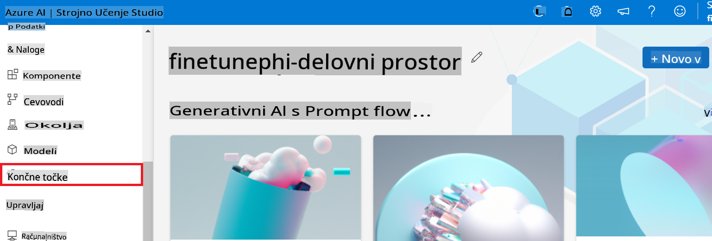

2. Izberite končno točko, ki ste jo ustvarili.

    

3. Na tej strani lahko upravljate končne točke, ustvarjene med postopkom uvajanja.

## Scenarij 3: Integracija s Prompt flow in pogovor z vašim prilagojenim modelom

### Integracija prilagojenega modela Phi-3 s Prompt flow

Po uspešnem uvajanju prilagojenega modela ga lahko zdaj integrirate s Prompt flow, da ga uporabite v realnočasovnih aplikacijah, kar omogoča različne interaktivne naloge z vašim prilagojenim modelom Phi-3.

#### Nastavite api ključ in uri končne točke prilagojenega modela Phi-3

1. Pojdite v delovni prostor Azure Machine Learning, ki ste ga ustvarili.
1. Izberite **Endpoints** v levem meniju.
1. Izberite končno točko, ki ste jo ustvarili.
1. Izberite **Consume** v navigacijskem meniju.
1. Kopirajte in prilepite svoj **REST endpoint** v datoteko *config.py*, tako da zamenjate `AZURE_ML_ENDPOINT = "your_fine_tuned_model_endpoint_uri"` with your **REST endpoint**.
1. Copy and paste your **Primary key** into the *config.py* file, replacing `AZURE_ML_API_KEY = "your_fine_tuned_model_api_key"` s svojim **Primary key**.

    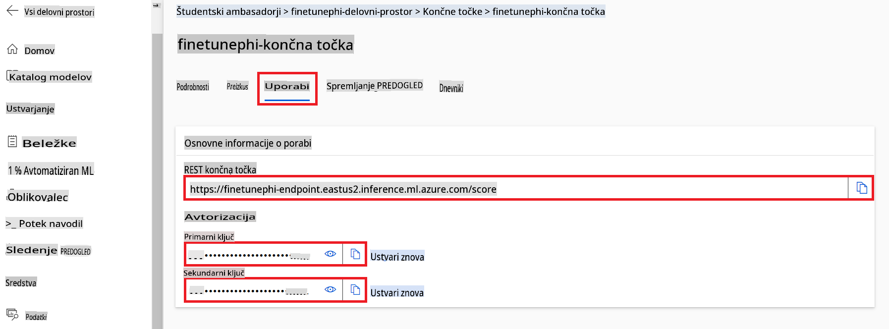

#### Dodajte kodo v datoteko *flow.dag.yml*

1. Odprite datoteko *flow.dag.yml* v Visual Studio Code.

1. Dodajte naslednjo kodo v datoteko *flow.dag.yml*.

    ```yml
    inputs:
      input_data:
        type: string
        default: "Who founded Microsoft?"

    outputs:
      answer:
        type: string
        reference: ${integrate_with_promptflow.output}

    nodes:
    - name: integrate_with_promptflow
      type: python
      source:
        type: code
        path: integrate_with_promptflow.py
      inputs:
        input_data: ${inputs.input_data}
    ```

#### Dodajte kodo v datoteko *integrate_with_promptflow.py*

1. Odprite datoteko *integrate_with_promptflow.py* v Visual Studio Code.

1. Dodajte naslednjo kodo v datoteko *integrate_with_promptflow.py*.

    ```python
    import logging
    import requests
    from promptflow.core import tool
    import asyncio
    import platform
    from config import (
        AZURE_ML_ENDPOINT,
        AZURE_ML_API_KEY
    )

    # Logging setup
    logging.basicConfig(
        format="%(asctime)s - %(levelname)s - %(name)s - %(message)s",
        datefmt="%Y-%m-%d %H:%M:%S",
        level=logging.DEBUG
    )
    logger = logging.getLogger(__name__)

    def query_azml_endpoint(input_data: list, endpoint_url: str, api_key: str) -> str:
        """
        Send a request to the Azure ML endpoint with the given input data.
        """
        headers = {
            "Content-Type": "application/json",
            "Authorization": f"Bearer {api_key}"
        }
        data = {
            "input_data": [input_data],
            "params": {
                "temperature": 0.7,
                "max_new_tokens": 128,
                "do_sample": True,
                "return_full_text": True
            }
        }
        try:
            response = requests.post(endpoint_url, json=data, headers=headers)
            response.raise_for_status()
            result = response.json()[0]
            logger.info("Successfully received response from Azure ML Endpoint.")
            return result
        except requests.exceptions.RequestException as e:
            logger.error(f"Error querying Azure ML Endpoint: {e}")
            raise

    def setup_asyncio_policy():
        """
        Setup asyncio event loop policy for Windows.
        """
        if platform.system() == 'Windows':
            asyncio.set_event_loop_policy(asyncio.WindowsSelectorEventLoopPolicy())
            logger.info("Set Windows asyncio event loop policy.")

    @tool
    def my_python_tool(input_data: str) -> str:
        """
        Tool function to process input data and query the Azure ML endpoint.
        """
        setup_asyncio_policy()
        return query_azml_endpoint(input_data, AZURE_ML_ENDPOINT, AZURE_ML_API_KEY)

    ```

### Pogovor z vašim prilagojenim modelom

1. Vnesite naslednji ukaz za zagon skripte *deploy_model.py* in začetek postopka uvajanja v Azure Machine Learning.

    ```python
    pf flow serve --source ./ --port 8080 --host localhost
    ```

1. Tukaj je primer rezultatov: Zdaj se lahko pogovarjate s svojim prilagojenim modelom Phi-3. Priporočljivo je, da postavljate vprašanja, ki temeljijo na podatkih, uporabljenih za prilagoditev.

    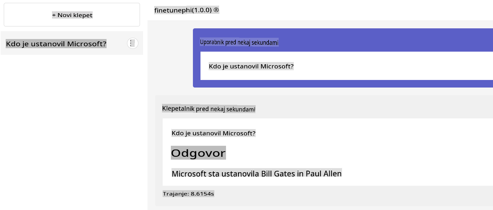

**Izjava o omejitvi odgovornosti**:  
Ta dokument je bil preveden s pomočjo storitev strojnega prevajanja z umetno inteligenco. Čeprav si prizadevamo za natančnost, vas opozarjamo, da lahko avtomatski prevodi vsebujejo napake ali netočnosti. Izvirni dokument v svojem izvirnem jeziku je treba obravnavati kot verodostojen vir. Za ključne informacije priporočamo strokovni prevod s strani človeškega prevajalca. Ne prevzemamo odgovornosti za morebitna nesporazuma ali napačne razlage, ki bi nastale zaradi uporabe tega prevoda.