# Prilagodite in integrirajte prilagojene modele Phi-3 z uporabo Prompt flow v Azure AI Foundry

Ta celoviti (E2E) primer temelji na vodiču "[Fine-Tune and Integrate Custom Phi-3 Models with Prompt Flow in Azure AI Foundry](https://techcommunity.microsoft.com/t5/educator-developer-blog/fine-tune-and-integrate-custom-phi-3-models-with-prompt-flow-in/ba-p/4191726?WT.mc_id=aiml-137032-kinfeylo)" iz Microsoft Tech Community. Predstavlja postopke prilagajanja, uvajanja in integracije prilagojenih modelov Phi-3 z uporabo Prompt flow v Azure AI Foundry.  
Za razliko od E2E primera "[Fine-Tune and Integrate Custom Phi-3 Models with Prompt Flow](./E2E_Phi-3-FineTuning_PromptFlow_Integration.md)", ki vključuje lokalno izvajanje kode, se ta vadnica osredotoča izključno na prilagajanje in integracijo vašega modela znotraj Azure AI / ML Studio.

## Pregled

V tem E2E primeru se boste naučili, kako prilagoditi model Phi-3 in ga integrirati z uporabo Prompt flow v Azure AI Foundry. Z izkoriščanjem Azure AI / ML Studio boste vzpostavili delovni tok za uvajanje in uporabo prilagojenih AI modelov. Ta E2E primer je razdeljen na tri scenarije:

**Scenarij 1: Nastavite Azure vire in se pripravite na prilagajanje**

**Scenarij 2: Prilagodite model Phi-3 in ga uvedite v Azure Machine Learning Studio**

**Scenarij 3: Integrirajte z uporabo Prompt flow in komunicirajte s svojim prilagojenim modelom v Azure AI Foundry**

Tukaj je pregled tega E2E primera.

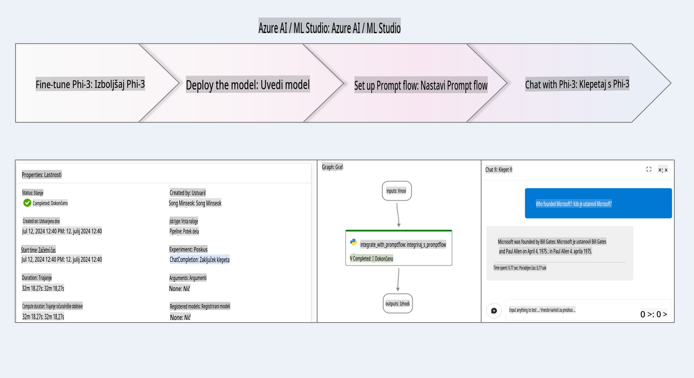

### Kazalo

1. **[Scenarij 1: Nastavite Azure vire in se pripravite na prilagajanje](../../../../../../md/02.Application/01.TextAndChat/Phi3)**
    - [Ustvarite Azure Machine Learning Workspace](../../../../../../md/02.Application/01.TextAndChat/Phi3)
    - [Zahtevajte GPU kvote v Azure naročnini](../../../../../../md/02.Application/01.TextAndChat/Phi3)
    - [Dodajte vlogo](../../../../../../md/02.Application/01.TextAndChat/Phi3)
    - [Nastavite projekt](../../../../../../md/02.Application/01.TextAndChat/Phi3)
    - [Pripravite podatkovni niz za prilagajanje](../../../../../../md/02.Application/01.TextAndChat/Phi3)

1. **[Scenarij 2: Prilagodite model Phi-3 in ga uvedite v Azure Machine Learning Studio](../../../../../../md/02.Application/01.TextAndChat/Phi3)**
    - [Prilagodite model Phi-3](../../../../../../md/02.Application/01.TextAndChat/Phi3)
    - [Uvedite prilagojen model Phi-3](../../../../../../md/02.Application/01.TextAndChat/Phi3)

1. **[Scenarij 3: Integrirajte z uporabo Prompt flow in komunicirajte s svojim prilagojenim modelom v Azure AI Foundry](../../../../../../md/02.Application/01.TextAndChat/Phi3)**
    - [Integrirajte prilagojen model Phi-3 z uporabo Prompt flow](../../../../../../md/02.Application/01.TextAndChat/Phi3)
    - [Komunicirajte s svojim prilagojenim modelom Phi-3](../../../../../../md/02.Application/01.TextAndChat/Phi3)

## Scenarij 1: Nastavite Azure vire in se pripravite na prilagajanje

### Ustvarite Azure Machine Learning Workspace

1. V iskalni vrstici na vrhu portala vnesite *azure machine learning* in izberite **Azure Machine Learning** iz prikazanih možnosti.

    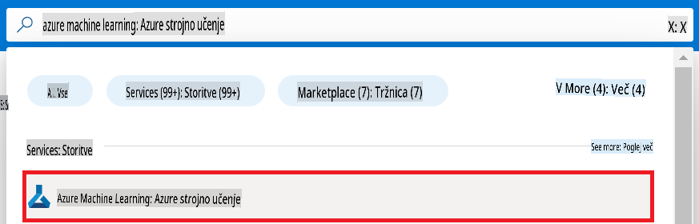

2. Izberite **+ Create** v navigacijskem meniju.

3. Izberite **New workspace** v navigacijskem meniju.

    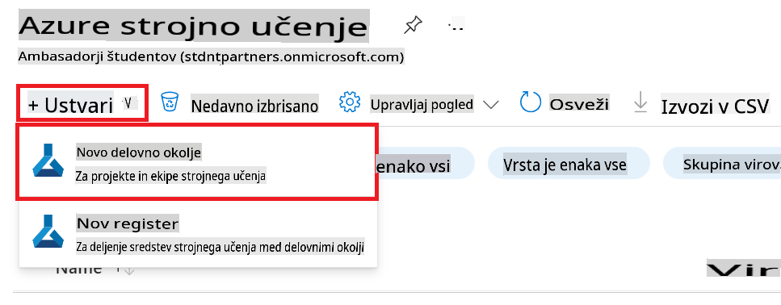

4. Izvedite naslednje naloge:

    - Izberite svojo Azure **Subscription**.
    - Izberite **Resource group**, ki jo želite uporabiti (po potrebi ustvarite novo).
    - Vnesite **Workspace Name**. Mora biti edinstvena vrednost.
    - Izberite **Region**, ki ga želite uporabiti.
    - Izberite **Storage account**, ki ga želite uporabiti (po potrebi ustvarite novega).
    - Izberite **Key vault**, ki ga želite uporabiti (po potrebi ustvarite novega).
    - Izberite **Application insights**, ki jih želite uporabiti (po potrebi ustvarite novega).
    - Izberite **Container registry**, ki ga želite uporabiti (po potrebi ustvarite novega).

    

5. Izberite **Review + Create**.

6. Izberite **Create**.

### Zahtevajte GPU kvote v Azure naročnini

V tej vadnici se boste naučili, kako prilagoditi in uvesti model Phi-3 z uporabo GPU-jev. Za prilagajanje boste uporabili *Standard_NC24ads_A100_v4* GPU, ki zahteva zahtevo za kvoto. Za uvajanje boste uporabili *Standard_NC6s_v3* GPU, ki prav tako zahteva zahtevo za kvoto.

> [!NOTE]
>
> Samo naročnine Pay-As-You-Go (standardni tip naročnine) so primerne za dodelitev GPU-jev; naročnine z ugodnostmi trenutno niso podprte.
>

1. Obiščite [Azure ML Studio](https://ml.azure.com/home?wt.mc_id=studentamb_279723).

1. Izvedite naslednje naloge za zahtevo kvote za *Standard NCADSA100v4 Family*:

    - Izberite **Quota** v levem zavihku.
    - Izberite **Virtual machine family**, ki ga želite uporabiti. Na primer, izberite **Standard NCADSA100v4 Family Cluster Dedicated vCPUs**, ki vključuje *Standard_NC24ads_A100_v4* GPU.
    - Izberite **Request quota** v navigacijskem meniju.

        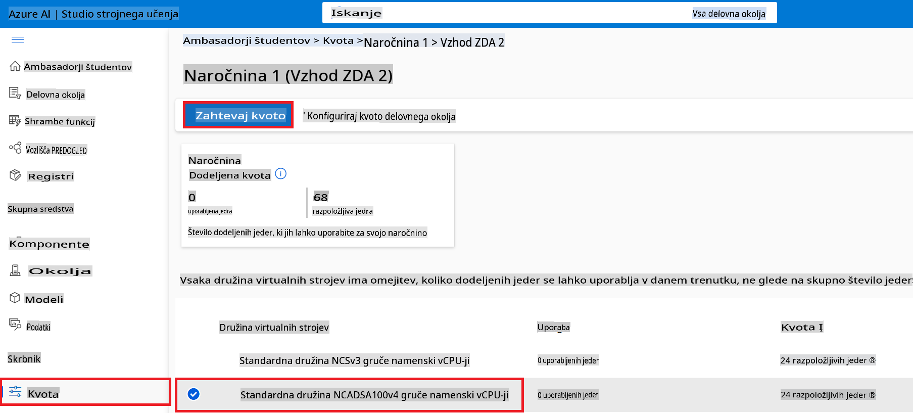

    - Na strani za zahtevo kvote vnesite **New cores limit**, ki ga želite uporabiti. Na primer, 24.
    - Na strani za zahtevo kvote izberite **Submit** za zahtevo GPU kvote.

1. Izvedite naslednje naloge za zahtevo kvote za *Standard NCSv3 Family*:

    - Izberite **Quota** v levem zavihku.
    - Izberite **Virtual machine family**, ki ga želite uporabiti. Na primer, izberite **Standard NCSv3 Family Cluster Dedicated vCPUs**, ki vključuje *Standard_NC6s_v3* GPU.
    - Izberite **Request quota** v navigacijskem meniju.
    - Na strani za zahtevo kvote vnesite **New cores limit**, ki ga želite uporabiti. Na primer, 24.
    - Na strani za zahtevo kvote izberite **Submit** za zahtevo GPU kvote.

### Dodajte vlogo

Za prilagajanje in uvajanje svojih modelov morate najprej ustvariti Uporabniško dodeljeno upravljano identiteto (UAI) in ji dodeliti ustrezna dovoljenja. Ta UAI bo uporabljena za avtentikacijo med uvajanjem.

#### Ustvarite Uporabniško dodeljeno upravljano identiteto (UAI)

1. V iskalni vrstici na vrhu portala vnesite *managed identities* in izberite **Managed Identities** iz prikazanih možnosti.

    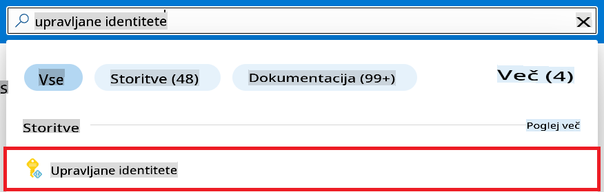

1. Izberite **+ Create**.

    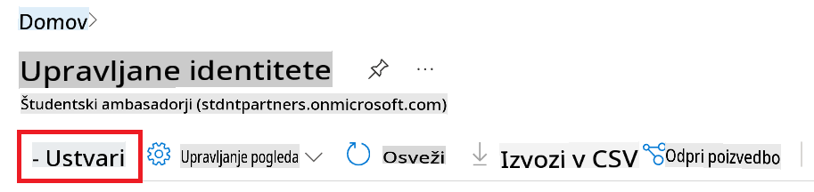

1. Izvedite naslednje naloge:

    - Izberite svojo Azure **Subscription**.
    - Izberite **Resource group**, ki jo želite uporabiti (po potrebi ustvarite novo).
    - Izberite **Region**, ki ga želite uporabiti.
    - Vnesite **Name**. Mora biti edinstvena vrednost.

    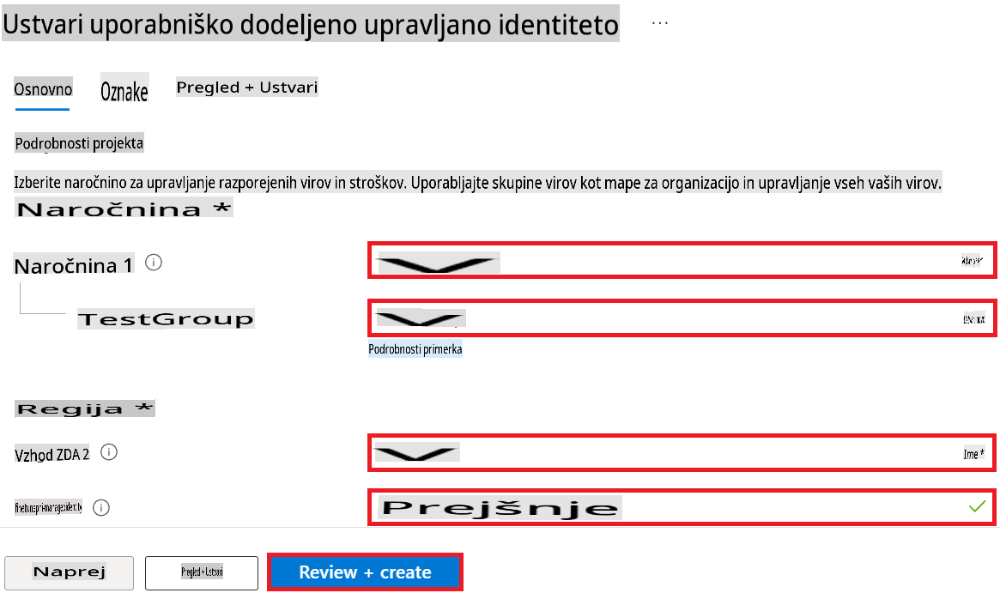

1. Izberite **Review + create**.

1. Izberite **+ Create**.

#### Dodajte Contributor vlogo upravljani identiteti

1. Pomaknite se do vira Upravljane identitete, ki ste ga ustvarili.

1. Izberite **Azure role assignments** v levem zavihku.

1. Izberite **+Add role assignment** v navigacijskem meniju.

1. Na strani za dodajanje vloge izvedite naslednje naloge:
    - Izberite **Scope** na **Resource group**.
    - Izberite svojo Azure **Subscription**.
    - Izberite **Resource group**, ki jo želite uporabiti.
    - Izberite **Role** na **Contributor**.

    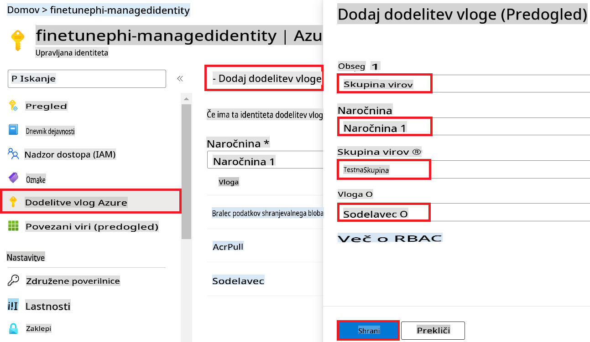

2. Izberite **Save**.
1. Obiščite [Azure ML Studio](https://ml.azure.com/home?wt.mc_id=studentamb_279723).

1. Izberite **Compute** iz levega zavihka.

1. Izberite **Compute clusters** iz navigacijskega menija.

1. Izberite **+ New**.

    

1. Opravite naslednje naloge:

    - Izberite **Region**, ki ga želite uporabiti.
    - Nastavite **Virtual machine tier** na **Dedicated**.
    - Nastavite **Virtual machine type** na **GPU**.
    - Nastavite filter za **Virtual machine size** na **Select from all options**.
    - Izberite **Virtual machine size** na **Standard_NC24ads_A100_v4**.

    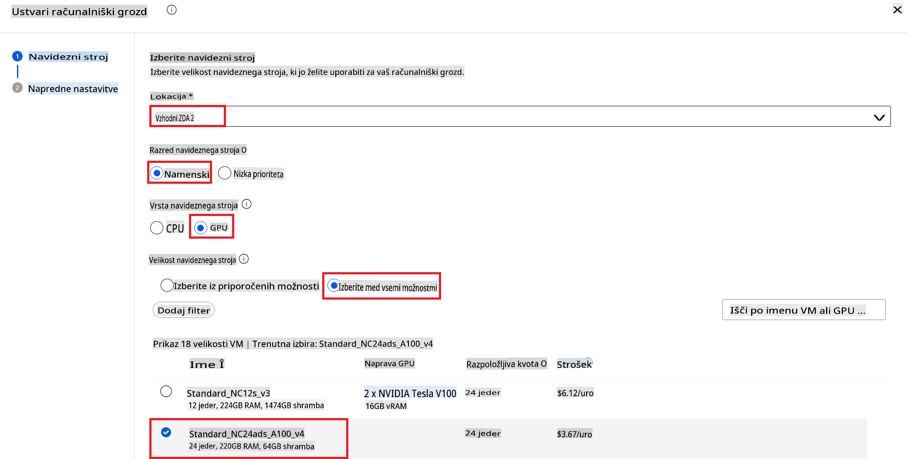

1. Izberite **Next**.

1. Opravite naslednje naloge:

    - Vnesite **Compute name**. Ime mora biti edinstveno.
    - Nastavite **Minimum number of nodes** na **0**.
    - Nastavite **Maximum number of nodes** na **1**.
    - Nastavite **Idle seconds before scale down** na **120**.

    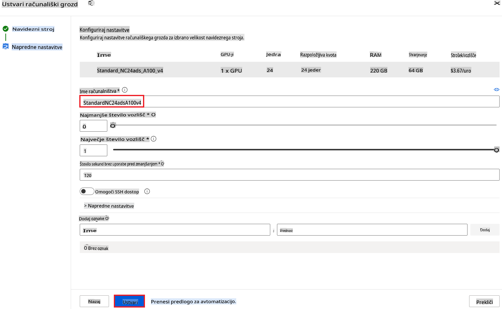

1. Izberite **Create**.

#### Prilagodite model Phi-3

1. Obiščite [Azure ML Studio](https://ml.azure.com/home?wt.mc_id=studentamb_279723).

1. Izberite Azure Machine Learning delovni prostor, ki ste ga ustvarili.

    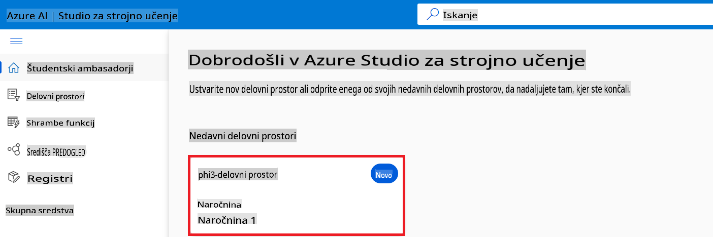

1. Opravite naslednje naloge:

    - Izberite **Model catalog** iz levega zavihka.
    - Vnesite *phi-3-mini-4k* v **iskalno vrstico** in izberite **Phi-3-mini-4k-instruct** iz prikazanih možnosti.

    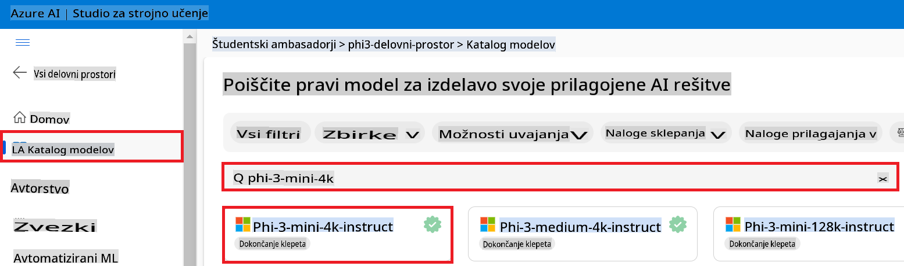

1. Izberite **Fine-tune** iz navigacijskega menija.

    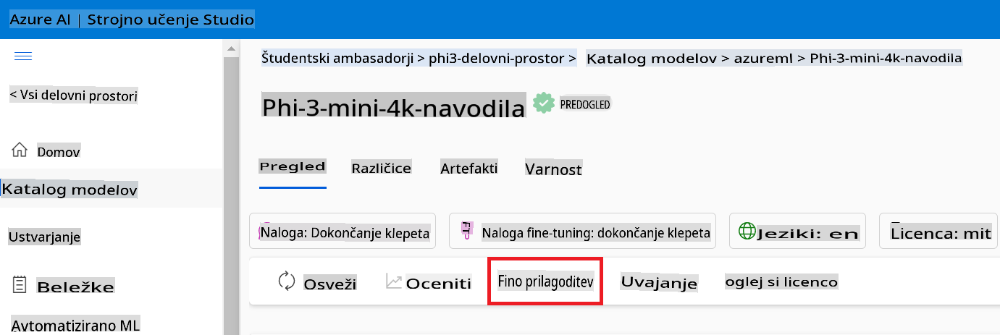

1. Opravite naslednje naloge:

    - Nastavite **Select task type** na **Chat completion**.
    - Izberite **+ Select data** za nalaganje **Traning data**.
    - Nastavite način nalaganja validacijskih podatkov na **Provide different validation data**.
    - Izberite **+ Select data** za nalaganje **Validation data**.

    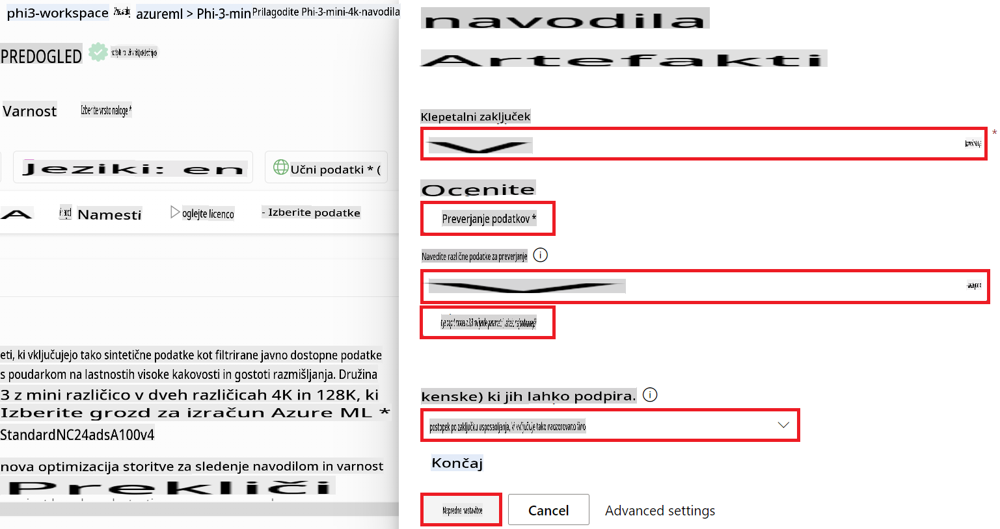

    > [!TIP]
    >
    > Izberete lahko **Advanced settings** za prilagoditev nastavitev, kot so **learning_rate** in **lr_scheduler_type**, da optimizirate proces prilagajanja glede na svoje specifične potrebe.

1. Izberite **Finish**.

1. V tej vaji ste uspešno prilagodili model Phi-3 z uporabo Azure Machine Learning. Upoštevajte, da lahko proces prilagajanja traja precej časa. Po zagonu prilagoditvene naloge morate počakati, da se dokonča. Status prilagoditvene naloge lahko spremljate v zavihku Jobs na levi strani vašega Azure Machine Learning delovnega prostora. V naslednji seriji boste model, ki ste ga prilagodili, implementirali in ga integrirali s Prompt flow.

    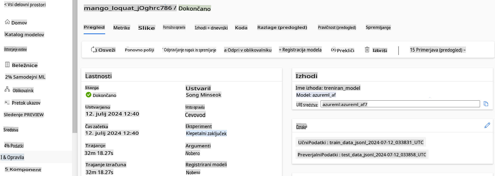

### Implementirajte prilagojeni model Phi-3

Za integracijo prilagojenega modela Phi-3 s Prompt flow morate model implementirati, da bo dostopen za realnočasovno sklepanje. Ta proces vključuje registracijo modela, ustvarjanje spletne končne točke in implementacijo modela.

V tej vaji boste:

- Registrirali prilagojeni model v Azure Machine Learning delovnem prostoru.
- Ustvarili spletno končno točko.
- Implementirali registrirani prilagojeni model Phi-3.

#### Registrirajte prilagojeni model

1. Obiščite [Azure ML Studio](https://ml.azure.com/home?wt.mc_id=studentamb_279723).

1. Izberite Azure Machine Learning delovni prostor, ki ste ga ustvarili.

    

1. Izberite **Models** iz levega zavihka.
1. Izberite **+ Register**.
1. Izberite **From a job output**.

    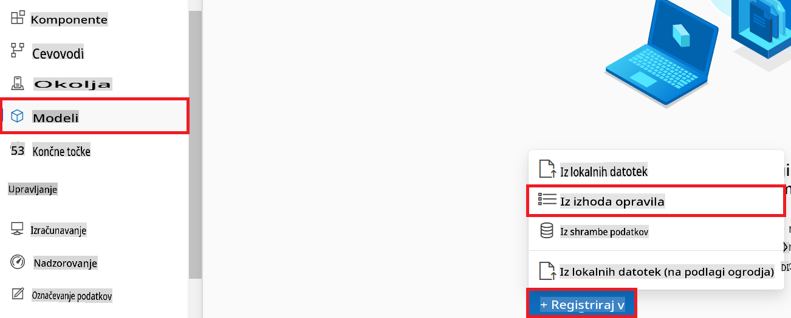

1. Izberite nalogo, ki ste jo ustvarili.

    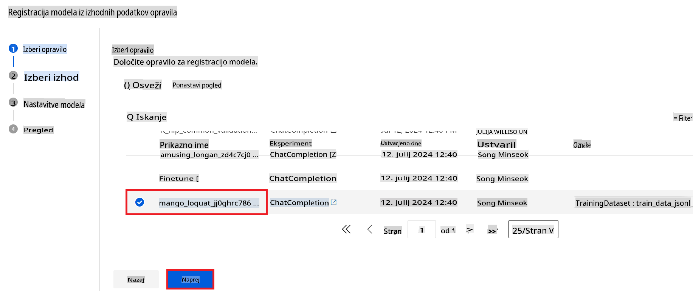

1. Izberite **Next**.

1. Nastavite **Model type** na **MLflow**.

1. Prepričajte se, da je izbrana možnost **Job output**; ta bi morala biti samodejno izbrana.

    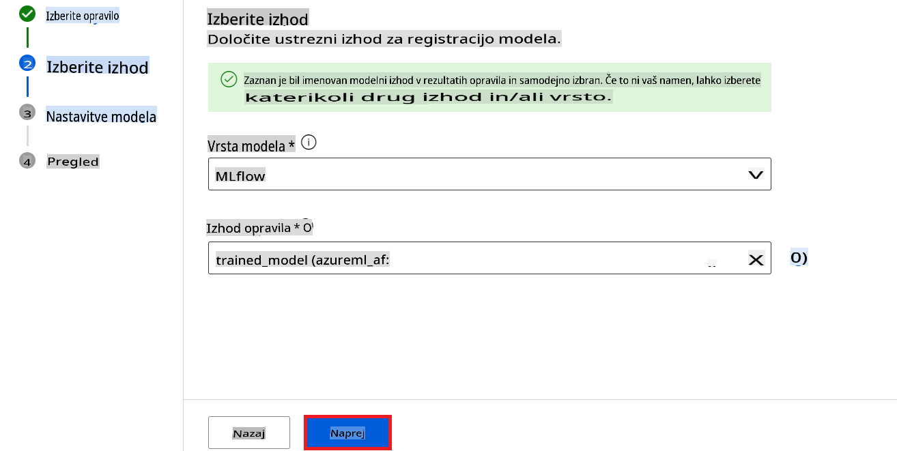

2. Izberite **Next**.

3. Izberite **Register**.

    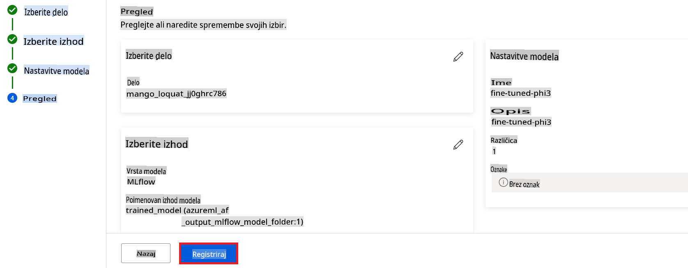

4. Svoj registrirani model si lahko ogledate z navigacijo do menija **Models** iz levega zavihka.

    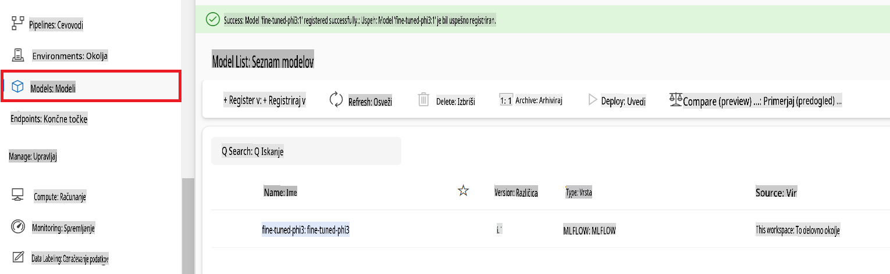

#### Implementirajte prilagojeni model

1. Pojdite v Azure Machine Learning delovni prostor, ki ste ga ustvarili.

1. Izberite **Endpoints** iz levega zavihka.

1. Izberite **Real-time endpoints** iz navigacijskega menija.

    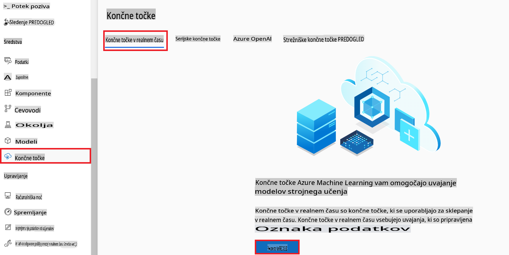

1. Izberite **Create**.

1. Izberite registrirani model, ki ste ga ustvarili.

    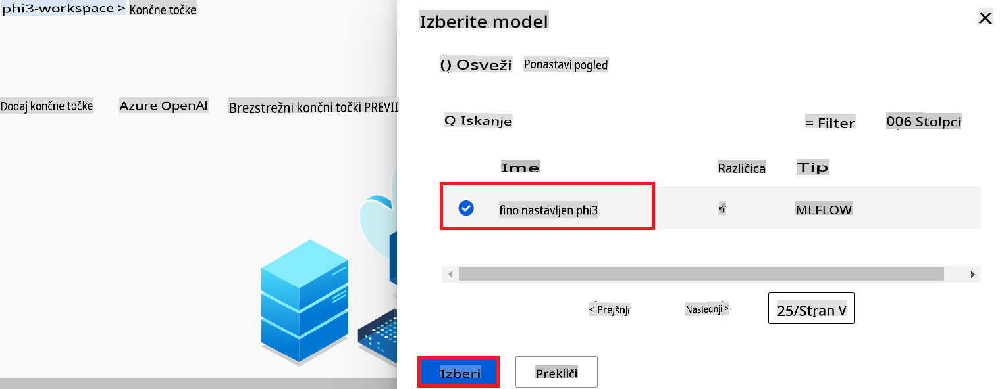

1. Izberite **Select**.

1. Opravite naslednje naloge:

    - Nastavite **Virtual machine** na *Standard_NC6s_v3*.
    - Izberite **Instance count**, ki ga želite uporabiti. Na primer, *1*.
    - Nastavite **Endpoint** na **New**, da ustvarite endpoint.
    - Vnesite **Endpoint name**. Ime mora biti edinstveno.
    - Vnesite **Deployment name**. Ime mora biti edinstveno.

    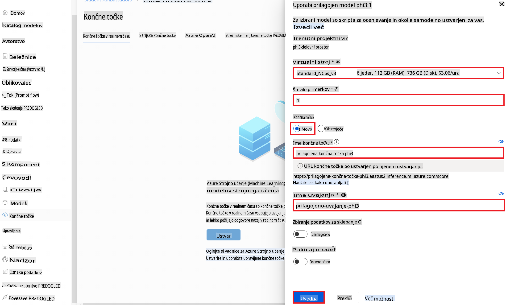

1. Izberite **Deploy**.

> [!WARNING]
> Da se izognete dodatnim stroškom na vašem računu, poskrbite, da izbrišete ustvarjeno končno točko v Azure Machine Learning delovnem prostoru.
>

#### Preverite status implementacije v Azure Machine Learning delovnem prostoru

1. Pojdite v Azure Machine Learning delovni prostor, ki ste ga ustvarili.

1. Izberite **Endpoints** iz levega zavihka.

1. Izberite končno točko, ki ste jo ustvarili.

    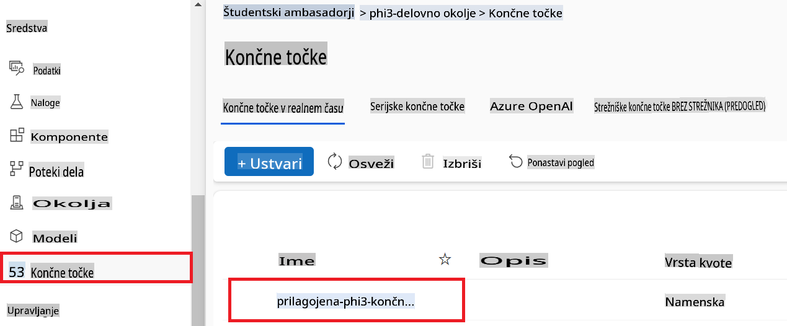

1. Na tej strani lahko upravljate končne točke med procesom implementacije.

> [!NOTE]
> Ko je implementacija končana, poskrbite, da je **Live traffic** nastavljen na **100%**. Če ni, izberite **Update traffic**, da prilagodite nastavitve prometa. Upoštevajte, da modela ne morete testirati, če je promet nastavljen na 0%.
>
> 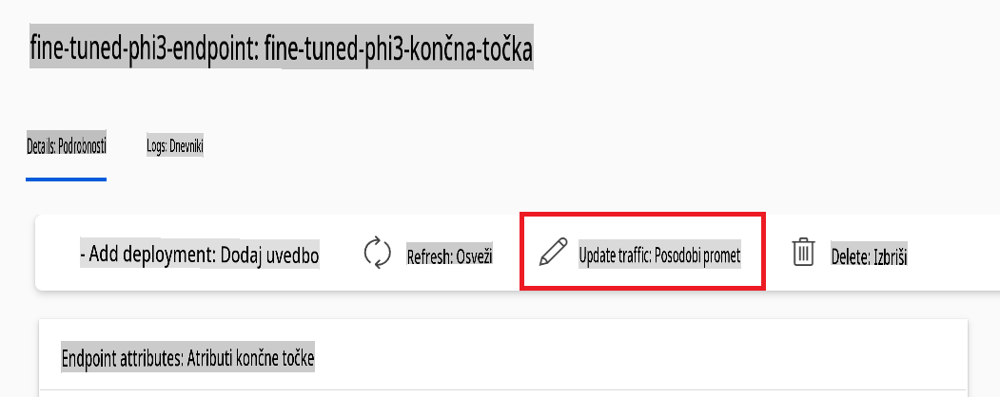
>

## Scenarij 3: Integrirajte s Prompt flow in klepetajte s svojim prilagojenim modelom v Azure AI Foundry

### Integrirajte prilagojen model Phi-3 s Prompt flow

Ko uspešno implementirate svoj prilagojeni model, ga lahko zdaj integrirate s Prompt Flow, da ga uporabite v realnočasovnih aplikacijah, kar omogoča različne interaktivne naloge z vašim prilagojenim modelom Phi-3.

V tej vaji boste:

- Ustvarili Azure AI Foundry Hub.
- Ustvarili Azure AI Foundry Project.
- Ustvarili Prompt flow.
- Dodali prilagojeno povezavo za prilagojeni model Phi-3.
- Nastavili Prompt flow za klepetanje s svojim prilagojenim modelom Phi-3.

> [!NOTE]
> Prav tako lahko integrirate s Promptflow z uporabo Azure ML Studio. Enak proces integracije se lahko uporabi v Azure ML Studio.

#### Ustvarite Azure AI Foundry Hub

Pred ustvarjanjem projekta morate ustvariti Hub. Hub deluje kot skupina virov, ki vam omogoča organizacijo in upravljanje več projektov znotraj Azure AI Foundry.

1. Obiščite [Azure AI Foundry](https://ai.azure.com/?WT.mc_id=aiml-137032-kinfeylo).

1. Izberite **All hubs** iz levega zavihka.

1. Izberite **+ New hub** iz navigacijskega menija.

    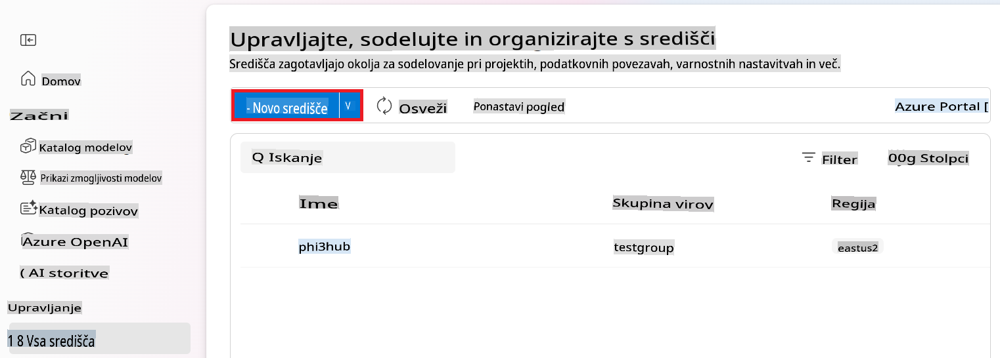

1. Opravite naslednje naloge:

    - Vnesite **Hub name**. Ime mora biti edinstveno.
    - Izberite svojo Azure **Subscription**.
    - Izberite **Resource group**, ki jo želite uporabiti (ustvarite novo, če je potrebno).
    - Izberite **Location**, ki jo želite uporabiti.
    - Izberite **Connect Azure AI Services**, ki jih želite uporabiti (ustvarite nove, če je potrebno).
    - Nastavite **Connect Azure AI Search** na **Skip connecting**.

    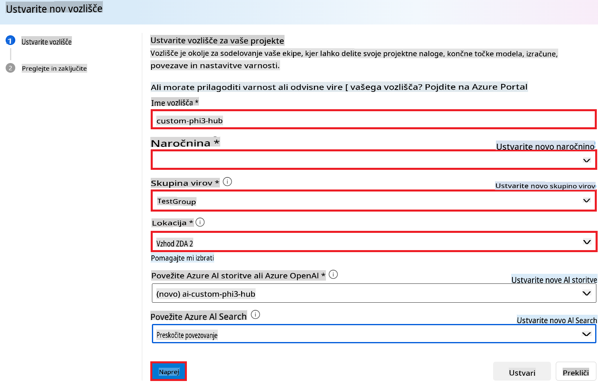

1. Izberite **Next**.

#### Ustvarite Azure AI Foundry Project

1. V Hubu, ki ste ga ustvarili, izberite **All projects** iz levega zavihka.

1. Izberite **+ New project** iz navigacijskega menija.

    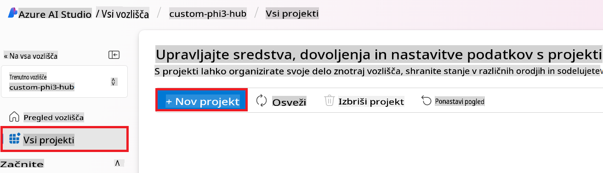

1. Vnesite **Project name**. Ime mora biti edinstveno.

    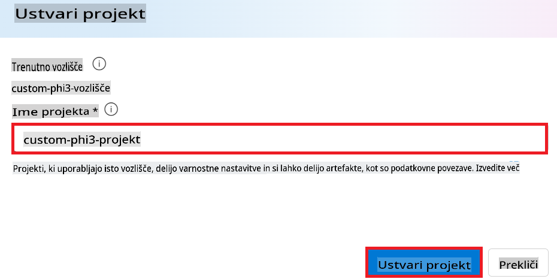

1. Izberite **Create a project**.

#### Dodajte prilagojeno povezavo za prilagojeni model Phi-3

Za integracijo vašega prilagojenega modela Phi-3 s Prompt flow morate shraniti končno točko modela in ključ v prilagojeni povezavi. Ta nastavitev omogoča dostop do vašega prilagojenega modela Phi-3 v Prompt flow.

#### Nastavite api ključ in endpoint uri za prilagojeni model Phi-3

1. Obiščite [Azure ML Studio](https://ml.azure.com/home?WT.mc_id=aiml-137032-kinfeylo).

1. Pojdite v Azure Machine Learning delovni prostor, ki ste ga ustvarili.

1. Izberite **Endpoints** iz levega zavihka.

    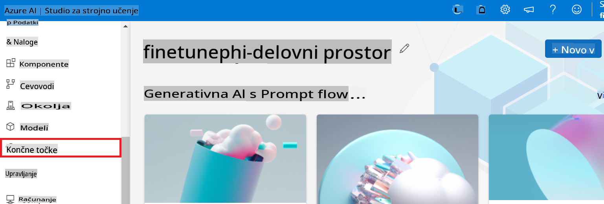

1. Izberite končno točko, ki ste jo ustvarili.

    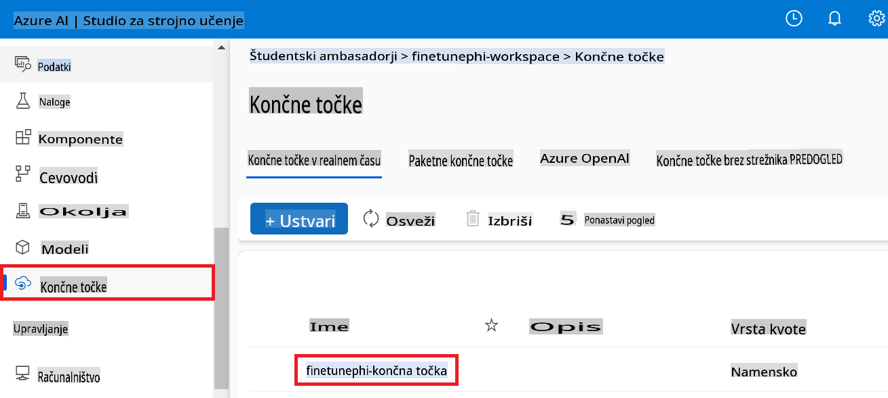

1. Izberite **Consume** iz navigacijskega menija.

1. Kopirajte svoj **REST endpoint** in **Primary key**.
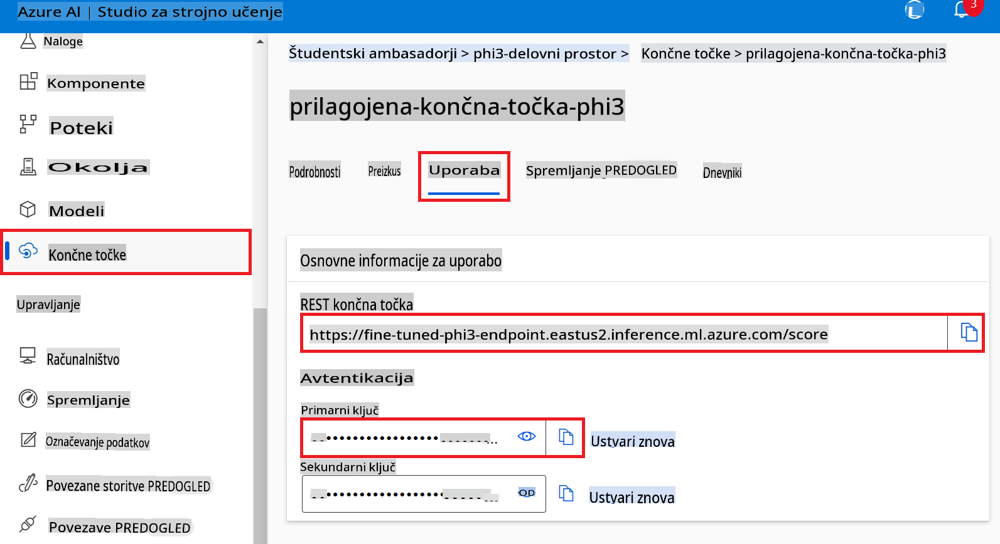

#### Dodajanje prilagojene povezave

1. Obiščite [Azure AI Foundry](https://ai.azure.com/?WT.mc_id=aiml-137032-kinfeylo).

1. Pomaknite se do projekta Azure AI Foundry, ki ste ga ustvarili.

1. V projektu, ki ste ga ustvarili, izberite **Settings** na levi stranski vrstici.

1. Izberite **+ New connection**.

    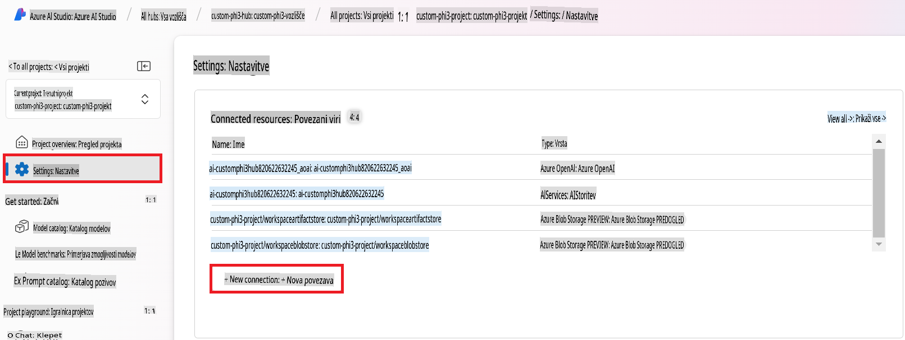

1. Izberite **Custom keys** iz navigacijskega menija.

    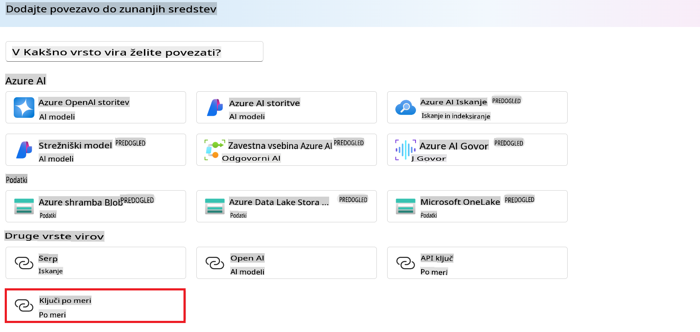

1. Izvedite naslednje korake:

    - Izberite **+ Add key value pairs**.
    - Za ime ključa vnesite **endpoint** in prilepite končno točko, ki ste jo kopirali iz Azure ML Studio, v polje za vrednost.
    - Ponovno izberite **+ Add key value pairs**.
    - Za ime ključa vnesite **key** in prilepite ključ, ki ste ga kopirali iz Azure ML Studio, v polje za vrednost.
    - Po dodajanju ključev izberite **is secret**, da preprečite razkritje ključa.

    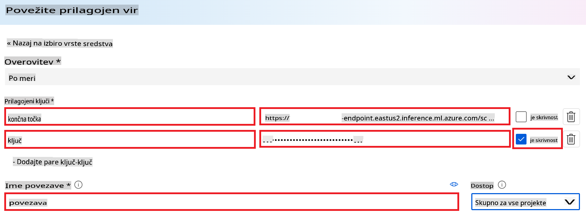

1. Izberite **Add connection**.

#### Ustvarjanje Prompt flow

Dodali ste prilagojeno povezavo v Azure AI Foundry. Zdaj ustvarimo Prompt flow s pomočjo naslednjih korakov. Nato boste povezali ta Prompt flow s prilagojeno povezavo, da boste lahko uporabili prilagojen model znotraj Prompt flow.

1. Pomaknite se do projekta Azure AI Foundry, ki ste ga ustvarili.

1. Izberite **Prompt flow** na levi stranski vrstici.

1. Izberite **+ Create** iz navigacijskega menija.

    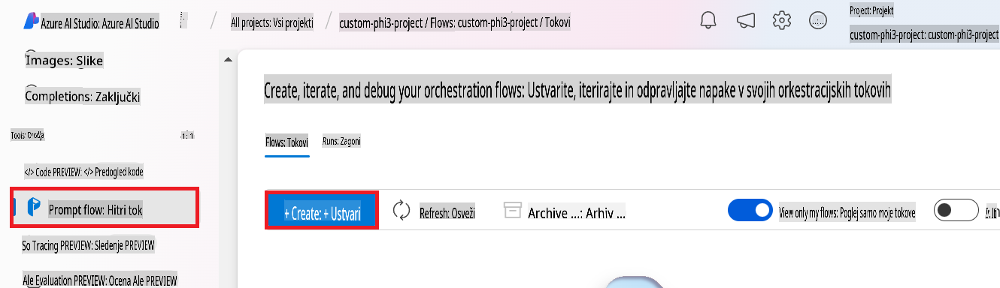

1. Izberite **Chat flow** iz navigacijskega menija.

    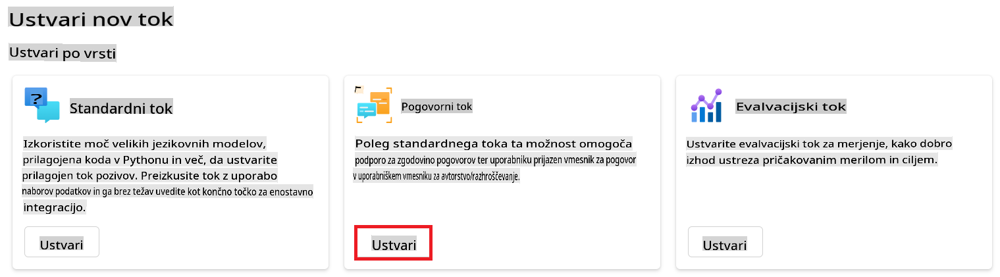

1. Vnesite **Folder name**, ki ga želite uporabiti.

    

2. Izberite **Create**.

#### Nastavitev Prompt flow za klepet s prilagojenim modelom Phi-3

Prilagojen model Phi-3 je potrebno vključiti v Prompt flow. Vendar trenutni Prompt flow, ki je na voljo, ni zasnovan za ta namen. Zato morate obstoječi Prompt flow preoblikovati, da omogočite integracijo prilagojenega modela.

1. V Prompt flow izvedite naslednje korake za preoblikovanje obstoječega toka:

    - Izberite **Raw file mode**.
    - Izbrišite vso obstoječo kodo v datoteki *flow.dag.yml*.
    - Dodajte naslednjo kodo v datoteko *flow.dag.yml*.

        ```yml
        inputs:
          input_data:
            type: string
            default: "Who founded Microsoft?"

        outputs:
          answer:
            type: string
            reference: ${integrate_with_promptflow.output}

        nodes:
        - name: integrate_with_promptflow
          type: python
          source:
            type: code
            path: integrate_with_promptflow.py
          inputs:
            input_data: ${inputs.input_data}
        ```

    - Izberite **Save**.

    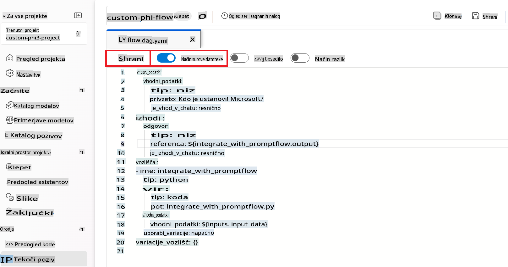

1. Dodajte naslednjo kodo v datoteko *integrate_with_promptflow.py*, da uporabite prilagojen model Phi-3 v Prompt flow.

    ```python
    import logging
    import requests
    from promptflow import tool
    from promptflow.connections import CustomConnection

    # Logging setup
    logging.basicConfig(
        format="%(asctime)s - %(levelname)s - %(name)s - %(message)s",
        datefmt="%Y-%m-%d %H:%M:%S",
        level=logging.DEBUG
    )
    logger = logging.getLogger(__name__)

    def query_phi3_model(input_data: str, connection: CustomConnection) -> str:
        """
        Send a request to the Phi-3 model endpoint with the given input data using Custom Connection.
        """

        # "connection" is the name of the Custom Connection, "endpoint", "key" are the keys in the Custom Connection
        endpoint_url = connection.endpoint
        api_key = connection.key

        headers = {
            "Content-Type": "application/json",
            "Authorization": f"Bearer {api_key}"
        }
        data = {
            "input_data": {
                "input_string": [
                    {"role": "user", "content": input_data}
                ],
                "parameters": {
                    "temperature": 0.7,
                    "max_new_tokens": 128
                }
            }
        }
        try:
            response = requests.post(endpoint_url, json=data, headers=headers)
            response.raise_for_status()
            
            # Log the full JSON response
            logger.debug(f"Full JSON response: {response.json()}")

            result = response.json()["output"]
            logger.info("Successfully received response from Azure ML Endpoint.")
            return result
        except requests.exceptions.RequestException as e:
            logger.error(f"Error querying Azure ML Endpoint: {e}")
            raise

    @tool
    def my_python_tool(input_data: str, connection: CustomConnection) -> str:
        """
        Tool function to process input data and query the Phi-3 model.
        """
        return query_phi3_model(input_data, connection)

    ```

    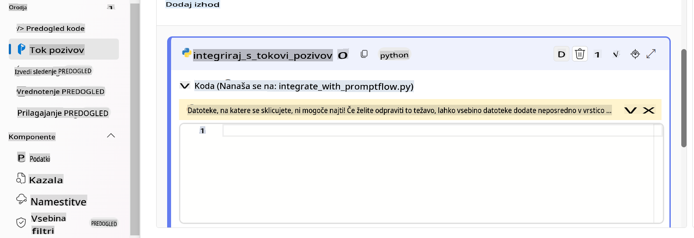

> [!NOTE]
> Za podrobnejše informacije o uporabi Prompt flow v Azure AI Foundry si lahko ogledate [Prompt flow v Azure AI Foundry](https://learn.microsoft.com/azure/ai-studio/how-to/prompt-flow).

1. Izberite **Chat input**, **Chat output**, da omogočite klepet z vašim modelom.

    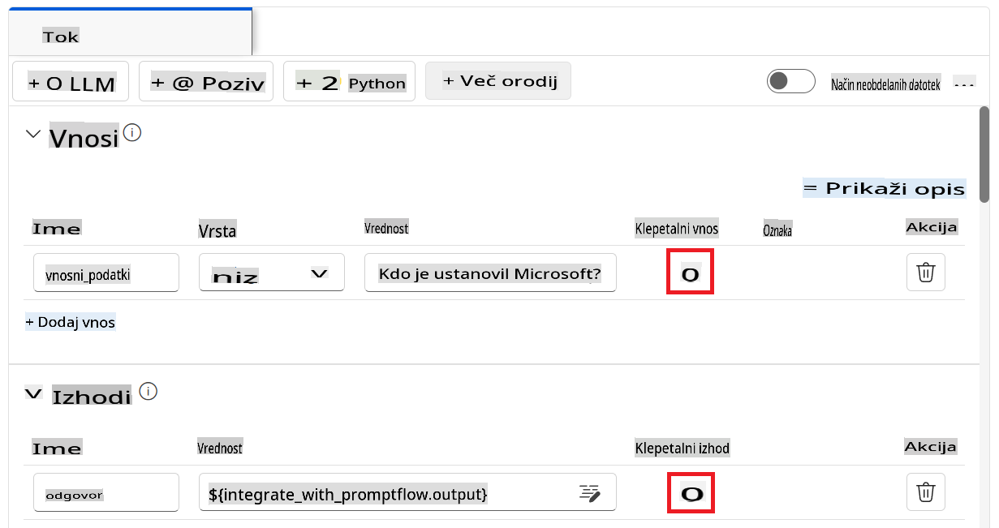

1. Zdaj ste pripravljeni na klepet s svojim prilagojenim modelom Phi-3. V naslednji vaji se boste naučili, kako zagnati Prompt flow in ga uporabiti za klepet s svojim prilagojenim modelom Phi-3.

> [!NOTE]
>
> Preoblikovani tok naj bi izgledal kot na spodnji sliki:
>
> 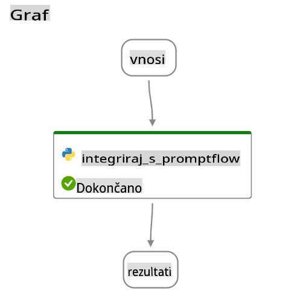
>

### Klepet s prilagojenim modelom Phi-3

Zdaj, ko ste prilagodili in vključili svoj model Phi-3 v Prompt flow, ste pripravljeni na interakcijo z njim. Ta vaja vas bo vodila skozi postopek nastavitve in začetka klepeta z vašim modelom z uporabo Prompt flow. Z upoštevanjem teh korakov boste lahko v celoti izkoristili zmožnosti vašega prilagojenega modela Phi-3 za različne naloge in pogovore.

- Klepetajte s svojim prilagojenim modelom Phi-3 z uporabo Prompt flow.

#### Zagon Prompt flow

1. Izberite **Start compute sessions**, da zaženete Prompt flow.

    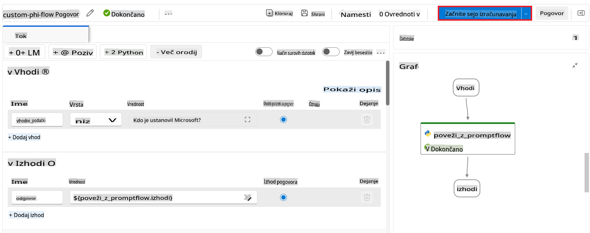

1. Izberite **Validate and parse input**, da osvežite parametre.

    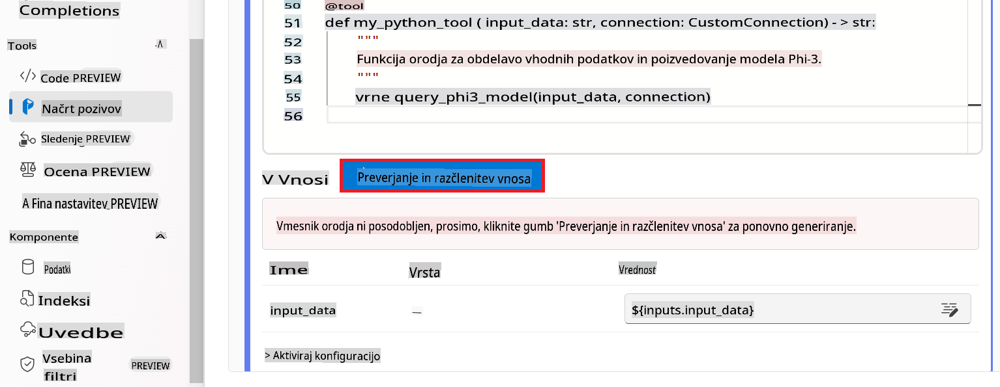

1. Izberite **Value** za **connection** do prilagojene povezave, ki ste jo ustvarili. Na primer, *connection*.

    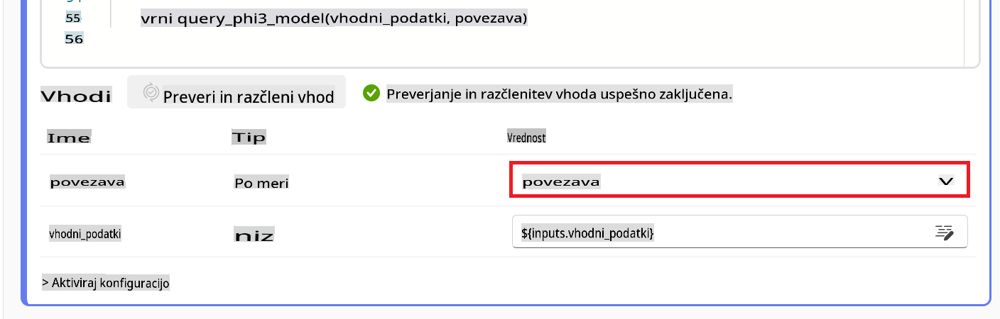

#### Klepet s prilagojenim modelom

1. Izberite **Chat**.

    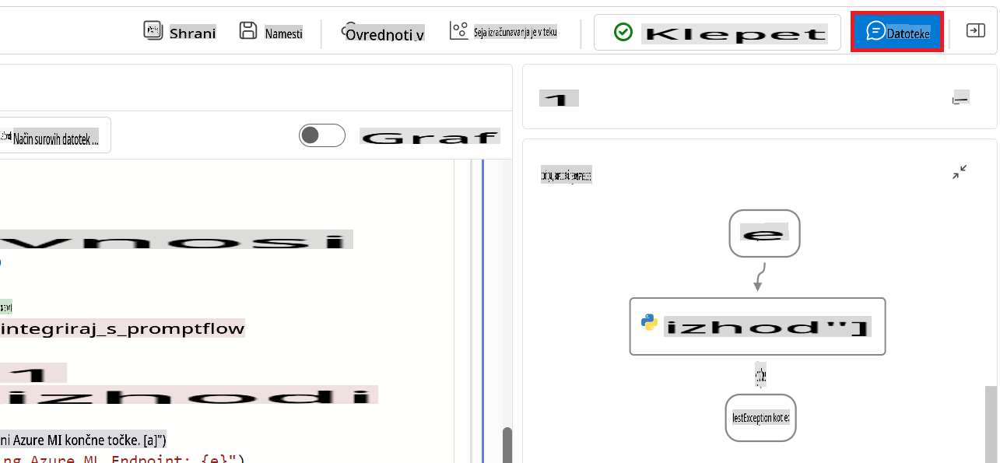

1. Tukaj je primer rezultatov: Zdaj lahko klepetate s svojim prilagojenim modelom Phi-3. Priporočljivo je, da postavljate vprašanja, ki temeljijo na podatkih, uporabljenih za prilagoditev.

    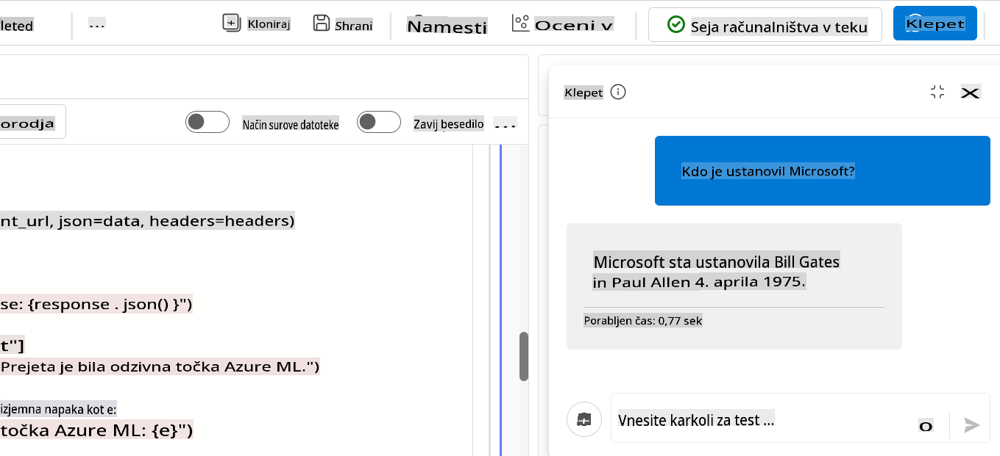

**Omejitev odgovornosti**:  
Ta dokument je bil preveden s pomočjo storitev strojnega prevajanja, ki temeljijo na umetni inteligenci. Čeprav si prizadevamo za natančnost, vas prosimo, da se zavedate, da lahko avtomatizirani prevodi vsebujejo napake ali netočnosti. Izvirni dokument v svojem maternem jeziku je treba obravnavati kot avtoritativni vir. Za ključne informacije priporočamo profesionalni človeški prevod. Ne prevzemamo odgovornosti za kakršne koli nesporazume ali napačne razlage, ki izhajajo iz uporabe tega prevoda.