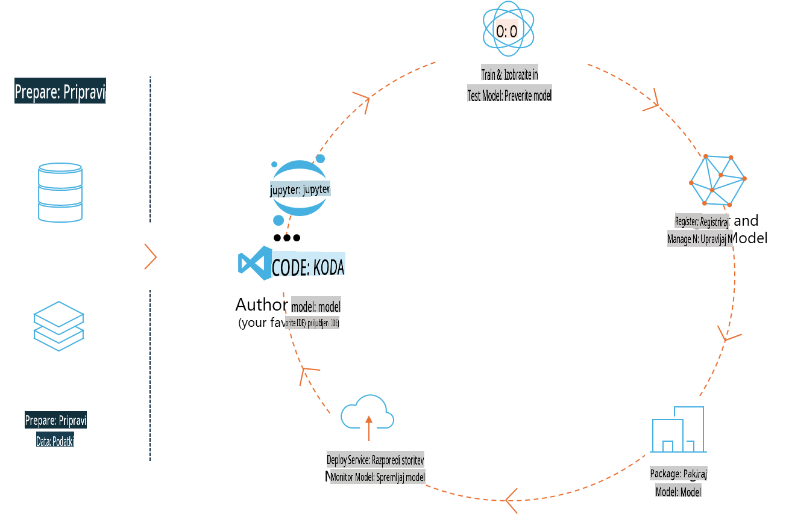
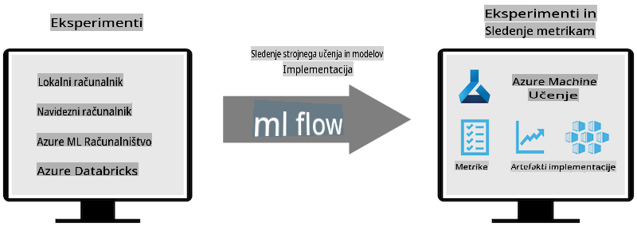
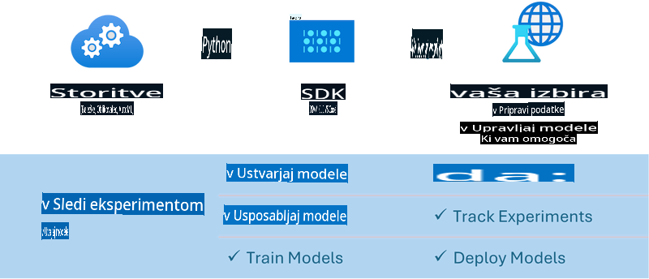

# MLflow

[MLflow](https://mlflow.org/) je odprtokodna platforma, zasnovana za upravljanje celotnega življenjskega cikla strojnega učenja.



MLFlow se uporablja za upravljanje življenjskega cikla strojnega učenja, vključno z eksperimentiranjem, ponovljivostjo, uvajanjem in osrednjim registrom modelov. Trenutno MLFlow ponuja štiri komponente:

- **MLflow Tracking:** Beleženje in iskanje eksperimentov, kode, podatkovnih konfiguracij in rezultatov.
- **MLflow Projects:** Pakiranje kode za podatkovno znanost v formatu, ki omogoča reproduciranje izvajanj na kateri koli platformi.
- **MLflow Models:** Uvajanje modelov strojnega učenja v različnih okolij za izvajanje.
- **Model Registry:** Shranjevanje, označevanje in upravljanje modelov v osrednjem repozitoriju.

Platforma vključuje funkcionalnosti za sledenje eksperimentom, pakiranje kode v reproducibilne izvedbe ter deljenje in uvajanje modelov. MLFlow je integriran v Databricks in podpira različne knjižnice za strojno učenje, zaradi česar je neodvisen od knjižnic. Uporablja se lahko z vsako knjižnico za strojno učenje in v katerem koli programskem jeziku, saj ponuja REST API in CLI za enostavno uporabo.



Ključne značilnosti MLFlow vključujejo:

- **Sledenje eksperimentom:** Beleženje in primerjava parametrov ter rezultatov.
- **Upravljanje modelov:** Uvajanje modelov na različne platforme za izvajanje in sklepanje.
- **Model Registry:** Sodelovalno upravljanje življenjskega cikla MLflow modelov, vključno z različicami in opombami.
- **Projekti:** Pakiranje kode za strojno učenje za deljenje ali uporabo v produkciji.

MLFlow podpira tudi cikel MLOps, ki vključuje pripravo podatkov, registracijo in upravljanje modelov, pakiranje modelov za izvajanje, uvajanje storitev in spremljanje modelov. Cilj je poenostaviti prehod od prototipa do produkcijskega poteka dela, zlasti v oblačnih in robnih okoljih.

## E2E scenarij - Izdelava ovojnice in uporaba Phi-3 kot MLFlow modela

V tem E2E vzorcu bomo prikazali dva različna pristopa k izdelavi ovojnice okoli majhnega jezikovnega modela Phi-3 (SLM) in nato njegovo izvajanje kot MLFlow modela bodisi lokalno bodisi v oblaku, na primer v Azure Machine Learning delovnem prostoru.



| Projekt | Opis | Lokacija |
| ------------ | ----------- | -------- |
| Transformer Pipeline | Transformer Pipeline je najlažja možnost za izdelavo ovojnice, če želite uporabiti HuggingFace model z eksperimentalnim transformer flavour v MLFlow. | [**TransformerPipeline.ipynb**](../../../../../../code/06.E2E/E2E_Phi-3-MLflow_TransformerPipeline.ipynb) |
| Custom Python Wrapper | V času pisanja transformer pipeline ni podpiral generiranja MLFlow ovojnic za HuggingFace modele v ONNX formatu, tudi z eksperimentalnim optimum Python paketom. Za takšne primere lahko izdelate svojo prilagojeno Python ovojnico za MLFlow model. | [**CustomPythonWrapper.ipynb**](../../../../../../code/06.E2E/E2E_Phi-3-MLflow_CustomPythonWrapper.ipynb) |

## Projekt: Transformer Pipeline

1. Potrebovali boste ustrezne Python pakete iz MLFlow in HuggingFace:

    ``` Python
    import mlflow
    import transformers
    ```

2. Nato morate inicializirati transformer pipeline z referenco na ciljni Phi-3 model v HuggingFace registru. Kot je razvidno iz modelne kartice _Phi-3-mini-4k-instruct_, je njegova naloga tipa "Generiranje besedila":

    ``` Python
    pipeline = transformers.pipeline(
        task = "text-generation",
        model = "microsoft/Phi-3-mini-4k-instruct"
    )
    ```

3. Sedaj lahko shranite transformer pipeline svojega Phi-3 modela v MLFlow formatu in dodate dodatne podrobnosti, kot so ciljna pot za artefakte, specifične nastavitve modela in tip API-ja za sklepanje:

    ``` Python
    model_info = mlflow.transformers.log_model(
        transformers_model = pipeline,
        artifact_path = "phi3-mlflow-model",
        model_config = model_config,
        task = "llm/v1/chat"
    )
    ```

## Projekt: Custom Python Wrapper

1. Tukaj lahko uporabimo Microsoftov [ONNX Runtime generate() API](https://github.com/microsoft/onnxruntime-genai) za inferenco ONNX modela ter kodiranje/odkodiranje tokenov. Izbrati morate paket _onnxruntime_genai_ za ciljno računalniško okolje, kot je prikazano spodaj za CPU:

    ``` Python
    import mlflow
    from mlflow.models import infer_signature
    import onnxruntime_genai as og
    ```

1. Naš prilagojeni razred implementira dve metodi: _load_context()_ za inicializacijo **ONNX modela** Phi-3 Mini 4K Instruct, **parametrov generatorja** in **tokenizerja**; ter _predict()_ za generiranje izhodnih tokenov glede na podani poziv:

    ``` Python
    class Phi3Model(mlflow.pyfunc.PythonModel):
        def load_context(self, context):
            # Retrieving model from the artifacts
            model_path = context.artifacts["phi3-mini-onnx"]
            model_options = {
                 "max_length": 300,
                 "temperature": 0.2,         
            }
        
            # Defining the model
            self.phi3_model = og.Model(model_path)
            self.params = og.GeneratorParams(self.phi3_model)
            self.params.set_search_options(**model_options)
            
            # Defining the tokenizer
            self.tokenizer = og.Tokenizer(self.phi3_model)
    
        def predict(self, context, model_input):
            # Retrieving prompt from the input
            prompt = model_input["prompt"][0]
            self.params.input_ids = self.tokenizer.encode(prompt)
    
            # Generating the model's response
            response = self.phi3_model.generate(self.params)
    
            return self.tokenizer.decode(response[0][len(self.params.input_ids):])
    ```

1. Sedaj lahko uporabite funkcijo _mlflow.pyfunc.log_model()_ za generiranje prilagojene Python ovojnice (v pickle formatu) za Phi-3 model skupaj z originalnim ONNX modelom in zahtevanimi odvisnostmi:

    ``` Python
    model_info = mlflow.pyfunc.log_model(
        artifact_path = artifact_path,
        python_model = Phi3Model(),
        artifacts = {
            "phi3-mini-onnx": "cpu_and_mobile/cpu-int4-rtn-block-32-acc-level-4",
        },
        input_example = input_example,
        signature = infer_signature(input_example, ["Run"]),
        extra_pip_requirements = ["torch", "onnxruntime_genai", "numpy"],
    )
    ```

## Podpisi generiranih MLFlow modelov

1. V 3. koraku zgoraj pri projektu Transformer Pipeline smo nastavili nalogo MLFlow modela na "_llm/v1/chat_". Takšna nastavitev generira API ovojnico modela, združljivo z OpenAI-jevim Chat API, kot je prikazano spodaj:

    ``` Python
    {inputs: 
      ['messages': Array({content: string (required), name: string (optional), role: string (required)}) (required), 'temperature': double (optional), 'max_tokens': long (optional), 'stop': Array(string) (optional), 'n': long (optional), 'stream': boolean (optional)],
    outputs: 
      ['id': string (required), 'object': string (required), 'created': long (required), 'model': string (required), 'choices': Array({finish_reason: string (required), index: long (required), message: {content: string (required), name: string (optional), role: string (required)} (required)}) (required), 'usage': {completion_tokens: long (required), prompt_tokens: long (required), total_tokens: long (required)} (required)],
    params: 
      None}
    ```

1. Posledično lahko svoj poziv pošljete v naslednjem formatu:

    ``` Python
    messages = [{"role": "user", "content": "What is the capital of Spain?"}]
    ```

1. Nato uporabite post-obdelavo, združljivo z OpenAI API, npr. _response[0][‘choices’][0][‘message’][‘content’]_, da polepšate svoj izhod, ki bo videti nekako takole:

    ``` JSON
    Question: What is the capital of Spain?
    
    Answer: The capital of Spain is Madrid. It is the largest city in Spain and serves as the political, economic, and cultural center of the country. Madrid is located in the center of the Iberian Peninsula and is known for its rich history, art, and architecture, including the Royal Palace, the Prado Museum, and the Plaza Mayor.
    
    Usage: {'prompt_tokens': 11, 'completion_tokens': 73, 'total_tokens': 84}
    ```

1. V 3. koraku zgoraj pri projektu Custom Python Wrapper smo dovolili, da MLFlow paket generira podpis modela iz podanega vhodnega primera. Podpis naše MLFlow ovojnice bo videti takole:

    ``` Python
    {inputs: 
      ['prompt': string (required)],
    outputs: 
      [string (required)],
    params: 
      None}
    ```

1. Tako bo naš poziv moral vsebovati ključ "prompt" v obliki slovarja, kot je to:

    ``` Python
    {"prompt": "<|system|>You are a stand-up comedian.<|end|><|user|>Tell me a joke about atom<|end|><|assistant|>",}
    ```

1. Izhod modela bo nato na voljo v obliki niza:

    ``` JSON
    Alright, here's a little atom-related joke for you!
    
    Why don't electrons ever play hide and seek with protons?
    
    Because good luck finding them when they're always "sharing" their electrons!
    
    Remember, this is all in good fun, and we're just having a little atomic-level humor!
    ```

**Omejitev odgovornosti**:  
Ta dokument je bil preveden z uporabo strojnih storitev za prevajanje z umetno inteligenco. Čeprav si prizadevamo za natančnost, vas prosimo, da upoštevate, da lahko avtomatizirani prevodi vsebujejo napake ali netočnosti. Izvirni dokument v njegovem izvirnem jeziku je treba obravnavati kot avtoritativni vir. Za kritične informacije priporočamo profesionalni človeški prevod. Ne prevzemamo odgovornosti za morebitne nesporazume ali napačne razlage, ki bi nastale zaradi uporabe tega prevoda.