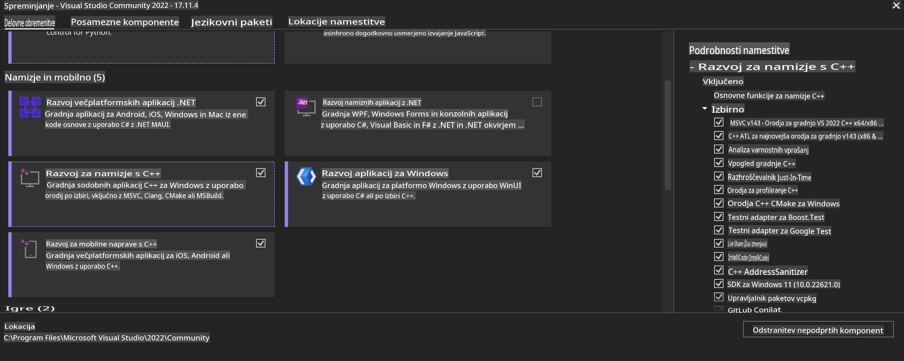
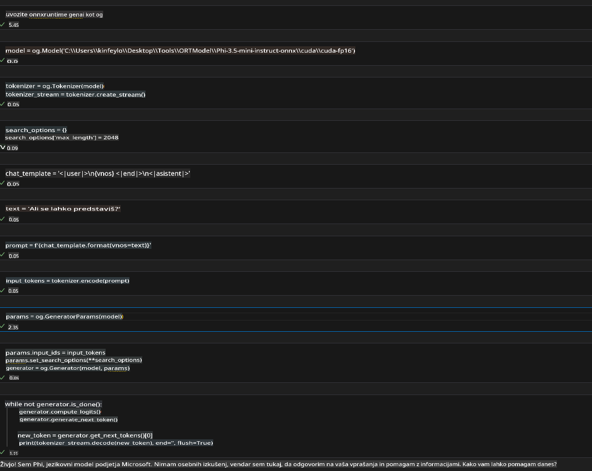
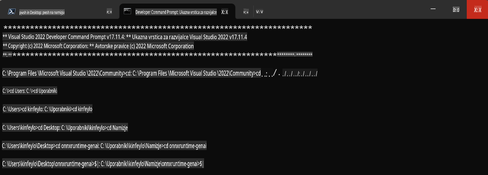

# **Navodila za OnnxRuntime GenAI Windows GPU**

Ta navodila vsebujejo korake za nastavitev in uporabo ONNX Runtime (ORT) z GPU-ji na Windows sistemih. Namenjena so izboljšanju zmogljivosti in učinkovitosti vaših modelov z uporabo pospeševanja prek GPU-jev.

Dokument vključuje smernice za:

- Nastavitev okolja: Navodila za namestitev potrebnih odvisnosti, kot so CUDA, cuDNN in ONNX Runtime.
- Konfiguracijo: Kako konfigurirati okolje in ONNX Runtime za učinkovito uporabo GPU virov.
- Nasvete za optimizacijo: Priporočila za fino nastavitev GPU nastavitev za optimalno zmogljivost.

### **1. Python 3.10.x /3.11.8**

   ***Opomba*** Priporočamo uporabo [miniforge](https://github.com/conda-forge/miniforge/releases/latest/download/Miniforge3-Windows-x86_64.exe) kot vaše Python okolje.

   ```bash

   conda create -n pydev python==3.11.8

   conda activate pydev

   ```

   ***Opomnik*** Če ste že namestili katerokoli ONNX knjižnico za Python, jo odstranite.

### **2. Namestitev CMake z winget**

   ```bash

   winget install -e --id Kitware.CMake

   ```

### **3. Namestitev Visual Studio 2022 - Namizni razvoj s C++**

   ***Opomba*** Če ne želite prevajati, lahko ta korak preskočite.



### **4. Namestitev NVIDIA gonilnika**

1. **NVIDIA GPU gonilnik**  [https://www.nvidia.com/en-us/drivers/](https://www.nvidia.com/en-us/drivers/)

2. **NVIDIA CUDA 12.4** [https://developer.nvidia.com/cuda-12-4-0-download-archive](https://developer.nvidia.com/cuda-12-4-0-download-archive)

3. **NVIDIA CUDNN 9.4**  [https://developer.nvidia.com/cudnn-downloads](https://developer.nvidia.com/cudnn-downloads)

***Opomnik*** Pri namestitvi uporabite privzete nastavitve.

### **5. Nastavitev NVIDIA okolja**

Kopirajte knjižnice, binarne datoteke in vključene datoteke iz NVIDIA CUDNN 9.4 v ustrezne mape NVIDIA CUDA 12.4.

- kopirajte datoteke iz *'C:\Program Files\NVIDIA\CUDNN\v9.4\bin\12.6'* v *'C:\Program Files\NVIDIA GPU Computing Toolkit\CUDA\v12.4\bin'*

- kopirajte datoteke iz *'C:\Program Files\NVIDIA\CUDNN\v9.4\include\12.6'* v *'C:\Program Files\NVIDIA GPU Computing Toolkit\CUDA\v12.4\include'*

- kopirajte datoteke iz *'C:\Program Files\NVIDIA\CUDNN\v9.4\lib\12.6'* v *'C:\Program Files\NVIDIA GPU Computing Toolkit\CUDA\v12.4\lib\x64'*

### **6. Prenos Phi-3.5-mini-instruct-onnx**

   ```bash

   winget install -e --id Git.Git

   winget install -e --id GitHub.GitLFS

   git lfs install

   git clone https://huggingface.co/microsoft/Phi-3.5-mini-instruct-onnx

   ```

### **7. Zagon InferencePhi35Instruct.ipynb**

   Odprite [Notebook](../../../../../../code/09.UpdateSamples/Aug/ortgpu-phi35-instruct.ipynb) in ga izvedite.



### **8. Prevajanje ORT GenAI GPU**

   ***Opomba*** 
   
   1. Najprej odstranite vse ONNX, ONNX Runtime in ONNX Runtime-GenAI knjižnice.

   ```bash

   pip list 
   
   ```

   Nato odstranite vse ONNX Runtime knjižnice, na primer:

   ```bash

   pip uninstall onnxruntime

   pip uninstall onnxruntime-genai

   pip uninstall onnxruntume-genai-cuda
   
   ```

   2. Preverite podporo Visual Studio razširitve.

   Preverite mapo C:\Program Files\NVIDIA GPU Computing Toolkit\CUDA\v12.4\extras, da zagotovite, da obstaja mapa C:\Program Files\NVIDIA GPU Computing Toolkit\CUDA\v12.4\extras\visual_studio_integration. 

   Če mape ni, preverite druge mape gonilnika CUDA Toolkit in kopirajte mapo visual_studio_integration ter njeno vsebino v C:\Program Files\NVIDIA GPU Computing Toolkit\CUDA\v12.4\extras\visual_studio_integration.

   - Če ne želite prevajati, lahko ta korak preskočite.

   ```bash

   git clone https://github.com/microsoft/onnxruntime-genai

   ```

   - Prenesite [https://github.com/microsoft/onnxruntime/releases/download/v1.19.2/onnxruntime-win-x64-gpu-1.19.2.zip](https://github.com/microsoft/onnxruntime/releases/download/v1.19.2/onnxruntime-win-x64-gpu-1.19.2.zip).

   - Razširite onnxruntime-win-x64-gpu-1.19.2.zip, preimenujte mapo v **ort**, nato kopirajte mapo ort v onnxruntime-genai.

   - Uporabite Windows Terminal, pojdite v Developer Command Prompt za VS 2022 in nato v mapo onnxruntime-genai.



   - Prevedite z vašim Python okoljem.

   ```bash

   cd onnxruntime-genai

   python build.py --use_cuda  --cuda_home "C:\Program Files\NVIDIA GPU Computing Toolkit\CUDA\v12.4" --config Release
 

   cd build/Windows/Release/Wheel

   pip install .whl

   ```

**Omejitev odgovornosti**:  
Ta dokument je bil preveden z uporabo storitev strojnega prevajanja z umetno inteligenco. Čeprav si prizadevamo za natančnost, vas prosimo, da upoštevate, da lahko avtomatizirani prevodi vsebujejo napake ali netočnosti. Izvirni dokument v njegovem maternem jeziku je treba obravnavati kot avtoritativni vir. Za ključne informacije priporočamo profesionalni prevod s strani človeka. Ne prevzemamo odgovornosti za kakršna koli nesporazumevanja ali napačne razlage, ki izhajajo iz uporabe tega prevoda.