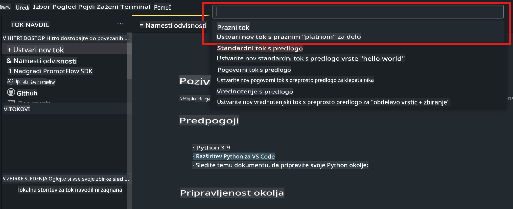
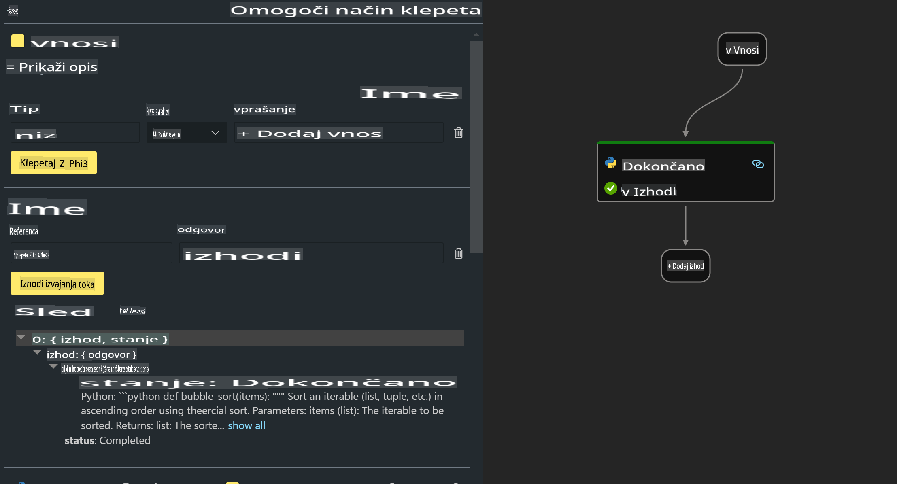

# **Lab 2 - Zaženite Prompt flow s Phi-3-mini na AIPC**

## **Kaj je Prompt flow**

Prompt flow je zbirka razvojnih orodij, zasnovana za poenostavitev celotnega razvojnega cikla aplikacij z umetno inteligenco na osnovi velikih jezikovnih modelov (LLM), od ideje, prototipiranja, testiranja, ocenjevanja do uvedbe v produkcijo in spremljanja. Olajša ustvarjanje pozivov (prompt engineering) in omogoča gradnjo aplikacij z LLM na produkcijski ravni.

S Prompt flow lahko:

- Ustvarjate tokove, ki povezujejo LLM-je, pozive, Python kodo in druga orodja v izvršljivem delovnem toku.

- Enostavno odpravljate napake in izboljšujete svoje tokove, zlasti interakcije z LLM-ji.

- Ocenjujete svoje tokove, izračunavate metrike kakovosti in zmogljivosti na večjih podatkovnih nizih.

- Integrirate testiranje in ocenjevanje v svoj CI/CD sistem za zagotavljanje kakovosti toka.

- Enostavno uvajate svoje tokove na izbrano platformo ali jih vključite v osnovno kodo svoje aplikacije.

- (Neobvezno, a zelo priporočljivo) Sodelujete s svojo ekipo z uporabo oblačne različice Prompt flow v Azure AI.

## **Kaj je AIPC**

AI PC vključuje CPU, GPU in NPU, pri čemer ima vsak specifične zmogljivosti za pospeševanje umetne inteligence. NPU ali nevralna procesna enota je specializiran pospeševalnik, ki obdeluje naloge umetne inteligence (AI) in strojnega učenja (ML) neposredno na vašem računalniku, namesto da bi pošiljal podatke v obdelavo v oblak. GPU in CPU lahko prav tako obdelujeta te naloge, vendar je NPU posebej učinkovit pri nizkoenergijskih izračunih AI. AI PC predstavlja temeljni premik v delovanju računalnikov. Ne gre za rešitev problema, ki prej ni obstajal, temveč za veliko izboljšavo pri vsakodnevni uporabi računalnikov.

Kako deluje? V primerjavi z generativno umetno inteligenco in obsežnimi velikimi jezikovnimi modeli (LLM), usposobljenimi na množici javnih podatkov, je AI na vašem računalniku bolj dostopen na skoraj vseh ravneh. Koncept je lažje razumeti, in ker je usposobljen na vaših podatkih brez potrebe po dostopu do oblaka, so koristi bolj takojšnje in privlačne širši populaciji.

V bližnji prihodnosti bo svet AI PC vključeval osebne asistente in manjše modele umetne inteligence, ki bodo delovali neposredno na vašem računalniku, pri čemer bodo uporabljali vaše podatke za zagotavljanje osebnih, zasebnih in varnejših izboljšav AI za stvari, ki jih že počnete vsak dan – zapisovanje zapisnikov sestankov, organiziranje fantazijske nogometne lige, avtomatiziranje izboljšav za urejanje fotografij in videoposnetkov ali pripravo popolnega itinerarja za družinsko srečanje glede na čase prihoda in odhoda vseh članov.

## **Izdelava tokov za generiranje kode na AIPC**

***Opomba***: Če še niste dokončali namestitve okolja, obiščite [Lab 0 - Namestitve](./01.Installations.md)

1. Odprite razširitev Prompt flow v Visual Studio Code in ustvarite prazen projekt toka.



2. Dodajte vhodne in izhodne parametre ter dodajte Python kodo kot nov tok.



Za sestavo svojega toka se lahko sklicujete na to strukturo (flow.dag.yaml):

```yaml

inputs:
  question:
    type: string
    default: how to write Bubble Algorithm
outputs:
  answer:
    type: string
    reference: ${Chat_With_Phi3.output}
nodes:
- name: Chat_With_Phi3
  type: python
  source:
    type: code
    path: Chat_With_Phi3.py
  inputs:
    question: ${inputs.question}


```

3. Dodajte kodo v datoteko ***Chat_With_Phi3.py***.

```python


from promptflow.core import tool

# import torch
from transformers import AutoTokenizer, pipeline,TextStreamer
import intel_npu_acceleration_library as npu_lib

import warnings

import asyncio
import platform

class Phi3CodeAgent:
    
    model = None
    tokenizer = None
    text_streamer = None
    
    model_id = "microsoft/Phi-3-mini-4k-instruct"

    @staticmethod
    def init_phi3():
        
        if Phi3CodeAgent.model is None or Phi3CodeAgent.tokenizer is None or Phi3CodeAgent.text_streamer is None:
            Phi3CodeAgent.model = npu_lib.NPUModelForCausalLM.from_pretrained(
                                    Phi3CodeAgent.model_id,
                                    torch_dtype="auto",
                                    dtype=npu_lib.int4,
                                    trust_remote_code=True
                                )
            Phi3CodeAgent.tokenizer = AutoTokenizer.from_pretrained(Phi3CodeAgent.model_id)
            Phi3CodeAgent.text_streamer = TextStreamer(Phi3CodeAgent.tokenizer, skip_prompt=True)

    

    @staticmethod
    def chat_with_phi3(prompt):
        
        Phi3CodeAgent.init_phi3()

        messages = "<|system|>You are a AI Python coding assistant. Please help me to generate code in Python.The answer only genertated Python code, but any comments and instructions do not need to be generated<|end|><|user|>" + prompt +"<|end|><|assistant|>"


        generation_args = {
            "max_new_tokens": 1024,
            "return_full_text": False,
            "temperature": 0.3,
            "do_sample": False,
            "streamer": Phi3CodeAgent.text_streamer,
        }

        pipe = pipeline(
            "text-generation",
            model=Phi3CodeAgent.model,
            tokenizer=Phi3CodeAgent.tokenizer,
            # **generation_args
        )

        result = ''

        with warnings.catch_warnings():
            warnings.simplefilter("ignore")
            response = pipe(messages, **generation_args)
            result =response[0]['generated_text']
            return result


@tool
def my_python_tool(question: str) -> str:
    if platform.system() == 'Windows':
        asyncio.set_event_loop_policy(asyncio.WindowsSelectorEventLoopPolicy())
    return Phi3CodeAgent.chat_with_phi3(question)


```

4. Tok lahko preizkusite z Debug ali Run, da preverite, ali generiranje kode deluje.


5. Zaženite tok kot razvojni API v terminalu.

```

pf flow serve --source ./ --port 8080 --host localhost   

```

Lahko ga preizkusite v Postmanu / Thunder Clientu.

### **Opombe**

1. Prvi zagon traja dolgo časa. Priporočamo prenos modela phi-3 iz Hugging face CLI.

2. Glede na omejeno računsko moč Intel NPU priporočamo uporabo Phi-3-mini-4k-instruct.

3. Uporabljamo pospeševanje Intel NPU za kvantizacijo v INT4, vendar morate pri ponovnem zagonu storitve izbrisati predpomnilnik in mape nc_workshop.

## **Viri**

1. Naučite se Promptflow [https://microsoft.github.io/promptflow/](https://microsoft.github.io/promptflow/)

2. Naučite se Intel NPU pospeševanja [https://github.com/intel/intel-npu-acceleration-library](https://github.com/intel/intel-npu-acceleration-library)

3. Primer kode, prenesite [Lokalni NPU Agent Primer kode](../../../../../../../../../code/07.Lab/01/AIPC)

**Omejitev odgovornosti**:  
Ta dokument je bil preveden z uporabo strojnih AI prevajalskih storitev. Čeprav si prizadevamo za natančnost, vas prosimo, da upoštevate, da lahko avtomatski prevodi vsebujejo napake ali netočnosti. Izvirni dokument v njegovem izvirnem jeziku je treba obravnavati kot avtoritativni vir. Za ključne informacije je priporočljivo uporabiti strokovni človeški prevod. Ne prevzemamo odgovornosti za kakršna koli nesporazumevanja ali napačne razlage, ki izhajajo iz uporabe tega prevoda.