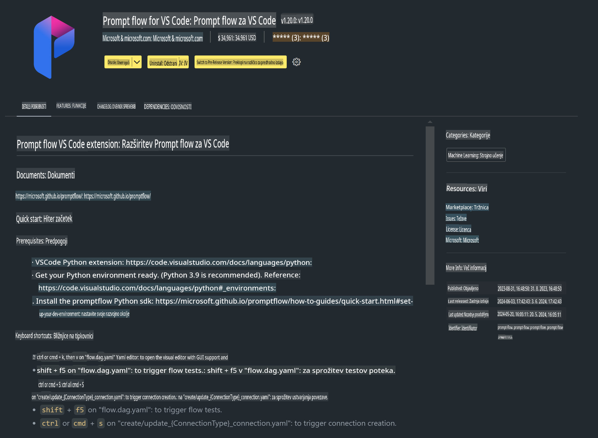

# **Lab 0 - Namestitev**

Ko vstopimo v laboratorij, moramo nastaviti ustrezno okolje:


### **1. Python 3.11+**

Priporočljivo je uporabiti miniforge za konfiguracijo Python okolja.

Za konfiguracijo miniforge obiščite [https://github.com/conda-forge/miniforge](https://github.com/conda-forge/miniforge)

Ko je miniforge nastavljen, zaženite naslednji ukaz v Power Shell-u:

```bash

conda create -n pyenv python==3.11.8 -y

conda activate pyenv

```


### **2. Namestitev Prompt flow SDK**

V Lab 1 bomo uporabljali Prompt flow, zato je potrebno nastaviti Prompt flow SDK.

```bash

pip install promptflow --upgrade

```

Prompt flow SDK lahko preverite z naslednjim ukazom:

```bash

pf --version

```

### **3. Namestitev Visual Studio Code Prompt flow razširitve**



### **4. Apple's MLX Framework**

MLX je okvir za raziskovanje strojnega učenja na Apple Silicon, ki ga je razvila Apple-ova raziskovalna ekipa za strojno učenje. **Apple MLX framework** lahko uporabite za pospeševanje LLM/SLM na Apple Silicon. Če želite izvedeti več, si oglejte [https://github.com/microsoft/PhiCookBook/blob/main/md/01.Introduction/03/MLX_Inference.md](https://github.com/microsoft/PhiCookBook/blob/main/md/01.Introduction/03/MLX_Inference.md).

Namestite knjižnico MLX framework v bash-u:

```bash

pip install mlx-lm

```


### **5. Druge Python knjižnice**

Ustvarite datoteko requirements.txt in vanjo dodajte naslednjo vsebino:

```txt

notebook
numpy 
scipy 
scikit-learn 
matplotlib 
pandas 
pillow 
graphviz

```


### **6. Namestitev NVM**

Namestite nvm v Power Shell-u:

```bash

brew install nvm

```

Namestite nodejs 18.20:

```bash

nvm install 18.20.0

nvm use 18.20.0

```

### **7. Namestitev podpore za razvoj v Visual Studio Code**

```bash

npm install --global yo generator-code

```

Čestitamo! Uspešno ste nastavili SDK. Sedaj nadaljujte z izvajanjem praktičnih korakov.

**Omejitev odgovornosti**:  
Ta dokument je bil preveden s pomočjo storitev strojnega prevajanja z umetno inteligenco. Čeprav si prizadevamo za natančnost, vas prosimo, da upoštevate, da lahko avtomatizirani prevodi vsebujejo napake ali netočnosti. Izvirni dokument v svojem maternem jeziku je treba obravnavati kot avtoritativni vir. Za ključne informacije je priporočljivo profesionalno človeško prevajanje. Ne prevzemamo odgovornosti za morebitna nesporazumevanja ali napačne razlage, ki izhajajo iz uporabe tega prevoda.