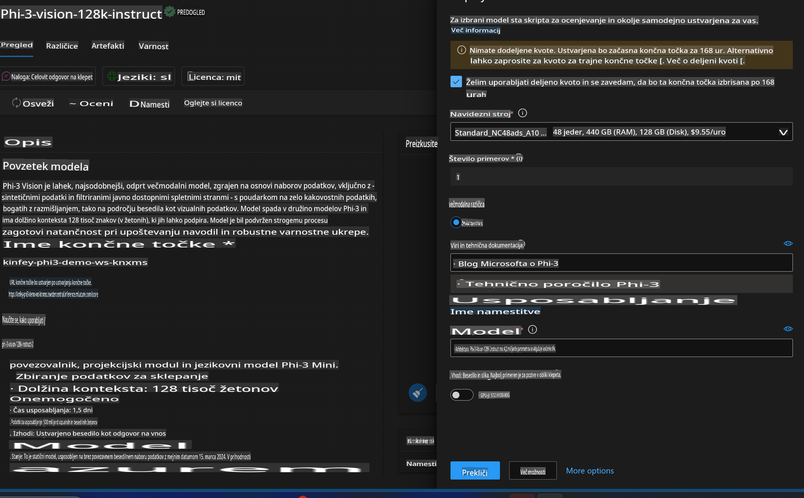
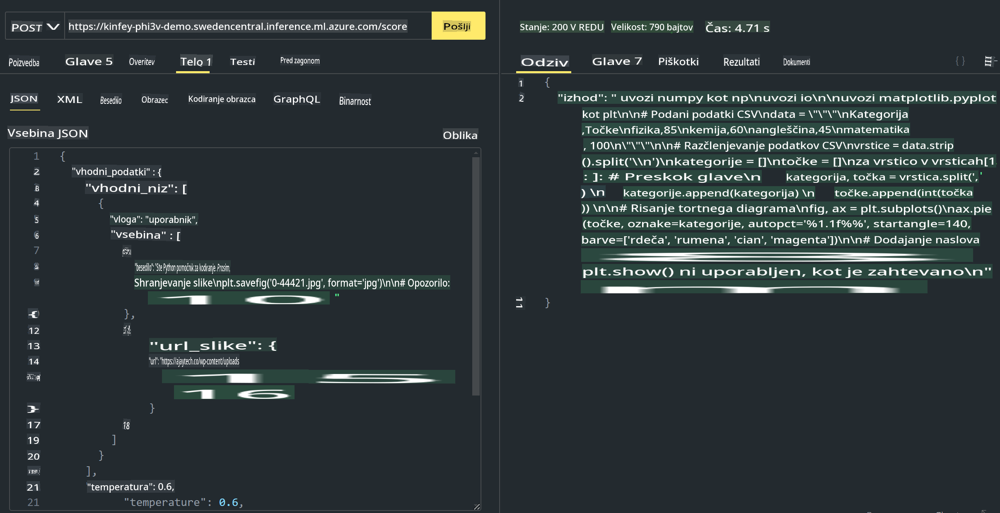

# **Lab 3 - Namestitev Phi-3-Vision na Azure Machine Learning Service**

Uporabljamo NPU za izvedbo produkcijskega uvajanja lokalne kode, nato pa želimo predstaviti možnost uvajanja PHI-3-VISION, da dosežemo generiranje kode iz slik.

V tem uvodu bomo hitro vzpostavili storitev Model As Service Phi-3 Vision v Azure Machine Learning Service.

***Opomba***: Phi-3 Vision potrebuje računsko moč za hitrejše generiranje vsebine. Za to potrebujemo računalniško moč v oblaku, ki nam bo pomagala pri doseganju cilja.


### **1. Ustvarjanje Azure Machine Learning Service**

Najprej moramo ustvariti Azure Machine Learning Service v Azure Portalu. Če želite izvedeti, kako to storiti, obiščite naslednjo povezavo [https://learn.microsoft.com/azure/machine-learning/quickstart-create-resources?view=azureml-api-2](https://learn.microsoft.com/azure/machine-learning/quickstart-create-resources?view=azureml-api-2)


### **2. Izbira Phi-3 Vision v Azure Machine Learning Service**


### **3. Namestitev Phi-3-Vision v Azure**




### **4. Testiranje končne točke v Postmanu**




***Opomba***

1. Preneseni parametri morajo vključevati Authorization, azureml-model-deployment in Content-Type. Te informacije je treba pridobiti iz podatkov o uvajanju.

2. Za prenos parametrov Phi-3-Vision potrebuje povezavo do slike. Oglejte si metodo GPT-4-Vision za prenos parametrov, na primer:

```json

{
  "input_data":{
    "input_string":[
      {
        "role":"user",
        "content":[ 
          {
            "type": "text",
            "text": "You are a Python coding assistant.Please create Python code for image "
          },
          {
              "type": "image_url",
              "image_url": {
                "url": "https://ajaytech.co/wp-content/uploads/2019/09/index.png"
              }
          }
        ]
      }
    ],
    "parameters":{
          "temperature": 0.6,
          "top_p": 0.9,
          "do_sample": false,
          "max_new_tokens": 2048
    }
  }
}

```

3. Uporabite metodo Post za klic **/score**

**Čestitamo**! Uspešno ste zaključili hitro namestitev PHI-3-VISION in preizkusili uporabo slik za generiranje kode. Naslednji korak je gradnja aplikacij s kombinacijo NPU-jev in oblaka.

**Omejitev odgovornosti**:  
Ta dokument je bil preveden s pomočjo strojnih AI prevajalskih storitev. Čeprav si prizadevamo za natančnost, vas prosimo, da upoštevate, da lahko avtomatski prevodi vsebujejo napake ali netočnosti. Izvirni dokument v svojem maternem jeziku je treba obravnavati kot avtoritativni vir. Za ključne informacije priporočamo strokovni človeški prevod. Ne prevzemamo odgovornosti za morebitna nesporazumevanja ali napačne razlage, ki izhajajo iz uporabe tega prevoda.