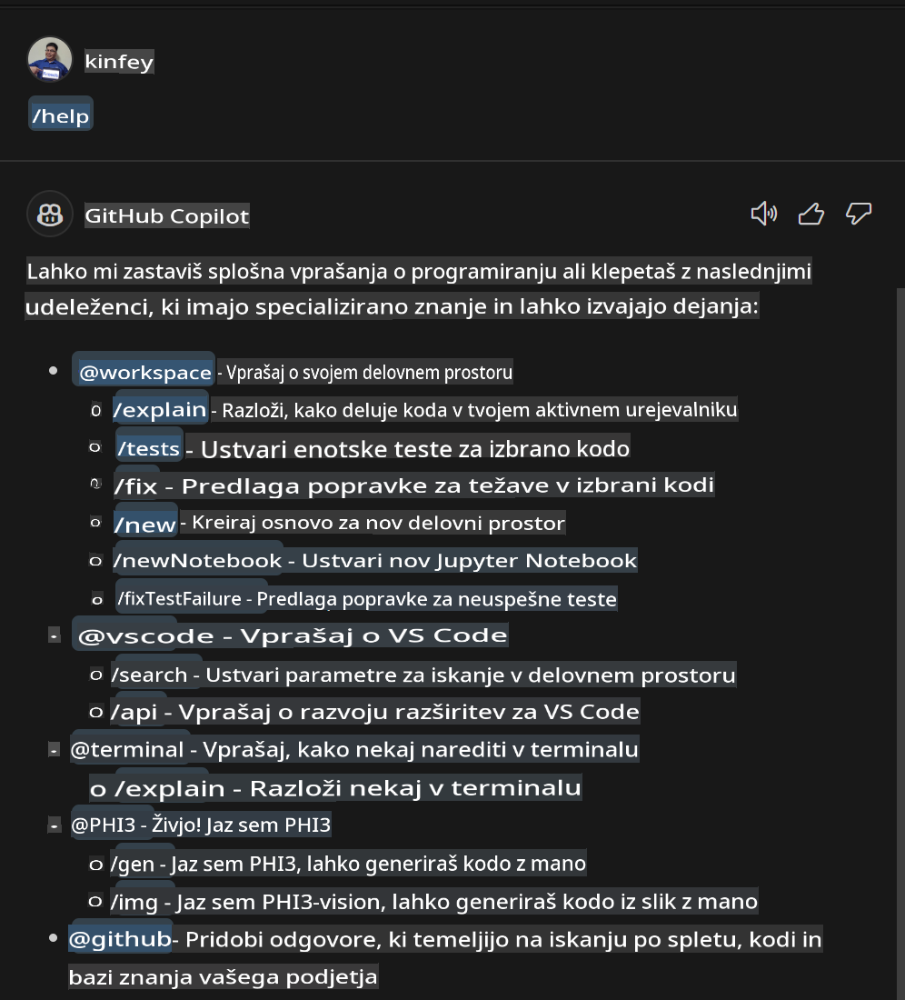
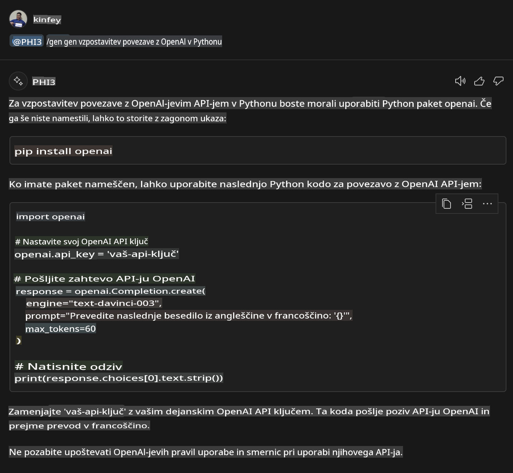
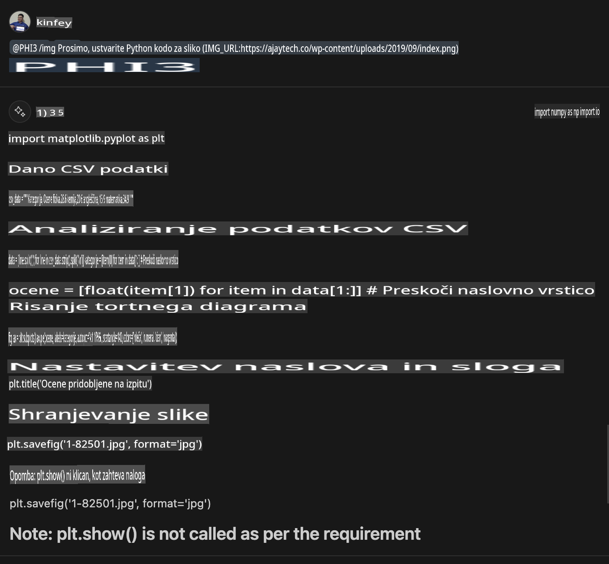

# **Lab 3 - Ustvarjanje @PHI3 agenta v GitHub Copilot Chat**

V Visual Studio Code Copilot Chat lahko upravljate celoten projekt prek @workspace. Za poslovne scenarije lahko Copilot Chatovega agenta prilagodimo bolj fleksibilno.

V zadnjem laboratoriju smo združili MX okvir in oblak, da smo dokončali razširitev za Visual Studio Code za Phi3 agenta.



### **1. Ustvarite razvojno razširitev za VSCode**

Prosimo, glejte ta povezava [https://code.visualstudio.com/api/get-started/your-first-extension](https://code.visualstudio.com/api/get-started/your-first-extension) za ustvarjanje projekta razširitve.

***OPOMBA:*** Prosimo, uporabite Typescript, WebPack kot tehnično rešitev za ta projekt.

### **2. Dodajte vscode.d.ts**

API za Visual Studio Code Chat še ni bil združen v kodo API, vendar je zdaj dodan prek razširitev.

Prenesite vscode.d.ts [https://github.com/microsoft/vscode/blob/main/src/vscode-dts/vscode.d.ts](https://github.com/microsoft/vscode/blob/main/src/vscode-dts/vscode.d.ts)

***OPOMBA:*** Zaženite ga v Visual Studio Code Insiders 1.90+.

### **3. Posodobite package.json**

```json

{
  "name": "phi3ext",
  "displayName": "phi3ext",
  "description": "",
  "version": "0.0.1",
  "engines": {
    "vscode": "^1.90.0"
  },
  "categories": [
      "AI",
      "Chat"
  ],
  "activationEvents": [],
  "enabledApiProposals": [
      "chatVariableResolver"
  ],
  "main": "./dist/extension.js",
  "contributes": {
      "chatParticipants": [
          {
              "id": "chat.PHI3",
              "name": "PHI3",
              "description": "Hey! I am PHI3",
              "isSticky": true,
              "commands": [
                  {
                      "name": "gen",
                      "description": "I am PHI3, you can gen code with me"
                  },
                  {
                      "name": "img",
                      "description": "I am PHI3-vision, you can gen code from img with me"
                  }
              ]
          }
      ],
      "commands": [
          {
              "command": "PHI3.namesInEditor",
              "title": "Use PHI3 in Editor"
          }
      ]
  },  
  "scripts": {
    "vscode:prepublish": "npm run package",
    "compile": "webpack",
    "watch": "webpack --watch",
    "package": "webpack --mode production --devtool hidden-source-map",
    "compile-tests": "tsc -p . --outDir out",
    "watch-tests": "tsc -p . -w --outDir out",
    "pretest": "npm run compile-tests && npm run compile && npm run lint",
    "lint": "eslint src --ext ts",
    "test": "vscode-test"
  },
  "devDependencies": {
    "@types/vscode": "^1.90.0",
    "@types/mocha": "^10.0.6",
    "@types/node": "18.x",
    "@typescript-eslint/eslint-plugin": "^7.11.0",
    "@typescript-eslint/parser": "^7.11.0",
    "eslint": "^8.57.0",
    "typescript": "^5.4.5",
    "ts-loader": "^9.5.1",
    "webpack": "^5.91.0",
    "webpack-cli": "^5.1.4",
    "@vscode/test-cli": "^0.0.9",
    "@vscode/test-electron": "^2.4.0"
  },
  "dependencies": {
    "@types/node-fetch": "^2.6.11",
    "node-fetch": "^3.3.2"
  }
}

```

V terminalu lahko zaženete **npm install** in razhroščujete svojo razširitev za testiranje.

***Prenesite vzorčno kodo*** [Kliknite tukaj](../../../../../../../../../code/07.Lab/01/Apple)

### **4. Spremenite src/extension.ts**

```ts

// The module 'vscode' contains the VS Code extensibility API
// Import the module and reference it with the alias vscode in your code below
import * as vscode from 'vscode';


interface IPHI3ChatResult extends vscode.ChatResult {
    metadata: {
        command: string;
    }
}


// This method is called when your extension is activated
// Your extension is activated the very first time the command is executed
export function activate(extcontext: vscode.ExtensionContext) {


	// Define a SHEIN chat handler. 
	const phi3handler: vscode.ChatRequestHandler = async (request: vscode.ChatRequest, context: vscode.ChatContext, stream: vscode.ChatResponseStream, token: vscode.CancellationToken): Promise<IPHI3ChatResult> => {

		if (request.command == 'gen') {

			const content = "Welcome to Phi-3 to gen code";

			const result = await gen(request.prompt);

			const code = result;
			
			
			stream.markdown(code)


            return { metadata: { command: 'gen' } };

		}
		if (request.command == 'img') {

			const content = "Welcome to Phi-3 vision to gen code in image";

			const prompt = request.prompt;

			if(prompt.indexOf("(IMG_URL:")>-1){

				const img_url = prompt.split("(IMG_URL:")[1].split(")")[0];
				const question = prompt.split("(IMG_URL:")[0];
				const tmp = question;

				const result = await genImage(question,img_url);
	
				const code = result;
				
				
				stream.markdown(code)
	
	
				return { metadata: { command: 'img' } };
			}
			else
			{
				var result = "Please ask question like this Your question (IMG_URL:https://example.com/image.jpg)";
				stream.markdown(result);
			}


            return { metadata: { command: 'img' } };

		}


		return { metadata: { command: '' } };

	}


	const phi3 = vscode.chat.createChatParticipant("chat.PHI3", phi3handler);

	phi3.iconPath = new vscode.ThemeIcon('sparkle');


    phi3.followupProvider = {
        provideFollowups(result: IPHI3ChatResult, context: vscode.ChatContext, token: vscode.CancellationToken) {
            return [{
                prompt: 'let us code with Phi-3 Family',
                label: vscode.l10n.t('Dev with Phi-3 Family'),
                command: 'help'
            } satisfies vscode.ChatFollowup];
        }
    };

	extcontext.subscriptions.push(phi3);
}


interface GenCode {
	prompt: string;
}

interface ImgGenCodeResponse {
	output: string;
}


interface GenCodeResponse {
	result: string;
}

async function gen(prompt: string) {

	const postData: GenCode = {
		prompt: prompt
	};
	const response = await fetch('http://localhost:8080/score', {
		method: 'POST',
		body: JSON.stringify(postData),
		headers: { 'Content-Type': 'application/json' }
	});
	const post = await response.json();
	const resultResponse = post as GenCodeResponse;
	return resultResponse.result;
}

async function genImage(prompt: string, img_url: string) {

	// const postData: GenCode = {
	// 	question: prompt
	// };
	const response = await fetch('Your Phi-3 Endpoint', {
		method: 'POST',
		body: JSON.stringify({
			"input_data":{
			  "input_string":[
				{
				  "role":"user",
				  "content":[ 
					{
					  "type": "text",
					  "text": prompt
					},
					{
						"type": "image_url",
						"image_url": {
						  "url": img_url
						}
					}
				  ]
				}
			  ],
			  "parameters":{
					"temperature": 0.6,
					"top_p": 0.9,
					"do_sample": false,
					"max_new_tokens": 2048
			  }
			}
		}),
		headers: { 'Content-Type': 'application/json', 'Authorization' : 'Bearer Your Phi-3-Vision Endpoint Key', 'azureml-model-deployment': 'Your Phi-3-Vision Deployment Name' }
	});
	const post = await response.json();
	const resultResponse = post as ImgGenCodeResponse;
	return resultResponse.output;
}

// This method is called when your extension is deactivated
export function deactivate() {}


```

Čestitamo! Zaključili ste vse laboratorije. Upam, da vam je to pomagalo razumeti družino Phi-3 in kako uporabljati GitHub Copilot Chat.

Lahko poskusite ***@PHI3 /gen*** 



Lahko poskusite ***@PHI3 /img*** 



**Omejitev odgovornosti**:  
Ta dokument je bil preveden s pomočjo strojnih AI prevajalskih storitev. Čeprav si prizadevamo za natančnost, vas prosimo, da upoštevate, da lahko avtomatski prevodi vsebujejo napake ali netočnosti. Izvirni dokument v njegovem izvirnem jeziku je treba obravnavati kot avtoritativni vir. Za ključne informacije priporočamo profesionalni človeški prevod. Ne prevzemamo odgovornosti za morebitne nesporazume ali napačne razlage, ki bi izhajale iz uporabe tega prevoda.