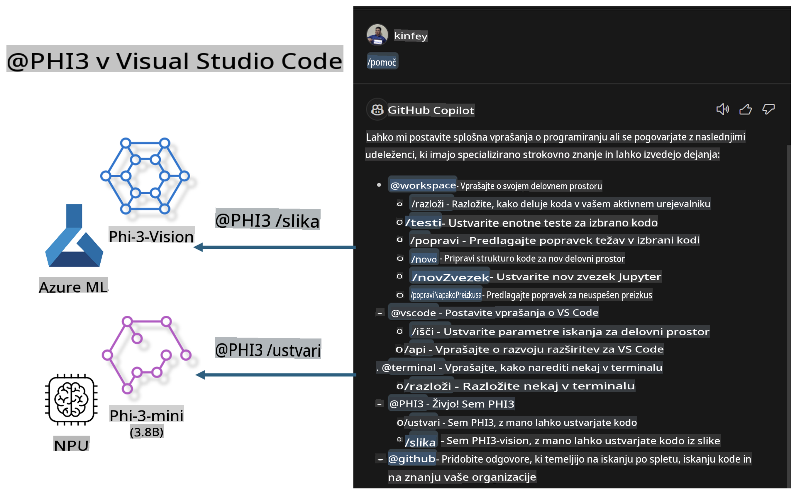

# **Zgradite svoj Visual Studio Code GitHub Copilot Chat z družino Microsoft Phi-3**

Ste že uporabljali agenta za delovna okolja v GitHub Copilot Chat? Želite ustvariti lastnega agenta za kodo za svojo ekipo? Ta praktična delavnica združuje odprtokodni model za izgradnjo poslovnega agenta za kodo na ravni podjetja.

## **Osnove**

### **Zakaj izbrati Microsoft Phi-3**

Phi-3 je serija modelov, ki vključuje phi-3-mini, phi-3-small in phi-3-medium, temelječe na različnih parametrih učenja za generiranje besedila, dokončanje dialogov in generiranje kode. Obstaja tudi phi-3-vision, ki temelji na vizualnih podatkih. Modeli so primerni za podjetja ali različne ekipe, ki želijo ustvariti rešitve za generativno umetno inteligenco brez povezave.

Priporočamo, da preberete ta povezava [https://github.com/microsoft/PhiCookBook/blob/main/md/01.Introduction/01/01.PhiFamily.md](https://github.com/microsoft/PhiCookBook/blob/main/md/01.Introduction/01/01.PhiFamily.md)

### **Microsoft GitHub Copilot Chat**

Razširitev GitHub Copilot Chat ponuja klepetalni vmesnik, ki omogoča interakcijo z GitHub Copilot in pridobivanje odgovorov na vprašanja, povezana s kodiranjem, neposredno v VS Code, brez potrebe po brskanju po dokumentaciji ali spletnih forumih.

Copilot Chat lahko uporablja poudarjanje sintakse, zamike in druge funkcije za izboljšanje jasnosti generiranih odgovorov. Glede na vrsto vprašanja uporabnika lahko rezultat vključuje povezave do konteksta, ki ga je Copilot uporabil za generiranje odgovora, kot so izvorne datoteke kode ali dokumentacija, ali gumbe za dostop do funkcionalnosti VS Code.

- Copilot Chat se integrira v vaš razvojni proces in vam nudi pomoč tam, kjer jo potrebujete:

- Začnite pogovor v vrstici neposredno iz urejevalnika ali terminala, da prejmete pomoč med kodiranjem

- Uporabite pogled Chat za AI asistenta, ki vam je vedno na voljo

- Zaženite Quick Chat, da hitro zastavite vprašanje in se vrnete k svojemu delu

GitHub Copilot Chat lahko uporabljate v različnih scenarijih, kot so:

- Odgovarjanje na vprašanja o tem, kako najbolje rešiti problem

- Razlaga kode drugih razvijalcev in predlaganje izboljšav

- Predlaganje popravkov kode

- Generiranje primerov enotnih testov

- Generiranje dokumentacije za kodo

Priporočamo, da preberete ta povezava [https://code.visualstudio.com/docs/copilot/copilot-chat](https://code.visualstudio.com/docs/copilot/copilot-chat?WT.mc_id=aiml-137032-kinfeylo)

### **Microsoft GitHub Copilot Chat @workspace**

Sklicevanje na **@workspace** v Copilot Chat omogoča postavljanje vprašanj o celotni kodi vašega projekta. Na podlagi vprašanja Copilot inteligentno pridobi ustrezne datoteke in simbole, ki jih nato v odgovoru navede kot povezave in primere kode.

Za odgovor na vaše vprašanje **@workspace** preišče iste vire, kot bi jih uporabil razvijalec pri navigaciji po kodi v VS Code:

- Vse datoteke v delovnem prostoru, razen tistih, ki jih .gitignore datoteka ignorira

- Strukturo direktorijev z ugnezdenimi mapami in imeni datotek

- Indeks iskanja kode na GitHubu, če je delovni prostor GitHubovo repozitorij in indeksiran z iskanjem kode

- Simbole in definicije v delovnem prostoru

- Trenutno izbrano besedilo ali vidno besedilo v aktivnem urejevalniku

Opomba: .gitignore se prezre, če imate datoteko odprto ali izbrano besedilo v ignorirani datoteki.

Priporočamo, da preberete ta povezava [[https://code.visualstudio.com/docs/copilot/copilot-chat](https://code.visualstudio.com/docs/copilot/workspace-context?WT.mc_id=aiml-137032-kinfeylo)]

## **Več o tej delavnici**

GitHub Copilot je močno izboljšal učinkovitost programiranja v podjetjih, vsako podjetje pa si želi prilagoditi funkcije GitHub Copilot svojim potrebam. Mnoga podjetja so že ustvarila razširitve, podobne GitHub Copilot, prilagojene svojim poslovnim scenarijem in odprtokodnim modelom. Za podjetja so prilagojene razširitve lažje za nadzor, vendar to lahko vpliva na uporabniško izkušnjo. Navsezadnje ima GitHub Copilot močnejše funkcije za splošne scenarije in strokovnost. Če lahko izkušnjo ohranimo dosledno, bi bilo bolje prilagoditi lastno razširitev podjetja. GitHub Copilot Chat ponuja ustrezne API-je za podjetja za širitev izkušnje klepeta. Ohranjanje dosledne izkušnje in hkrati prilagojenih funkcij zagotavlja boljšo uporabniško izkušnjo.

Ta delavnica uporablja model Phi-3 v kombinaciji z lokalnim NPU in Azure hibridom za izgradnjo prilagojenega agenta v GitHub Copilot Chat ***@PHI3***, ki pomaga razvijalcem v podjetjih pri generiranju kode ***(@PHI3 /gen)*** in generiranju kode na podlagi slik ***(@PHI3 /img)***.

### ***Opomba:*** 

Ta delavnica je trenutno izvedena na AIPC za Intel CPU in Apple Silicon. Nadaljevali bomo z nadgradnjo za različico NPU Qualcomm.

## **Delavnica**

| Ime | Opis | AIPC | Apple |
| ------------ | ----------- | -------- |-------- |
| Lab0 - Namestitve(✅) | Konfigurirajte in namestite ustrezna okolja in orodja za namestitev | [Go](./HOL/AIPC/01.Installations.md) |[Go](./HOL/Apple/01.Installations.md) |
| Lab1 - Zaženite Prompt flow s Phi-3-mini (✅) | V kombinaciji z AIPC / Apple Silicon, z uporabo lokalnega NPU za ustvarjanje kode s Phi-3-mini | [Go](./HOL/AIPC/02.PromptflowWithNPU.md) |  [Go](./HOL/Apple/02.PromptflowWithMLX.md) |
| Lab2 - Namestite Phi-3-vision na Azure Machine Learning Service(✅) | Generirajte kodo z uporabo Model Catalog - Phi-3-vision slike na Azure Machine Learning Service | [Go](./HOL/AIPC/03.DeployPhi3VisionOnAzure.md) |[Go](./HOL/Apple/03.DeployPhi3VisionOnAzure.md) |
| Lab3 - Ustvarite @phi-3 agenta v GitHub Copilot Chat(✅)  | Ustvarite prilagojenega Phi-3 agenta v GitHub Copilot Chat za dokončanje generiranja kode, generiranje grafovske kode, RAG itd. | [Go](./HOL/AIPC/04.CreatePhi3AgentInVSCode.md) | [Go](./HOL/Apple/04.CreatePhi3AgentInVSCode.md) |
| Primer kode (✅)  | Prenesite primer kode | [Go](../../../../../../../code/07.Lab/01/AIPC) | [Go](../../../../../../../code/07.Lab/01/Apple) |

## **Viri**

1. Phi-3 Cookbook [https://github.com/microsoft/Phi-3CookBook](https://github.com/microsoft/Phi-3CookBook)

2. Več o GitHub Copilot [https://learn.microsoft.com/training/paths/copilot/](https://learn.microsoft.com/training/paths/copilot/?WT.mc_id=aiml-137032-kinfeylo)

3. Več o GitHub Copilot Chat [https://learn.microsoft.com/training/paths/accelerate-app-development-using-github-copilot/](https://learn.microsoft.com/training/paths/accelerate-app-development-using-github-copilot/?WT.mc_id=aiml-137032-kinfeylo)

4. Več o GitHub Copilot Chat API [https://code.visualstudio.com/api/extension-guides/chat](https://code.visualstudio.com/api/extension-guides/chat?WT.mc_id=aiml-137032-kinfeylo)

5. Več o Azure AI Foundry [https://learn.microsoft.com/training/paths/create-custom-copilots-ai-studio/](https://learn.microsoft.com/training/paths/create-custom-copilots-ai-studio/?WT.mc_id=aiml-137032-kinfeylo)

6. Več o Model Catalog Azure AI Foundry [https://learn.microsoft.com/azure/ai-studio/how-to/model-catalog-overview](https://learn.microsoft.com/azure/ai-studio/how-to/model-catalog-overview)

**Omejitev odgovornosti**:  
Ta dokument je bil preveden s pomočjo storitev strojnega prevajanja z umetno inteligenco. Čeprav si prizadevamo za natančnost, vas prosimo, da upoštevate, da lahko avtomatski prevodi vsebujejo napake ali netočnosti. Izvirni dokument v njegovem maternem jeziku je treba obravnavati kot avtoritativni vir. Za ključne informacije je priporočljivo profesionalno človeško prevajanje. Ne prevzemamo odgovornosti za morebitna nesporazumevanja ali napačne razlage, ki izhajajo iz uporabe tega prevoda.